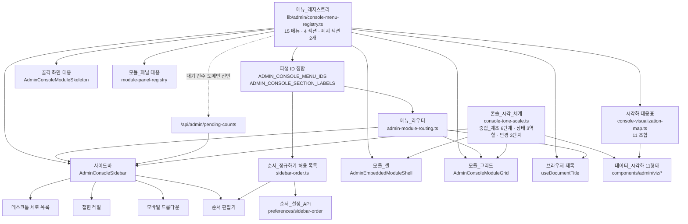
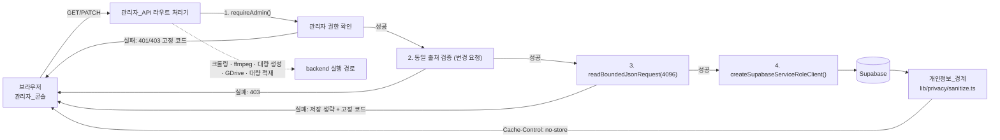
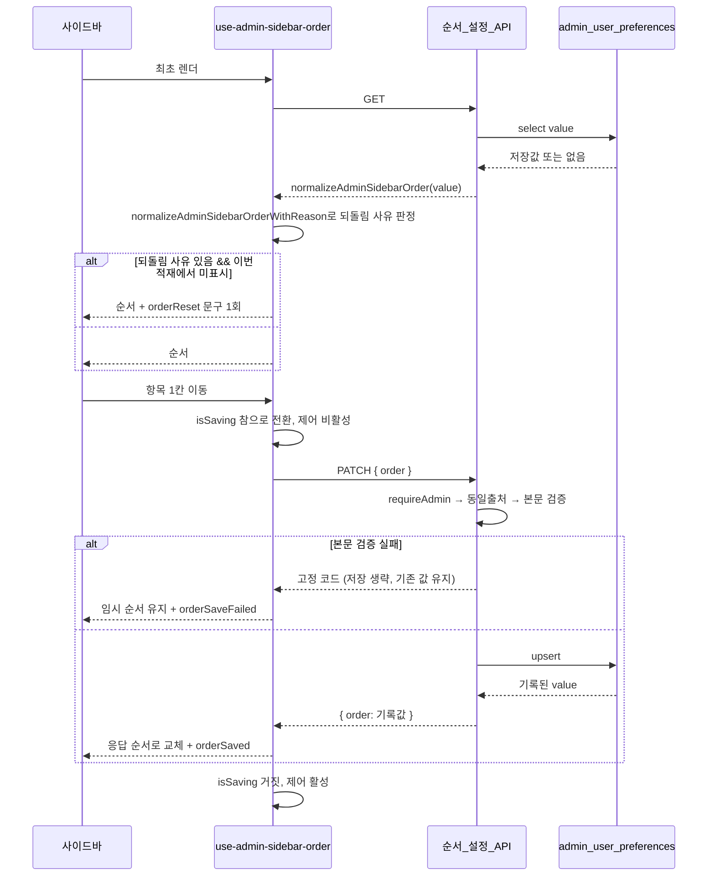
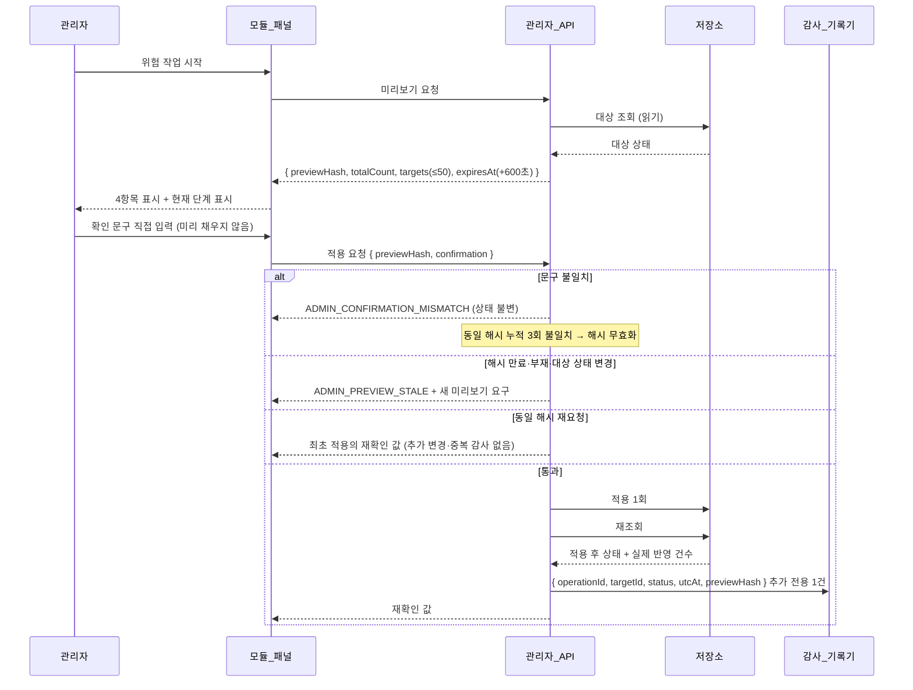

# Design Document

## Overview

이 설계는 관리자 콘솔의 사이드바를 **단일 메뉴 레지스트리**로 재구성하고, 15개 메뉴 전부를 운영등급으로 끌어올리며, 콘솔 셸 전체에 단색 계조 시각 언어를 적용합니다.

설계의 핵심 판단은 세 가지입니다.

1. **레지스트리 우선**. 메뉴 정의가 5곳에 흩어진 현행 구조를 하나의 데이터 모듈로 모으고, 사이드바·라우터·모듈 셸·모듈 그리드·순서 정규화기·브라우저 제목이 전부 그 모듈에서 파생하게 만듭니다. 파생 관계는 타입 수준 전수성(exhaustiveness)으로 강제하여, 메뉴 누락이 실행 시점 공백이 아니라 컴파일 오류가 되게 합니다.
2. **경계가 있는 분해**. `AdminConsoleOverview.tsx`는 11,085줄입니다. 전면 재작성은 이 스펙의 위험을 관리 불가능하게 만듭니다. 대신 **요구사항이 재구성을 요구하는 표면**(사이드바, 모듈 그리드, 골격 화면, 모듈 패널 대응, 시각화 카드)만 파일 밖으로 빼고, 대시보드 (KPI) 차트 본문과 셸 레이아웃·스크롤·모바일 크롬 로직은 제자리에 둡니다. 분해 경계는 "레지스트리가 먹이는 것"과 "이 스펙이 새로 만드는 것"입니다.
3. **토큰에서만 파생하는 색**. 중립_계조 6단계를 CSS 변수 토큰과 불투명도 조합으로 한 곳에서 정의하고, Tailwind 유틸리티와 recharts가 **같은 정의**를 각자의 방식으로 읽습니다. recharts는 구체 색 문자열을 요구하므로, 소스에 16진수를 두지 않고 실행 시점에 계산된 스타일에서 토큰 값을 읽어 조합합니다.

### 검증한 현행 상태

설계는 다음 확인 사실 위에 서 있습니다. 각 항목은 소스를 직접 읽어 확인했습니다.

| 확인 사실 | 위치 |
| --- | --- |
| 메뉴 정의 5중 중복 | `ADMIN_CONSOLE_MODULE_IDS`(`lib/admin/admin-module-routing.ts` 1행), `ADMIN_SIDEBAR_ITEM_IDS`·`DEFAULT_ADMIN_SIDEBAR_ORDER`(`lib/admin/sidebar-order.ts` 2행·28행), `consoleModules` 12개 항목(`AdminConsoleOverview.tsx` 173행), `sidebarSections`(같은 파일 385행), `activeModuleLabel` 삼항식(같은 파일 10485행) |
| `description`·`actionLabel`·`href`·`priority` 미사용 | `renderMenuItem`(8174행)은 `item.title`과 `item.badge`만 렌더링 |
| `AdminEmbeddedModuleShell` 5개 메뉴만 사용 | `overview`, `routes`, `llm`, `audit`, `map-overlays` |
| `hideHeader`는 프롭이 아니라 셸 내부 파생 | `AdminEmbeddedModuleShell.tsx` 36행 `const hideHeader = moduleId === "overview"` |
| `loading: () => null` 7개 | 871·878·884·889·896·902·909행 |
| `llm`은 데이터 조회 없음 | `LlmSessionWorkspace`(8953행)는 3개 설명 카드 + 운영 원칙 문단 |
| `audit`은 이름만 자리표시 | `AuditPlaceholder`(9050행)가 `/api/admin/audit-events`를 조회하고 로딩·빈·오류·세션만료 상태 보유 |
| 순서 정규화기 전체 되돌림 | `normalizeAdminSidebarOrder`는 `hasItemsOutsideCurrentSection`이 참이면 기본 순서 반환 |
| 순서 저장 실패가 조용한 덮어쓰기 | `route.ts` PATCH: `const body = requestBody.ok ? requestBody.value : null` 이후 `normalizeAdminSidebarOrder(null)`을 저장 |
| 차트 8개 16진수 + 트리맵 2개 | `adminDashboardFocusPalette`(2996행), 트리맵 `#cbd5e1`·`#e2e8f0`(4902·4903행) |
| 셸 색조 의존 | `getSidebarBadgeClassName`(376행) 앰버·스카이·바이올렛·에메랄드, 활성 메뉴 `bg-primary`(8202행), 셸 제목 `bg-gradient-primary bg-clip-text text-transparent`, 아이콘 `text-primary` |
| 밝기 모드가 첫 페인트 후 적용 | `applyAdminThemePreference`가 `useEffect`에서 실행됨. `app/admin/layout.tsx`에 선행 스크립트 없음 |
| `insights`가 대시보드 컴포넌트를 재사용 | `loadInsightsModule()`(717행) → `AdminOverviewDashboard` |
| `fast-check` 미설치 | `package.json`·`bun.lock` 모두 0건. `tests-unit/pin-contract.test.ts`가 결정적 시드 PRNG(mulberry32)로 성질 시험을 작성하는 기존 관례 보유 |

### 착수 전 해소해야 하는 기준선 결함

`AdminConsoleOverview.tsx`는 현재 HEAD에서 다음 상태입니다.

```text
137: import { AdminOpsReadbackStrip } from "@/components/admin/AdminOpsReadbackStrip";
138: import { AdminOpsReadbackStrip } from "@/components/admin/AdminOpsReadbackStrip";
139: import { AdminOpsReadbackStrip } from "@/components/admin/AdminOpsReadbackStrip";
```

동일 식별자를 3회 중복 선언하며, `apps/web/components/admin/AdminOpsReadbackStrip.tsx`는 **존재하지 않습니다**. 저장소 전체에서 이 식별자를 참조하는 곳은 이 파일뿐입니다. 이 상태는 커밋된 HEAD에 있고, 워크트리 수정분이 아닙니다(`git status`에 이 파일 없음).

설계는 이것을 **작업 0의 선행 조건**으로 둡니다. 이 결함이 남아 있으면 `npm run typecheck:parity`와 `npm run build`가 이 스펙의 변경과 무관하게 실패하므로, 요구사항 21-10의 "실패 0건" 형태를 만들 수 없습니다. 해소 경로는 두 가지이며 어느 쪽이 옳은지는 이 설계가 판단하지 않습니다.

- (a) 미사용 중복 import 3줄을 제거한다. `AdminOpsReadbackStrip`은 파일 본문에서 사용되지 않으므로 제거만으로 컴파일이 복구됩니다.
- (b) 누락된 `AdminOpsReadbackStrip` 컴포넌트를 별도 변경으로 도입하고 import를 1회로 정리한다.

이 설계는 (a)를 기본 경로로 삼습니다. 근거: 본문에서 참조가 없어 기능 손실이 없고, 이 스펙 범위 밖의 컴포넌트를 새로 만들면 위험_작업_절차 재확인 표시(요구사항 18-8)와 성격이 겹치는 미승인 표면이 생깁니다. 어느 경로든 이 스펙이 무엇을 고쳤는지 커밋 단위로 분리합니다.

동시에 저장소 규칙에 따라 **워크트리의 나머지 예기치 않은 변경(161개 항목)은 사용자 작업으로 보존합니다.** 되돌리거나 stash 하거나 정리하지 않습니다.

### 열린 사항 결정

| 열린 사항 | 결정 | 근거 |
| --- | --- | --- |
| 1. 리뷰 검수 목표 기준값 출처 | **기본값을 도입하지 않는다.** 목표 기준값은 승인된 출처가 응답으로 확인될 때만 존재하는 값(`{ approved: true, value } \| { approved: false }`)으로 모델링하고, 미승인이면 불릿 바 목표 표식을 렌더링하지 않고 고정 한국어 미승인 문장을 같은 카드에 표시한다. 소스에 상수 기준값을 두지 않는다. | 요구사항 10-10이 이미 그렇게 규정. 요구사항 10-9는 "승인 출처 없는 목표 기준값 상수가 소스에 없음"을 단정하도록 요구. **운영자 승인 대기로 남는다** — 이 스펙에서 값을 만들지 않는다. |
| 2. 경고/성공 상태_색상 토큰 | **새 색조 토큰을 정의하지 않는다.** 오류 역할에만 `--destructive`를 배정하고, 경고·성공 역할은 배정 없음(`token: null`)으로 선언하여 요구사항 9-17의 대체 표시(중립_계조 단계 + 한국어 상태 문자열)를 실제 동작으로 삼는다. | 저장소에 `--warning`·`--success` 토큰이 없다. 새로 만들려면 색조 값을 이 스펙이 발명해야 하고, 그 값은 라이트·다크 양쪽 명암비 검증과 공용 테마 표면(`styles/light-root-tokens.css`) 변경을 동반한다. 요구사항 9-17이 완결된 대체 경로를 이미 규정하므로, 발명 대신 대체 경로를 구현한다. **실제 색조 토큰 배정은 디자인 시스템 소유자 결정으로 열린 상태로 남는다.** 9-4의 "역할마다 정확히 1개 토큰"은 역할당 토큰 슬롯이 1개를 넘지 않는다는 뜻으로 구현하고, 검증_스위트가 역할 3개·슬롯 1개 이하·오류=`--destructive`·경고·성공 사용 지점의 색조 리터럴 0건을 단정한다. |
| 3. CSS 전환 vs `framer-motion` | **CSS 전환을 사용한다.** `framer-motion`은 설치 상태를 유지하되 `components/admin` 아래에서 계속 사용하지 않는다. | 요구사항 12-6은 전환이 200밀리초 안에 **완료**되고 "최종 표시 대상만 남는다"를 요구한다. `framer-motion`의 `AnimatePresence` 퇴장 애니메이션은 제거될 노드를 퇴장 완료까지 DOM에 유지하므로, 그 사이 요구사항 13-5가 알리는 카드 수와 DOM 카드 수가 어긋난다. CSS 전환에서는 필터 결과가 첫 커밋에 이미 최종 집합이고 전환은 시각 효과만 담당한다. 요구사항 12-7·12-13의 "중간 단계 표시 없이 최종 상태"는 `motion-reduce:transition-none`으로 구조적으로 참이 되며, 별도 분기 검증이 필요 없다. 기존 콘솔이 이미 `motion-reduce:*` 관례를 쓰고 있어 표기도 일관된다. |
| 4. `insights` vs 대시보드 (KPI) 경계 | **대시보드는 "지금 무엇을 먼저 할까", `insights`는 "무엇이 그 결과를 만들었나"를 답한다.** 대시보드는 채널 집계 지표의 최근 구간 방향(스파크라인)과 대기 업무 배분(게이지 호)만 다루고 영상 단위 계열을 렌더링하지 않는다. `insights`는 영상 단위 기여도(트리맵)와 다구간 변동 범위(범위 밴드 영역)만 다루고 대기 건수를 조회하지 않는다. | 두 화면이 같은 `/api/admin/youtube-kpis`를 읽는 것 자체는 문제가 아니다. 문제는 같은 질문에 두 번 답하는 것이다. 시간 지평(최근 구간 vs 다구간)과 집계 단위(채널 vs 영상)로 분리하면 대응표 11개 조합이 중복 없이 성립한다. 소스 계약 시험이 대시보드에 영상 단위 계열 키가 없고 `insights`에 대기 건수 질의가 없음을 단정한다. |

---

## Architecture

### 파생 관계

메뉴_레지스트리가 단일 원천이고 나머지는 전부 파생 소비자입니다. 어떤 소비자도 메뉴 제목이나 섹션 이름 문자열을 직접 선언하지 않습니다.



### 요청 경계



순서가 중요합니다. `requireAdmin`이 본문 파싱보다 앞서고, 본문 파싱이 서비스 롤 클라이언트 생성보다 앞섭니다(요구사항 17-1, 17-10). 현행 `sidebar-order/route.ts`가 이미 이 순서를 지키므로 변경은 본문 실패 처리에만 국한됩니다.

### 계층

| 계층 | 책임 | 파일 |
| --- | --- | --- |
| 정의 | 메뉴·섹션·시각화 대응·토큰. 순수 데이터와 순수 함수만. React 의존 없음 | `lib/admin/console-menu-registry.ts`, `console-visualization-map.ts`, `console-tone-scale.ts`, `console-menu-search.ts` |
| 파생 | 라우팅 변환, 순서 정규화. 순수 함수 | `lib/admin/admin-module-routing.ts`, `lib/admin/sidebar-order.ts` |
| 셸 | 사이드바, 모듈 셸, 모듈 그리드, 골격 화면, 모듈 패널 대응 | `components/admin/console/*`, `components/admin/AdminEmbeddedModuleShell.tsx` |
| 시각화 | 11개 형태 + 공통 카드 · 카드_메타_행 | `components/admin/viz/*` |
| 패널 | 각 메뉴의 실제 작업 화면 | 기존 컴포넌트 유지 + `AdminOpsAssistPanel`, `AdminAuditEventsPanel` 신설 |
| 서버 | 관리자_API | `app/api/admin/**/route.ts` |

정의 계층은 서버 라우트와 클라이언트 컴포넌트가 함께 import 합니다. 따라서 `"use client"`를 두지 않고 React를 참조하지 않으며, 아이콘 참조는 컴포넌트 계층의 별도 대응표로 분리합니다. 이렇게 하면 `sidebar-order/route.ts`가 레지스트리를 읽어도 서버 번들에 lucide 아이콘이 들어오지 않습니다.

---

## Components and Interfaces

### 메뉴_레지스트리

`apps/web/lib/admin/console-menu-registry.ts` (신설)

```ts
// 산출물_성격 (요구사항 1-9, 4-7)
export const ADMIN_MENU_OUTPUT_KINDS = ["조회", "변경", "모델생성"] as const;
export type AdminMenuOutputKind = (typeof ADMIN_MENU_OUTPUT_KINDS)[number];

// 섹션 (요구사항 5-1). 순서가 곧 기본 섹션 순서.
export const ADMIN_CONSOLE_SECTION_LABELS = [
  "판단", "검수", "운영", "콘텐츠 제작",
] as const;
export type AdminConsoleSectionLabel =
  (typeof ADMIN_CONSOLE_SECTION_LABELS)[number];

// 폐지된 섹션 이름 (요구사항 5-9)
export const RETIRED_ADMIN_SECTION_LABELS = ["홈", "실험실"] as const;
export type RetiredAdminSectionLabel =
  (typeof RETIRED_ADMIN_SECTION_LABELS)[number];

// 메뉴 ID (요구사항 1-1). 배열 순서 = 모듈_그리드 표시 순서 (요구사항 13-1)
export const ADMIN_CONSOLE_MENU_IDS = [
  "overview", "insights", "llm",
  "restaurants", "restaurant-refresh-history", "submissions", "reviews",
  "map-overlays", "banners", "routes", "users", "pipeline", "audit",
  "storyboard", "youtube-thumbnail-generator",
] as const;
export type AdminConsoleMenuId = (typeof ADMIN_CONSOLE_MENU_IDS)[number];

// 대기 건수 도메인 (요구사항 8-7). pending-counts.ts의 도메인 ID를 재사용.
import type { AdminPendingCountDomainId } from "@/lib/admin/pending-counts";

export type AdminConsoleMenuDefinition = {
  /** 1. 메뉴 ID */
  readonly id: AdminConsoleMenuId;
  /** 2. 표시 제목. 14자 이내 (요구사항 1-3, 16-2) */
  readonly title: string;
  /** 3. 목적 문장. 60자 이내 (요구사항 1-3) */
  readonly purpose: string;
  /** 4. 담당 운영 업무. 60자 이내 (요구사항 1-3) */
  readonly operationalDuty: string;
  /** 5. 1차 데이터 출처. 1~3개 (요구사항 1-10) */
  readonly primarySources: readonly [string, ...string[]];
  /** 6. 대표 작업 이름. 20자 이내 (요구사항 1-3) */
  readonly primaryActionLabel: string;
  /** 7. 산출물_성격 (요구사항 1-9) */
  readonly outputKind: AdminMenuOutputKind;
  /** 섹션 배치 (요구사항 5-2, 5-4) */
  readonly section: AdminConsoleSectionLabel;
  /** 대기 건수 도메인. 선언한 메뉴만 대기_배지를 갖는다 (요구사항 8-1, 8-7) */
  readonly pendingDomains?: readonly [
    AdminPendingCountDomainId, ...AdminPendingCountDomainId[],
  ];
};

export type AdminConsoleSectionDefinition = {
  /** 섹션 이름. 8자 이내 (요구사항 1-2) */
  readonly label: AdminConsoleSectionLabel;
  /** 섹션 목적 문장. 60자 이내 (요구사항 1-2) */
  readonly purpose: string;
};
```

**전수성 강제.** 레지스트리 본체는 배열이 아니라 ID를 키로 갖는 레코드로 선언하고 `satisfies`로 검사합니다. 메뉴 하나가 빠지면 타입 오류입니다.

```ts
export const ADMIN_CONSOLE_MENUS = {
  overview: {
    id: "overview",
    title: "대시보드 (KPI)",
    purpose: "채널 성과와 미처리 업무량을 한 화면에서 파악한다",
    operationalDuty: "오늘 우선 처리할 업무 판단",
    primarySources: ["/api/admin/pending-counts", "/api/admin/youtube-kpis"],
    primaryActionLabel: "오늘 업무 확인",
    outputKind: "조회",
    section: "판단",
  },
  // ... 14개 계속
  submissions: {
    id: "submissions",
    title: "제보 관리",
    purpose: "사용자 신규·수정 제보를 판정한다",
    operationalDuty: "제보 승인, 반려, 반영",
    primarySources: ["/api/admin/restaurant-requests"],
    primaryActionLabel: "제보 검토",
    outputKind: "변경",
    section: "검수",
    pendingDomains: [
      "restaurant_submissions", "restaurant_recommendation_requests",
    ],
  },
  reviews: {
    /* ... */ pendingDomains: ["reviews"],
  },
} as const satisfies Record<AdminConsoleMenuId, AdminConsoleMenuDefinition>;
```

`satisfies Record<AdminConsoleMenuId, …>`가 두 방향을 동시에 막습니다. 키가 빠지면 "속성 없음" 오류, 레지스트리에 없는 키를 추가하면 `AdminConsoleMenuId`에 없다는 오류입니다. 이것이 요구사항 2-10이 요구하는 컴파일 시점 보증입니다. 같은 패턴을 골격 화면 대응, 모듈_패널 대응, 아이콘 대응에 반복 적용합니다.

파생 접근자:

```ts
export const ADMIN_CONSOLE_MENU_LIST: readonly AdminConsoleMenuDefinition[] =
  ADMIN_CONSOLE_MENU_IDS.map((id) => ADMIN_CONSOLE_MENUS[id]);

export function getAdminConsoleMenu(id: AdminConsoleMenuId): AdminConsoleMenuDefinition;
export function findAdminConsoleMenu(id: string): AdminConsoleMenuDefinition | null;
export function getAdminConsoleSection(label: AdminConsoleSectionLabel): AdminConsoleSectionDefinition;
export function getAdminConsoleMenuIdsBySection(label: AdminConsoleSectionLabel): readonly AdminConsoleMenuId[];
export function isRetiredAdminSectionLabel(value: unknown): value is RetiredAdminSectionLabel;
export function getAdminConsoleMenuPendingDomains(id: AdminConsoleMenuId): readonly AdminPendingCountDomainId[];
```

`getAdminConsoleMenu`는 총함수입니다(키 타입이 좁혀져 있으므로). 신뢰할 수 없는 문자열은 `findAdminConsoleMenu`가 받고 `null`을 반환합니다 — 요구사항 6-4의 미해석 처리와 21-5의 5개 잘못된 형식 입력이 이 함수를 통과합니다.

**레지스트리가 보유하지 않는 필드.** 요구사항 2-6은 최소 1곳에서 읽히는 필드만 보유하도록 요구합니다. 현행 `consoleModules`의 `href`는 `buildCanonicalAdminModuleHref(id)`로 계산 가능하므로 제거합니다. `priority`는 어떤 표시 지점도 읽지 않으므로 제거합니다. `badge`("데이터 검수", "실험 중" 같은 임의 라벨)는 대기_배지와 개념이 충돌하고 섹션 이름과 중복되므로 제거하고, 사이드바 보조 표기는 `section` 값에서 파생합니다. `description`은 `purpose`로, `actionLabel`은 `primaryActionLabel`로 이름을 정정하여 승격합니다.

### 콘솔_시각_체계

`apps/web/lib/admin/console-tone-scale.ts` (신설)

```ts
/** 중립_계조. 정확히 6단계. 1이 가장 어둡고 6이 가장 밝다(라이트 모드 기준 역순). */
export const CONSOLE_TONE_STEP_IDS = [1, 2, 3, 4, 5, 6] as const;
export type ConsoleToneStepId = (typeof CONSOLE_TONE_STEP_IDS)[number];

export type ConsoleToneStep = {
  readonly step: ConsoleToneStepId;
  /** 파생 원천 토큰 이름 (요구사항 9-2) */
  readonly token: "--foreground" | "--muted-foreground" | "--muted"
    | "--border" | "--card" | "--background";
  /** 불투명도 단계 */
  readonly alpha: number;
  /** CSS 변수 이름. 이 이름만 Tailwind와 recharts가 참조한다 */
  readonly cssVariable: `--admin-tone-${ConsoleToneStepId}`;
  /** 채움 단독으로 카드 배경 대비 3:1을 만족하는지 (요구사항 9-11) */
  readonly fillOnlySafe: boolean;
};
```

**단계 값.** 6단계 전부를 `--foreground`와 불투명도 조합으로 파생하고, 합성 배경은 데이터_시각화 카드 표면인 `--card`로 고정합니다. 원천을 하나로 두는 이유는 라이트·다크 양쪽에서 인접 단계 명도 차 8퍼센트포인트(요구사항 9-11)를 **계산으로 보장**할 수 있기 때문입니다. 원천 토큰을 섞으면 라이트 모드에서 `--border`(L 83%)와 `--muted`(L 90%)가 7퍼센트포인트 차이로 조건을 위반합니다. 또한 라이트 모드에서 `--card`와 `--background`는 둘 다 `38 30% 98%`로 값이 같아 서로 다른 단계로 쓸 수 없습니다.

| 단계 | 원천 토큰 | 불투명도 | 라이트 합성 명도 | 다크 합성 명도 | 채움 단독 안전 |
| --- | --- | --- | --- | --- | --- |
| 1 | `--foreground` | 1.00 | 10% | 96% | 예 |
| 2 | `--foreground` | 0.82 | 약 26% | 약 81% | 예 |
| 3 | `--foreground` | 0.66 | 약 40% | 약 68% | 예 |
| 4 | `--foreground` | 0.52 | 약 52% | 약 56% | 예 |
| 5 | `--foreground` | 0.40 | 약 63% | 약 46% | 아니오 |
| 6 | `--foreground` | 0.30 | 약 72% | 약 38% | 아니오 |

합성 명도 열은 선형 알파 합성 근사값입니다(`L ≈ L_card + α·(L_fg − L_card)`, 라이트 `L_card=98`·`L_fg=10`, 다크 `L_card=13`·`L_fg=96`). 인접 차이는 라이트에서 15.8 → 14.1 → 12.3 → 10.6 → 8.8 퍼센트포인트, 다크에서 14.9 → 13.3 → 11.6 → 10.0 → 8.3 퍼센트포인트로 모두 8을 넘습니다.

**설계는 실제 명암비를 주장하지 않습니다.** 위 표의 `fillOnlySafe` 판정과 명도 차이는 계산 예상값입니다. 요구사항 9-7·9-8·9-9·9-10·9-11이 요구하는 4.5:1과 3:1은 검증_스위트가 토큰 문자열을 파싱해 sRGB 상대 휘도로 실측하여 단정합니다. 계조 정의 모듈이 순수 함수 `getToneStepContrastRatio(step, surface, mode)`를 노출하고, 시험이 그 함수로 임계값을 확인합니다. 설계 예상값과 실측이 어긋나면 불투명도 사다리를 조정하는 것이 아니라 시험이 실패하고 사다리를 다시 정합니다.

**계조_동반_경계선 규칙.** 단계 5·6은 채움만으로 카드 배경 대비 3:1을 만족하지 못합니다. 따라서 단계 5·6을 계열 채움으로 사용하는 도형은 단계 2의 1픽셀 경계선을 **반드시** 함께 갖습니다. 요구사항 9-11이 "채움 **또는** 경계선"을 허용하므로 경계선이 조건을 충족시킵니다. 이 규칙은 시각화 공통 헬퍼가 강제합니다.

```ts
export function getSeriesToneAssignment(seriesCount: number): readonly {
  step: ConsoleToneStepId;
  fillVariable: string;
  strokeVariable: string;   // 단계 5·6이면 단계 2, 그 외는 자신
  strokeWidthPx: 1;
}[];
```

`seriesCount`가 2 이상 6 이하이면 서로 다른 단계를 하나씩 배정합니다(요구사항 9-5). 7 이상이면 단계는 순환하고 호출자에게 `requiresNonToneChannel: true`를 함께 반환하여 직접 라벨·표식 형태·채움 패턴 중 하나를 추가하도록 강제합니다(요구사항 9-16).

**상태_색상.**

```ts
export const CONSOLE_STATUS_ROLES = ["오류", "경고", "성공"] as const;
export type ConsoleStatusRole = (typeof CONSOLE_STATUS_ROLES)[number];

export const CONSOLE_STATUS_TOKENS = {
  오류: { token: "--destructive", cssVariable: "--admin-status-error" },
  경고: { token: null, fallbackToneStep: 2 },
  성공: { token: null, fallbackToneStep: 3 },
} as const satisfies Record<ConsoleStatusRole, ConsoleStatusRoleAssignment>;
```

경고·성공은 `token: null`이므로 요구사항 9-17 경로로 렌더링됩니다: 중립_계조 단계 + 한국어 상태 문자열, 색조 리터럴 없음. 요구사항 9-18과 14-9가 요구하는 "색상과 같은 자리에 한국어 문자열" 조건은 오류 역할에도 동일하게 적용되어, 세 역할 모두 항상 한국어 문자열을 동반합니다.

**모서리 반경 3단계와 실선.**

```ts
export const CONSOLE_RADIUS_SCALE = {
  card: 24,      // 픽셀 (요구사항 11-2)
  control: 12,   // 픽셀 (요구사항 11-13)
  pill: "999px", // 표식 높이의 1/2 이상 → 완전 원형 (요구사항 11-3)
} as const;

export const CONSOLE_HAIRLINE_WIDTH_PX = 1;   // 요구사항 11-4
export const CONSOLE_BAR_END_RADIUS_PX = 4;   // 요구사항 11-5
export const CONSOLE_META_ROW_FONT_SIZE_PX = 11; // 요구사항 11-9
export const CONSOLE_META_ROW_MIN_HEIGHT_PX = 16; // 요구사항 11-8

/** 요구사항 11-14: 막대 두께가 반경의 2배 미만이면 반경을 두께의 1/2로 축소 */
export function getBarEndRadius(barThicknessPx: number): number {
  return barThicknessPx < CONSOLE_BAR_END_RADIUS_PX * 2
    ? barThicknessPx / 2
    : CONSOLE_BAR_END_RADIUS_PX;
}
```

### Tailwind 4와 recharts가 같은 정의를 읽는 방법

CSS 변수를 한 곳에서 선언합니다. `apps/web/app/globals.css`에 콘솔 범위 블록을 추가합니다.

```css
[data-admin-console-tone-scale="v1"] {
  --admin-tone-1: hsl(var(--foreground));
  --admin-tone-2: hsl(var(--foreground) / 0.82);
  --admin-tone-3: hsl(var(--foreground) / 0.66);
  --admin-tone-4: hsl(var(--foreground) / 0.52);
  --admin-tone-5: hsl(var(--foreground) / 0.40);
  --admin-tone-6: hsl(var(--foreground) / 0.30);
  --admin-status-error: hsl(var(--destructive));
  --admin-hairline: hsl(var(--border));
  --admin-card-radius: 24px;
  --admin-control-radius: 12px;
}
```

`hsl(var(--foreground))`는 토큰 참조이므로 요구사항 9-2가 금지하는 "채도가 0이 아닌 `hsl` 함수 표기"가 아닙니다. 검증_스위트는 `hsl(` 뒤에 **숫자 채도**가 오는 리터럴만 위반으로 판정하고 `hsl(var(--…))`는 허용합니다(요구사항 9-14). 이 구분을 시험 코드에 정규식으로 명시합니다.

**소비 경로 1 — Tailwind 4 / DOM.** 임의 값 유틸리티가 변수를 참조합니다: `bg-[var(--admin-tone-4)]`, `text-[var(--admin-tone-1)]`, `border-[var(--admin-hairline)]`, `rounded-[var(--admin-card-radius)]`. 색조 이름을 포함한 클래스(`text-amber-700`)는 전부 사라집니다. 라이트/다크 전환은 `--foreground`가 `.dark`에서 바뀌므로 자동으로 따라옵니다.

**소비 경로 2 — recharts.** recharts는 `fill`·`stroke`에 구체 색 문자열을 요구하고, SVG 표현 속성의 `var()` 치환은 브라우저 간 보장이 없습니다. 따라서 실행 시점에 해결합니다.

```ts
// apps/web/hooks/use-console-tone-scale.ts (신설)
export function useConsoleToneScale(): {
  /** 단계별 해석된 색 문자열. recharts fill/stroke에 그대로 전달 */
  readonly tones: readonly string[];        // 길이 6
  readonly statusError: string;
  readonly hairline: string;
  readonly axis: string;
  readonly resolved: boolean;
};
```

구현:

1. `data-admin-console-tone-scale="v1"` 요소를 `ref`로 잡고 `getComputedStyle(el).getPropertyValue("--admin-tone-1")` 등 8개 값을 읽는다.
2. `document.documentElement`의 `class` 속성을 `MutationObserver`로 감시하여 `dark` 토글 시 다시 읽는다. 밝기 모드 전환은 데이터 재요청을 유발하지 않으므로(요구사항 12-4) 계조만 갱신되고 조회 결과·검색 문자열·필터 선택은 그대로 유지된다.
3. 해석 전(`resolved: false`)에는 recharts 도형을 렌더링하지 않고 골격 화면을 유지한다. 문자열 요약은 계조와 무관하므로 이미 표시된다 — 요구사항 10-7의 문자열 제공이 계조 해석에 의존하지 않는다.

계산된 스타일은 브라우저가 이미 합성한 값을 반환하므로 라이트/다크 각 모드의 정확한 색이 나오고, 소스에는 16진수가 한 개도 남지 않습니다. `adminDashboardFocusPalette`(8개 리터럴)와 트리맵 `#cbd5e1`·`#e2e8f0`는 이 훅 반환값으로 전면 대체됩니다. `adminDashboardGridColor`(`hsl(var(--border) / 0.55)`)와 `adminDashboardAxisColor`(`hsl(var(--muted-foreground))`)는 이미 토큰 참조이므로 계조 모듈로 이관만 합니다.

**첫 페인트 밝기 모드(요구사항 12-5).** 현행은 `useEffect`에서 `dark` 클래스를 토글하므로 잘못된 모드가 한 프레임 표시될 수 있습니다. `app/admin/layout.tsx`에 차단 인라인 스크립트를 추가하여 `tzudong-admin-theme`를 읽고 첫 페인트 전에 `dark` 클래스를 설정합니다. 저장값이 없거나 `light`·`dark`·`system` 중 어느 것과도 다르면 시스템 모드를 적용하고 그 값을 저장합니다(요구사항 12-12). 스크립트는 개인정보_경계 금지 부류를 읽지도 기록하지도 않습니다(테마 문자열 1개만 다룸).

### 파일별 변경 계획

분해 경계는 **레지스트리가 먹이는 표면**과 **이 스펙이 새로 만드는 표면**입니다. 그 밖의 것은 옮기지 않습니다.

#### 신설 — 정의 계층 (React 없음, 서버·클라이언트 공용)

| 파일 | 내용 | 근거 요구사항 |
| --- | --- | --- |
| `lib/admin/console-menu-registry.ts` | 15 메뉴 × 7 필드 + 섹션, 폐지 섹션 목록, 대기 도메인 선언, 파생 접근자 | 1, 2, 4-1, 5, 8-7, 16 |
| `lib/admin/console-tone-scale.ts` | 중립_계조 6단계, 상태 3역할, 반경 3단계, 실선·막대 반경, 계열 배정, 명암비 계산 함수 | 9, 11, 12-1, 12-2 |
| `lib/admin/console-visualization-map.ts` | 11개 (메뉴 ID, 시각화 형태) 조합 + 운영 질문 + 근거 데이터 라벨 + 형태별 최소 점 개수 | 10 |
| `lib/admin/console-menu-search.ts` | 모듈_그리드 필터 순수 함수. 컴포넌트와 성질 시험이 같은 함수를 쓴다 | 13-3, 13-4, 13-11, 13-12, 13-13, 13-16 |
| `lib/admin/console-menu-icons.ts` | 메뉴 ID → lucide 아이콘 대응. 정의 계층과 분리해 서버 번들 오염 방지 | 2-3 |

#### 변경 — 파생 계층

| 파일 | 변경 내용 |
| --- | --- |
| `lib/admin/admin-module-routing.ts` | `ADMIN_CONSOLE_MODULE_IDS`를 `ADMIN_CONSOLE_MENU_IDS` 재수출로 대체. 공개 함수 시그니처는 전부 유지. `getAdminModuleStateWarning`의 미해석 `module` 값이 안내 문구·치환 주소·브라우저 제목에 새지 않음을 보강(요구사항 6-4) |
| `lib/admin/sidebar-order.ts` | `ADMIN_SIDEBAR_SECTIONS`·`ADMIN_SIDEBAR_ITEM_IDS`·`DEFAULT_ADMIN_SIDEBAR_ORDER`를 레지스트리에서 파생. 폐지 섹션 이름 감지 시 전체 되돌림 추가. `normalizeAdminSidebarOrder`가 되돌림 여부를 함께 알리는 형태로 확장 |

#### 신설 — 셸 계층

| 파일 | 내용 | AdminConsoleOverview.tsx에서 이동 |
| --- | --- | --- |
| `components/admin/console/AdminConsoleSidebar.tsx` | 데스크톱 목록 · 접힌 레일 · 모바일 드롭다운 · 섹션 배지 · 대기_배지 · `aria-current` · 초점 표시 · 접근성 라벨 | `renderMenuItem`(8174-8290), 드롭다운 렌더(8560-8620), 사이드바 렌더(8860-8900), `getSidebarBadgeClassName`(376-385), `sidebarSections`(385-455) |
| `components/admin/console/AdminConsoleSidebarOrderEditor.tsx` | 순서 편집 토글 · 항목/섹션 이동 · 초기화 · 저장 잠금 · 되돌림 안내 | 순서 편집기 렌더(8290-8460) |
| `components/admin/console/use-admin-sidebar-order.ts` | 조회·저장 훅. 진행 중 1건 잠금, 실패 시 임시 순서 유지, 되돌림 1회 안내 | `loadSidebarOrder`·`persistSidebarOrder`(8017-8095) |
| `components/admin/console/use-admin-pending-badges.ts` | 60초 이하 재조회, 도메인 합산, 실패 시 배지 생략, 180초 지연 표식, 부분 집계 표식 | `getItemStatus`(8100-8120) |
| `components/admin/console/AdminConsoleModuleGrid.tsx` | 15개 카드 · 검색 · 섹션 필터 · 결과 수 알림 · 필터 해제 | 신규 (요구사항 13) |
| `components/admin/console/AdminConsoleModuleSkeleton.tsx` | 메뉴 ID → 골격 화면 전수 대응 | `getAdminConsoleModuleLoadingSkeleton`(9533-9550), `getAdminConsoleCanvasSkeletonConfig`(9552-9665), `AdminConsoleCanvasSkeleton`(9667-9880) |
| `components/admin/console/module-panel-registry.tsx` | 메뉴 ID → 지연 로딩 모듈_패널 전수 대응. 15개 `dynamic()` 선언 + `loading`에 메뉴별 골격 화면 | `dynamic()` 선언 9개(864-915), `InlineModulePanel` switch(9398-9470), 캔버스 3중 삼항식(11040-11078) |
| `components/admin/console/AdminOpsAssistPanel.tsx` | `llm` 메뉴의 읽기 전용 데이터 연결 화면 | `LlmSessionWorkspace`(8953-9020) 대체 |
| `components/admin/console/AdminAuditEventsPanel.tsx` | `audit` 메뉴. `AuditPlaceholder` 이름 정정 | `AuditPlaceholder`(9050-9396) 이동 |

#### 신설 — 시각화 계층

| 파일 | 내용 |
| --- | --- |
| `components/admin/viz/ConsoleVizCard.tsx` | 공통 카드 껍데기. 24픽셀 반경 · 1픽셀 경계선 · 운영 질문 문장 · 근거 데이터 라벨 · 도형 슬롯 · 카드_메타_행 · 빈/오류/최소점미달 분기 |
| `components/admin/viz/ConsoleCardMetaRow.tsx` | 좌 설명(24자 이내, 말줄임) · 우 강조 값(고정폭·`tabular-nums`·비축약) · 상단 1픽셀 구분선 · 11픽셀 고정폭 |
| `components/admin/viz/ConsoleVizSummary.tsx` | 계열 이름·값 문자열 요약. 도형과 같은 단위·반올림. 보조 기술이 읽는 텍스트 |
| `components/admin/viz/KpiSparklineCard.tsx` 외 10개 | 11개 형태 각각 |
| `components/admin/viz/use-viz-value-hint.ts` | 값 안내 상태. 한 번에 하나 · 이탈 시 복원 · 초점 시 동일 내용 · Esc 시 제거하고 초점 유지 |

#### 변경 — 기존 컴포넌트

| 파일 | 변경 내용 |
| --- | --- |
| `components/admin/AdminEmbeddedModuleShell.tsx` | `hideHeader` 내부 파생 제거(요구사항 3-10). `title`·`summary` 프롭을 없애고 `menuId`만 받아 레지스트리에서 조회(요구사항 3-1, 2-5). 제목 그라디언트/투명 텍스트 제거 → 단계 1 단색(요구사항 9-9). 아이콘 `text-primary` → 단계 2. 산출물_성격 데이터 속성 추가(요구사항 4-7) |
| `components/admin/AdminConsoleOverview.tsx` | 위 표의 이동 대상 삭제 후 신설 컴포넌트 사용. `consoleModules`·`sidebarSections`·`activeModuleLabel` 삼항식 삭제. 중복 `AdminOpsReadbackStrip` import 정리. 대시보드 (KPI) 본문에 KPI 스파크라인 카드·반원 게이지 호·모듈_그리드 배치 |
| `components/admin/AdminOverviewDashboard.tsx` | `insights` 전용으로 역할 확정. 트리맵 색을 계조로 교체, 범위 밴드 영역 추가, 대기 건수 조회 없음을 유지 |
| `app/admin/layout.tsx` | 밝기 모드 선행 인라인 스크립트 추가 |
| `app/globals.css` | 콘솔 계조 변수 블록 추가 |
| `app/api/admin/preferences/sidebar-order/route.ts` | 본문 실패 시 저장 생략 + 고정 코드 응답. 고정 상태 코드 집합 열거 |

#### 이동하지 않는 것과 그 이유

- **대시보드 (KPI) 차트 렌더러 본문**(4200-5540 부근). 요구사항이 요구하는 변경은 색 지정을 계조로 바꾸는 것과 카드 기하를 통일하는 것뿐입니다. 렌더러를 옮기면 시각 회귀 위험이 색 변경 위험과 뒤섞여 원인 분리가 불가능해집니다. 색·기하만 제자리에서 교체합니다.
- **콘솔 셸 레이아웃·스크롤 소유권·모바일 크롬 자동 숨김**(10470-11085 부근). `data-scroll-owner`, `useMobileBottomNavAutoHide`, 터치/휠 처리기는 기존 시험(`admin-console-uiux-source.test.ts`의 G012 초점 경로·스크롤 소유권 단정)이 이 파일을 대상으로 단정합니다. 옮기면 그 단정이 전부 깨지며 이 스펙과 무관한 회귀 표면이 열립니다.
- **`AdminRestaurantModal`, `EvaluationTableNew`, `SubmissionListView` 등 패널 내부**. 요구사항 3과 4는 이 패널들의 **머리말·상태 표식·대표 작업**을 요구하고 내부 로직은 요구하지 않습니다.

결과적으로 `AdminConsoleOverview.tsx`는 약 11,085줄에서 약 8,000줄대로 줄고, 새로 만들어지는 모듈은 모두 단일 책임 크기를 유지합니다. 이 스펙은 "파일이 작아지는 것"을 목표로 삼지 않고 **레지스트리에서 파생하는 경로가 하나만 존재하는 것**을 목표로 삼습니다.

### 데이터_시각화 11개 형태

공통 골격은 세 겹입니다.

```tsx
<ConsoleVizCard binding={binding} state={state}>
  {/* 1. 운영 질문 문장 (초기 표시, 상호작용 불필요) — 요구사항 10-2 */}
  {/* 2. 근거 데이터 라벨 — 요구사항 10-3 */}
  {/* 3. 도형 영역: aria-hidden="true", 내부 초점 가능 요소 0개 — 요구사항 10-8 */}
  {/* 4. 문자열 요약: 보조 기술이 읽는 텍스트, 계열 이름·값 — 요구사항 10-7 */}
  {/* 5. 카드_메타_행 1개, 최하단, 상단 1px 구분선 — 요구사항 11-7 */}
</ConsoleVizCard>
```

**문자열 요약 + `aria-hidden` 도형 패턴.** 도형은 장식으로 취급하고 정보는 문자열이 전달합니다. 도형 컨테이너에 `aria-hidden="true"`를 두고 그 안에 `tabIndex`를 가진 요소를 두지 않습니다. recharts는 기본적으로 `<Surface>` 안에 초점 가능 요소를 만들지 않지만, `Tooltip`의 트리거는 마우스 이벤트에 의존하므로 키보드 경로를 도형 밖 계열 요약 제어가 담당합니다. `ConsoleVizSummary`가 계열마다 `<button type="button">`을 렌더링하고, 이 버튼이 초점을 받으면 마우스 진입과 **동일한 값 안내**를 표시합니다(요구사항 12-10). Esc는 안내를 닫고 초점을 그 버튼에 유지합니다(요구사항 12-14).

| 형태 | 구현 수단 | 근거 |
| --- | --- | --- |
| KPI 스파크라인 카드 | recharts `LineChart` + `Line`(`strokeLinecap="round"`, `dot={false}`) | 시계열 축 계산과 반응형 컨테이너가 필요. 이미 대시보드에서 쓰는 구성 |
| 컴팩트 스파크라인 행 | recharts `LineChart` (높이 24px, 축·격자 없음) | 위와 같은 데이터 형태의 축약판. 별도 구현을 만들 이유 없음 |
| 범위 밴드 영역 | recharts `AreaChart` + `Area`(하한~상한 밴드) + `Line`(중앙값) | 누적 영역 계산을 recharts가 담당 |
| 계조 누적 막대 | recharts `BarChart` + `Bar` 다중 `stackId` + `radius` | 누적 좌표 계산이 필요 |
| 불릿 바 | recharts `BarChart` 수평 + 배경 `Bar` + 실측 `Bar` + 목표 `ReferenceLine` | 목표 표식이 축 좌표에 붙어야 함. **목표 미승인 시 `ReferenceLine`을 렌더링하지 않음** |
| 워터폴 델타 단계 | recharts `BarChart` + 투명 받침 `Bar` + 값 `Bar` | 누적 오프셋 계산에 축이 필요 |
| 단계 퍼널 | 손수 만든 SVG `<polygon>` | recharts에 퍼널 프리미티브가 없고, 단계 수가 고정(4~5)이라 축 계산이 불필요. 다각형 좌표를 직접 계산하는 편이 단순 |
| 반원 게이지 호 | 손수 만든 SVG `<path>` 원호 | 180도 호와 도메인별 각도 배분은 recharts `PieChart`로도 되지만, 시작·끝 각과 둥근 마감(`stroke-linecap="round"`, 요구사항 11-6)을 직접 통제하는 편이 정확 |
| 트리맵 타일 | `d3-hierarchy`의 `treemap()`으로 좌표 계산 + 손수 만든 SVG `<rect>` | 이미 설치된 의존성. 현행 구현과 동일한 접근 유지 |
| 활동 히트맵 | 순수 CSS 그리드 + DOM `<div>` | 격자 셀 배치는 SVG가 필요 없다. `grid-template-columns` + 셀 배경을 계조 변수로 지정. 360px에서 셀 크기 축소가 CSS로 자연스럽다 |
| 카드_메타_행 | 순수 CSS + DOM | 도형이 아니다 |

손수 만든 SVG(단계 퍼널, 반원 게이지 호, 트리맵 타일)와 CSS/DOM(활동 히트맵)은 계조 변수를 `fill`/`background`에 직접 참조할 수 있으므로 `useConsoleToneScale()`의 해석 대기가 필요 없습니다. recharts 형태만 해석을 기다립니다.

**카드_메타_행 세부.**

```tsx
<div
  className="flex items-center justify-between gap-2 border-t
             border-[var(--admin-hairline)] pt-1.5
             font-mono text-[11px] leading-4 min-h-4"
  data-admin-viz-meta-row="true"
>
  <span className="min-w-0 flex-1 truncate text-[var(--admin-tone-2)]">
    {leftDescription /* 24자 이내 한국어 */}
  </span>
  <span className="shrink-0 tabular-nums text-[var(--admin-tone-1)]">
    {rightValue}
  </span>
</div>
```

`min-w-0 flex-1 truncate`가 왼쪽만 말줄임시키고, `shrink-0`이 오른쪽 값의 축약을 막습니다(요구사항 11-15). `tabular-nums`가 숫자 문자 폭을 고정해 값이 갱신되어도 오른쪽 정렬 기준선과 소수점 위치가 유지됩니다(요구사항 11-10). 11픽셀 고정폭은 `--font-mono` 토큰을 사용합니다.

### 메뉴별 완성도 계획

15개 메뉴 전부가 골격·빈·오류·권한 4개 상태와 대표 작업을 갖습니다. `AdminEmbeddedModuleShell`이 머리말과 대표 작업 영역을 제공하고, 각 패널이 4개 상태를 렌더링합니다.

| 메뉴 ID | 골격 형태 | 빈 상태 | 오류 상태 | 권한 상태 | 대표 작업 배선 |
| --- | --- | --- | --- | --- | --- |
| `overview` | 지표 카드 4 + 게이지 1 + 그리드 카드 6 자리표시자 | 지표 0건 안내 + 수집 로그 확인 조치 | 고정 문구 + 다시 시도 | 재로그인 → `/admin` | 오늘 업무 확인 → 최다 대기 메뉴 정규_링크 |
| `insights` | 트리맵 타일 격자 + 밴드 영역 자리표시자 | 영상 0건 안내 + 기간 변경 조치 | 고정 문구 + 다시 시도 | 재로그인 → `?module=insights` | 기간 전환 제어 |
| `llm` | 컴팩트 스파크라인 3행 + 점검표 자리표시자 | 대기 0건 안내 + 다른 메뉴 조치 | 고정 문구 + 다시 시도 | 재로그인 → `?module=llm` | 다음 검수 후보 열기 → 해당 메뉴 정규_링크 |
| `restaurants` | 검수 테이블 6행 + 상세 패널 | 검수 대상 0건 안내 | 고정 문구 + 다시 시도 | 재로그인 | 맛집 데이터 검수 (기존) |
| `restaurant-refresh-history` | 후보 목록 + 이력 패널 | 최신화 후보 0건 안내 | 고정 문구 + 다시 시도 | 재로그인 | 최신화 이력 보기 (기존) |
| `submissions` | 제보 큐 6행 + 판정 패널 | 제보 0건 안내 | 고정 문구 + 다시 시도 | 재로그인 | 제보 검토 (기존) |
| `reviews` | 리뷰 큐 6행 + 증빙 패널 | 리뷰 0건 안내 | 고정 문구 + 다시 시도 | 재로그인 | 리뷰 검수 (기존) |
| `map-overlays` | 오버레이 3탭 자리표시자 | 오버레이 0건 안내 | 고정 문구 + 다시 시도 | 재로그인 | 지도 오버레이 관리 (기존) |
| `banners` | 배너 편집기 자리표시자 | 배너 0건 안내 | 고정 문구 + 다시 시도 | 재로그인 | 배너 노출 관리 (기존) |
| `routes` | 두 창 지도 자리표시자 | 후보 0건 안내 | 고정 문구 + 다시 시도 | 재로그인 | 동선 확인 (기존) |
| `users` | 사용자 표 6행 자리표시자 | 계정 0건 안내 | 고정 문구 + 다시 시도 | 재로그인 | 사용자 계정 관리 (기존) |
| `pipeline` | 실행 상태 타임라인 + 히트맵 | 실행 기록 0건 안내 | 고정 문구 + 다시 시도 | 재로그인 | 실행 요청 (기존) |
| `audit` | 범위 카드 + 이벤트 3행 + 히트맵 | 감사 이벤트 0건 안내 | 고정 문구 + 다시 시도 | 세션 만료 안내 (기존 보유) | 감사 범위 보기 (기존) |
| `storyboard` | 씬 4컷 자리표시자 | 소재 0건 안내 | 고정 문구 + 다시 시도 | 재로그인 | 스토리보드 만들기 (기존) |
| `youtube-thumbnail-generator` | 도구 12개 자리표시자 | 초안 0건 안내 | 고정 문구 + 다시 시도 | 재로그인 | 썸네일 생성 (기존) |

골격 화면의 "주요 영역 자리표시자 수"는 완료 화면의 주요 영역 수와 같아야 합니다(요구사항 3-3). 골격 정의를 데이터로 선언하고 같은 값을 시험이 읽습니다.

```ts
export type ModuleSkeletonShape = {
  readonly menuId: AdminConsoleMenuId;
  readonly regions: readonly string[]; // 완료 화면의 주요 영역 이름과 1:1
  readonly variant: ConsoleSkeletonVariant;
};
```

`loading: () => null`인 7개 모듈(`banners`, `restaurant-refresh-history`, `users`, `storyboard`, `youtube-thumbnail-generator`, `insights`, `routes`)은 `loading: () => <AdminConsoleModuleSkeleton menuId="…" />`로 교체됩니다. 15개 `dynamic()` 선언 전부가 골격을 반환하는지 소스 계약 시험이 단정합니다(요구사항 3-4).

#### `llm`(운영 보조)의 새 데이터 연결

현행 `LlmSessionWorkspace`는 3개 설명 카드와 운영 원칙 문단만 렌더링합니다. `AdminOpsAssistPanel`이 이를 대체하고 3개 출처를 읽습니다.

- `/api/admin/pending-counts` → 도메인별 대기 건수와 방향(컴팩트 스파크라인 행)
- `/api/admin/system-status` → 실패·저하 상태
- `/api/admin/audit-events` → 최근 감사 기록에서 위험 작업 후보

**읽기 전용을 구조로 보장합니다.** 이 패널은 `fetch`의 `method`를 지정하지 않는 GET 조회만 발신하고, 변경 호출 경로를 갖지 않습니다(요구사항 4-10). 산출물_성격이 모델생성이므로 각 제안 항목에 초안/제안 표기(요구사항 4-4)와 근거 출처 이름(요구사항 4-5)을 붙이고, 변경을 제안하는 항목은 담당 메뉴의 위험_작업_절차로 위임하며 위임 대상 메뉴의 표시 제목을 표시합니다(요구사항 4-6). 위임은 정규_링크 이동으로 구현하고, 이 패널 안에서 적용을 수행하지 않습니다.

생성 준비 상태가 사용 불가로 보고되면 이미 표시된 조회 결과를 유지한 채 생성 제어만 비활성화하고 고정 문구를 표시합니다(요구사항 4-11). 조회 결과를 지우지 않는 것이 요점입니다.

#### `audit` 명명 정정

`AuditPlaceholder` → `AdminAuditEventsPanel`. 이름만 바뀌는 것이 아니라 파일이 분리되고(`components/admin/console/AdminAuditEventsPanel.tsx`) 섹션이 `실험실`에서 `운영`으로 이동합니다. 요구사항 20-10이 컴포넌트 이름에 자리 표시·준비 중 의미의 낱말이 없음을 단정합니다. 현행 구현이 이미 보유한 감사 범위 표기(`data-admin-audit-coverage`, `universal: false`, 6개 과장 문구 부재)와 로딩·빈·오류·세션만료 상태는 그대로 이관하고, 활동 히트맵과 카드_메타_행(좌: 부분 범위 문구 + 도메인, 우: 건수 최대 50)을 추가합니다(요구사항 20-6).

### 메뉴_라우터 설계

기존 `admin-module-routing.ts`의 공개 함수 시그니처를 유지하고 내부 파생만 레지스트리로 바꿉니다. 호출자가 많아 시그니처 변경은 불필요한 파급을 만듭니다.

| 동작 | 이력 의미 | 근거 |
| --- | --- | --- |
| 사이드바에서 비활성 메뉴 선택 | `push` — 이력 항목 1개 추가 | 6-1 |
| 이미 활성인 메뉴 재선택 | 아무것도 하지 않음 | 6-12 |
| 비정규 `/admin` 주소 진입 | `replace` — 현재 항목 교체 | 6-10 |
| `view`/`tab` 레거시 링크 진입 | `replace` + 고정 안내 문구 | 6-3 |
| 미해석 `module` 값 | `replace` + 고정 안내 문구, 대시보드 활성화 | 6-4 |
| 뒤로/앞으로 | 새 항목 추가 없음, 주소가 진리 | 6-8 |

**정규_링크 생성 규칙.** 질의 이름은 `module`, `video_id`, `issue`, `reason` 4개로 한정합니다. `overview`는 `module`을 포함하지 않으므로 `/admin`이 됩니다. 보존 대상 3개는 빈 문자열이 아닌 값만, 원래 문자열 그대로 유지합니다. 현행 `buildCanonicalAdminHrefFromSearchParams`가 이미 이 동작이므로 변경 없이 재사용합니다.

멱등성(요구사항 6-11)이 자연히 성립합니다: 생성 결과에는 4개 질의만 남고, 두 번째 생성은 같은 4개를 같은 순서(`URLSearchParams` 삽입 순서: `module` → `video_id` → `issue` → `reason`)로 다시 씁니다.

**미해석 값 누출 차단(요구사항 6-4).** 현행 `getAdminModuleStateWarning`은 고정 문구만 반환하므로 안내 문구에는 누출이 없습니다. 치환 주소는 `buildCanonicalAdminHrefFromSearchParams`가 미해석 `module`을 버리므로 누출이 없습니다. 브라우저 제목은 `activeModuleLabel`이 레지스트리 조회 결과이므로 누출이 없습니다. 세 지점 모두에 대해 임의 문자열 입력으로 성질 시험을 세워 회귀를 막습니다.

**활성 상태 표시.** 데스크톱 목록과 모바일 드롭다운 각각에서 활성 메뉴에만 `aria-current="page"`를 부여합니다(요구사항 6-6). 현행 `renderMenuItem`이 이미 그렇게 하지만, 두 모드가 동시에 DOM에 존재하므로 시험은 모드별 컨테이너 범위 안에서 개수를 셉니다.

### 순서 개인화 설계



**진행 중 저장 잠금.** `isSaving`이 참인 동안 항목 이동·섹션 이동·초기화 제어를 `disabled`로 두고 새 요청을 발행하지 않습니다(요구사항 7-15). 큐를 만들지 않습니다 — 큐는 요구사항 7-4의 "이동 1회에 저장 요청 1건"과 어긋날 여지를 만듭니다.

**last-write-wins.** 서버는 병합하지 않고 `upsert`로 덮어씁니다. 겹친 2건이 도착하면 나중에 완료된 값이 최종 저장 값이고 각 응답은 자신이 기록한 값을 반환합니다(요구사항 7-17). `.select("value").single()`이 이미 그 동작입니다.

**되돌림 1회 안내.** `useRef<boolean>`으로 "이번 적재에서 표시했는지"를 기억합니다. 되돌림 결과가 다시 수신되어도 재표시하지 않습니다(요구사항 5-10). `useState`가 아니라 `ref`인 이유는 안내 표시가 렌더 결과에 영향을 주지 않는 1회성 부작용이기 때문입니다.

**조회 실패.** 기본 순서를 표시하고 **저장 요청을 전송하지 않습니다**(요구사항 7-2). 현행 코드는 조회 실패 시 저장을 트리거하지 않으므로 이 동작은 유지되며, 시험으로 고정합니다.

### 모듈_그리드 설계

`AdminConsoleModuleGrid`는 대시보드 (KPI) 지표 요약 영역 **다음**에 배치됩니다. 1280×768 초기 스크롤 위치에서 지표 요약이 계속 보여야 하므로(요구사항 13-15), 그리드는 요약 아래 흐름에 놓이고 요약을 밀어내지 않습니다.

**필터 순수 함수.** 컴포넌트와 성질 시험이 같은 함수를 씁니다.

```ts
export type ModuleGridFilter = {
  /** 확정된 검색 문자열. IME 조합 중 문자는 여기 들어오지 않는다 */
  readonly committedQuery: string;
  readonly section: AdminConsoleSectionLabel | null;
};

export function filterAdminConsoleMenus(
  filter: ModuleGridFilter,
): readonly AdminConsoleMenuDefinition[] {
  const needle = filter.committedQuery.trim().toLocaleLowerCase("ko-KR");
  return ADMIN_CONSOLE_MENU_LIST.filter((menu) => {
    if (filter.section !== null && menu.section !== filter.section) return false;
    if (needle.length === 0) return true;
    const haystack = `${menu.title}\n${menu.purpose}`.toLocaleLowerCase("ko-KR");
    return haystack.includes(needle);
  });
}
```

세 성질이 이 함수에서 구조적으로 나옵니다. `Array.prototype.filter`는 원본의 부분 수열을 반환하므로 결과 크기는 0 이상 15 이하(Property 9)이고 결과 집합은 부분집합(Property 10)입니다. `needle`이 접두사 관계일 때 `includes`가 단조 감소하므로 검색 단조성(Property 11)이 성립합니다. 섹션 필터를 먼저 적용하고 검색을 뒤에 적용하는 순서는 AND 결합에 영향이 없습니다.

64자 초과 입력은 입력 요소의 `maxLength={64}`로 막습니다(요구사항 13-3). 필터 함수는 길이를 검사하지 않습니다 — 검사 지점을 하나로 두는 편이 단조성 성질을 깨뜨리지 않습니다.

**한글 IME 조합 처리.** `composition` 이벤트로 조합 상태를 추적하고, 조합 중에는 `committedQuery`를 갱신하지 않습니다.

```tsx
const [rawValue, setRawValue] = useState("");
const [committedQuery, setCommittedQuery] = useState("");
const isComposingRef = useRef(false);

<input
  value={rawValue}
  maxLength={64}
  onCompositionStart={() => { isComposingRef.current = true; }}
  onCompositionEnd={(event) => {
    isComposingRef.current = false;
    setCommittedQuery(event.currentTarget.value);
  }}
  onChange={(event) => {
    setRawValue(event.target.value);
    if (!isComposingRef.current) setCommittedQuery(event.target.value);
  }}
/>
```

`rawValue`는 입력 상자에 그대로 보이고 `committedQuery`만 필터에 들어갑니다. 조합 중 미확정 문자는 결과에 영향을 주지 않고 직전 확정 문자열의 결과가 유지됩니다(요구사항 13-14). `onCompositionEnd`가 `onChange`보다 늦게 오는 브라우저와 반대인 브라우저가 모두 있으므로 두 곳에서 `committedQuery`를 갱신하되 조합 플래그로 보호합니다.

**결과 수 알림.** `aria-live="polite"` 영역에 현재 수와 전체 15를 포함한 한국어 문장을 둡니다. 표시 카드 수가 바뀔 때만 갱신합니다(요구사항 13-5).

```tsx
<p className="sr-only" aria-live="polite" data-admin-module-grid-count="true">
  {`${visibleMenus.length}개 메뉴를 표시합니다. 전체 15개.`}
</p>
```

**중단점.** 767px 이하 1열, 768~1279px 2열, 1280px 이상 3열(요구사항 13-9). Tailwind: `grid-cols-1 md:grid-cols-2 xl:grid-cols-3`. `md`가 768px, `xl`이 1280px 기본값과 일치합니다. 360px에서 가로 스크롤이 없어야 하므로 카드 내부에 `min-w-0`을 두고 긴 문자열은 `break-keep`으로 처리합니다.

**전환.** CSS 전환만 씁니다. 카드는 필터 결과 변화 즉시 DOM에서 제거되고, 남은 카드에 `transition-[opacity,transform] duration-150 motion-reduce:transition-none`을 적용합니다. 200ms 예산 안에서 완료되며(요구사항 12-6), 동작 축소 환경에서는 첫 커밋이 곧 최종 상태입니다(요구사항 12-7, 12-13).

**필터 해제 제어.** 결과 0건이면 카드 영역 대신 빈 상태 문장과 해제 제어를 표시합니다. 해제는 `committedQuery`·`rawValue`를 빈 문자열로, `section`을 `null`로 되돌려 15개 전부를 복원합니다(요구사항 13-6).

### 가드레일 설계

**호출 순서.** 모든 관리자_API 처리기가 같은 순서를 지킵니다.

```ts
export async function PATCH(request: NextRequest) {
  // 1. 관리자 권한 확인 — 본문·저장소·외부 호출보다 먼저 (요구사항 17-1)
  const auth = await requireAdmin();
  if (!auth.ok) return auth.response;          // 401/403 고정 코드 (요구사항 17-2)

  // 2. 동일 출처 검증 — 변경 요청 (요구사항 17-4)
  if (!isTrustedSameOriginMutation(request)) return forbidden();

  // 3. 본문 상한 판독 (요구사항 17-5)
  const body = await readBoundedJsonRequest(request, MAX_REQUEST_BYTES);
  if (!body.ok) return fixedCode(body.code);   // 저장 생략

  // 4. 권한 있는 서버 전용 클라이언트 — 여기서 처음 생성 (요구사항 17-10)
  const supabase = createSupabaseServiceRoleClient();
  // ...
}
```

소스 계약 시험이 `requireAdmin` 문자열의 첫 등장 인덱스가 `readBoundedJsonRequest`·`createSupabaseServiceRoleClient`·`.from(`·`fetch(`의 첫 등장 인덱스보다 작음을 단정합니다(요구사항 17-9).

**목록 응답 상한.** 각 경로가 상수로 상한을 선언하고, 요청 매개변수가 상한보다 크면 상한으로 절단하며, 매개변수가 없으면 선언된 기본값을 씁니다(요구사항 17-6). 감사 이벤트는 상한 50건이며 카드_메타_행 우측 값도 그 상한을 넘지 않습니다(요구사항 20-6).

**`Cache-Control: no-store`.** 성공·오류 모든 응답 분기에 포함합니다(요구사항 17-7). 공통 헬퍼로 감싸 누락을 구조적으로 막습니다.

```ts
function adminJson(body: unknown, status: (typeof ADMIN_API_STATUS_CODES)[number] = 200) {
  return NextResponse.json(body, {
    status,
    headers: { "Cache-Control": "no-store" },
  });
}
```

**위험_작업_절차.** 5단계 이름은 미리보기 → 확인 → 적용 → 재확인 → 감사 기록입니다(요구사항 16-3). 현행 `guardedSteps` 상수가 이미 이 문자열 배열이므로 이름 규칙은 유지됩니다.



**미리보기 식별 해시의 안정성.** 해시는 대상 식별자 집합과 요청 의도로부터 결정적으로 계산합니다. 같은 대상·같은 의도면 같은 해시가 나오므로 동일 해시 재요청 판정(요구사항 18-10)과 대상 상태 변경 감지(요구사항 18-9)가 가능합니다. 해시 입력에 개인정보_경계 금지 부류를 넣지 않습니다 — 대상 식별자는 내부 ID이고 해시 출력만 화면에 표시됩니다.

**개인정보_경계.** 화면에 표시되거나 로그에 기록되는 모든 값이 `apps/web/lib/privacy/sanitize.ts`를 통과합니다. `sanitizePrivacyValue`와 `assertPrivacySafe`가 이미 존재하므로 새 경계를 만들지 않고 호출 지점을 늘립니다.

- 표시: 사용자 관리 화면은 8개 항목만 표시하고 이메일은 마스킹 표식을 씁니다(요구사항 19-4).
- 기록: 오류 기록은 메뉴 ID 또는 도메인 이름, 작업 이름, 고정 오류 코드, 기록 시각 4개만 남깁니다(요구사항 19-3). 현행 `sidebar-order/route.ts`의 `console.error("[admin/preferences/sidebar-order] failed to …:")`는 오류 객체를 인자로 넘기지 않으므로 이미 누출이 없습니다. 4개 항목 형태로 정정합니다.
- 클라이언트 보고: 메뉴 ID와 고정 오류 코드만(요구사항 19-9).
- 시각화 입력: 집계 값과 분류 이름만. `ConsoleVizSeries` 타입에 계정 식별자·좌표·OCR 원문 필드가 없어 타입 수준에서 막힙니다(요구사항 19-6).
- 위치: 기기 위치 접근 요청 없이 저장된 업소 좌표만 사용합니다(요구사항 19-5).

**`backend` 위임.** 크롤링, 미디어 변환, 대량 생성 모델 호출, 외부 드라이브 작업, 대량 적재를 라우트 처리기 안에서 직접 실행하지 않습니다(요구사항 17-8). 이 스펙은 새 장시간 작업을 만들지 않으며, `pipeline` 메뉴의 실행 요청은 기존 control-plane 위임 경로를 그대로 씁니다. `backend`·외부 호출은 상수로 선언된 10초 상한을 적용하고 초과 시 중단하고 `ADMIN_UPSTREAM_TIMEOUT`을 반환합니다(요구사항 17-12).

---

## Data Models

### 순서 저장 값

```ts
export type AdminSidebarOrderPreference = {
  sections: AdminConsoleSectionLabel[];
  items: Record<AdminConsoleSectionLabel, AdminConsoleMenuId[]>;
};

/** 정규화 결과 + 되돌림 사유. 되돌림 사유는 사이드바의 1회 안내에 쓰인다 */
export type AdminSidebarOrderNormalization = {
  order: AdminSidebarOrderPreference;
  /** null이면 부분 보존, 그 외는 전체 되돌림 사유 */
  revertedReason: "retired-section" | "cross-section-item" | null;
};

export function normalizeAdminSidebarOrder(value: unknown): AdminSidebarOrderPreference;
export function normalizeAdminSidebarOrderWithReason(value: unknown): AdminSidebarOrderNormalization;
```

기존 `normalizeAdminSidebarOrder` 시그니처를 유지하고 사유가 필요한 호출자만 `…WithReason`을 씁니다. 서버 라우트는 사유를 쓰지 않으므로 기존 호출을 그대로 둡니다.

정규화 불변식(요구사항 7-9): 결과는 항상 4개 섹션 전부와 15개 메뉴 ID를 각각 정확히 1회 포함합니다.

되돌림 순서(요구사항 5-5, 5-6, 7-8):

1. 입력이 객체가 아니면 기본 순서.
2. `sections` 배열 또는 `items` 키에 폐지 섹션 이름(`홈`, `실험실`)이 1개 이상 있으면 → `revertedReason: "retired-section"`, 기본 순서 전체 반환. **부분 보존하지 않습니다.**
3. 어떤 섹션 키 아래에 그 섹션의 새 기본 배치에 속하지 않는 알려진 메뉴 ID가 1개 이상 있으면 → `revertedReason: "cross-section-item"`, 기본 순서 전체 반환.
4. 그 외: 알 수 없는 섹션 이름 제거, 알 수 없는 메뉴 ID 제거, 중복 메뉴 ID 제거, 배열이 아닌 값 제거, 누락 항목을 기본 슬롯에서 채움.

3번은 현행 `hasItemsOutsideCurrentSection`과 같은 판정이며, 2번이 신설입니다. `insights`·`llm`·`routes`·`audit`이 섹션을 옮기므로 기존 저장값은 2번 또는 3번 중 하나에 걸려 전부 되돌아갑니다(요구사항 5-11).

### 시각화 대응표

```ts
export const CONSOLE_VIZ_FORMS = [
  "kpi-sparkline-card", "semicircle-gauge-arc", "treemap-tile",
  "range-band-area", "tone-stacked-bar", "waterfall-delta-step",
  "stage-funnel", "bullet-bar", "activity-heatmap",
  "compact-sparkline-row",
] as const;
export type ConsoleVizForm = (typeof CONSOLE_VIZ_FORMS)[number];

export type ConsoleVizBinding = {
  readonly menuId: AdminConsoleMenuId;
  readonly form: ConsoleVizForm;
  /** 답하는 운영 질문. 60자 이내 (요구사항 10-2) */
  readonly question: string;
  /** 근거 데이터 출처 라벨. 40자 이내 (요구사항 10-3) */
  readonly sourceLabel: string;
  /** 형태별 최소 데이터 점 개수 (요구사항 10-11) */
  readonly minimumPoints: 1 | 2;
};

export const CONSOLE_VIZ_BINDINGS: readonly ConsoleVizBinding[] = [ /* 11개 */ ];
```

형태는 10종, 조합은 11개입니다. `activity-heatmap`이 `pipeline`과 `audit` 두 메뉴에 배정되므로 형태 수와 조합 수가 다릅니다. 최소 점 개수 2인 형태: `kpi-sparkline-card`, `range-band-area`, `waterfall-delta-step`, `activity-heatmap`, `compact-sparkline-row`. 나머지는 1.

```ts
export function getConsoleVizBindings(menuId: AdminConsoleMenuId): readonly ConsoleVizBinding[];
```

대응표에 없는 6개 메뉴(`map-overlays`, `banners`, `routes`, `users`, `storyboard`, `youtube-thumbnail-generator`)는 빈 배열을 받습니다(요구사항 10-4).

### 시각화 계열 입력

```ts
export type ConsoleVizSeries = {
  readonly label: string;      // 계열 식별 라벨
  readonly points: readonly number[];
  readonly unit: string;       // 문자열 요약과 도형이 공유
  readonly fractionDigits: number; // 반올림 자릿수 공유 (요구사항 10-7)
};

export type ConsoleVizState =
  | { kind: "loading" }
  | { kind: "error" }                              // 요구사항 10-6
  | { kind: "empty" }                              // 모든 계열 점 합 0 (요구사항 10-5)
  | { kind: "insufficient"; series: readonly ConsoleVizSeries[] } // 요구사항 10-11
  | { kind: "ready"; series: readonly ConsoleVizSeries[]; sparseSeriesLabels: readonly string[] };
```

`kind: "ready"`의 `sparseSeriesLabels`가 요구사항 10-12를 담습니다. 점 0개인 계열은 도형에서 빠지지만 문자열 요약에는 이름이 남습니다. 상태 계산은 순수 함수로 분리합니다.

```ts
export function resolveConsoleVizState(input: {
  requestStatus: "loading" | "error" | "settled";
  series: readonly ConsoleVizSeries[];
  minimumPoints: 1 | 2;
}): ConsoleVizState;
```

동시에 두 상태가 표시될 수 없다는 요구사항 3-11과 같은 성질이 이 판별 합집합에서 구조적으로 나옵니다.

### 목표 기준값 (승인 게이트)

```ts
/** 요구사항 10-10. 승인 출처가 없으면 값 자체가 존재하지 않는다 */
export type ReviewThroughputTarget =
  | { readonly approved: true; readonly value: number; readonly approvalSource: string }
  | { readonly approved: false };

export const REVIEW_THROUGHPUT_TARGET: ReviewThroughputTarget = { approved: false };
```

판별 합집합이므로 `approved: false` 분기에서 `value`에 접근하면 컴파일 오류입니다. 기본값·추정값을 둘 자리가 타입에 없습니다. 검증_스위트는 이 모듈 소스에 숫자 리터럴 목표값이 없음을 단정합니다(요구사항 10-9).

### 대기_배지 상태

```ts
export type PendingBadgeState =
  | { kind: "hidden" }                    // 도메인 미선언 또는 조회 실패 (요구사항 8-1, 8-4)
  | {
      kind: "shown";
      count: number;                      // 0 이상 정수, 도메인 합 (요구사항 8-9)
      displayText: string;                // 1~99는 정수, 100 이상은 "99+" (요구사항 8-2)
      accessibleText: string;             // 축약하지 않은 정수 + 의미 (요구사항 8-6)
      partialAggregate: boolean;          // readiness.status === "degraded" (요구사항 8-8)
      staleAggregate: boolean;            // asOf가 180초 이상 과거 (요구사항 8-11)
      dotOnly: boolean;                   // 접힌 상태 && count >= 1 (요구사항 8-5)
    };
```

`/api/admin/pending-counts`가 이미 `domains`(3개)·`total`·`readiness.status`·`asOf`를 반환하므로 새 서버 변경이 없습니다. 합산은 레지스트리의 `pendingDomains`가 선언한 도메인만 더합니다: `submissions` = `restaurant_submissions` + `restaurant_recommendation_requests`, `reviews` = `reviews`. 남은 13개 메뉴는 `pendingDomains`가 없으므로 `kind: "hidden"`입니다.

배지는 상태_색상 토큰을 쓰지 않습니다(요구사항 8-2, 8-3). 대기 건수는 오류·경고·성공이 아니기 때문입니다. 현행 `getItemStatus`의 `urgent` 플래그와 `border-primary/25 bg-primary/5 text-primary` 표기는 제거되고, 0건과 1건 이상 모두 같은 계조 표기를 쓰며 구분은 표시 문자열과 접근성 라벨이 담당합니다.

---

## Correctness Properties

*속성은 시스템의 모든 유효한 실행에서 참이어야 하는 특성 또는 행동입니다. 즉 시스템이 무엇을 해야 하는지에 대한 형식적 서술이며, 사람이 읽는 명세와 기계가 검증하는 정확성 보증 사이의 다리 역할을 합니다.*

### Property 1: 레지스트리 형태 불변식

*For all* 메뉴_레지스트리 항목에 대해, 항목 수는 정확히 15이고 메뉴 ID는 중복 없이 유일하며, 7개 필드(메뉴 ID, 표시 제목, 목적 문장, 담당 운영 업무, 1차 데이터 출처, 대표 작업 이름, 산출물_성격)가 모두 존재하고 공백만으로 구성되지 않으며, 산출물_성격은 조회·변경·모델생성 3개 값 중 정확히 하나이고, 1차 데이터 출처 목록 길이는 1 이상 3 이하이며, 섹션은 판단·검수·운영·콘텐츠 제작 4개 중 정확히 하나이고 섹션별 개수는 3·4·6·2이다.

**Validates: Requirements 1.1, 1.2, 1.3, 1.7, 1.8, 1.9, 1.10, 4.1, 5.1, 5.2, 5.3, 5.4, 21.1, 21.13**

### Property 2: 표기 규칙 불변식

*For all* 메뉴_레지스트리의 표시 제목과 섹션 이름에 대해, 표시 제목의 유니코드 문자 수는 14 이하이고 그중 최대 길이는 10이며, 15개 제목은 서로 중복되지 않고, 표시 제목·목적 문장·담당 운영 업무·대표 작업 이름은 각각 한글 문자를 1자 이상 포함하며, 금지 낱말(식당, 음식점, 업소, 가게, 신청, 문의, 심사, 경로, 루트)을 포함하지 않고, 로마자는 KPI와 OCR 두 약어만 나타난다.

**Validates: Requirements 1.3, 16.1, 16.2, 16.8, 16.10, 16.11**

### Property 3: 파생 집합 동일성

*For all* 메뉴_레지스트리 정의에 대해, 라우팅 가능한 메뉴 ID 집합, 사이드바 배치 대상 메뉴 ID 집합, 정규_링크 생성 대상 집합, 모듈_셸 머리말 대상 집합, 모듈_그리드 카드 대상 집합, 순서_정규화기 허용 메뉴 ID 집합, 골격 화면 대응 키 집합, 모듈_패널 대응 키 집합은 각각 15개 원소를 갖고 순서와 무관하게 메뉴_레지스트리 메뉴 ID 집합과 동일하다.

**Validates: Requirements 2.1, 2.4, 2.7, 2.10, 21.1**

### Property 4: 순서_정규화기 멱등성

*For all* 입력 값(객체가 아닌 값, 빈 객체, 알 수 없는 섹션 이름, 폐지된 섹션 이름, 알 수 없는 메뉴 ID, 중복 메뉴 ID, 누락 메뉴 ID, 뒤바뀐 순서, 섹션 간 교차 배치를 포함해 결정적으로 생성한 100개 이상)에 대해, 순서_정규화기를 1회 적용한 결과와 2회 적용한 결과는 같다.

**Validates: Requirements 7.10, 21.2**

### Property 5: 순서_정규화기 결과 불변식

*For all* 입력 값에 대해, 순서_정규화기의 결과는 4개 섹션 이름 전부를 각각 정확히 1회 포함하고 15개 메뉴 ID 전부를 각각 정확히 1회 포함하며, 각 메뉴 ID는 자신의 기본 섹션 아래에만 나타난다.

**Validates: Requirements 5.5, 5.6, 7.8, 7.9, 21.2**

### Property 6: 폐지 섹션 및 교차 배치 전체 되돌림

*For all* 폐지된 섹션 이름(홈, 실험실)을 섹션 목록 또는 섹션 키에 포함하는 저장값, 그리고 이동한 메뉴 ID(`insights`, `llm`, `routes`, `audit`)를 이전 섹션 키 아래에 담은 저장값에 대해, 순서_정규화기의 결과는 새 기본 순서와 완전히 같고 되돌림 사유가 함께 보고된다.

**Validates: Requirements 5.5, 5.6, 5.8, 5.11, 21.2**

### Property 7: 정규_링크 왕복

*For all* 15개 메뉴 ID와 `video_id`·`issue`·`reason` 질의 값 조합에 대해, 정규_링크를 생성한 뒤 그 주소에서 다시 해석한 메뉴 ID는 원래 메뉴 ID와 같고, 보존 대상 질의 값 중 빈 문자열이 아닌 값은 원래 문자열과 같으며, 생성된 주소의 질의 이름은 `module`·`video_id`·`issue`·`reason` 4개를 넘지 않고, 대시보드 (KPI)에는 `module` 질의가 포함되지 않는다.

**Validates: Requirements 6.2, 6.5, 6.9, 21.5**

### Property 8: 정규_링크 멱등성

*For all* `/admin` 주소의 질의 조합에 대해, 정규_링크 생성 결과에 정규_링크 생성을 한 번 더 적용한 결과는 최초 생성 결과와 같다.

**Validates: Requirements 6.11**

### Property 9: 모듈_그리드 결과 크기 한계

*For all* 검색 문자열과 섹션 필터 조합(빈 문자열, 공백만인 문자열, 1자, 일치 없음, 부분 일치, 대소문자 변형, 64자 초과, 한글·로마자 혼용을 포함해 결정적으로 생성한 100개 이상)에 대해, 모듈_그리드가 표시하는 카드 수는 0 이상 15 이하이고, 검색 문자열이 빈 문자열이거나 공백만이며 섹션 필터가 선택되지 않은 경우에는 정확히 15이다.

**Validates: Requirements 13.11, 13.12, 21.7**

### Property 10: 모듈_그리드 결과 부분집합

*For all* 검색 문자열과 섹션 필터 조합에 대해, 표시된 카드의 메뉴 ID 집합은 메뉴_레지스트리 메뉴 ID 집합의 부분집합이고, 섹션 필터가 선택된 경우 표시된 모든 카드의 섹션 값은 선택된 섹션과 같다.

**Validates: Requirements 13.4, 13.13, 21.7**

### Property 11: 검색 단조성

*For all* 검색 문자열 A와 A를 접두사로 갖는 검색 문자열 B, 그리고 동일한 섹션 필터 값에 대해, B가 표시하는 카드 집합은 A가 표시하는 카드 집합의 부분집합이다.

**Validates: Requirements 13.16**

### Property 12: 대기_배지 합산 불변식

*For all* 대기 건수 응답과 15개 메뉴_항목 조합에 대해, 대기_배지가 표시되는 메뉴는 메뉴_레지스트리가 대기 건수 도메인을 1개 이상 선언한 메뉴 정확히 2개이고, 표시 건수는 그 메뉴가 선언한 모든 도메인 건수의 합과 같은 0 이상 정수이며, 접근성 라벨은 축약하지 않은 정수를 포함하고, 조회가 실패하면 15개 메뉴 전부에서 대기_배지가 표시되지 않는다.

**Validates: Requirements 8.1, 8.2, 8.4, 8.6, 8.7, 8.9**

### Property 13: 중립_계조 구분 가능성

*For all* 표시 계열 수 2 이상 6 이하와 라이트·다크 두 밝기 모드 조합에 대해, 배정된 중립_계조 단계는 서로 다르고 개수는 계열 수와 같으며, 인접 단계의 합성 명도 차이는 8퍼센트포인트 이상이고, 각 계열 도형의 채움 또는 경계선과 카드 배경 사이 명암비는 3:1 이상이다.

**Validates: Requirements 9.1, 9.5, 9.11, 12.1, 12.2**

### Property 14: 밝기 모드 정보량 동등성

*For all* 데이터_시각화 표면과 동일한 데이터 집합에 대해, 라이트 모드와 다크 모드에서 표시되는 계열 수, 계열 식별 라벨 집합, 계열별 데이터 점 개수는 같다.

**Validates: Requirements 12.3, 12.11**

### Property 15: 시각화 상태 배타성

*For all* 요청 상태와 계열 집합 조합에 대해, 시각화 상태 판별 결과는 로딩·오류·빈·최소점미달·정상 중 정확히 하나이고, 정상 상태에서만 도형이 렌더링되며, 최소 점 개수를 충족한 계열이 1개 이상이고 점 0개인 계열이 1개 이상일 때는 빈 상태가 아니라 정상 상태이며 점 0개인 계열 이름이 문자열 요약에 포함된다.

**Validates: Requirements 3.11, 10.5, 10.6, 10.11, 10.12**

### Property 16: 순서 저장 왕복

*For all* 정규화된 순서 값(결정적으로 생성한 100개 이상)에 대해, 동일 관리자 계정에서 두 요청 사이에 다른 저장 요청이 없을 때 저장 후 조회한 결과는 저장 요청의 정규화된 값과 같다.

**Validates: Requirements 7.11**

### Property 17: 순서 저장 실패 시 기존 값 보존

*For all* 읽을 수 없는 저장 요청 본문(JSON이 아닌 매체 유형, JSON 형식 오류, 4096바이트 초과, 선언 길이와 실제 바이트 불일치, 순서 값 없음, 순서 값이 객체가 아님)에 대해, 순서_설정_API는 저장을 생략하고 기존 저장 값을 변경하지 않으며 열거된 고정 상태 코드 집합 안의 고정 코드 응답을 반환한다.

**Validates: Requirements 7.12, 7.16, 17.5, 17.11**

---

## Error Handling

### 고정 문구 원칙

모든 오류 표시는 같은 오류 유형에 항상 같은 고정 한국어 문구를 씁니다(요구사항 16-4). 제공자 원문 메시지, 예외 이름, 응답 상태 값, 요청 본문 값은 문구에 들어가지 않습니다. 문구를 메뉴별로 흩뿌리지 않고 한 곳에 모읍니다.

```ts
// apps/web/lib/admin/console-messages.ts (신설)
export const CONSOLE_FIXED_MESSAGES = {
  dataFetchFailed: "데이터를 불러오지 못했습니다. 다시 시도해 주세요.",
  sessionExpired: "관리자 세션 확인이 필요합니다. 다시 로그인해 주세요.",
  modulePanelMissing: "이 메뉴의 작업 화면을 준비하지 못했습니다. 다른 메뉴를 선택해 주세요.",
  orderLoadFailed: "저장된 메뉴 순서를 불러오지 못해 처음 상태로 표시합니다.",
  orderSaveFailed: "저장하지 못했습니다. 화면에는 임시 순서가 반영되어 있습니다.",
  orderSaved: "메뉴 순서를 저장했습니다.",
  orderReset: "메뉴 구성이 바뀌어 메뉴 순서를 처음 상태로 되돌렸습니다.",
  legacyLinkNormalized: "기존 검수 링크를 새 관리자 경로로 정리했습니다.",
  unknownModule: "알 수 없는 관리자 화면 요청을 대시보드 (KPI)로 되돌렸습니다.",
  vizEmpty: "표시할 데이터가 없습니다.",
  vizFailed: "도표 데이터를 읽지 못했습니다.",
  vizInsufficient: "도형을 그리기에 데이터 점이 부족합니다.",
  reviewTargetUnapproved: "리뷰 검수 목표 기준값이 승인되지 않아 목표 표식을 표시하지 않습니다.",
  generationUnavailable: "생성 준비 상태를 확인하지 못해 생성 제어를 사용할 수 없습니다.",
  gridEmpty: "조건에 맞는 메뉴가 없습니다.",
} as const;
```

`legacyLinkNormalized`와 `unknownModule`은 현행 `getAdminModuleStateWarning`의 문구를 그대로 옮깁니다.

### 상태 표식 규약

15개 메뉴 × 3종 = 45개 상태 표식을 데이터 속성으로 노출합니다(요구사항 3-9, 21-3). 서로 다른 고정 값을 씁니다.

```text
data-admin-module-state="loading" | "empty" | "error" | "unauthorized" | "ready"
data-admin-module-state-menu="{메뉴 ID}"
data-admin-module-output-kind="조회" | "변경" | "모델생성"
```

한 시점에 `data-admin-module-state` 속성을 가진 요소는 활성 작업 영역 안에 최대 1개입니다(요구사항 3-11). 이는 `ConsoleVizState`와 같은 판별 합집합으로 상태를 표현하고 단일 지점에서 렌더링 분기하여 구조적으로 보장합니다.

### 관리자_API 오류 응답

```ts
export const ADMIN_API_STATUS_CODES = [200, 400, 401, 403, 413, 415, 500, 504] as const;
```

요구사항 17-11이 요구하는 열거된 고정 집합입니다. 집합 밖의 상태 코드를 응답에 도입하지 않습니다.

| 상황 | 상태 코드 | 고정 오류 코드 | 근거 |
| --- | --- | --- | --- |
| 미인증 | 401 | `ADMIN_AUTH_REQUIRED` | 17-2 |
| 권한 없음 | 403 | `ADMIN_FORBIDDEN` | 17-2 |
| 동일 출처 검증 실패 | 403 | `ADMIN_ORIGIN_REJECTED` | 7-13, 17-4 |
| 본문 상한 초과 | 413 | `ADMIN_BODY_TOO_LARGE` | 7-12, 17-5 |
| 매체 유형 불일치 | 415 | `ADMIN_UNSUPPORTED_MEDIA_TYPE` | 7-16 |
| JSON 형식 오류·길이 불일치·순서 값 없음 | 400 | `ADMIN_BODY_UNREADABLE` | 7-16 |
| 미리보기 해시 만료/부재/상태 변경 | 400 | `ADMIN_PREVIEW_STALE` | 18-9 |
| 확인 문구 불일치 | 400 | `ADMIN_CONFIRMATION_MISMATCH` | 18-5 |
| 저장소·제공자 오류 | 500 | `ADMIN_STORAGE_UNAVAILABLE` | 17-3 |
| `backend`·외부 호출 10초 초과 | 504 | `ADMIN_UPSTREAM_TIMEOUT` | 17-12 |

오류 코드는 공백 없는 64자 이내 문자열입니다(요구사항 17-3). 성공·오류 모든 응답에 `Cache-Control: no-store`를 포함합니다(요구사항 17-7). 현행 `sidebar-order/route.ts`의 500 응답 2곳은 헤더가 빠져 있어 추가 대상입니다.

### 순서_설정_API 본문 실패 정정

현행 코드의 결함:

```ts
const requestBody = await readBoundedJsonRequest(request, MAX_SIDEBAR_ORDER_REQUEST_BYTES);
const body = requestBody.ok ? requestBody.value : null;   // 실패를 null로 흡수
const order = normalizeAdminSidebarOrder(isRecord(body) ? body.order : null); // 기본 순서
// → 기본 순서를 upsert. 관리자가 저장해 둔 순서가 조용히 덮어써진다.
```

정정 후:

```ts
const requestBody = await readBoundedJsonRequest(request, MAX_SIDEBAR_ORDER_REQUEST_BYTES);
if (!requestBody.ok) {
  return jsonFixedCode(
    requestBody.code === "BODY_TOO_LARGE" ? 413
      : requestBody.code === "UNSUPPORTED_MEDIA_TYPE" ? 415
      : 400,
    requestBody.code === "BODY_TOO_LARGE" ? "ADMIN_BODY_TOO_LARGE"
      : requestBody.code === "UNSUPPORTED_MEDIA_TYPE" ? "ADMIN_UNSUPPORTED_MEDIA_TYPE"
      : "ADMIN_BODY_UNREADABLE",
  );
}
if (!isRecord(requestBody.value) || !isRecord(requestBody.value.order)) {
  return jsonFixedCode(400, "ADMIN_BODY_UNREADABLE");
}
```

**저장소 접근 없음**을 보장합니다. `createSupabaseServiceRoleClient()` 호출이 본문 검증 뒤에 오므로, 실패 경로에서는 클라이언트가 만들어지지 않고 `upsert`도 실행되지 않습니다(요구사항 7-12, 7-16, 17-10). `readBoundedJsonRequest`는 이미 선언 길이 기준과 실제 수신 바이트 기준을 모두 검사하고 1초 본문 수신 마감을 적용하므로 요구사항 7-16의 6개 실패 사유 전부를 이 헬퍼가 덮습니다 — 새 검사를 만들지 않습니다.

관리자 식별자가 UUID 형식이 아니면(요구사항 7-14) 저장소를 읽지도 쓰지도 않고 요청 본문의 순서 값을 정규화해 반환합니다. 현행 동작이 이미 그러하므로 유지하되, 본문 검증이 앞으로 이동한 뒤에도 같은 순서를 지킵니다.

### 겹친 저장 요청

요구사항 7-17은 병합 금지와 나중 완료 우선(last-write-wins)을 요구합니다. 서버는 `upsert`로 무조건 덮어쓰므로 별도 잠금이 없고, 각 응답은 자신이 기록한 값을 반환합니다(`.select("value").single()`). 병합 로직을 도입하지 않는 것이 요구사항입니다.

클라이언트 쪽에서는 겹침 자체를 막습니다(요구사항 7-15). `use-admin-sidebar-order.ts`가 `isSaving` 상태를 유지하고, 참인 동안 항목 이동·섹션 이동·초기화 제어를 `disabled`로 두며 새 저장 요청을 발행하지 않습니다. 진행 중 요청은 항상 1건 이하입니다. 실패하면 자동 재시도하지 않고 임시 순서를 화면에 남깁니다(요구사항 7-6).

### 모듈_패널 부재

`module-panel-registry.tsx`가 `satisfies Record<AdminConsoleMenuId, …>`이므로 항목 누락은 컴파일 오류입니다. 그럼에도 요구사항 2-11이 실행 시점 처리를 요구하므로, 조회 실패 시 `CONSOLE_FIXED_MESSAGES.modulePanelMissing`을 표시하고 사이드바 메뉴 선택 기능은 계속 동작하게 둡니다. 콘솔 셸을 통째로 내리지 않습니다.

---

## Testing Strategy

### 이중 접근

- **단위 시험**: 구체 예시, 경계 조건, 오류 경로. 고정 매핑 비교와 단일 분기 확인.
- **소스 계약 시험**: 정적 규칙. 색조 리터럴 부재, 호출 순서, 하드코딩 문자열 부재, `loading: () => null` 부재, 컴포넌트 이름 규칙.
- **성질 기반 시험**: 위 17개 성질. 입력 공간이 크고 규칙이 보편적인 대상.
- **브라우저 시험**: 실제 렌더 결과, 초점 순서, 뷰포트 전환, 명암비 측정.

네 종류가 서로를 대체하지 않습니다. 소스 계약이 "쓰지 말아야 할 것"을 막고, 성질이 "언제나 참인 것"을 확인하고, 단위가 "이 경우 이렇게"를 고정하고, 브라우저가 "실제로 보이는가"를 확인합니다.

### 성질 기반 시험 도구

**`fast-check`를 추가하지 않습니다.** 요구사항 9-12가 기존 의존성 목록만 사용하도록 요구하고, `package.json`·`bun.lock` 어디에도 `fast-check`가 없습니다. 저장소에는 이미 확립된 대안 관례가 있습니다: `tests-unit/pin-contract.test.ts`가 결정적 시드 PRNG(mulberry32)로 위치별 100개 이상 사례를 열거하고 `bun:test` 형식으로 단정합니다. 이 관례를 따릅니다.

```ts
// apps/web/tests-unit/helpers/deterministic-generator.ts (신설)
export function mulberry32(seed: number): () => number;
export function generateSidebarOrderCases(count: number): unknown[];
export function generateSearchQueryCases(count: number): string[];
export function generateCanonicalHrefCases(count: number): { moduleId: string; query: Record<string, string> }[];
```

각 성질 시험은 최소 100회 반복합니다(요구사항 7-10, 7-11, 21-2, 21-7이 요구하는 하한). 생성기는 요구사항이 열거한 부류를 **반드시 포함**하도록 구성합니다: 순서 값 생성기는 객체 아닌 값·빈 객체·알 수 없는 섹션 이름·폐지된 섹션 이름·알 수 없는 메뉴 ID·중복 메뉴 ID·누락 메뉴 ID·뒤바뀐 순서·교차 배치를 각각 1개 이상 포함하고, 검색 문자열 생성기는 빈 문자열·공백만·1자·일치 없음·부분 일치·대소문자 변형을 각각 1개 이상 포함합니다.

시험마다 설계 성질을 주석으로 참조합니다.

```ts
// Feature: admin-console-sidebar-refactor, Property 4: 순서_정규화기 멱등성
// Validates: Requirements 7.10, 21.2
```

각 성질은 **단일** 성질 기반 시험으로 구현합니다.

### 성질 → 시험 파일 대응

| 성질 | 시험 파일 | 신설/변경 |
| --- | --- | --- |
| 1 레지스트리 형태 불변식 | `tests-unit/admin-console-menu-registry.test.ts` | 신설 |
| 2 표기 규칙 불변식 | `tests-unit/admin-console-menu-registry.test.ts` | 신설 |
| 3 파생 집합 동일성 | `tests-unit/admin-console-menu-registry.test.ts` | 신설 |
| 4 순서_정규화기 멱등성 | `tests-unit/admin-sidebar-order.test.ts` | 변경 |
| 5 순서_정규화기 결과 불변식 | `tests-unit/admin-sidebar-order.test.ts` | 변경 |
| 6 폐지 섹션·교차 배치 전체 되돌림 | `tests-unit/admin-sidebar-order.test.ts` | 변경 |
| 7 정규_링크 왕복 | `tests-unit/admin-module-routing.test.ts` | 신설 |
| 8 정규_링크 멱등성 | `tests-unit/admin-module-routing.test.ts` | 신설 |
| 9 모듈_그리드 결과 크기 한계 | `tests-unit/admin-console-module-grid.test.ts` | 신설 |
| 10 모듈_그리드 결과 부분집합 | `tests-unit/admin-console-module-grid.test.ts` | 신설 |
| 11 검색 단조성 | `tests-unit/admin-console-module-grid.test.ts` | 신설 |
| 12 대기_배지 합산 불변식 | `tests-unit/admin-sidebar-pending-badge.test.ts` | 신설 |
| 13 중립_계조 구분 가능성 | `tests-unit/admin-console-tone-scale.test.ts` | 신설 |
| 14 밝기 모드 정보량 동등성 | `tests/admin-console-tone-parity.spec.ts` | 신설 (브라우저) |
| 15 시각화 상태 배타성 | `tests-unit/admin-console-viz-state.test.ts` | 신설 |
| 16 순서 저장 왕복 | `tests-unit/admin-sidebar-order-api.test.ts` | 신설 |
| 17 순서 저장 실패 시 기존 값 보존 | `tests-unit/admin-sidebar-order-api.test.ts` | 신설 |

Property 14가 브라우저 시험인 이유: 계조 해석이 `getComputedStyle`에 의존하므로 실제 브라우저에서만 두 모드의 값이 나옵니다. Property 13은 토큰 문자열 파싱과 명암비 계산이 순수하므로 단위 시험입니다.

### 짝을 맞춰 갱신해야 하는 기존 시험

요구사항 21-9가 열거한 6개 파일 전부가 갱신 대상입니다. 각 파일이 무엇을 단정하고 있어 깨지는지 확인했습니다.

| 파일 | 현행 단정 | 필요한 변경 |
| --- | --- | --- |
| `tests-unit/admin-sidebar-order.test.ts` | `DEFAULT_ADMIN_SIDEBAR_ORDER.items["검수"]`·`["운영"]`·`["실험실"]` 배열 완전 일치, `ADMIN_CONSOLE_MODULE_IDS.slice(0, 3)` 순서, `normalizeAdminSidebarOrder` 되돌림 3개 사례 | 섹션 키 `홈`→`판단`, `실험실`→`콘텐츠 제작`. `운영` 6개·`콘텐츠 제작` 2개로 재구성. ID 순서 단정을 레지스트리 순서로. Property 4·5·6 추가 |
| `tests-unit/admin-console-uiux-source.test.ts` (9,292행) | `sidebarSections`·`consoleModules` 소스 형태, `AdminEmbeddedModuleShell` 사용 범위, 골격 화면 형태, 섹션 배지 색 클래스, 활성 메뉴 `bg-primary`, `activeModuleLabel` 삼항식, `data-admin-sidebar-badge-tone` | 삭제된 상수를 참조하는 단정을 레지스트리 참조로. 색조 클래스 단정을 계조 변수 단정으로 반전(존재 → 부재). 15개 셸 사용 단정 추가. 45개 상태 표식 단정 추가 |
| `tests-unit/admin-user-management-source.test.ts` | 사용자 관리 화면 표시 항목·감사 경로 | 8개 항목 단정 유지, 상태 표식 3종·산출물_성격 표식 추가 |
| `tests-unit/admin-restaurant-refresh-history-source.test.ts` | 최신화 화면 구조 | 상태 표식 3종·워터폴 시각화 단정 추가 |
| `tests-unit/preference-trend-request-security.test.ts` | 선호도·트렌드 요청 보안 | 순서_설정_API 본문 실패 처리 변경에 맞춘 상태 코드·저장 생략 단정 |
| `tests-unit/nightly-regression-workflow.test.ts` (1,652행) | 야간 회귀 대상 목록 | 신설 시험 파일을 회귀 대상에 등록 |

### 브라우저 시험

`apps/web/tests` 신설·변경:

| 파일 | 범위 | 근거 |
| --- | --- | --- |
| `admin-console-module-hydration.spec.ts` (변경) | 15개 메뉴 활성화 → 골격 → 결과. `loading: () => null` 제거 확인 | 3-4, 4-2 |
| `admin-console-sidebar-ia.spec.ts` (신설) | 4개 섹션 이름, 15개 제목, `aria-current`, 대기_배지, 접힌 상태 점 표식 | 1-4, 5-1, 6-6, 8 |
| `admin-console-keyboard.spec.ts` (신설) | 건너뛰기 링크 → 사이드바 → 작업 영역 순서, 15개 초점·활성화, 순서 편집 키보드 조작, 드롭다운 초점 순환·복귀 | 14, 21-11 |
| `admin-console-module-grid.spec.ts` (신설) | 15개 카드, 검색·섹션 필터 AND, 결과 수 알림, 빈 상태·해제, 한글 IME 조합 | 13, 21-7 |
| `admin-console-responsive.spec.ts` (신설) | 360·768·1280px에서 사이드바 표현, 카드 접근, 가로 넘침 0, 767/768 경계 | 15, 21-12 |
| `admin-console-tone-parity.spec.ts` (신설) | 라이트·다크 계열 수·라벨·점 개수 일치, 명암비 측정 | 9, 12, 21-6 |

**증거 규칙(요구사항 19-10, 21-8).** 증거 저장 전에 6종 금지 항목을 검사합니다: 쿠키, 요청 헤더, 로컬 저장소, 관리자 응답 본문 원문, 표 원문, 데이터베이스 응답 원문. 1건 이상 발견되면 저장을 생략하고 발견된 종류 이름을 포함한 실패를 보고합니다. 저장하는 증거는 마스킹 표식 존재 여부, 요소 개수, 데이터 속성 값, 계산된 스타일 수치, 초점 순서로 한정합니다. 스크린샷은 표 내용이 보이지 않는 영역으로 제한하거나 사용하지 않습니다.

```ts
// apps/web/tests/helpers/evidence-guard.ts (신설)
const FORBIDDEN_EVIDENCE_KINDS = [
  "cookie", "request-header", "local-storage",
  "admin-response-body", "table-content", "database-response",
] as const;

export function assertEvidenceSafe(evidence: unknown): void;
```

### 실행 형태

요구사항 21-10은 3개 실행에서 실패 0건·건너뜀 0건을 요구합니다.

```text
bun run test:unit
npm run typecheck:parity
npx playwright test
```

`npm run typecheck:parity`는 기준선 결함(`AdminOpsReadbackStrip`)이 해소되기 전까지 이 스펙의 변경과 무관하게 실패합니다. 따라서 작업 0이 완료되기 전에는 "실패 0건" 형태를 주장하지 않습니다.

**이 설계는 어떤 시험도 아직 실행되지 않았음을 기록합니다.** 위 대응표는 계획이며, 통과 증거가 아닙니다.

### 검증하지 않는 것

- 명암비 4.5:1과 3:1 임계는 계산으로 확인하지만, 실제 보조 기술 사용성은 사람의 수동 시험과 접근성 전문가 검토가 필요합니다. 이 스펙의 시험은 WCAG 준수를 증명하지 않습니다.
- 요구사항 12-6의 200밀리초와 요구사항 1-5·14-3의 120밀리초는 브라우저 시험에서 측정하지만, 실행 환경의 부하에 따라 흔들립니다. 시험은 여유를 두고 상한을 확인하며, 성능 주장으로 사용하지 않습니다.
- 로컬 시험 통과는 호스팅 프로덕션 상태나 법적 준수를 증명하지 않습니다.

---

## Migration and Rollout

### 기존 관리자에게 무엇이 바뀌는가

| 변경 | 관찰되는 결과 | 완화 |
| --- | --- | --- |
| 섹션 이름·배치 변경 | 저장된 관리자별 사이드바 순서가 **전부** 새 기본 순서로 초기화된다 | 적재 후 처음 되돌림을 수신할 때 고정 한국어 안내 1회 표시(요구사항 5-7). 순서는 다시 편집 가능 |
| `홈` → `판단`, `실험실` → `콘텐츠 제작` | 사이드바 섹션 라벨 변경 | 메뉴 제목은 그대로이므로 메뉴 자체는 같은 이름으로 찾을 수 있다 |
| `insights`·`llm`·`routes`·`audit` 섹션 이동 | 메뉴가 다른 섹션 아래에 나타난다 | 정규_링크(`?module=…`)는 변하지 않으므로 공유된 주소는 계속 동작한다 |
| 섹션 배지·활성 메뉴·머리말 색 제거 | 앰버·스카이·바이올렛·에메랄드·빨강 강조가 회색 계조로 바뀐다 | 색이 사라진 자리는 계조 대비와 한국어 문자열이 대신한다 |
| 차트 색조 제거 | 8개 계열 색이 계조 6단계로 바뀐다. 계열 7개 이상이면 직접 라벨·표식·패턴이 추가된다 | 문자열 요약이 계열 이름·값을 항상 제공하므로 정보량은 줄지 않는다 |
| 대시보드에 모듈_그리드 추가 | 지표 요약 아래에 15개 카드가 나타난다 | 지표 요약은 1280×768 초기 스크롤 위치에서 계속 보인다 |
| 순서 저장 실패 처리 변경 | 큰 본문·잘못된 본문이 더 이상 기본 순서를 덮어쓰지 않는다 | 정정이며 기능 손실이 아니다 |

**저장된 데이터 마이그레이션은 없습니다.** `admin_user_preferences.value`는 그대로 남고, 읽는 쪽이 폐지된 섹션 이름을 감지해 기본 순서를 반환합니다. Supabase 마이그레이션을 추가하지 않으며, 적용된 마이그레이션을 수정하지 않습니다.

### 관찰 가능한 것

- `data-admin-console-active-module`, `data-admin-module-state`, `data-admin-module-output-kind`, `data-admin-sidebar-badge-tone`(값 규칙 변경), `data-admin-viz-meta-row`, `data-admin-module-grid-count` 데이터 속성.
- `Cache-Control: no-store`와 열거된 8개 상태 코드로 한정된 관리자_API 응답.
- 감사 기록: 위험_작업_절차 적용 시 단일 작업 식별자로 1건. 이 스펙은 새 감사 도메인을 추가하지 않으므로 `audit` 화면의 부분 범위 표기는 그대로 유지됩니다(요구사항 20-8).

### 릴리스 게이트에 남는 것

이 설계는 배포·승인·법적 준수를 주장하지 않습니다. 저장소 규칙에 따라 다음이 그대로 게이트에 남습니다.

- 콘텐츠 패치는 새 헤드에서 시작해 `develop -> data -> main` 직렬 PR로 이동하며 외부 승인과 브랜치 보호를 따릅니다.
- 더러운 원본 워크트리는 불변으로 두고, 작업은 분리된 복구 후보에서만 수행합니다. 어느 워크트리도 reset·stash·clean 하지 않습니다.
- Vercel 작업 전에 Git 연동된 정확한 `tzudong` 프로젝트를 확인합니다. 오래된 `web` 프로젝트를 쓰지 않고 DNS를 변경하지 않습니다.
- 이 소스 트리는 병합이나 배포가 일어났다고 주장하지 않습니다.

### 운영자 승인 대기 항목

설계가 결정할 수 없어 명시적으로 남기는 항목입니다.

1. **리뷰 검수 목표 기준값.** 승인된 출처가 확인될 때까지 `reviews` 불릿 바의 목표 표식은 렌더링되지 않고, 같은 카드에 미승인 문장이 표시됩니다. 코드에 기본값·추정값을 두지 않습니다. 승인 후에는 응답 필드로 값이 도착하는 형태이며, 소스에 상수를 추가하는 형태가 아닙니다.
2. **경고·성공 상태_색상 토큰.** 이 스펙은 요구사항 9-17 대체 경로(중립_계조 + 한국어 문자열)를 구현합니다. 실제 색조 토큰 배정은 디자인 시스템 소유자의 결정과 라이트·다크 양쪽 명암비 검증을 필요로 하며, 공용 테마 표면 변경을 동반하므로 별도 변경으로 분리합니다.

### 작업 순서 제안

1. **작업 0**: 기준선 결함 해소. `AdminOpsReadbackStrip` 중복 import 정리. `npm run typecheck:parity`가 통과하는 것을 확인하고 이 스펙의 변경과 분리된 커밋으로 둡니다.
2. 정의 계층 신설(레지스트리, 계조, 시각화 대응표, 검색 함수) + 성질 1·2·3·13 시험.
3. 파생 계층 변경(`admin-module-routing.ts`, `sidebar-order.ts`) + 성질 4·5·6·7·8 시험 + `admin-sidebar-order.test.ts` 갱신.
4. 순서_설정_API 본문 실패 정정 + 성질 16·17 시험 + `preference-trend-request-security.test.ts` 갱신.
5. 사이드바 추출(`AdminConsoleSidebar`, 순서 편집기, 대기 배지 훅) + 성질 12 시험.
6. 모듈_셸 변경(`hideHeader` 제거, 계조 적용) + 15개 메뉴 적용.
7. 골격 화면·모듈_패널 대응 추출 + 7개 `loading: () => null` 교체.
8. 모듈_그리드 신설 + 성질 9·10·11 시험.
9. 시각화 계층 신설(공통 카드·메타 행·요약 + 11개 형태) + 성질 15 시험 + 차트 색 교체.
10. `llm` 데이터 연결, `audit` 개명, 나머지 메뉴 상태 보강.
11. 밝기 모드 선행 스크립트 + 성질 14 브라우저 시험.
12. 브라우저 시험 신설 + `admin-console-uiux-source.test.ts`·`nightly-regression-workflow.test.ts` 갱신.

3번과 5번 사이에서 사이드바가 일시적으로 두 정의를 함께 참조할 수 있습니다. 그 구간을 최소화하기 위해 파생 계층 변경과 사이드바 추출을 같은 PR에 묶는 것이 안전합니다.
