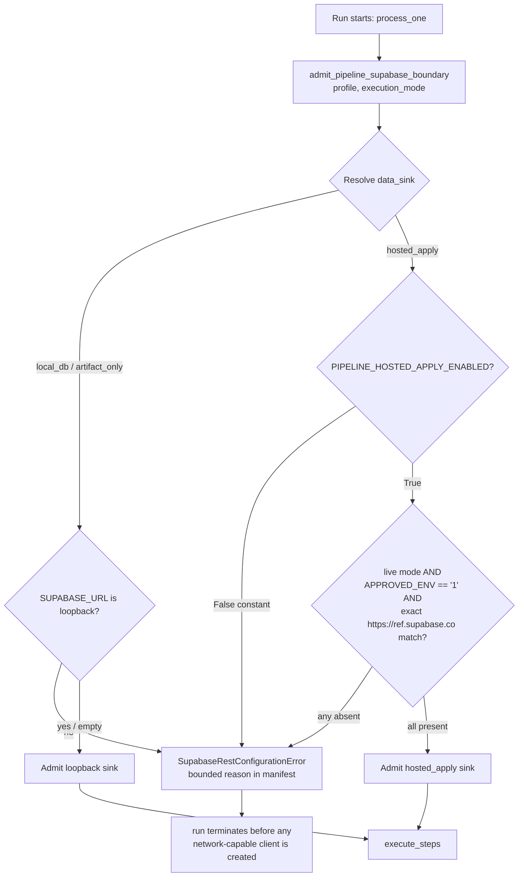

# Design Document

## Overview

This feature formalizes and hardens the crawler pipeline that already runs across three
cooperating actors — a scheduled GitHub Actions workflow (lite compute + evidence), a Mac
LaunchAgent (heavy compute + hosted reflection), and hosted Supabase (persistence boundary).
The goal is **not** to rebuild the pipeline. It is to turn an incrementally-assembled
arrangement into one coherent, scheduled, observable orchestration whose fail-closed controls,
idempotency, schedule ordering, and public-repo data hygiene are made explicit and testable.

The design maps every requirement onto the modules and workflows that exist today and identifies
the specific, additive changes needed:

- A committed, Operator-readable **cadence configuration artifact** plus a **schedule-validation**
  function that rejects overlapping/mis-ordered windows (Requirement 1).
- A small **schedule-source-of-truth check** that keeps `daily-crawler.yml` cron, the launchd
  `StartCalendarInterval`, and the cadence config in agreement, all expressed in KST via a fixed
  UTC+9 offset (Requirements 1, 9).
- Continued reliance on the existing `resolve_compute_profile` / `skip_reason_for_step` split for
  lite-vs-heavy separation and the `heavy_local_runtime_ready` gate (Requirement 2).
- Continued reliance on `admit_pipeline_supabase_boundary` as the single fail-closed hosted-write
  gate, with a documented **bounded rejection-code enumeration** surfaced through the Run_Manifest
  (Requirement 3).
- A documented **idempotent mutual-backup contract** on top of the existing
  `skip_already_on_hosted` classification, with per-candidate applied/skipped/unresolved accounting
  (Requirement 4).
- A **manifest staleness / health** rule that treats a missing-or-stale `current-summary.json` as
  not-Succeeded, layered on the existing `write_run_manifest` fields (Requirement 5).
- Explicit **missed-run catch-up**, **soft-timeout staging/backfill**, and **GHA-degradation**
  behaviors, all already partially implemented in the workflows and launchd agent (Requirement 6).
- A per-runner **env-contract preflight ordering** requirement on top of `check_env_contract.py`
  (Requirement 7).
- **Artifact redaction** and the default-disabled **data-branch publish gate** already present in
  the workflow, made explicit as invariants (Requirement 8).
- **Governance boundaries**: backend ownership, protected serialized `develop -> data -> main`
  flow, `requireAdmin` on any admin surface, immutable applied migrations, no fabricated
  approval/deploy evidence (Requirement 9).

All changes to protected-branch workflow behavior are described as changes that must traverse the
existing PR flow under branch protection; this document does not authorize weakening any
fail-closed control and does not assert hosted production state or legal compliance.

## Architecture

### Components (existing ground truth)

| Component | Module / artifact | Role |
|---|---|---|
| GHA_Runner | `.github/workflows/daily-crawler.yml` | cron `0 19 * * *` UTC = 04:00 KST; lite compute on `ubuntu-latest` against a `postgres:15` loopback service; prepares data-only publication artifact; uploads frames to GDrive with soft-timeout staging |
| Backfill_Runner | `.github/workflows/gdrive-frame-backfill.yml` | cron `0 21`/`0 23` UTC + `workflow_run` after Crawler; reconciles staged frame shards idempotently under a remote lease lock |
| Mac_Runner | launchd `dev.tzudong.hosted-new-video` (installed by `backend/bin/install_mac_hosted_pipeline_launchd.sh`) | `StartCalendarInterval` 05:15 local KST; runs `run_hosted_new_video_pipeline.py --channel tzuyang --limit 1` |
| Mac entrypoint | `backend/bin/run_hosted_new_video_pipeline.py` | chains `evaluate_new_youtube_videos.py` then `apply_hosted_pending_candidates.py` (always dry-run preview first); self-loads `backend/.env`; does not auto-enable hosted apply |
| Pipeline_Worker | `backend.pipeline_control.worker` (`process_one`) | claims a run, classifies sink via `admit_pipeline_supabase_boundary` before any client, binds `TZUDONG_DATA_SINK/EXECUTION_MODE/COMPUTE_PROFILE` into child env, runs `execute_steps`, writes Run_Manifest |
| Step graph | `backend/pipeline_control/graph.py` (`STEP_SPECS`) | declarative numbered-script graph; capabilities `mutating_db`/`heavy_compute`/`map_url`/`frame_caption`/`chunk`; `skip_when_lite`; fail-closed `validate_graph`/`build_argv` |
| Skip policy | `backend/pipeline_control/profiles.py` (`resolve_compute_profile`, `skip_reason_for_step`, `mutating_steps_allowed`) | resolves `lite_gha`/`heavy_local`; decides optional vs downstream skips |
| Adapter | `backend/pipeline_control/adapter.py` (`execute_steps`) | iterates `STEP_SPECS`, emits `step.progress`/`run.lifecycle` events, invokes runners in live mode |
| Hosted_Apply_Gate | `backend/utils/supabase_rest.py` (`admit_pipeline_supabase_boundary`) | fail-closed sink classifier: loopback for `local_db`/`artifact_only`; exact project-ref + live + approved + enablement for `hosted_apply` |
| Run_Manifest writer | `worker.write_run_manifest` + `backend/pipeline_control/manifest.py` | writes `backend/log/cron/current-summary.json`; live-evidence eligibility recomputed, never trusted |
| Env_Contract_Check | `backend/bin/check_env_contract.py` | per-profile required/optional/aliases; forbidden-name detection; names+presence only; fail-closed exit |
| Cadence config (new) | committed schedule artifact (see Data Models) | Operator-readable KST window assignments; validated by schedule-validation |

### Daily cadence sequence

```mermaid
sequenceDiagram
    autonumber
    participant Cron as GHA cron (19:00 UTC / 04:00 KST)
    participant GHA as GHA_Runner (lite_gha)
    participant PG as postgres:15 loopback
    participant Art as Evidence Artifact
    participant Mac as Mac_Runner (heavy_local, 05:15 KST)
    participant Hosted as Hosted_Store (Supabase)
    participant BF as Backfill_Runner (21:00/23:00 UTC)

    Cron->>GHA: trigger scheduled run
    GHA->>GHA: env-contract preflight (daily, pipeline-control)
    GHA->>PG: worker classifies sink = local_db (loopback only)
    GHA->>GHA: execute_steps under lite_gha (heavy steps skipped)
    GHA->>Art: publish Run_Manifest + data-only publication (secrets/data redacted)
    GHA->>Hosted: hosted-pending-apply job ONLY if vars.TZUDONG_HOSTED_DATA_PLANE_APPROVED == '1'
    Note over GHA,Hosted: dry-run preview precedes any live write
    Mac->>Mac: buffer >= 30 min after GHA window; env-contract preflight (hosted-pending-apply)
    Mac->>Mac: evaluate_new_youtube_videos -> pending candidates
    Mac->>Hosted: apply_hosted_pending_candidates (dry-run preview, then apply if operator-enabled)
    Note over Mac,Hosted: idempotent: skip_already_on_hosted per candidate identity
    BF->>Hosted: reconcile staged frame shards (idempotent, lease-locked)
```

### Fail-closed hosted-write gate decision flow



Note: `PIPELINE_HOSTED_APPLY_ENABLED` is a compile-time `False` constant in `supabase_rest.py`.
Environment variables alone cannot enable a hosted write; this is intentional and this design does
not change it. Removing that latch is out of scope and would require operation-bound preview,
approval, capability, and hosted readback receipts under the external process.

## Components and Interfaces

This section maps each requirement to the concrete existing module(s) and the additive change(s).

### R1 — Coherent staggered daily schedule

- **Existing**: GHA cron `0 19 * * *` UTC (04:00 KST); launchd `StartCalendarInterval` Hour 5 /
  Minute 15 (05:15 KST). The committed GHA window ends at 04:45, preserving the required 30-minute
  buffer before the Mac runner begins.
- **Additive**:
  - A committed **cadence config artifact** (`backend/pipeline_control/cadence.schedule.json`, see
    Data Models) recording each runner's KST window start/end (R1.5).
  - A pure **schedule-validation function** (`backend/pipeline_control/schedule.py::validate_cadence`)
    that rejects the config when windows overlap, violate the ≥30-minute buffer, or violate the
    GHA-before-Mac ordering, returning a bounded error identifying the conflicting windows (R1.1,
    R1.2, R1.6). No runner is triggered under an invalid config — validation runs as a preflight in
    the worker/entrypoints and fails closed.
  - A **KST derivation helper** applying the fixed UTC+9 offset with no DST adjustment, used to
    document each UTC cron's KST equivalent (R1.3).
  - A **window-overrun indication**: the Run_Manifest records `windowStart`/`windowEnd`/actual
    completion so an overrun for one runner is recorded without disturbing other runners' windows
    (R1.7). GHA start-latency (R1.4) is a scheduler property of GitHub Actions and is documented, not
    enforced in code.

### R2 — Lite vs heavy compute separation

- **Existing**: `resolve_compute_profile` returns `lite_gha` under `GITHUB_ACTIONS=true` (or explicit
  env), `heavy_local` otherwise. `skip_reason_for_step` returns `("optional", SKIP_HEAVY_REASON)` for
  `skip_when_lite` heavy steps under `lite_gha`. Heavy steps: `03-2-visual`, `04-frames`,
  `05-map-url`, `06-frame-caption`, `08-chunk`. `worker.main()` raises
  `heavy_local_runtime_missing` when profile is `heavy_local` and `heavy_local_runtime_ready()` is
  not all-true.
- **Additive**: none functionally; the design pins these behaviors as invariants (R2.1–R2.6) and adds
  source-contract tests. `ProfileError("compute_profile_invalid")` already covers the
  profile-unresolved halt (R2.6).

### R3 — Fail-closed hosted-write gating

- **Existing**: `admit_pipeline_supabase_boundary(profile, execution_mode)` is called in
  `process_one` **before** any client. `hosted_apply` requires all four conditions; any absence
  raises `SupabaseRestConfigurationError`, which `process_one` maps to `finish_failed` +
  `write_run_manifest("Failed", ...)`. `_production_url` enforces the byte-exact
  `https://<ref>.supabase.co` shape (scheme/host/port/path all checked). Lite/local/artifact sinks
  are restricted to loopback. Mac entrypoint always runs a dry-run preview before apply and never
  auto-enables the latch.
- **Additive**:
  - A **bounded fixed-code enumeration** for rejection reasons recorded in the Run_Manifest
    (`hostedGateRejectionCode`), drawn from a closed set (see Data Models), never provider/DB text
    (R3.7). Existing codes (`supabase_data_boundary_rejected`, `SUPABASE_REST_CONFIGURATION_INVALID`)
    are folded into this enumeration at the manifest layer without exposing internals.
  - Pin the Mac dry-run-preview-precedes-live invariant (R3.5) and the no-auto-enable invariant
    (R3.6) as source-contract assertions.

### R4 — Idempotent mutual backup between runners

- **Existing**: both the Mac entrypoint (`evaluate_new_youtube_videos` +
  `apply_hosted_pending_candidates`) and the GHA `hosted-pending-apply` job reflect candidates by
  stable identity and skip those already on Hosted_Store (`skip_already_on_hosted`).
  `LIVE_MAX_NEW_ITEMS=1` bounds writes.
- **Additive**: a documented **idempotent mutual-backup contract**:
  - Per-candidate classification into mutually-exclusive `applied` / `skippedAlreadyPresent` /
    `unresolved` sets that together cover the processed set (R4.4, R4.6).
  - "Already present ⇒ skip, never duplicate" (R4.1); "N reflections in a day ⇒ exactly one record"
    (R4.2); "either runner's success suffices" (R4.3).
  - Concurrency safety (R4.5) rests on a **unique candidate-identity constraint** at the
    Hosted_Store insert boundary (additive migration if not already enforced) so the losing writer
    observes a conflict and reclassifies as already-present. Applied migrations are immutable; any
    correction is a new additive migration (ties to R9.7).
  - Partial-termination durability (R4.7): applied records are never rolled back; subsequent runs
    reclassify them as present. This is inherent to insert-if-absent semantics.

### R5 — Run health and observability

- **Existing**: `write_run_manifest` writes `current-summary.json` with `finalStatus`
  (`OK`/`ERROR`), `executionMode`, `dataSink`, `computeProfile`, `stepEvents` (with
  `optional_skipped`/`downstream_skipped`), `stepEvidenceSha256`, `gitSha`, `generatedAt`/`date`
  (UTC), and bounded per-step outcomes. GHA publishes these in artifacts.
- **Additive**:
  - A **manifest staleness/health check** (`backend/pipeline_control/health.py::run_is_healthy`)
    that returns not-Succeeded (fail closed) when the manifest's `date` is earlier than the current
    UTC date or no manifest exists for today (R5.7).
  - A fixed **status vocabulary** mapping: `finalStatus` "OK"↔Succeeded, "ERROR"↔Failed, mutually
    exclusive (R5.5). Add a bounded `operatorSummary` string (fixed max length) stating final status,
    execution mode, data sink, and failed-required-step count (R5.8).
  - Confirm redaction: no field carries secrets/tokens/provider diagnostics (R5.9) — enforced by the
    payload validator and by only ever writing fixed codes and canonical step names.

### R6 — Failure handling and recovery

- **Existing**: launchd coalesces missed runs into a single next-wake execution (macOS
  `StartCalendarInterval` semantics run once at wake, not once per missed slot) (R6.1). GHA GDrive
  upload has a soft budget (`GDRIVE_UPLOAD_SOFT_BUDGET_SECONDS`) that stages remaining shards to a
  residual queue and completes non-failing (R6.3). Backfill processes residual/staged shards
  idempotently, short-circuits on empty backlog (`SystemExit(42)` → exit 0), and retains
  attempt-exhausted shards after a bounded `--backfill-threshold-attempts 3` (R6.4, R6.5, R6.6). GHA
  lite path publishes evidence even on non-zero adapter status and does not report a clean success
  when degraded (R6.7, R6.8). Env preflight fails closed before work (R6.10).
- **Additive**:
  - A **missed-window count** recorded in the audit trail when ≥2 windows are coalesced, without
    provider/DB detail (R6.2). Sourced from comparing last-successful manifest `date` to current UTC
    date.
  - Pin retry-idempotency reliance (R6.9) to the R4 contract.

### R7 — Environment-contract and secret readiness preconditions

- **Existing**: `check_env_contract.py` profiles `daily`, `pipeline-control`, `hosted-pending-apply`,
  `gdrive-backfill`; required/optional/`allowed_aliases`; `FORBIDDEN_ENV_NAMES`; prints names +
  presence only; exits non-zero when required missing or forbidden present. GHA runs `daily` +
  `pipeline-control` before the pipeline; `hosted-pending-apply` and `gdrive-backfill` jobs run their
  profiles first.
- **Additive**:
  - A documented **runner→profile mapping** and a **preflight-ordering invariant**: contract
    validation must complete (exit 0) before any pipeline step for that runner (R7.1, R7.2).
  - **Placeholder rejection** (R7.3): extend `_present` semantics so a required secret bound to a
    known placeholder/fabricated marker is treated as absent. (Blank values are already rejected;
    add a bounded placeholder denylist check that never logs the value.)
  - Confirm alias-satisfaction (R7.6) and machine-readable report (R7.7) — both already emitted by
    `validate()` / `--json`.

### R8 — No crawl data or secrets in the public repository

- **Existing**: `.gitignore` excludes data dirs, `**/*.jsonl`, `**/.env`, `oauth_creds.json`,
  `*session.json`, `cookies*`, `.gemini/`, credential dirs. `daily-publish` is disabled by default
  and only runs when `vars.TZUDONG_DATA_BRANCH_PUBLISH == '1'`; the publication path validates a
  manifest-bound, digest-verified, data-only bundle and stages only manifest-listed data paths.
  Evidence artifacts carry only status/log JSON.
- **Additive**:
  - Pin the **data-branch publish gate** as an invariant: any flag state other than the exact enabled
    value keeps the path disabled (R8.3, R8.4).
  - Pin **artifact redaction** (R8.5, R8.6) and the **ignore-configuration coverage** (R8.7) as
    source-contract tests.
  - Pin the commit-guard behavior that blocks non-manifest/data/secret paths and leaves history
    unchanged (R8.1, R8.2, R8.8) — already implemented via the staged-path allowlist check in
    `daily-publish`.

### R9 — Governance-consistent change and reflection boundaries

- **Existing**: long-running crawler/media/model/backup/batch-insert work runs only in backend
  runners (never route handlers). Workflows gate on `github.ref_name == default_branch &&
  github.ref_protected` and only run the default-branch definition. Admin API handlers call
  `requireAdmin`, return bounded fixed codes, and never expose provider/DB errors.
- **Additive**: no functional change. The design documents that any change to protected-branch
  workflow behavior must merge through `develop -> data -> main` under branch protection before it is
  active (R9.2, R9.5); no approval/deploy evidence is fabricated (R9.3); no fail-closed control is
  weakened as a means to complete a run (R9.4); applied Supabase migrations are immutable — a
  correction is a new additive migration (R9.7); any admin surface exposing an orchestration
  operation keeps `requireAdmin` + bounded codes (R9.6).

## Data Models

### Cadence configuration artifact (new)

Committed, Operator-readable, no secrets. Path: `backend/pipeline_control/cadence.schedule.json`.

```json
{
  "schemaVersion": 1,
  "timezone": "Asia/Seoul",
  "utcOffsetMinutes": 540,
  "minBufferMinutes": 30,
  "windows": [
    {
      "runner": "GHA_Runner",
      "profile": "lite_gha",
      "kstStart": "04:00",
      "kstEnd": "04:45",
      "utcCron": "0 19 * * *",
      "workflow": ".github/workflows/daily-crawler.yml"
    },
    {
      "runner": "Mac_Runner",
      "profile": "heavy_local",
      "kstStart": "05:15",
      "kstEnd": "07:00",
      "launchdCalendar": { "Hour": 5, "Minute": 15 },
      "agent": "dev.tzudong.hosted-new-video"
    }
  ]
}
```

`validate_cadence` returns `{ "ok": bool, "errorCode": str|null, "conflictingWindows": [str,...] }`
with `errorCode` drawn from `{ null, "windows_overlap", "buffer_too_small", "order_violation",
"window_shape_invalid" }`. The example matches the committed schedule: GHA begins at 04:00 and its
window ends at 04:45; the Mac runner begins at 05:15, leaving the required 30-minute buffer. The
source-contract validator fails closed when the workflow cron, installer calendar, agent label, or
their KST derivations diverge from this artifact.

### Run_Manifest (`backend/log/cron/current-summary.json`) — existing + additive fields

Existing (selected): `generatedAt`, `date` (UTC), `finalStatus` (`OK`/`ERROR`), `finalExitCode`,
`failedRequiredSteps`, `optionalSkips`, `downstreamSkips`, `stepEvents[]`
(`{name,status,reason?}`, status ∈ `completed`/`failed`/`optional_skipped`/`downstream_skipped`),
`executionMode` (`dry_run`/`live`), `dataSink` (`local_db`/`artifact_only`/`hosted_apply`),
`computeProfile`, `gitSha`, `stepEvidenceSha256`, live-evidence sha/count fields.

Additive (all bounded, secret-free):

| Field | Type | Purpose | Req |
|---|---|---|---|
| `hostedGateRejectionCode` | enum string \| null | fixed rejection reason when the hosted gate rejects | R3.7 |
| `operatorSummary` | string (≤ fixed max) | one-line status/mode/sink/failed-count summary | R5.8 |
| `windowStart` / `windowEnd` | string (KST HH:MM) \| null | assigned cadence window for the runner | R1.5, R1.7 |
| `windowOverrun` | bool | run extended past `windowEnd` | R1.7 |
| `missedWindowCount` | int ≥ 0 | coalesced missed windows since last success | R6.2 |
| `reflection` | object | per-candidate accounting (below) | R4.4 |

### Reflection accounting object (new)

```json
{
  "applied": ["<candidateId>", "..."],
  "skippedAlreadyPresent": ["<candidateId>", "..."],
  "unresolved": ["<candidateId>", "..."]
}
```

Invariant: the three lists are pairwise disjoint and their union equals the processed candidate set.
`candidateId` is the stable candidate identity (e.g. YouTube video id / restaurant trace id), never
raw payloads.

### Hosted gate rejection code enumeration (new, closed set)

`{ "sink_not_admitted", "loopback_required", "hosted_apply_disabled", "not_live_mode",
"approval_flag_absent", "project_ref_mismatch", "config_invalid" }` — mapped from the gate's internal
`SupabaseRestConfigurationError` without exposing provider/DB text.

### Residual backlog / staging manifest (existing)

- `gdrive-upload-residual-queue.jsonl` — newline-delimited per-item state (`staged`,
  `missing_local`, `pending_local`) with `stagingShard` binding.
- `current-upload-staging-manifest.json` — `{ schemaVersion: 2, shards: [{ shardId, remoteShard,
  archiveSha256, archiveSize, itemCount, byteCount, items[], archiveReceipt }] }`.
- `current-upload-status.json` — `{ status, residualCount, stagedShardCount, completionProof, ... }`;
  `status == "backfill_required"` signals residual work; backfill retains attempt-exhausted shards.

### Evidence artifact contents (existing)

Status/log JSON only (`current-summary.json`, `current-upload-status.json`, budget posture, quality
audit, preflight reports) plus the digest-verified data-only publication bundle. Excludes secrets,
credentials, cookies, tokens, and repository-committed crawl data.

## Correctness Properties

*A property is a characteristic or behavior that should hold true across all valid executions of a
system — essentially, a formal statement about what the system should do. Properties serve as the
bridge between human-readable specifications and machine-verifiable correctness guarantees.*

The following properties target the **pure-logic layer** of the orchestration (schedule validation,
sink classification, idempotent reflection, health/staleness, env-contract, skip policy, redaction,
and publish/ignore/commit gating). Workflow scheduler timing, artifact upload wiring, and governance
process are validated by source-contract and integration tests instead (see Testing Strategy), not
by these properties.

### Property 1: Valid schedule implies non-overlap and buffer

*For all* generated sets of cadence windows, if `validate_cadence` returns `ok = true`, then no two
windows overlap and every pair of consecutive windows is separated by at least the configured
minimum buffer (30 minutes); and *for all* window sets that overlap or violate the buffer,
`validate_cadence` returns `ok = false` with an `errorCode` from the closed set and a non-empty list
of conflicting windows.

**Validates: Requirements 1.1, 1.6**

### Property 2: Valid schedule preserves GHA-before-Mac ordering

*For all* generated GHA/Mac window pairs, if `validate_cadence` returns `ok = true`, then the
GHA_Runner window ends at least the minimum buffer before the Mac_Runner window begins; any pair
violating this ordering is rejected with an ordering `errorCode`.

**Validates: Requirements 1.2, 1.6**

### Property 3: KST derivation round-trips with a fixed UTC+9 offset

*For all* minutes-of-day, converting a UTC time to KST by adding 540 minutes (mod 1440) and back to
UTC is the identity, and the applied offset is always exactly 540 minutes with no daylight-saving
adjustment.

**Validates: Requirements 1.3**

### Property 4: Lite profile never runs a heavy step

*For all* steps in `STEP_SPECS` under compute profile `lite_gha`, every heavy step (those with the
`heavy_compute` capability or `skip_when_lite`) is skipped with a bounded optional skip reason and is
never dispatched to a runner.

**Validates: Requirements 2.1, 2.5**

### Property 5: Heavy readiness gates every heavy step

*For all* heavy-local readiness states in which at least one required prerequisite is absent, the
Pipeline_Worker under profile `heavy_local` halts with a bounded heavy-runtime-missing condition
before invoking any heavy step, leaving heavy-step outputs unmodified.

**Validates: Requirements 2.3, 2.4**

### Property 6: Unresolvable profile halts before heavy work

*For all* non-empty compute-profile strings that are not exactly `lite_gha` or `heavy_local`,
profile resolution raises a bounded profile-unresolved error and no heavy step executes.

**Validates: Requirements 2.6**

### Property 7: Sink is classified as exactly one target before any client

*For all* environments, `admit_pipeline_supabase_boundary` either returns a data sink that is exactly
one of `local_db`, `artifact_only`, or `hosted_apply`, or raises the fixed configuration error — and
it performs no network access and returns no key while doing so.

**Validates: Requirements 3.1**

### Property 8: Hosted write requires all four conditions

*For all* environments classified to the `hosted_apply` sink in which any one of (live execution
mode, hosted-apply enablement, approved-environment flag equal to the exact string "1", byte-exact
`https://<project_ref>.supabase.co` match) is absent, the gate rejects the hosted write and no
network-capable client is instantiated; only the case where all four hold admits the sink.

**Validates: Requirements 3.2**

### Property 9: Any project-reference difference is treated as a mismatch

*For all* single-character, scheme, letter-case, subdomain, path, or query mutations of the expected
`https://<project_ref>.supabase.co` value, the gate treats the project-reference condition as absent
and rejects the hosted write.

**Validates: Requirements 3.3**

### Property 10: Lite, local, and artifact profiles never admit Hosted_Store

*For all* environments whose profile is `lite_gha` or whose sink is `local_db` or `artifact_only`,
the admitted sink is restricted to a loopback or artifact target and is never `hosted_apply` under
any condition.

**Validates: Requirements 3.4**

### Property 11: Gate rejection records a single bounded fixed code

*For all* environments that cause a hosted-gate rejection, the Run_Manifest records exactly one
`hostedGateRejectionCode` drawn from the closed enumeration, the run halts with a bounded
blocked-status result, and no field contains provider identifiers, database error text, connection
strings, or free-form diagnostics.

**Validates: Requirements 3.7, 9.4**

### Property 12: Reflection is idempotent

*For all* eligible candidate sets and all repetition counts N ≥ 1, reflecting the set N times yields
the same hosted state as reflecting it once — exactly one record per candidate identity — and this
holds regardless of which runner performs each reflection and regardless of a prior partial
completion that already applied a prefix of the set.

**Validates: Requirements 4.1, 4.2, 4.3, 4.7**

### Property 13: Reflection accounting partitions the processed set

*For all* processed candidate sets, the `applied`, `skippedAlreadyPresent`, and `unresolved` lists
are pairwise disjoint and their union equals the processed set.

**Validates: Requirements 4.4**

### Property 14: Concurrent reflection creates at most one record

*For all* interleavings of two runners reflecting the same candidate identity, at most one hosted
record is created for that identity and the losing attempt reclassifies the candidate as already
present; the resulting state is independent of application order (confluence).

**Validates: Requirements 4.5**

### Property 15: Unresolved candidates are skipped without a record

*For all* candidates whose hosted presence cannot be determined, the runner skips applying the
candidate, creates no record for it, and records it in the `unresolved` set.

**Validates: Requirements 4.6**

### Property 16: Manifest timestamps are UTC in a fixed format

*For all* runs, the Run_Manifest `generatedAt` matches the fixed `%Y-%m-%dT%H:%M:%SZ` UTC pattern and
`date` matches the fixed `%Y-%m-%d` UTC pattern.

**Validates: Requirements 5.2**

### Property 17: Skipped steps carry a fixed-vocabulary reason

*For all* skipped steps, the Run_Manifest records a status of exactly `optional_skipped` or
`downstream_skipped` with a skip reason drawn from the fixed vocabulary, distinguishing an
optional-step skip from a downstream skip caused by an upstream required-step failure.

**Validates: Requirements 5.4**

### Property 18: Final status is Succeeded exclusive-or Failed

*For all* run outcomes, `finalStatus` is exactly one of the two values (OK↔Succeeded, ERROR↔Failed);
success and failure are mutually exclusive.

**Validates: Requirements 5.5**

### Property 19: Failed runs identify failed required steps by bounded id only

*For all* failing runs, each failed required step is recorded by its fixed canonical step identifier
with a bounded outcome indicator, and no field contains raw provider errors or stack traces.

**Validates: Requirements 5.6**

### Property 20: Stale or absent manifest is not healthy

*For all* manifests whose generation date is earlier than the current UTC date, and for the absence
of any manifest for the current UTC date, the health check returns not-Succeeded (fail closed); only
a manifest dated the current UTC date with a Succeeded status is healthy.

**Validates: Requirements 5.7**

### Property 21: Operator summary is bounded and complete

*For all* Run_Manifests, the `operatorSummary` string does not exceed the fixed maximum length and
encodes the final status, execution mode, data sink, and count of failed required steps.

**Validates: Requirements 5.8**

### Property 22: Manifest excludes secrets and diagnostics

*For all* generated runs, the serialized Run_Manifest — including step outcomes and skip reasons —
contains none of the forbidden markers (passwords, credentials, tokens, email/phone, provider
diagnostics, or free-form error text).

**Validates: Requirements 5.9**

### Property 23: Missed-window count reflects the coalesced gap

*For all* pairs of (last-successful-run UTC date, current UTC date) with a gap of two or more days,
the recorded `missedWindowCount` equals the number of missed windows in the gap, and the audit entry
contains no provider or database diagnostics.

**Validates: Requirements 6.2**

### Property 24: Soft-timeout staging captures exactly the unverified remainder

*For all* partitions of an expected frame set into verified and remaining items, the staging manifest
produced at soft-timeout contains exactly the unverified remainder and the run completes with a
non-failure status.

**Validates: Requirements 6.3**

### Property 25: Backfill processes staged shards before new work

*For all* non-empty residual backlogs, the backfill planner selects eligible staged shards (up to the
configured batch/item limits) for processing before starting any new pipeline work.

**Validates: Requirements 6.4**

### Property 26: Empty backlog short-circuits without contacting hosted targets

*For all* runs that start with an empty residual backlog and no newly scheduled work, the runner
short-circuits, records a zero-work outcome, and exits with a non-failure status without contacting
hosted upload targets.

**Validates: Requirements 6.5**

### Property 27: Attempt-exhausted shards are retained without blocking others

*For all* residual shards whose processing attempts reach the bounded maximum of 3, the shard is
retained in the residual backlog and marked attempt-exhausted, and the remaining shards continue to
be processed.

**Validates: Requirements 6.6**

### Property 28: Missing required secret halts before any work

*For all* environments missing at least one required secret for the applicable profile (considering
allowed aliases), the Env_Contract_Check reports the contract not satisfied, listing each missing
secret by canonical name only, and the runner halts before executing any pipeline step with a
non-zero exit, staging or publishing no partial results.

**Validates: Requirements 7.2, 6.10**

### Property 29: Placeholder values do not satisfy a required secret

*For all* required secrets bound only to a known placeholder or fabricated marker, the contract check
treats the secret as absent and reports the contract as not satisfied.

**Validates: Requirements 7.3**

### Property 30: Forbidden legacy names fail the contract

*For all* environments in which any forbidden legacy environment name is bound to a non-empty value,
the Env_Contract_Check reports the contract not satisfied and lists the forbidden name, and the
runner halts with a non-zero exit before any pipeline step.

**Validates: Requirements 7.4**

### Property 31: Env-contract report never emits a secret value

*For all* environments with arbitrary secret values, the machine-readable contract report contains
only secret names and presence status and never contains any secret value string.

**Validates: Requirements 7.5**

### Property 32: An allowed alias satisfies its required secret

*For all* required secrets that define allowed aliases, binding only an alias to a non-empty value
causes that required secret to be evaluated as present.

**Validates: Requirements 7.6**

### Property 33: Data-branch publish is enabled only by the exact flag value

*For all* values of the publish enablement flag, the data-branch publication path is enabled if and
only if the flag equals its exact enabled value ("1"); every other state (unset, empty, or any other
value) keeps the path disabled.

**Validates: Requirements 8.3, 8.4**

### Property 34: Evidence artifacts exclude and redact sensitive content

*For all* generated evidence artifacts, the contents contain no secrets, credentials, session tokens,
cookies, or repository-committed crawl data; and for any artifact that would otherwise contain such
an item, only that item is redacted or omitted while the remaining non-sensitive content is retained.

**Validates: Requirements 8.5, 8.6**

### Property 35: Ignore configuration covers every forbidden path category

*For all* generated paths in the forbidden categories (crawl/evaluation data directories,
newline-delimited JSON dataset files, environment files, OAuth credential files, session files,
cookie files, provider credential directories), the repository ignore configuration excludes the path
from source control.

**Validates: Requirements 8.7**

### Property 36: Commit guard blocks non-manifest data or secret paths

*For all* staged path sets, if any staged path is a crawl/evaluation dataset or secret-bearing file
that is not in the publication manifest allowlist, the publication guard rejects the attempt and
leaves repository history unchanged while surfacing a bounded rejection indication.

**Validates: Requirements 8.1, 8.2, 8.8**

## Error Handling

All error handling is fail-closed and bounded. No path weakens a control to complete a run.

- **Hosted-gate rejection**: `admit_pipeline_supabase_boundary` raises `SupabaseRestConfigurationError`
  before any client. `process_one` catches it, calls `store.finish_failed(run.id,
  "supabase_data_boundary_rejected")`, and writes a `Failed` manifest whose `hostedGateRejectionCode`
  is a value from the closed enumeration. No provider/DB text is ever recorded (R3.7, R9.4).
- **Graph / profile / target errors**: `AdapterGraphError`, `ProfileError`, `TargetSchemaError` and
  `KafkaPublishError`/`EsIndexError` are caught in `process_one`, mapped to their fixed `.code`, and
  written to a `Failed` manifest. `validate_graph`/`build_argv` reject path escape, disallowed
  interpreters, and unknown argument templates before any subprocess starts.
- **Heavy-runtime not ready**: `worker.main()` raises `SystemExit("heavy_local_runtime_missing")`
  before executing any heavy step when profile is `heavy_local` and `heavy_local_runtime_ready()` is
  not all-true (R2.4).
- **Env-contract failure**: `check_env_contract.py` exits non-zero when required secrets are missing
  (including placeholder/fabricated values) or a forbidden name is present; runners halt before any
  pipeline step. Missing operator secrets fail closed by design; no fake values are ever injected
  (R6.10, R7.2, R7.3, R7.4).
- **Missed / coalesced runs**: launchd runs one catch-up at next wake (not one per missed slot). When
  ≥2 windows are missed, `missedWindowCount` is derived from the last-success date and recorded in the
  audit trail without provider/DB detail (R6.1, R6.2).
- **Soft-timeout uploads**: the GHA GDrive step stops starting new shard uploads when the soft budget
  is near-exhausted, stages the remainder to the residual queue/staging manifest, records the residual
  count, and completes with a non-failure status (R6.3).
- **Backfill retries**: staged shards are processed idempotently; a shard failing across the bounded
  maximum of 3 attempts is retained and marked attempt-exhausted while the rest continue; an empty
  backlog short-circuits with a zero-work non-failure exit (R6.5, R6.6).
- **GHA degradation**: on a non-zero adapter status the lite path still publishes evidence recording
  the exit code and keeps the job green so `hosted-pending-apply` can run; a deploy/limit failure
  publishes a degraded outcome and does not report a clean success (R6.7, R6.8).
- **Publication commit guard**: `daily-publish` blocks any staged path outside the manifest allowlist,
  leaves history unchanged, and surfaces the rejection; the job is disabled by default and requires
  the exact `vars.TZUDONG_DATA_BRANCH_PUBLISH == '1'` flag (R8.4, R8.8).
- **Schedule misconfiguration**: `validate_cadence` returns a bounded `errorCode` and the conflicting
  windows; a runner preflight fails closed and triggers nothing under an invalid config (R1.6).

## Testing Strategy

### Dual approach

- **Unit / example tests** cover specific behaviors, edge cases, and error conditions.
- **Property-based tests** cover the universal invariants in the Correctness Properties section.
- **Source-contract tests** (per `apps/web/tests-unit` conventions and backend `unittest`) pin
  workflow wiring, ordering, and governance guarantees that are not input-varying.

### Property-based tests

- **Library**: Python `hypothesis` for the backend pure-logic layer (schedule, gate, profiles,
  manifest/health, env-contract, reflection model, staging/backfill planner logic). Do not implement
  PBT from scratch.
- **Iterations**: configure each property test for a minimum of 100 examples
  (`@settings(max_examples=100)`).
- **Tagging**: each property test carries a comment
  `# Feature: crawler-pipeline-orchestration, Property {n}: {property text}` and is implemented as a
  single property test per property.
- **Placement**: `backend/pipeline_control/test_*_pbt.py` and
  `backend/utils/tests/test_*_pbt.py`, runnable via `python -m unittest` (hypothesis integrates with
  unittest `TestCase`).
- **Mapping** (property → module under test):
  - P1, P2, P3 → `backend/pipeline_control/schedule.py` (`validate_cadence`, KST helper)
  - P4, P5, P6 → `backend/pipeline_control/profiles.py`, `adapter.execute_steps`,
    `worker.heavy_local_runtime_ready`
  - P7–P11 → `backend/utils/supabase_rest.py` (`admit_pipeline_supabase_boundary`) + manifest
    rejection-code mapping
  - P12–P15 → an in-memory reflection model over the candidate-identity insert-if-absent contract
    (mocks for hosted I/O; no live Supabase)
  - P16–P22 → `worker.write_run_manifest`, `manifest.py`, `health.run_is_healthy`
  - P23–P27 → `health` missed-window derivation and `run_daily_helpers` staging/backfill planner
    functions
  - P28–P32 → `check_env_contract.validate`
  - P33–P36 → publish-flag predicate, artifact redaction helper, `.gitignore` matcher, and the
    publication commit-guard allowlist

### Unit / example tests

- Cadence config schema presence (R1.5); window-overrun field derivation (R1.7).
- Manifest presence-and-fields at the fixed path for a representative run (R5.1); `--json`
  env-contract report schema (R7.7).
- Mac entrypoint dry-run-preview-precedes-live ordering and no-auto-enable (R3.5, R3.6).

### Source-contract tests

- Each runner runs its `check_env_contract` profile before pipeline steps; runner→profile mapping
  (R7.1).
- GHA jobs guard on `github.ref_name == default_branch && github.ref_protected` and run only the
  default-branch definition (R9.5); upload step path list includes `current-summary.json` (R5.3);
  lite path publishes evidence and records `pipeline_exit` on non-zero status (R6.7, R6.8).
- Route handlers do not import crawler/ffmpeg/Gemini-bulk/GDrive/batch-insert modules (R9.1); any
  admin orchestration handler calls `requireAdmin` first and returns bounded fixed codes without
  provider/DB detail (R9.6).
- Applied Supabase migration files are unchanged; corrections are new additive files (R9.7).
- `.gitignore` excludes data dirs and `**/*.jsonl` and the secret safety-net patterns (R8.2, R8.7).

### Integration / smoke (not PBT)

- GHA scheduler start-latency (R1.4) and launchd single-catch-up-at-wake (R6.1) are observed out of
  band; documented, not unit-tested.
- Governance process items (R9.2 protected serialized flow, R9.3 no fabricated evidence) are external
  process guarantees confirmed by branch protection and review, not by in-repo tests.

### Backend test commands (per AGENTS.md)

```text
python -m unittest backend.pipeline_control.test_validators_unittest
python -m unittest backend.pipeline_control.test_data_contracts_unittest
python -m unittest backend.utils.tests.test_run_daily_regression
python backend/bin/check_env_contract.py --profile daily
```

New property and source-contract tests are added alongside these and run under the same
`python -m unittest` harness (plus `bun run test:unit` for any `apps/web` source-contract additions).
