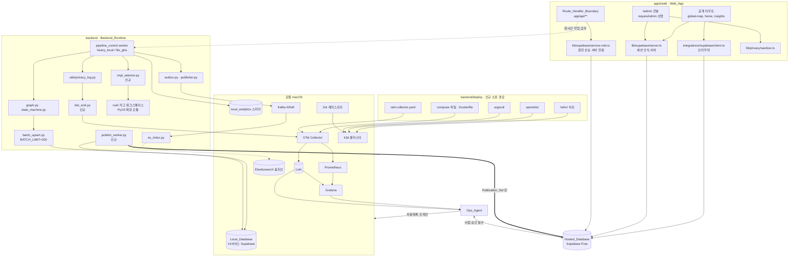
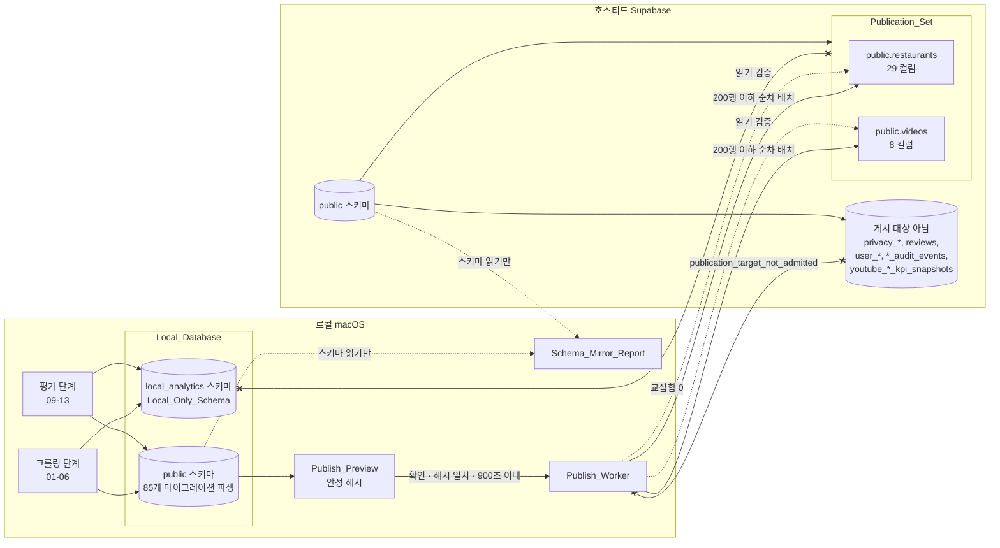
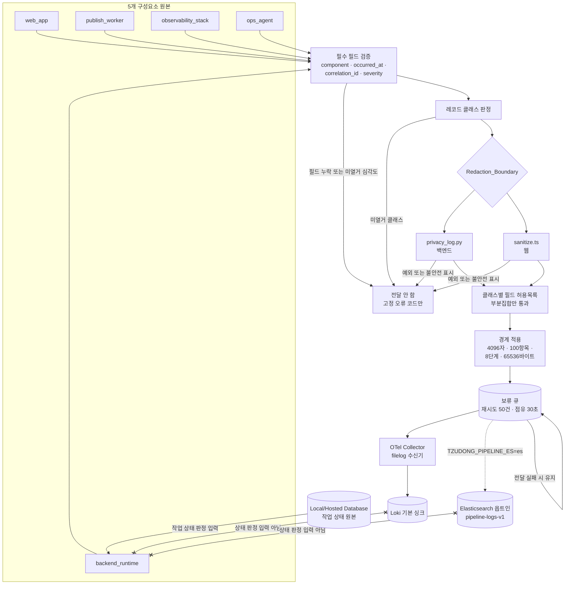
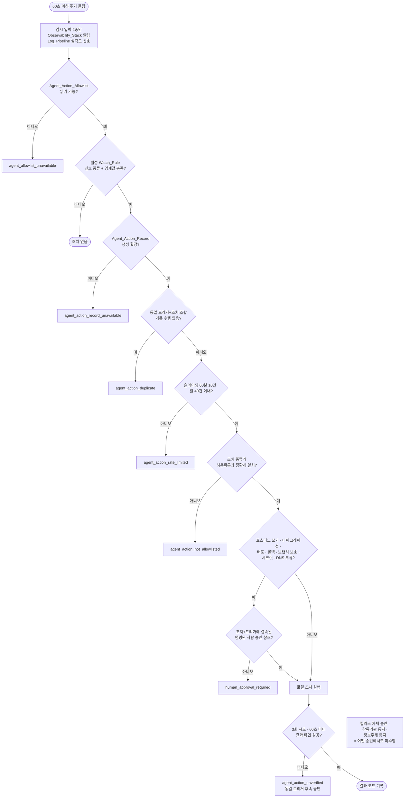
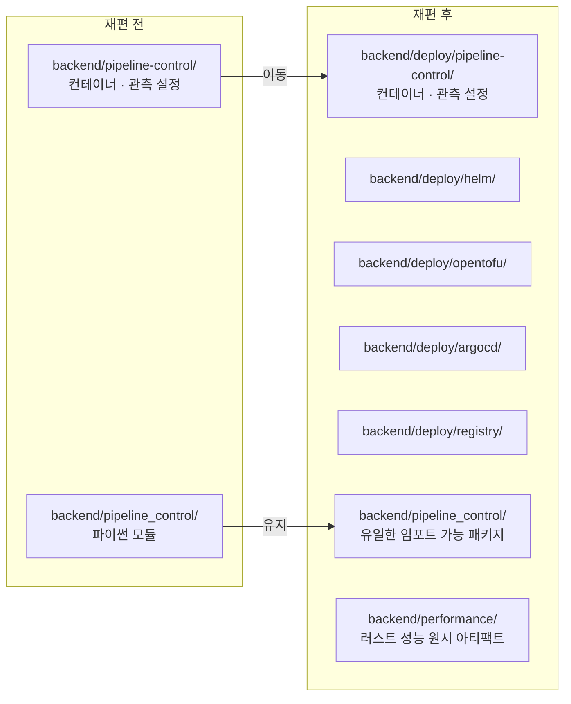
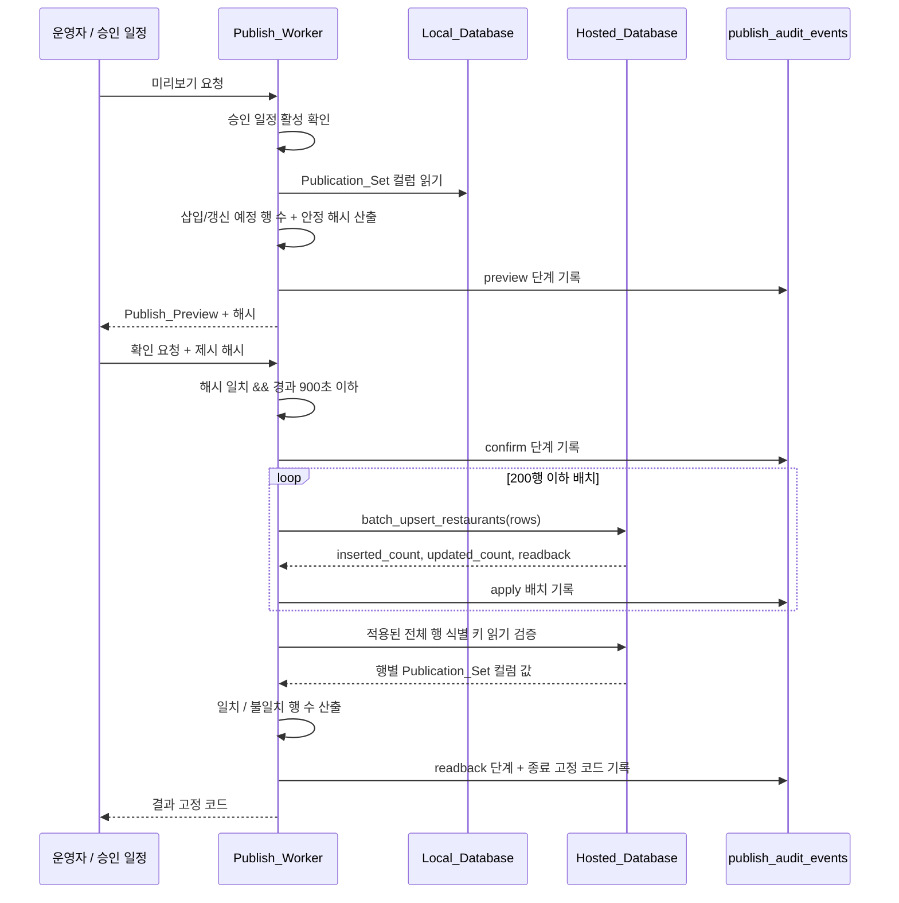

# Design Document

## Overview

이 설계는 `.kiro/specs/platform-modernization/requirements.md`의 요구사항 1-16을 현재 트리 자산 위에 착지시키는 방법을 정의한다. 요구사항이 제시한 아홉 갈래 요구를 다섯 개 설계 축으로 재편성한다.

| 설계 축 | 담당 요구사항 | 핵심 산출물 |
| --- | --- | --- |
| A. 로컬 우선 데이터 평면 | 8, 9, 10 | `local_analytics` 스키마, Schema_Mirror_Report, Publish_Worker |
| B. 관측·로그 평면 | 12, 13 | Loki 기본 Log_Sink, OTel Collector filelog 수신기, 필드 허용목록 |
| C. 공급망·구조 규율 | 4, 5, 6, 7, 11 | Dependency_Freshness_Workflow, `backend/deploy/`, Rename_Ledger, Tooling_Selection_Record |
| D. 러스트 이행 | 1, 2, 3 | `backend/rust/` 카고 워크스페이스, Migration_Ledger, Parity_Harness |
| E. 이전 준비·자율 운영 | 14, 15 | Deployment_Descriptor_Set, Ops_Agent, Agent_Action_Allowlist |

요구사항 16(단계 순서와 롤백 게이트)은 다섯 축 전체에 걸리는 횡단 규율이며 별도 축으로 두지 않는다.

### 설계 원칙

1. **기존 자산 확장이 기본이다.** `backend/pipeline_control/`의 39개 모듈, `backend/supabase/`의 85개 마이그레이션과 14개 서비스 로컬 스택, `backend/pipeline-control/`의 컨테이너·관측 스캐폴드, 20개 GitHub Actions 워크플로는 대체 대상이 아니라 확장 대상이다. 새 파일을 만들기 전에 기존 진입점을 먼저 사용한다. (요구사항 전반)
2. **실패는 폐쇄한다.** 승인·증거·시크릿·도구가 부재하면 부분 실행이 아니라 고정 코드 반환과 무변경이 정답이다. 기존 `backend/pipeline_control/profiles.py:mutating_steps_allowed`가 `hosted_apply`를 `hosted_apply_not_admitted`로 차단하는 방식을 전체 설계의 표준 패턴으로 채택한다. (요구사항 1.6, 8.3, 11.5, 13.16, 15.14)
3. **로컬이 원본, 호스티드가 게시 대상이다.** 파이프라인 쓰기는 Local_Database에만 일어나고, 호스티드로 나가는 경로는 Publish_Worker 하나뿐이다. (요구사항 8.2, 10.2)
4. **주장에는 보존된 아티팩트가 붙는다.** 성능 수치, 패리티 판정, 게시 성공, 도구 미채택 사유는 각각 조회 가능한 아티팩트를 참조한다. 참조가 끊기면 주장이 무효로 표기된다. (요구사항 2.4, 3.3, 10.7, 11.7)
5. **레다크션은 경계 하나다.** `backend/utils/privacy_log.py`와 `apps/web/lib/privacy/sanitize.ts` 밖에서 로그를 만들지 않는다. (요구사항 13.3)

### 사용자 참조 도구 목록 대비 편차

사용자 요청은 "Grafana, Kafka·kafka-ui, 서비스 메시, Elasticsearch, EFK, Helm, IaC"를 참조 목록으로 제시했다. 조사 결과 세 항목에서 참조 목록과 다른 선택을 채택한다. 근거는 요구사항 11.2가 요구하는 측정 항목, 특히 단일 macOS 워크스테이션의 상주 메모리다.

- **EFK → Loki + OTel Collector + Grafana.** Elasticsearch 단독을 기본 Log_Sink로 두면 JVM 힙이 로컬 상주 메모리를 지배한다. 현행 `backend/pipeline-control/docker-compose.elasticsearch.yml`은 이미 `ES_JAVA_OPTS: "-Xms1g -Xmx1g"`를 고정하고 있어 힙만 1 GiB다. Loki를 기본 싱크로 두고 Elasticsearch를 옵트인 보조 싱크로 남긴다. 기존 `es_index.py`의 `pipeline-logs-v1`/`pipeline-raw-v1` 인덱스, `LOG_ALLOWLIST`/`RAW_ALLOWLIST` 필드 허용목록, `admit_es_url`의 `local_db` 전용 호스트 승인은 이미 검증된 자산이므로 삭제하지 않고 보존한다. Fluentd/Fluent Bit를 추가하지 않는 이유는 수집기가 이미 OTel Collector 하나로 존재하므로 수집기를 둘로 늘리면 유지 대상만 증가한다는 점이다. (요구사항 11.2, 11.6, 13.10)
- **서비스 메시 → 기본 스택 제외, Linkerd 옵트인 프로파일.** 단일 macOS 머신에서 소수 서비스가 도는 구성에서 mTLS와 L7 정책이 주는 이득이 컨트롤 플레인 상주 비용을 넘지 않는다. Deployment_Descriptor_Set은 메시 주입이 가능한 형태(파드 어노테이션 슬롯, 사이드카 리소스 슬롯)를 유지하되 기본 렌더링에서 메시를 켜지 않는다. (요구사항 11.1, 12.15)
- **Harbor → Zot(주소 체계는 Harbor 유지).** Harbor는 Postgres + Redis + 다중 서비스 구성이라 로컬 상주 메모리가 과다하다. Zot을 로컬 서빙 주체로 채택하되 `backend/pipeline-control/harbor-tags.md`가 이미 기록한 `harbor.local/tzudong/pipeline-api`, `harbor.local/tzudong/pipeline-worker` 주소 규약은 그대로 유지한다. 유료 이전 시점에 서빙 주체만 Harbor로 승격하면 재태깅이 필요 없다. (요구사항 11.6, 14.1)

이 편차는 "참조 목록을 조용히 따르기"보다 "측정값을 인용한 선택"이 요구사항 11.7의 요구라고 판단한 결과다.

### 이 문서가 주장하지 않는 것

이 소스 트리는 어떤 병합, 배포, 호스티드 프로덕션 변경, 법령 준수 승인, 정책 공표, 신고 접수, 법무 검토 완료도 발생했다고 주장하지 않는다. 아래 항목은 모두 외부 증거와 명명된 사람의 결정에 달려 있으며 이 설계는 그 결정을 대신하지 않는다.

- 프로덕션 릴리스, 롤백, DNS 변경, 브랜치 보호 변경
- 로그 보존 기간과 법적 근거의 활성화 (요구사항 13.12, 아래 "보존 분류" 절 참조)
- 위치정보사업 신고 또는 비해당 확인
- 감독기관·정보주체 통지의 제출과 접수

---

## Architecture

### 전체 구성요소와 경계



설계 결정: Route_Handler_Boundary는 Publish_Worker와 파이프라인 워커를 **호출하지 않는다**. 관리자 콘솔이 게시를 트리거하는 경로가 필요하면 라우트 핸들러가 `local_analytics.publish_jobs`에 요청 행을 남기고 워커가 그 행을 집어간다. 라우트 핸들러는 큐잉과 상태 조회만 한다. (요구사항 1.3, 8.6, 10.10)

### 로컬 → 호스티드 데이터 흐름과 Publication_Set 경계



### 로그 파이프라인과 Redaction_Boundary



### Ops_Agent 결정 흐름



설계 결정: 허용목록 6개 조치는 전부 로컬 전용이므로 `HIGH` 분기를 타지 않는다. 즉 정상 경로에서 사람 승인 없이 실행되는 조치는 로컬·가역·멱등 조치뿐이고, 호스티드에 영향을 주는 모든 조치는 구조적으로 `human_approval_required`에 걸린다. (요구사항 15.3, 15.5, 15.6, 15.16)

### 디렉터리 소유권 재편

현재 트리는 `backend/pipeline-control/`(하이픈)과 `backend/pipeline_control/`(밑줄)이 이름만 다른 형제로 공존한다. 요구사항 6.3은 두 경로를 서로 다른 항목으로 유지하라고 요구하지만, 이름 충돌 자체가 요구사항 7의 명명 목표("이름만 보고 책임을 알 수 있다")와 충돌한다. 해결책은 유사 이름 형제를 제거하는 것이다.



`backend/deploy/`가 운영 산출물의 유일한 소유자가 되고, `backend/pipeline_control/`이 유일한 임포트 가능 파이썬 패키지로 남는다. 별칭 디렉터리와 호환 심링크는 만들지 않는다. (요구사항 6.3, 6.5, 6.11, 7.3)

이동에 따라 갱신해야 하는 참조는 다음과 같다. 요구사항 6.7의 미해석 참조 검사는 이 목록을 대상으로 한다.

| 참조 위치 | 현재 값 | 재편 후 값 |
| --- | --- | --- |
| `.github/dependabot.yml` pip 항목 | `/backend/pipeline-control` | `/backend/deploy/pipeline-control` |
| `harbor-tags.md` 빌드 명령 | `-f backend/pipeline-control/Dockerfile` | `-f backend/deploy/pipeline-control/Dockerfile` |
| compose 볼륨 경로 | `./otel-collector.yaml`, `./grafana/...` | 동일(상대 경로 유지, 파일과 함께 이동) |
| `backend/pipeline_control/metrics.py:CATALOG_PATH` | `pipeline-control/metrics.v1.json` 해석 | `deploy/pipeline-control/metrics.v1.json` |
| `.github/workflows/*` 내 경로 참조 | `backend/pipeline-control/...` | `backend/deploy/pipeline-control/...` |
| `backend/config/channels.yaml` | `data_path` 상대 경로 | 변경 없음(이동 대상 아님) |

`backend/supabase/migrations/`의 적용된 마이그레이션, `apps/web/app` 하위 공개 라우트, 영속 데이터 경로는 이동 대상이 아니며 이동 요청 시 `immutable_path_move_rejected`로 거부한다. (요구사항 6.6)

### 단계 순서와 Phase_Gate

요구사항 16.1은 요구사항 1-15를 겹치지 않는 단계로 분할하라고 요구한다. 확정된 배정은 다음과 같다.

| 순번 | 단계 식별자 | 배정 요구사항 | Phase_Gate 요약 | 단계 산출물 |
| --- | --- | --- | --- | --- |
| 1 | `P1-local-pipeline` | 8, 9 | 진입: 로컬 14서비스 스택 기동 확인. 완료: `heavy_local`+`local_db` 전 구간 실행 성공, Hosted 쓰기 0, Schema_Mirror_Report 결함 0 | `backend/log/phases/p1-report.json` |
| 2 | `P2-publication` | 10 | 진입: P1 완료. 완료: 미리보기→확인→적용→읽기검증→감사 5단계 전부 통과, 2회 연속 적용 후 값 불변 | `backend/log/phases/p2-report.json` |
| 3 | `P3-observability` | 12, 13 | 진입: P2 완료. 완료: 13개 지표 전부 대시보드 노출, 레다크션 속성 통과, 루프백 전용 바인딩 확인 | `backend/log/phases/p3-report.json` |
| 4 | `P4-supply-chain` | 4, 5, 11 | 진입: P3 완료. 완료: 11개+1개 도구 범주 기록 완성, Pin_Contract 6항목 일치, 7단위 의존성 후보 생성 확인 | `backend/log/phases/p4-report.json` |
| 5 | `P5-layout-naming` | 6, 7 | 진입: P4 완료. 완료: Layout_Manifest 전 항목 대응, 미해석 참조 0, Rename_Ledger 검증 3항목 기록 | `backend/log/phases/p5-report.json` |
| 6 | `P6-rust` | 1, 2, 3 | 진입: P5 완료 + P1 로컬 실행 경로가 패리티 입력 원본으로 확보. 완료: 슬라이스별 N=3 연속 패리티, 회귀 3스위트 무결, 성능 증거 세트 유효 | `backend/log/phases/p6-report.json` |
| 7 | `P7-readiness-agent` | 14, 15 | 진입: P6 완료. 완료: Deployment_Descriptor_Set 시크릿 리터럴 0, 2개 클러스터 식별자 렌더링, 허용목록 외 조치 0 | `backend/log/phases/p7-report.json` |

러스트 이행이 6번째인 이유는 명시적이다. 요구사항 2의 Parity_Harness는 동일 입력을 파이썬과 러스트에 투입해야 하고, 그 입력의 원본은 1-2단계에서 만든 로컬 실행 경로다. 로컬 실행이 안정되기 전에 패리티를 쌓으면 불일치의 원인이 구현 차이인지 입력 불안정인지 구분되지 않는다.

모든 단계의 완료 판정은 요구사항 16.4의 7개 명령 집합을 실행한다.

```text
apps/web:  bun run lint
apps/web:  bun run test:unit
apps/web:  npm run typecheck:parity
apps/web:  npm run build
repo root: python -m unittest backend.utils.tests.test_run_daily_regression
repo root: python -m unittest backend.pipeline.test_validators_unittest
repo root: python -m unittest backend.pipeline.test_data_contracts_unittest
```

모든 단계의 파일 편집과 명령 실행은 격리된 복구 후보 워크트리에서만 수행한다. 더티 원본 워크트리에는 reset, stash, clean, 체크아웃, 파일 삭제를 실행하지 않는다. 설명되지 않는 워크트리 변경이 발견되면 경로 목록만 기록하고 단계를 중단한다. (요구사항 16.5, 16.8, 16.9)

---

## Components and Interfaces

### C1. 러스트 이행 바인딩과 Implementation_Selector

**요구사항 1, 2, 3**

바인딩 방식은 maturin으로 빌드한 PyO3 확장 모듈이며, 기존 파이썬 패키지가 이를 임포트한다. 별도 프로세스나 IPC를 도입하지 않는다. 이 선택의 근거는 요구사항 1.3이 요구하는 실행 경계 보존이다. 새 프로세스 토폴로지를 만들면 크롤러·ffmpeg·Gemini·GDrive·배치 삽입 작업이 어느 진입점에서 도는지가 다시 불확실해진다. PyO3 확장은 `python3 -m backend.pipeline_control.worker`라는 기존 진입점을 그대로 유지한다.

| 항목 | 고정 값 | 근거 |
| --- | --- | --- |
| PyO3 | `0.29.2` | 조사 시점 최신 안정판 |
| maturin | `1.15.0` | 조사 시점 최신 안정판. 사용자 지시의 `1.12.3`보다 신판이므로 실제 현재 값을 채택 |
| Rust 툴체인 | `1.97.0` (`rust-toolchain.toml`) | 현재 안정판 `1.98.0`보다 1 릴리스 보수적. 상향은 Dependency_Freshness_Workflow의 별도 후보 |
| proptest | `1.11.0` | 러스트 측 속성 테스트 |
| 카고 워크스페이스 | `backend/rust/` | 슬라이스당 1 크레이트 |

`rust-toolchain.toml`은 메이저·마이너·패치 3자리 고정 문자열만 쓰고 `stable`·`beta` 같은 채널 별칭을 쓰지 않는다. (요구사항 5.6)

**Migration_Slice 순서 (요구사항 1 우선순위 확정)**

| 순번 | 슬라이스 식별자 | 대체 대상 파이썬 경로 | 러스트 산출물 | 대체 범위 | 선정 근거 |
| --- | --- | --- | --- | --- | --- |
| 1 | `R1-validators` | `backend/pipeline/validators.py`, `backend/pipeline/state.py` | `backend/rust/tzudong-validators/` | `partial_replacement` | 순수 함수이고 `test_validators_unittest`·`test_data_contracts_unittest`가 이미 패리티 오라클로 존재 |
| 2 | `R2-normalize` | `backend/utils/` 내 정규화·안정 해시·텍스트 파싱 헬퍼 | `backend/rust/tzudong-normalize/` | `partial_replacement` | 입출력이 결정적이고 라운드트립 속성이 자연스럽게 성립 |
| 3 | `R3-upsert-payload` | `backend/pipeline_control/batch_upsert.py`의 페이로드 구성·안정 해시 부분 | `backend/rust/tzudong-upsert-payload/` | `partial_replacement` | RPC 호출과 psycopg2 경로는 파이썬 유지 |
| 4 | `R4-media-compute` | 프레임 선택·메타데이터 계산 부분 | `backend/rust/tzudong-media-compute/` | `partial_replacement` | ffmpeg 프로세스 오케스트레이션은 파이썬 유지 |
| 5 | `R5-pipeline-graph` | `backend/pipeline_control/graph.py`, `backend/pipeline_control/state_machine.py` | `backend/rust/tzudong-pipeline-graph/` | `partial_replacement` | 선언적 그래프 검증과 상태 전이는 순수 논리 |

이행 제외 항목은 Migration_Ledger에 `excluded`로 기록한다. (요구사항 1.7)

| 제외 경로 부류 | 제외 사유 분류 | 유지되는 파이썬/Node 구현 |
| --- | --- | --- |
| 브라우저 자동화 | `node_sdk_bound` | `backend/restaurant-crawling/scripts/03-collect-transcript.js`, `04-extract-frames-with-heatmap.js`, `05-map-url-crawling.js` |
| Gemini SDK 글루 | `provider_sdk_bound` | `backend/restaurant-crawling/scripts/06-frame-caption.py` 및 평가 단계 LAAJ 경로 |
| GDrive SDK 글루 | `provider_sdk_bound` | GDrive 업로드/백필 경로 |

**Implementation_Selector 인터페이스**

신규 `backend/pipeline_control/impl_selector.py`가 다음 계약을 제공한다.

```python
SELECTOR_ENV = "TZUDONG_RUST_SLICES"      # 콤마 구분 슬라이스 식별자 옵트인
INIT_TIMEOUT_SECONDS = 30.0
DEFAULT_ENV = "TZUDONG_RUST_DEFAULT_SLICES"  # N=3 패리티 충족 슬라이스만 등재

class SelectorError(Exception):
    code: str   # rust_component_unavailable | migration_slice_unknown

def resolve_implementation(slice_id: str, *, environment=None) -> str:
    """'python' 또는 'rust'를 반환. 옵트인 부재 시 항상 'python'."""

def load_rust(slice_id: str):
    """확장 모듈을 임포트하고 30초 초기화 예산을 적용.
    초과 또는 실패 시 rust_component_unavailable. 재시도하지 않고
    파이썬으로 자동 대체하지 않는다. 부분 결과와 쓰기를 산출하지 않는다."""
```

설계 결정: 초기화 실패 시 파이썬으로 자동 대체하지 않는 이유는 요구사항 1.6의 명시 요구이며, 자동 대체는 "어느 구현이 이 결과를 만들었는가"를 불확실하게 만들어 패리티 증거의 의미를 훼손한다. 대체 대신 고정 코드로 종료하고 운영자가 옵트인을 해제하도록 한다.

**Parity_Harness 인터페이스**

기존 `backend/pipeline_control/parity.py`는 컨트롤 플레인 요약 대 `.sh` 베이스라인 비교용이며 이미 `pipeline-parity-ledger.json`과 N=3 개념을 갖고 있다. 러스트 패리티는 같은 개념을 재사용하되 별도 하네스로 둔다.

```python
# backend/pipeline_control/rust_parity.py
NORMALIZATION_RULES = {
    "v1": {
        "sort_keys": True,
        "excluded_fields": ("generated_at", "duration_ms", "host", "pid"),
    }
}
RUN_TIMEOUT_SECONDS = 600.0
MAX_MISMATCH_FIELDS = 50

def run_parity(slice_id: str, input_id: str, payload: dict) -> dict:
    """Parity_Result 1건을 산출.
    반환 필드: matched, input_id, normalization_rule_id,
               rust_artifact_id, compared_fields, mismatch_fields,
               mismatch_field_count
    600초 초과 또는 비정상 종료 시 matched=false + parity_run_incomplete.
    불일치 필드는 이름만 최대 50개. 필드 값은 기록하지 않는다."""
```

비교 대상 필드 집합이 비어 있는 Parity_Result는 N=3 계수에 포함하지 않는다. 이 규칙이 없으면 "아무것도 비교하지 않은 성공"이 계수를 채워 기본값 전환을 통과시킬 수 있다. (요구사항 2.4)

Rust_Component 산출물 식별자가 바뀌면 해당 슬라이스의 연속 계수를 0으로 초기화하고 기본값을 파이썬으로 되돌린다. 식별자는 크레이트 이름 + 빌드된 확장 모듈 파일의 SHA-256으로 구성한다. (요구사항 2.10)

**성능 증거 경로 분리**

러스트 원시 성능 아티팩트는 `backend/performance/` 아래에만 보존하고 `apps/web/performance/*`에는 어떤 러스트 원시 아티팩트도 기록하지 않는다. 반대로 정규 예산 입력(`apps/web/performance/performance-budgets.v1.json`)은 백엔드 경로에 복제하지 않는다. 양방향 위반 시 `performance_evidence_path_violation`을 반환한다. (요구사항 3.6, 3.9)

현재 `apps/web/performance/performance-budgets.v1.json`이 정의한 백엔드 지표 3개가 러스트 성능 주장의 예산 원본이다.

| 지표 키 | 절대 예산 | 노이즈 예산 | 최소 표본 | 요약 통계 |
| --- | --- | --- | --- | --- |
| `backend.delta_total_p75_ms` | 3,600,000 ms | 30,000 ms | 7 | p75 |
| `backend.no_work_p75_ms` | 180,000 ms | 30,000 ms | 7 | p75 |
| `backend.peak_rss_mib` | 4,096 MiB | 128 MiB | 7 | p75 |

관측된 개선폭의 절대값이 노이즈 예산 이하이면 결과를 `no_admitted_slice`로 기록하고 실패나 재실행 필요로 표기하지 않는다. 이는 유효한 결과다. (요구사항 3.4)

### C2. Dependency_Freshness_Workflow와 Pin_Contract 보호

**요구사항 4, 5**

`.github/dependabot.yml`의 6개 단위에 러스트 카고를 7번째 단위로 추가한다. 신규 워크플로 `.github/workflows/dependency-freshness.yml`이 후보 검증을 담당한다.

| 단위 번호 | 생태계 | 디렉터리 |
| --- | --- | --- |
| 1 | npm | `/apps/web` |
| 2 | npm | `/backend` |
| 3 | pip | `/backend/pipeline` |
| 4 | pip | `/backend/restaurant-crawling/scripts` |
| 5 | pip | `/backend/deploy/pipeline-control` (P5 이후 경로) |
| 6 | github-actions | `/` |
| 7 | cargo | `/backend/rust` |

후보 검증은 `apps/web`을 작업 디렉터리로 4개 명령을 실행하고 명령별 통과·실패와 종료 시각을 후보에 첨부한다.

```text
bun run lint
bun run test:unit
npm run typecheck:parity
npm run build
```

명령 1건이 30분을 초과하거나 4개 결과가 모두 첨부되지 않으면 `dependency_check_failed`로 병합 불가 표시하고 후보 내용을 자동 변경하지 않는다. (요구사항 4.4)

**Pin_Contract 검증기**

신규 `apps/web/scripts/verify-pin-contract.mjs`가 6개 항목의 선언 값과 해석 값을 각각 검증한다.

| 항목 | 선언 위치 | 해석 위치 | 기대 값 |
| --- | --- | --- | --- |
| npm | `package.json:packageManager` | 실행 npm 버전 | 정확히 `11.6.2` |
| Node | `package.json:engines.node` | 실행 Node 버전 | `24.x` (24.0.0 이상 25.0.0 미만) |
| `@typescript/native` 별칭 | `package.json` | `package-lock.json` 해석 값 | 정확히 `7.0.2` |
| 호환 브리지 TypeScript | `package.json` | `package-lock.json` 해석 값 | 정확히 `6.0.2` |
| `package.json` | 자체 | — | 릴리스 패키지 권위 |
| `package-lock.json` | 자체 | — | 릴리스 패키지 권위 |

선언 값과 해석 값이 다르면 `pin_contract_drift`로 실패 종료하고 어떤 핀 값도 자동 변경하지 않는다. `bun.lock`과 `package-lock.json`이 충돌하면 `package-lock.json`을 권위로 삼아 `bun.lock`만 조정하고 불일치 패키지 이름 목록과 개수를 검사 결과에 기록한다. (요구사항 5.4, 5.8)

타입 검사는 `npm run typecheck:parity`로만 수행한다. 이 스크립트는 현재 `node scripts/run-typecheck.mjs --compiler parity`로 해석되며, 컴파일러가 저장소 소유 의존성 트리 밖 경로로 해석되면 `global_compiler_not_admitted`로 실패 종료하고 결과 산출물을 만들지 않는다. (요구사항 5.5, 5.9)

`.github/dependabot.yml`의 보류 항목 4건(`next >=16.3.0` 계열 3패키지, `eslint` 메이저, `@types/node` 메이저, `typescript-eslint >8.63.0`)은 변경 없이 유지한다. 보류 해제는 `.github/dependabot.yml` 변경만 포함하는 단독 병합 후보로만 수행한다. (요구사항 4.5, 4.11)

메이저 버전 상승은 마이너·패치와 같은 PR에 섞지 않고 패키지 1개당 단독 PR로 만든다. (요구사항 4.7)

### C3. Layout_Manifest와 Rename_Ledger

**요구사항 6, 7**

`backend/layout-manifest.v1.json`이 저장소가 추적하는 1단·2단 디렉터리 전체에 대해 항목 하나씩을 갖는다. 각 항목은 소유 책임 1개, 허용 내용 1개 이상, 금지 내용 1개 이상, 그리고 `source`·`build_artifact`·`local_ephemeral` 중 정확히 하나의 분류를 갖는다.

검사기 `backend/bin/check_layout_manifest.py`는 세 가지를 확인한다.

1. 트리의 1단·2단 디렉터리와 매니페스트 항목의 양방향 대응. 어느 방향이든 누락 시 `layout_manifest_missing_entry`. (요구사항 6.9)
2. 디렉터리 소유권 침범. `backend/deploy/`에 파이썬 임포트 모듈이 추가되거나 `backend/pipeline_control/`에 컨테이너·설정 산출물이 추가되면 `directory_ownership_violation`. (요구사항 6.11)
3. 이동 후보의 잔여 경로. 이동 전 경로 일치 0건, 이동 후 경로 일치 정확히 1건이 아니면 `directory_move_residual_path`. 별칭 디렉터리나 호환 심링크가 포함되면 `alias_path_not_admitted`. (요구사항 6.4, 6.5)

미해석 참조 검사는 `.github/workflows/`, `.github/dependabot.yml`, `docker-compose*.yml` 볼륨 경로, `backend/config/channels.yaml` 상대 경로를 대상으로 하며 미해석 1건 이상이면 `stale_path_reference`. (요구사항 6.7, 6.10)

**Rename_Ledger**

기존 `backend/naming-renames.v1.json` 형식을 그대로 확장한다. 현재 5개 항목과 `nonGoals` 5항목이 이미 존재하며 스키마 버전은 `1`이다. 계약 분류는 닫힌 집합 5값만 허용한다.

```text
internal-path | runner-contract | test-loader-contract
| operator-cli-contract | regression-fixture-contract
```

명명 변경에서 별칭 함수, 호환 래퍼, 재수출 셰임, 위임 내보내기를 만들지 않는다. 적용 후 이전 이름으로 도달 가능한 진입점은 0건이어야 한다. (요구사항 7.3)

명명 변경 범위 밖 항목은 다음과 같으며 대상 지정 시 `rename_scope_violation` 또는 `privacy_contract_violation`으로 거부한다.

- 공개 라우트 경로, 공개 API 응답 필드 이름
- 적용된 Supabase 마이그레이션 객체 이름, Supabase RPC 이름
- 영속 데이터 경로
- 정규 프라이버시 객체 7개: `privacy_policy_versions`, `privacy_onboarding_challenges`, `privacy_age_profiles`, `privacy_guardian_verifications`, `privacy_consent_events`, `privacy_consent_state`, `privacy_audit_events`
- 정규 프라이버시 RPC 5개: `get_current_privacy_policy_version`, `create_privacy_onboarding_challenge`, `confirm_privacy_onboarding`, `submit_privacy_consent`, `record_privacy_guardian_verification`

검증 내역에는 최소 3개 항목을 기록한다. 이전 이름 부재 확인, 새 이름 유일성 확인, 그리고 스위트 식별자·통과 개수·스킵 개수를 포함한 테스트 실행 결과. 검사 대상 트리는 `.local-archive/`를 제외한 첫 번째 당사자 트리(현재 파이썬 파일 약 360개)다. (요구사항 7.6, 7.7)

### C4. 로컬 우선 파이프라인

**요구사항 8**

진입점은 기존 `python3 -m backend.pipeline_control.worker` 계열 워커뿐이다. Route_Handler_Boundary는 진입점이 아니다. 기존 `profiles.py`의 프로파일 해석을 그대로 사용한다.

```text
TZUDONG_COMPUTE_PROFILE=heavy_local
TZUDONG_DATA_ENV=local_db
TZUDONG_EXECUTION_MODE=live
```

`profiles.py:default_data_sink`는 `heavy_local` → `local_db`, `lite_gha` → `artifact_only`를 이미 반환한다. `mutating_steps_allowed`는 `hosted_apply`에 대해 `ProfileError("hosted_apply_not_admitted")`를 이미 던진다. 이 동작을 유지하고, 요구사항 8.3이 요구하는 "어떤 단계도 시작하지 않음"을 보장하기 위해 프로파일 해석을 첫 단계 실행 이전 프리플라이트로 앞당긴다.

**단계 부류 편성** — `graph.py:STEP_SPECS`의 18개 단계를 4개 부류로 사상한다.

| 부류 | 단계 식별자 |
| --- | --- |
| 크롤링 | `01-collect-urls`, `02-collect-meta`, `02-1-migrate`, `02-5-cleanup`, `03-transcript`, `03-1-context` |
| 평가 | `03-2-visual`, `09-target`, `10-rule`, `11-laaj`, `12-transform` |
| 미디어 | `04-frames`, `05-map-url`, `06-frame-caption`, `06-1-enrich`, `08-chunk` |
| 삽입 | `13-supabase-insert`, `13-quality-gate` |

각 단계는 성공·실패·건너뜀 중 정확히 하나의 종료 상태를 받는다. 건너뜀 사유 코드는 `profiles.py:skip_reason_for_step`이 이미 반환하는 고정 집합으로 제한한다.

**로컬 도구 프리플라이트** — 신규 `backend/bin/check_local_runtime.py`가 도구별 이름, 사람 입력 없이 실행되는 확인 명령, 부재 판정 기준 3항목을 문서화하고 검사한다. (요구사항 8.7, 8.9)

| 도구 | 확인 명령 | 부재 판정 기준 |
| --- | --- | --- |
| Python | `python3 --version` | 종료 코드 != 0 또는 출력이 `Python 3.` 로 시작하지 않음 |
| Node | `node --version` | 종료 코드 != 0 또는 출력이 `v` 로 시작하지 않음 |
| ffmpeg | `ffmpeg -hide_banner -version` | 종료 코드 != 0 |
| Docker | `docker version --format {{.Server.Version}}` | 종료 코드 != 0 또는 빈 출력 |
| Docker Compose | `docker compose version --short` | 종료 코드 != 0 또는 빈 출력 |
| psycopg2 | `python3 -c "import psycopg2"` | 종료 코드 != 0 |
| Hypothesis | `python3 -c "import hypothesis"` | 종료 코드 != 0 |
| Rust 툴체인 (P6부터) | `cargo --version` | 종료 코드 != 0 |

하나라도 부재 판정이면 첫 단계 실행 전에 `heavy_local_runtime_missing`으로 중단한다.

환경 계약 검사는 기존 `python backend/bin/check_env_contract.py --profile daily`를 그대로 쓴다. 필수 운영자 시크릿 부재 시 실패로 반환하고 부재 환경 변수 **이름만** 보고한다. 대체값과 자리표시자 값은 생성하지 않는다. (요구사항 8.8)

**실행 요약** — 실행 종료 시 다음을 기록한다. Forbidden_Log_Field는 제외한다.

```json
{
  "runId": "…",
  "computeProfile": "heavy_local",
  "dataSink": "local_db",
  "hostedReadRequestCount": 0,
  "hostedWriteRequestCount": 0,
  "succeededSteps": ["01-collect-urls", "…"],
  "failedSteps": [],
  "skippedSteps": [{"step": "…", "reasonCode": "artifact_only_skips_mutating_step"}],
  "finalStatus": "succeeded"
}
```

`local_db` 데이터 싱크에서 파이프라인 단계가 Hosted_Database 쓰기를 시도하면 `supabase_data_boundary_rejected`로 종료하고 공급자 진단 정보와 데이터베이스 오류 문자열을 응답에서 제외한다. (요구사항 8.11)

### C5. 스키마 미러링과 Local_Only_Schema

**요구사항 9**

Local_Database 스키마는 `backend/supabase/migrations/`의 85개 항목을 파일명 오름차순으로 빠짐없이 적용한 결과로만 구성한다. 마이그레이션 파일에 대응하지 않는 수동 DDL을 허용하지 않는다. 적용된 마이그레이션의 내용·파일명 변경 요청은 `applied_migration_immutable`로 거부하고 교정은 새 마이그레이션 추가로만 허용한다. (요구사항 9.1, 9.2)

**Local_Only_Schema: `local_analytics`**

로컬에만 두는 스키마를 하나로 모아 `local_analytics`로 확정한다. 이 스키마는 Publication_Set과 교집합이 0이어야 한다.

| 테이블 | 용도 |
| --- | --- |
| `local_analytics.staging_restaurants` | 삽입 전 스테이징 행 |
| `local_analytics.staging_videos` | 삽입 전 스테이징 영상 메타 |
| `local_analytics.crawl_evidence` | 단계별 크롤 증거 요약 |
| `local_analytics.parity_results` | 요구사항 2 Parity_Result 행 |
| `local_analytics.benchmark_runs` | 요구사항 3 성능 측정 실행 |
| `local_analytics.publish_jobs` | 게시 작업 요청·상태 |
| `local_analytics.publish_history` | 게시 미리보기·적용·읽기검증 이력 |
| `local_analytics.publish_audit_events` | 게시 추가 전용 감사 기록 |
| `local_analytics.phase_reports` | 요구사항 16 단계 산출물 색인 |
| `local_analytics.agent_action_records` | 요구사항 15 Agent_Action_Record |

**Schema_Mirror_Report**

신규 `backend/bin/schema_mirror_report.py`가 마이그레이션 적용 완료와 동일 실행 안에서 보고서를 생성한다. Hosted_Database 접근은 스키마 읽기 조회로만 수행한다.

5개 부류를 각각 열거하고 항목이 없는 부류도 건수 0으로 기록한다.

1. Local에만 있는 테이블
2. Hosted에만 있는 테이블
3. 양쪽에 있으나 컬럼 집합이 다른 테이블
4. 양쪽에 있으나 제약이 다른 테이블
5. RPC 이름 차이

각 항목은 스키마 이름, 객체 이름, 차이 분류를 포함한다. Hosted에만 존재하는 항목이 1건 이상이거나 Local에만 있는 테이블이 `local_analytics`에 열거되지 않았으면 `schema_mirror_defect`. Hosted 스키마 읽기 실패 시 `hosted_schema_read_unavailable`을 반환하고 보고서를 미완성으로 표기하며 미러링 판정을 통과로 기록하지 않는다. (요구사항 9.4, 9.10)

**접근 진입점** — Local_Database 접근도 Hosted와 동일한 세 진입점만 쓴다. 네 번째 진입점이나 직접 연결 경로를 추가하지 않는다. (요구사항 9.7)

| 용도 | 파일 |
| --- | --- |
| 브라우저 | `apps/web/integrations/supabase/client.ts` |
| 세션 인식 서버 | `apps/web/lib/supabase/server.ts` |
| 권한 상승 서버 전용 | `apps/web/lib/supabase/service-role.ts` |

백엔드 워커의 postgres DSN 경로(`pool.py`, `pg_store.py`)는 웹 진입점 계약과 별개의 기존 계약이며 `dsn_guard.py`가 이미 그 경계를 지킨다.

**시드 픽스처 표기** — Local_Database 시드 픽스처의 모든 레코드는 `LOCAL_TEST_ONLY:NOT_PRODUCTION` 표기를 유지하고, 이 표기를 가진 레코드는 게시 입력에서 제외한다. 표기 없는 픽스처 적재 요청은 어떤 행도 적재하지 않고 `seed_fixture_marker_missing`을 반환한다. (요구사항 9.8, 9.11)

### C6. Publish_Worker와 Publication_Set

**요구사항 10**

**Publication_Set 도출 방법 (감사 가능)**

집합 A는 공개 표면이 런타임에 실제로 읽는 컬럼의 합집합이다. 근거 파일과 심볼은 다음과 같다.

- `apps/web/hooks/use-restaurants.tsx:RESTAURANT_MERGE_SELECT` — 40개 항목. 소비처: `apps/web/app/global-map/page.tsx`, `apps/web/app/home-supabase-actions.ts`
- `apps/web/lib/popular-restaurants.ts:POPULAR_RESTAURANT_SELECT` — 인기 목록 경로
- `apps/web/lib/public-insights/treemap.ts` — `public.videos`에서 `id,title,published_at,duration,view_count,like_count,comment_count,category,meta_history`

집합 B는 파이프라인이 실제로 쓰는 컬럼이다. 근거는 `backend/restaurant-crawling/scripts/02-1-migrate-meta-to-supabase.py`의 `videos` 업서트 `row_data`와 평가 단계 `13-supabase-insert.py`가 채우는 `restaurants` 필드, 그리고 `pipeline_control.batch_upsert_restaurants` RPC가 받는 페이로드 키다.

Publication_Set = (A ∩ B) − {운영자·사용자 소유 카운터, 진단 문자열, DB 소유 타임스탬프}.

`public.restaurants` — 행 식별 키 `id`, CAS 보조 키 `trace_id`, `updated_at`. 게시 대상 컬럼 29개:

```text
approved_name, origin_name, naver_name, google_name, trace_id_name_source,
trace_id, phone, categories, status, source_type, channel_name,
youtube_link, youtube_meta, description_map_url,
evaluation_results, reasoning_basis, tzuyang_review,
origin_address, road_address, jibun_address, english_address, address_elements,
lat, lng, geocoding_success, geocoding_false_stage,
is_missing, is_not_selected, recollect_version
```

`public.videos` — 행 식별 키 `id`. 게시 대상 컬럼 8개:

```text
title, published_at, duration, category, meta_history,
view_count, like_count, comment_count
```

명시적 제외와 그 이유:

| 제외 컬럼 | 이유 |
| --- | --- |
| `created_by`, `updated_by_admin_id` | 관리자·사용자 소유. 게시가 호스티드 소유권 기록을 덮어쓴다 |
| `review_count`, `search_count`, `weekly_search_count` | 호스티드 사용자 활동 파생값. 로컬에는 원본이 없다 |
| `db_error_message`, `db_error_details` | 진단 문자열. Forbidden_Log_Field 인접 부류이므로 게시하지 않는다 |
| `created_at`, `updated_at` | DB 소유 메타데이터. CAS 입력으로만 쓰고 게시 값으로 삼지 않는다 |
| `name` | `approved_name`의 조회 별칭이며 실제 컬럼이 아니다 |

게시 대상이 아닌 테이블: `privacy_*` 전체, `reviews`, `review_likes`, `user_roles`, `user_account_status`, `user_bookmarks`, `profiles`, `restaurant_submissions`, `restaurant_submission_items`, `restaurant_requests`, `notifications`, `*_audit_events`, `youtube_video_kpi_snapshots`, `youtube_channel_kpi_snapshots`, `local_analytics.*`. (요구사항 10.2, 10.3)

**게시 주기 (확정)**

현재 트리의 `backend/pipeline_control/cadence.schedule.json`이 이미 KST 창과 UTC 크론을 정의한다. `.github/workflows/daily-crawler.yml`은 `cron: '0 19 * * *'`(KST 04:00), Mac 러너는 launchd로 KST 05:15-07:00 창을 갖는다. `restaurant-refresh-cron.yml`은 `cron: '47 18 * * 0'`으로 주간이라 게시 정렬 대상이 아니다.

게시는 하루 1회, Mac 러너 heavy_local 창이 끝난 뒤에 실행한다. 승인 일정 파일 `backend/deploy/publish-schedule.approved.json`에 값을 두고 코드는 이 값을 읽기만 한다. 코드가 주기 값을 생성하거나 기본값으로 대체하지 않는다. 파일이 없거나 `activation.status`가 활성이 아니면 미리보기와 적용을 시작하지 않고 `publish_schedule_not_approved`를 반환한다. (요구사항 10.14, 10.17)

```json
{
  "schemaVersion": 1,
  "timezone": "Asia/Seoul",
  "utcOffsetMinutes": 540,
  "cadence": "daily",
  "kstWindowStart": "07:30",
  "kstWindowEnd": "08:30",
  "utcCron": "30 22 * * *",
  "minBufferMinutesAfterHeavyLocal": 30,
  "approval": {
    "approverName": null,
    "approvedAt": null,
    "status": "unresolved"
  }
}
```

`approverName`과 `approvedAt`은 명명된 사람이 채운다. 이 설계는 값을 채우지 않는다.

**배치 상한** — 200행, 변경 없음. `batch_upsert.py:BATCH_LIMIT = 200`과 `pipeline_control.batch_upsert_restaurants` RPC의 `IF v_count > 200 THEN RAISE EXCEPTION 'batch_upsert_limit'`가 이미 양쪽에서 강제한다. 200행 초과 입력은 순차 배치로 분할한다. (요구사항 10.9)

**Preview → Confirm → Apply → Readback → Audit**



**안정 해시** — 행 식별 키와 게시 대상 컬럼 값에서만 결정적으로 산출한다. 정렬된 키, `separators=(",", ":")`, `ensure_ascii=True`의 정규 JSON을 SHA-256으로 해싱한다. 기존 `state_machine.py:payload_hash`와 동일한 정규화 규칙을 재사용한다. 동일 입력 집합은 동일 해시를, 값이 하나라도 다른 입력 집합은 다른 해시를 산출한다. (요구사항 10.4)

**CAS와 멱등성** — 여기에 설계상 주의점이 있다. 기존 RPC는 `updated_at = now()`를 항상 설정하고 갱신 조건으로 `target.updated_at IS NOT DISTINCT FROM $4`를 요구한다. 따라서 동일 입력으로 두 번째 적용을 시도하면 `compare_and_set_conflict`가 발생한다. 요구사항 10.11의 멱등성은 "동일 명령이 두 번 성공한다"가 아니라 "관측 가능한 상태가 수렴한다"로 정의해야 성립한다.

Publish_Worker는 `compare_and_set_conflict`를 받으면 해당 행을 다시 읽고, 호스티드 행의 Publication_Set 컬럼 값이 의도한 값과 이미 같으면 그 행을 `converged_no_op`으로 기록하고 성공으로 취급한다. 값이 다르면 `publish_apply_aborted`로 중단한다. 이 처리는 실패 폐쇄를 약화시키지 않는다. 읽기 검증은 여전히 전체 행에 대해 수행되고 불일치가 1건이라도 있으면 `publish_readback_mismatch`가 나간다. `updated_at`은 Publication_Set에 없으므로 수렴 판정 대상이 아니다.

**컬럼 허용목록의 강제 위치** — 현재 RPC는 `jsonb_object_keys(v_payload)`로 컬럼 목록을 동적으로 만들며 서버 측 컬럼 허용목록이 없다. 따라서 Publication_Set 컬럼 제한은 Publish_Worker의 페이로드 구성 단계와 사전 검사에서 강제한다. 서버 측 허용목록은 더 강한 형태이며 **새 마이그레이션**으로만 추가할 수 있다. 적용된 `20260820040000_pipeline_batch_upsert.sql`은 수정하지 않는다. 이 설계는 소스 측 강제를 P2 범위로 두고 서버 측 허용목록 마이그레이션을 P2의 후속 항목으로 기록한다. (요구사항 9.2, 10.3)

**감사 기록** — 단일 게시 작업 식별자 아래에 미리보기·확인·적용·읽기검증 각 단계의 시각, 대상 테이블 이름, 테이블별 행 수, 종료 고정 코드를 추가 전용으로 남긴다. 기록된 항목은 수정·삭제하지 않는다. Forbidden_Log_Field를 제외한다. (요구사항 10.8)

**실행 위치** — 적용과 읽기 검증은 Backend_Runtime 워커 프로세스에서만 실행한다. Route_Handler_Boundary에서 실행하지 않는다. 관리자 콘솔은 `local_analytics.publish_jobs`에 요청 행을 남기고 상태만 조회한다. 관리자 API 핸들러는 `requireAdmin`을 선행 호출하고 경계 있는 고정 코드 응답만 반환하며 공급자·데이터베이스 오류를 노출하지 않는다. (요구사항 10.10)

### C7. Tooling_Selection_Record

**요구사항 11**

`backend/deploy/tooling-selection.v1.json`이 12개 범주(요구사항 11.1의 11개 + 로컬 쿠버네티스 1개)를 열거하고 범주마다 2개 이상 6개 이하 후보에 고유 식별자를 부여한다. 아래 표가 채택 결과다. 버전은 조사 시점 실제 최신 안정판을 확인한 값이며 사용자 지시와 다른 항목은 그 사실을 함께 적었다.

| 범주 | 채택 | 고정 태그·버전 | 미채택 후보와 측정 기반 사유 |
| --- | --- | --- | --- |
| 컨테이너 레지스트리 | Zot | `ghcr.io/project-zot/zot-linux-arm64:v2.1.20` (지시의 `v2.1.5`보다 신판이므로 실제 값 채택) | Harbor — Postgres + Redis + 다중 서비스 구성으로 상주 프로세스 개수와 로컬 상주 메모리가 최대. 유료 이전 시점에 승격 후보로 유지 |
| 이미지 레지스트리 주소 체계 | 기존 `harbor.local/tzudong/*` 규약 유지 | `harbor.local/tzudong/pipeline-api`, `harbor.local/tzudong/pipeline-worker` | 새 주소 체계 — `harbor-tags.md`의 기존 규약을 버리면 이전 시 전 이미지 재태깅이 필요. 대체가 필요한 기존 트리 파일 경로 개수 기준으로 불리 |
| 배포 도구 | Argo CD | `quay.io/argoproj/argocd:v3.5.2` (지시의 3.2.x보다 신판이므로 실제 값 채택) | Flux — UI 부재로 "개발자가 직관적으로 확인"이라는 목표에 불리. 장애 복구 시 운영자 수동 조치 단계 수가 더 많다 |
| 대시보드 도구 | Grafana (현행 유지) | `grafana/grafana:11.5.2` | 교체 후보 없음. 현행 자산이 이미 CSP·익명인증 비활성·임베딩 정책을 갖췄고 대체 파일 경로 개수 0 |
| 메시지 브로커 | Kafka KRaft 단일 노드 (현행 유지) | `apache/kafka:3.9.0` | Redpanda — Kafka API 호환이고 더 가볍지만 기존 compose 자산과 `queue.py`/`outbox.py`/`publisher.py` 경로를 대체해야 한다. 로컬 상주 메모리가 병목으로 관측되면 승인된 교체 후보로 기록 |
| 브로커 관리 UI | kafbat kafka-ui | `ghcr.io/kafbat/kafka-ui:v1.5.0` | provectuslabs `v0.7.2` — 상류가 더 이상 릴리스하지 않는다(마지막 릴리스 `v0.7.2`). 버전 갱신 주기 항목에서 실격이며 요구사항 4의 신선도 목표와 충돌한다. **이 항목은 사용자 지시의 provectuslabs 선택에서 벗어난다.** Redpanda Console — 브로커 선택에 종속 |
| 서비스 메시 | **기본 스택 제외.** Linkerd 옵트인 로컬 프로파일 | `linkerd/controller:edge-26.8.4` | Istio ambient, Cilium — 단일 macOS 머신의 소수 서비스에서 mTLS·L7 정책 이득이 컨트롤 플레인 상주 메모리와 상시 실행 프로세스 개수를 넘지 않는다 |
| 검색·로그 저장소 | **Loki 기본**, Elasticsearch 옵트인 보조 | `grafana/loki:3.7.7` (지시의 `3.4.2`보다 신판), `docker.elastic.co/elasticsearch/elasticsearch:8.17.0` | Elasticsearch 단독 — 현행 compose가 이미 힙 1 GiB를 고정하며 JVM 힙이 로컬 상주 메모리를 지배. 다만 `es_index.py`의 인덱스·허용목록·URL 승인은 검증된 자산이라 삭제하지 않고 옵트인 경로로 보존 |
| 로그 수집기 | OTel Collector 단일 수집기 (현행 유지 + filelog 수신기 + loki 내보내기) | `otel/opentelemetry-collector:0.120.0` | Fluentd, Fluent Bit — 수집기가 이미 존재하므로 둘로 늘리면 상시 실행 프로세스 개수와 유지 대상만 증가 |
| 패키지 매니저 차트 | Helm | CLI `4.2.4`, 차트 `apiVersion: v2` | Kustomize 단독 — 클러스터 식별자 매개변수화가 Helm values로 더 단순. **지시는 "Helm 3"이었으나 현재 안정 라인은 4.x이며 `apiVersion: v2` 차트를 그대로 소비하므로 4.2.4를 핀으로 기록한다.** 운영자가 3.x 라인을 원하면 원장 항목만 교체하면 된다 |
| IaC | OpenTofu | `1.12.6` | Terraform — BUSL 라이선스. OpenTofu는 MPL 2.0 / Linux Foundation 거버넌스이고 provider 호환. Pulumi — 새 언어 런타임 도입으로 대체가 필요한 파일 경로 개수와 갱신 주기 부담 증가 |
| 로컬 쿠버네티스 (추가 범주) | k3d | `5.9.0` | kind — 쿠버네티스 자체 테스트 지향. k3s는 이후 VPS 이전에 그대로 쓰이므로 로컬→VPS 연속성이 있다 |

각 후보 항목은 요구사항 11.2가 요구하는 측정 필드를 갖는다.

```json
{
  "candidateId": "registry.zot",
  "category": "container_registry",
  "imageTag": "ghcr.io/project-zot/zot-linux-arm64:v2.1.20",
  "macosLocalInstallSucceeded": null,
  "installVerifyCommand": "docker run --rm ghcr.io/project-zot/zot-linux-arm64:v2.1.20 --version",
  "installVerifyObservation": null,
  "residentMemoryMiBAt300s": null,
  "paidMigrationTargetForm": "harbor_or_managed_oci_registry",
  "unresolvedItems": ["replication policy", "auth backend"],
  "replacedTreeFileCount": 1,
  "alwaysOnProcessCount": 1,
  "versionUpdateCadence": "upstream_release",
  "manualRecoverySteps": 1,
  "operatorApproval": {
    "approverName": null,
    "approvedAt": null,
    "category": "container_registry",
    "selectedCandidateId": "registry.zot",
    "status": "unresolved"
  }
}
```

`macosLocalInstallSucceeded`, `installVerifyObservation`, `residentMemoryMiBAt300s`는 실제 로컬 실행으로만 채운다. 이 설계는 측정값을 추정하지 않고 `null`로 둔다. `null`이 남아 있는 범주는 요구사항 11.8에 따라 미해결 항목이 되고 기본 실행 대상에서 제외되며 `local_install_unverified`를 반환한다.

`operatorApproval.approverName`은 명명된 사람이 채운다. 이 표의 선택은 **기록된 엔지니어링 결정**이며 승인 자체가 아니다. 승인 상태가 승인이 아닌 범주는 기본 실행 대상에서 제외되고 `tooling_approval_missing`을 반환하며 부분 기동하지 않는다. (요구사항 11.4, 11.5)

현행 자산 결정 기록 (요구사항 11.6):

| 현행 자산 | 결정 | 대체 후보 | 되돌림 절차 |
| --- | --- | --- | --- |
| `otel/opentelemetry-collector:0.120.0` | 유지 | — | 설정 파일 되돌림 |
| `prom/prometheus:v3.2.1` | 유지 | — | 설정 파일 되돌림 |
| `grafana/grafana:11.5.2` | 유지 | — | 프로비저닝 되돌림 |
| `docker-compose.kafka.yml` Kafka `apache/kafka:3.9.0` | 유지 | `redpanda` (조건부) | compose 파일 되돌림 |
| `docker-compose.kafka.yml` kafka-ui `provectuslabs/kafka-ui:v0.7.2` | 대체 | `broker-ui.kafbat` | compose 이미지 라인 되돌림 |
| `docker-compose.elasticsearch.yml` `elasticsearch:8.17.0` | 유지(옵트인) | — | 옵트인 플래그 해제 |
| `harbor-tags.md` 태그 규약 | 유지 | — | 문서 되돌림 |

Tooling_Selection_Record는 자격증명 값, 토큰 값, 레지스트리 접속 비밀, Forbidden_Log_Field 값을 포함하지 않는다. (요구사항 11.10)

### C8. Observability_Stack 상호연동

**요구사항 12**

기동 명령은 `backend/deploy/pipeline-control/`의 compose 오버레이를 순서대로 올린다. 신규 `backend/bin/observability_up.py`가 1회 실행으로 준비 점검까지 수행한다.

준비 점검은 수집기·지표 저장·대시보드 각각에 개별 수행하고 서비스당 최대 120초까지 5초 간격으로 재점검한다. 120초 내 준비 미달이면 `service_readiness_timeout`과 미준비 서비스 이름 목록을 반환한다. (요구사항 12.1, 12.13)

모든 호스트 포트 공개는 `127.0.0.1` 루프백으로만 선언한다. 현행 compose가 이미 `127.0.0.1:4318`, `127.0.0.1:9090`, `127.0.0.1:3001`, `127.0.0.1:29092`, `127.0.0.1:8088`, `127.0.0.1:9200`을 쓴다. Loki는 `127.0.0.1:3100`을 추가한다. `0.0.0.0`, `::`, 사설망·공개 주소 바인딩 선언이 있으면 어떤 서비스도 기동하지 않고 `non_loopback_bind_rejected`를 반환한다. (요구사항 12.2, 12.3)

대시보드 도구는 익명 인증과 자체 가입을 비활성으로 유지하고 관리자 자격증명을 환경 변수에서만 읽는다. 현행 compose가 이미 `GF_AUTH_ANONYMOUS_ENABLED: "false"`, `GF_USERS_ALLOW_SIGN_UP: "false"`, `GF_SECURITY_ADMIN_PASSWORD: ${GRAFANA_ADMIN_PASSWORD:?...}`를 강제한다. 환경 변수가 부재하거나 빈 값이면 대시보드를 기동하지 않고 `dashboard_credential_missing`을 반환하며 기본값·임시 자격증명을 생성하지 않는다. (요구사항 12.7, 12.8)

iframe 임베딩 허용 오리진은 운영자 승인 목록의 로컬 루프백 관리자 오리진으로만 제한한다. 현행 CSP 템플릿이 이미 `frame-ancestors http://127.0.0.1:3000`을 고정한다. 목록 외·비루프백·와일드카드 오리진의 프레임 삽입을 차단한다. (요구사항 12.12)

**지표 계약** — `metrics.v1.json`이 열거한 13개 지표를 누락 없이 대시보드 조회 대상으로 노출한다. 하나라도 부재하면 `metrics_contract_incomplete`와 부재 지표 이름 목록을 반환한다. (요구사항 12.5, 12.14)

카운터 4개:

```text
tzudong_pipeline_runs_enqueued_total
tzudong_pipeline_runs_claimed_total
tzudong_pipeline_runs_succeeded_total
tzudong_pipeline_runs_failed_total
```

추가 카운터 1개:

```text
tzudong_pipeline_step_failures_total
```

게이지 8개:

```text
tzudong_pipeline_queue_depth
tzudong_pipeline_queue_age_seconds
tzudong_pipeline_active_jobs
tzudong_pipeline_step_duration_seconds
tzudong_pipeline_kafka_lag
tzudong_pipeline_es_rows_per_sec
tzudong_pipeline_process_cpu_ratio
tzudong_pipeline_process_rss_bytes
```

브로커 구성요소가 기동된 상태이면 `tzudong_pipeline_kafka_lag`(브로커 지연)와 `tzudong_pipeline_queue_depth`·`tzudong_pipeline_queue_age_seconds`(큐 적체)를 대시보드에 노출한다. `publisher.py:observe_queue`가 이미 이 세 값을 관측하고 `es_index.py:consume_once`가 `kafka_lag`을 관측한다. (요구사항 12.6)

브로커 또는 로그 검색 구성요소가 미기동이면 나머지 서비스의 기동 결과를 성공으로 유지하고 해당 패널을 데이터 없음으로 표시하며 기동 결과 산출물에 미기동 사유 코드를 기록한다. (요구사항 12.15)

메트릭 1건 내보내기 후 60초 이내 대시보드 조회 결과 노출을 요구한다. Prometheus `scrape_interval: 15s`와 OTel Collector prometheus 내보내기 조합이면 최악 지연이 스크레이프 1주기 + 대시보드 새로고침이므로 60초 예산 안에 든다. (요구사항 12.4)

기동 요청이 로컬 도커 컨텍스트가 아닌 원격 컨텍스트를 대상으로 하면 기동을 거부하고 `remote_context_rejected`를 반환한다. `docker context inspect`의 엔드포인트가 로컬 소켓인지 확인한다. (요구사항 12.11)

기동 결과 산출물은 서비스별 이름, 참조 이미지 태그, 준비 상태(`ready`/`not_ready`), 준비까지 경과 초를 기록하고 Forbidden_Log_Field를 제외한다. (요구사항 12.9)

이미지는 고정 태그로만 참조하고 `latest`·태그 없는 참조·이동 가능한 별칭 태그를 쓰지 않는다. (요구사항 12.10)

### C9. Log_Pipeline

**요구사항 13**

**구성요소 식별자 5값** — 각 레코드에 정확히 1개를 부여한다.

```text
web_app | backend_runtime | publish_worker | observability_stack | ops_agent
```

**필수 필드 4개** — `component`, `occurred_at`(UTC, 밀리초 이상 해상도), `correlation_id`, `severity`(`debug`|`info`|`warn`|`error`). 하나라도 없거나 심각도가 열거 값 밖이면 전달하지 않고 고정 오류 코드 `log_record_field_missing`을 반환한다. (요구사항 13.2, 13.14)

**레코드 클래스와 필드 허용목록** — 기존 `es_index.py`의 `LOG_ALLOWLIST`/`RAW_ALLOWLIST`를 클래스 체계로 확장한다. `resolve_index`가 이미 미등록 `type`에 `es_document_class_unknown`을 던지는 구조를 유지한다.

| 클래스 | 허용 키 |
| --- | --- |
| `run.lifecycle` | `component`, `occurred_at`, `correlation_id`, `severity`, `type`, `job_id`, `status`, `target`, `profile`, `request_id` |
| `step.progress` | 위 + `step`, `index`, `skipped` |
| `record.upserted` | 위 + `index` |
| `publish.stage` | `component`, `occurred_at`, `correlation_id`, `severity`, `type`, `publish_job_id`, `stage`, `table`, `row_count`, `result_code`, `preview_hash` |
| `agent.action` | `component`, `occurred_at`, `correlation_id`, `severity`, `type`, `action_id`, `trigger_signal_id`, `signal_severity`, `action_kind_id`, `result_code`, `human_approval_ref` |
| `observability.service` | `component`, `occurred_at`, `correlation_id`, `severity`, `type`, `service`, `image_tag`, `readiness`, `elapsed_seconds` |
| `adapter.raw` | `component`, `occurred_at`, `correlation_id`, `severity`, `type`, `job_id`, `step`, `status`, `skipped`, `request_id`, `payload_hash` |

허용목록에 있는 키만 Log_Sink로 전달하고 나머지 키는 전달 전에 제거한다. 클래스가 열거 집합에 없는 레코드는 전달하지 않는다. (요구사항 13.4)

**레다크션** — 모든 레코드는 Log_Sink 기록 전에 Redaction_Boundary를 통과한다. 백엔드는 `backend/utils/privacy_log.py`의 `sanitize_log_value`, 웹은 `apps/web/lib/privacy/sanitize.ts`다. 통과하지 않은 레코드는 Log_Sink로 전달하지 않는다. Forbidden_Log_Field는 원본 값의 부분 문자열·길이·해시를 포함하지 않는 고정 대체 표시로 치환하고 동일 값 부류에 항상 동일한 표시를 쓴다. 백엔드는 `REDACTED = "[REDACTED]"`, 절단은 `TRUNCATED = "[TRUNCATED]"`, 웹은 `[REDACTED:` 접두 형태를 이미 쓴다. (요구사항 13.3, 13.5)

레다크션 처리가 예외로 종료되거나 결과가 불안전 표시(`PRIVACY_UNSAFE_VALUE`)를 포함하면 전달하지 않고 예외 타입 이름과 고정 오류 코드만 기록한다. (요구사항 13.15)

**경계 값** — 문자열 4,096자, 레코드당 항목 100개, 중첩 깊이 8단계, 직렬화 크기 65,536바이트. 초과분은 고정 절단 표시로 대체한다. 웹 `sanitize.ts`가 이미 `DEFAULT_MAX_DEPTH = 8`, `DEFAULT_MAX_ENTRIES = 100`, `DEFAULT_MAX_STRING_LENGTH = 4_096`을 갖는다. 백엔드 `privacy_log.py`는 현재 `DEFAULT_MAX_DEPTH = 6`이므로 Log_Pipeline 경계에서 깊이 상한을 8로 통일하는 얇은 래퍼를 둔다. 이는 상한 완화가 아니라 두 경계의 값을 요구사항 13.8에 맞추는 조정이다. (요구사항 13.8)

**예외 정보** — 최대 128자로 절단된 예외 타입 이름만 기록한다. 예외 메시지와 스택 문자열은 Log_Sink로 전달하지 않는다. `privacy_log.py:safe_error_name`이 이미 이 역할을 한다. (요구사항 13.9)

**검색 저장소 승인** — Log_Sink가 검색 저장소이면 데이터 환경이 `local_db`일 때만 전달을 허용하고, URL 스킴은 `http`/`https`, 호스트는 `127.0.0.1`·`localhost`·`::1`·`elasticsearch`로 제한한다. 그 외에는 `es_url_host_rejected`를 반환하고 전달하지 않는다. `es_index.py:admit_es_url`이 이 로직을 이미 구현하며 Loki 싱크도 동일한 승인 함수를 재사용한다(호스트 집합에 `loki` 추가). (요구사항 13.10)

**상태 판정 분리** — 작업 상태 판정과 재실행 결정은 Local_Database 또는 Hosted_Database 조회 결과로만 수행한다. Log_Sink 조회 결과를 상태 판정 입력으로 쓰지 않는다. Log_Sink 전달 실패나 조회 불가 상태에서도 작업 상태 조회와 처리를 계속한다. `events.v1.json`이 이미 `structuredSourceOfTruth: supabase.pipeline_control`, `rawPayloadStore: elasticsearch`, `elasticsearchWriter: ... not SoT`로 이 분리를 선언한다. (요구사항 13.11)

**보류 큐** — 전달 실패 시 미전달 레코드를 보류 큐에 유지하고 전달 성공 확인 후에만 제거한다. 레코드별 재시도 횟수를 기록하고 1회 재시도 배치를 최대 50건으로 제한하며 점유 후 30초가 지난 미확인 레코드를 재시도 대상으로 되돌린다. 동일 레코드 식별자의 재전달이 중복 레코드를 만들지 않게 결정적 문서 ID를 쓴다. `outbox.py`가 이미 `CLAIM_LIMIT = 50`, `CLAIM_STALE_SECONDS = 30.0`, `event_id`/`document_id` 결정적 해시를 제공하므로 이 구조를 그대로 재사용한다. (요구사항 13.13)

**보존 분류 — 이 항목은 게이트 상태로 남는다**

요구사항 13.12와 13.16, 그리고 `AGENTS.md`의 "보존 기간과 법적 근거는 활성 운영자 승인 분류에서만 온다"가 함께 요구하는 것은 명확하다. 코드는 기간 값을 정의하거나 기본 기간을 생성하지 않는다.

이 설계는 **제안된** 분류만 기록한다. 승인도 활성화도 하지 않는다.

```json
{
  "schemaVersion": 1,
  "proposedClasses": [
    {
      "classId": "operational_logs",
      "proposedRetentionDays": 30,
      "legalBasis": null,
      "trigger": null,
      "activation": { "status": "unresolved", "approverName": null, "approvedAt": null }
    },
    {
      "classId": "audit_events",
      "proposedRetentionDays": null,
      "note": "기존 프라이버시 보존 분류가 지배한다. 여기서 기간을 발명하지 않는다.",
      "legalBasis": null,
      "trigger": null,
      "activation": { "status": "unresolved", "approverName": null, "approvedAt": null }
    }
  ]
}
```

활성 상태인 운영자 승인 보존 분류가 없으면 Log_Pipeline은 보존·만료·삭제 작업을 수행하지 않고 고정 오류 코드 `retention_class_unavailable`을 반환하며 기본 보존 기간을 적용하지 않는다. 이는 엔지니어링 선택이 아니라 명명된 사람의 활성화 결정이다. 이 문서는 그 결정이 이루어졌다고 주장하지 않는다. (요구사항 13.12, 13.16)

### C10. 이전 준비와 Deployment_Descriptor_Set

**요구사항 14**

`backend/deploy/migration-readiness.v1.json`이 5개 구성요소 각각에 로컬 실행 설정 항목, 이전 대상 설정 항목, 외부화 필요 값 목록을 기록한다. 외부화 대상 값은 **참조 이름으로만** 기록한다.

| 구성요소 | 로컬 형태 | 이전 대상 형태 | 외부화 참조 이름 예 |
| --- | --- | --- | --- |
| Web_App | Vercel 프리뷰 / 로컬 dev | 관리형 Node 호스팅 | `SUPABASE_URL_REF`, `SUPABASE_ANON_KEY_REF`, `SUPABASE_SERVICE_ROLE_KEY_REF` |
| Backend_Runtime | macOS launchd + heavy_local | VPS 워커 또는 k3s 디플로이먼트 | `PIPELINE_PG_DSN_REF`, `GEMINI_API_KEY_REF`, `YOUTUBE_API_KEY_REF` |
| Local_Stack | 14서비스 compose | 관리형 Postgres + 관리형 Auth/Storage | `MANAGED_PG_DSN_REF`, `JWT_SECRET_REF` |
| Observability_Stack | compose 오버레이 | k3s + Helm 릴리스 | `GRAFANA_ADMIN_PASSWORD_REF`, `LOKI_STORAGE_REF` |
| Log_Pipeline | 파일 + Loki | 관리형 로그 저장소 | `LOG_SINK_URL_REF`, `LOG_SINK_TOKEN_REF` |

**Deployment_Descriptor_Set** — `backend/deploy/helm/`와 `backend/deploy/opentofu/`. 5개 구성요소 정의마다 이미지 참조, 리소스 요청 값, 환경 변수 이름과 출처 참조, 시크릿 참조 이름의 4항목을 모두 채운다. 어느 항목도 빈 상태로 두지 않는다. (요구사항 14.2)

자격증명 값, 토큰 값, 접속 문자열의 비밀 구성요소는 파일 내용에서 제외하고 외부 시크릿 참조 이름으로만 지시한다. 리터럴 1건 이상 검출 시 `secret_value_in_descriptor`를 반환하고 렌더링 산출물을 만들지 않는다. (요구사항 14.3, 14.4)

클러스터 식별자를 렌더링 매개변수로 받고 서로 다른 2개 이상 식별자에 대해 동일한 정의 원본을 재사용한다. 렌더링 결과의 차이는 클러스터 식별자에서 파생된 필드로만 한정한다. 검사는 로컬 렌더링 산출물만 만들고 원격 대상 적용 시도 건수 0을 검사 요약에 기록한다. 원격 클러스터 자격증명이나 원격 적용 권한을 요구하면 검사를 거부하고 `remote_apply_not_admitted`만 반환하며 부분 렌더링 산출물을 남기지 않는다. (요구사항 14.5, 14.6, 14.7)

**Vercel 프로젝트 확인** — Vercel 관련 동작 실행 전에 Git 연동된 `tzudong` 프로젝트 식별자와 연동 저장소 참조를 확인하고 확인된 식별자를 동작 기록에 리드백으로 남긴다. 프로젝트 식별자가 확인되지 않거나 `web` 프로젝트를 지시하면 동작을 수행하지 않고 `vercel_project_not_verified`를 반환한다. DNS 레코드 변경 요청은 이 스펙 자동화 범위 밖으로 처리해 수행하지 않고 `dns_change_out_of_scope`를 반환한다. (요구사항 14.9, 14.10, 14.11)

**증거 게이트** — 백업 증거와 시점 복구 증거 항목, 그리고 요구사항 14.12의 8개 게이트 항목을 열거한다. 상태는 `unresolved` 또는 `external_evidence_confirmed` 두 값만 쓰고, 외부 증거 참조 식별자가 없는 항목을 `external_evidence_confirmed`로 표기하지 않는다. 이 설계는 모든 항목을 `unresolved`로 초기화한다. (요구사항 14.8, 14.13)

### C11. Ops_Agent

**요구사항 15**

감시 입력은 두 원본만 쓴다. Observability_Stack 알림과 Log_Pipeline 심각도 신호. 폴링 주기는 60초 이하. (요구사항 15.1)

**Agent_Action_Allowlist (확정, 6개)** — 전부 로컬 전용이고 멱등이다.

| 조치 종류 식별자 | 동작 | 멱등성 근거 |
| --- | --- | --- |
| `restart_local_container` | Observability_Stack 서비스 재기동. 로컬 도커 컨텍스트 전용 | 재기동 후 상태는 실행 중 하나로 수렴 |
| `requeue_failed_pipeline_task` | Local_Database 작업 재큐 | 동일 작업 식별자 재큐가 중복 행을 만들지 않음 |
| `flush_log_pending_queue` | 보류 큐 재전달 트리거 | 결정적 문서 ID로 중복 레코드가 생기지 않음 |
| `open_github_issue` | 고정 라벨 이슈 생성만 | 동일 트리거 신호 식별자당 1회 제한으로 중복 방지 |
| `capture_diagnostic_snapshot` | 레다크션 통과 지표·상태 스냅샷 아티팩트 생성 | 스냅샷 생성은 대상 상태를 바꾸지 않음 |
| `scale_local_worker_concurrency` | 승인된 상하한 내 로컬 워커 동시성 조정 | 목표값 설정이므로 반복 적용이 같은 값으로 수렴 |

조치 종류 식별자가 허용목록 항목과 **정확히** 일치하지 않으면 조치를 수행하지 않고 `agent_action_not_allowlisted`를 반환하며 결과 코드를 Agent_Action_Record에 기록한다. (요구사항 15.3, 15.4)

**상한** — 슬라이딩 60분 창 10건, 일 하드 캡 40건. 값은 활성 운영자 승인 상한 파일에서만 읽는다. 초과 요청은 조치를 수행하지 않고 `agent_action_rate_limited`를 반환한다. (요구사항 15.9)

**사람 승인 필수 부류** — 다음은 조치 식별자와 트리거 신호 식별자에 결속된 명명된 사람 승인 참조가 Agent_Action_Record에 기록된 이후에만 수행한다. 결속된 참조가 없으면 수행하지 않은 상태로 대기 상태를 기록하고 `human_approval_required`를 반환한다.

```text
Hosted_Database 쓰기 · 호스티드 마이그레이션 적용 · 배포 실행 ·
롤백 실행 · 브랜치 보호 설정 변경 · 시크릿 값 변경 · DNS 변경
```

**어떤 승인 상태에서도 수행하지 않는 것** — 릴리스 자체 승인, 감독기관 통지 발송, 정보주체 통지 발송. 이 항목은 명명된 사람의 결정·실행 대기 상태로만 기록한다. Ops_Agent는 릴리스 증거, 배포 영수증, 법령 준수 상태, 통지의 제출·접수 사실을 생성하거나 충족 상태로 표기하지 않는다. (요구사항 15.13, 15.16)

**중복 방지** — 동일한 트리거 신호 식별자와 조치 종류 식별자 조합에 대해 정확히 1회만 수행하고 이후 동일 조합 요청에는 `agent_action_duplicate`를 반환한다. (요구사항 15.8)

**결과 확인** — 조치 실행 후 결과 확인이 최대 3회 시도와 총 60초 이내에 성공하지 않으면 실패로 기록하고 `agent_action_unverified`를 반환하며 동일 트리거 신호 식별자에 대한 후속 조치를 중단한다. (요구사항 15.10)

**Agent_Action_Record 필드** — 조치 식별자, 트리거 신호 식별자, 신호 심각도, 조치 종류 식별자, 결과 코드, 명명된 사람 승인 참조. 이 6개만 포함하고 Forbidden_Log_Field를 제외한다. 조치 근거 신호는 신호 식별자와 심각도로만 기록하고 신호 원문 본문, 공급자 진단 정보, 자유 형식 오류 문자열을 포함하지 않는다. (요구사항 15.7, 15.11)

허용목록을 읽을 수 없으면 어떤 조치도 수행하지 않고 `agent_allowlist_unavailable`을 반환한다. Agent_Action_Record 생성이 확정되지 않으면 조치를 실행하지 않고 `agent_action_record_unavailable`을 반환한다. 즉 기록이 조치보다 먼저다. (요구사항 15.2, 15.14, 15.15)

### C12. Phase_Gate 실행기

**요구사항 16**

`backend/bin/phase_gate.py`가 단계별 완료 판정을 수행한다.

```python
VERIFICATION_COMMANDS = (
    ("apps/web", ("bun", "run", "lint")),
    ("apps/web", ("bun", "run", "test:unit")),
    ("apps/web", ("npm", "run", "typecheck:parity")),
    ("apps/web", ("npm", "run", "build")),
    (".", ("python", "-m", "unittest", "backend.utils.tests.test_run_daily_regression")),
    (".", ("python", "-m", "unittest", "backend.pipeline.test_validators_unittest")),
    (".", ("python", "-m", "unittest", "backend.pipeline.test_data_contracts_unittest")),
)
PUBLIC_ROUTE_TIMEOUT_SECONDS = 5.0
```

Phase_Gate 기록은 진입 조건, 완료 조건, 검증 명령, 정확히 1개의 Rollback_Plan 참조를 갖는다. 진입·완료 조건은 각각 충족·미충족 판정이 가능한 문장과 고유 조건 식별자를 갖는다. 4개 중 하나라도 부재하면 진입을 차단하고 `phase_gate_incomplete`를 반환한다. (요구사항 16.2, 16.11)

공개 라우트 확인은 단계 산출물에 열거된 라우트 전체를 대상으로 하며, 각 라우트가 5초 이내에 서버 오류 없이 응답한 경우만 성공으로 기록한다. 라우트별 판정 결과와 응답 시간을 기록하고 쿠키, 헤더, 로컬 스토리지, 관리자 본문·표 내용, Supabase 페이로드를 기록에서 제외한다. (요구사항 16.10)

명령 실패 또는 라우트 확인 실패가 1건 이상이면 단계를 미완료로 표기하고 다음 단계 진입을 차단하며 `phase_verification_failed`를 반환한다. 완료 조건 미충족이면 미충족 조건 식별자 목록을 단계 산출물에 기록하고 `phase_gate_not_satisfied`를 반환하며 다음 단계 산출물을 만들지 않는다. (요구사항 16.3, 16.12)

**Rollback_Plan** — 되돌림 대상 경로 목록, 실행 명령 순서, 되돌림 후 검증 항목(4항 명령 전체), 되돌림 성공 판정 기준을 기록한다. 실행 명령의 대상 워크트리는 격리된 복구 후보 워크트리로 한정하고, 더티 원본 워크트리를 대상으로 하는 명령과 reset·stash·clean을 포함하지 않는다. (요구사항 16.5)

**병합 경로** — 콘텐츠 패치는 새 헤드에서 시작해 `develop -> data -> main` 순서의 직렬 PR로만 이동한다. 앞 순서 대상 브랜치의 병합이 확인되기 전에 다음 순서 PR을 제출하지 않는다. 브랜치 보호 설정을 변경·우회하지 않고 보호 브랜치 직접 푸시와 강제 푸시를 하지 않는다. 외부 승인 참조 또는 브랜치 보호 상태 증거 참조가 부재하면 병합을 수행하지 않고 `merge_approval_missing`을 반환한다. (요구사항 16.6, 16.7, 16.13)

---

## Data Models

### D1. Migration_Ledger — `backend/rust/migration-ledger.v1.json`

요구사항 1.1이 요구하는 5개 필드를 모두 갖고, 하나의 파이썬 모듈 경로가 둘 이상의 슬라이스에 나타나지 않는다.

```json
{
  "schemaVersion": 1,
  "slices": [
    {
      "sliceId": "R1-validators",
      "replacedPythonPaths": [
        "backend/pipeline/validators.py",
        "backend/pipeline/state.py"
      ],
      "rustArtifactPaths": ["backend/rust/tzudong-validators/src/lib.rs"],
      "replacementScope": "partial_replacement",
      "activeImplementation": "python",
      "rustArtifactId": null,
      "consecutiveMatchedCount": 0,
      "parityResultRefs": [],
      "regressionSuites": [
        { "suite": "backend.utils.tests.test_run_daily_regression", "failures": null, "errors": null },
        { "suite": "backend.pipeline.test_validators_unittest", "failures": null, "errors": null },
        { "suite": "backend.pipeline.test_data_contracts_unittest", "failures": null, "errors": null }
      ],
      "boundaryCheck": { "routeHandlerViolations": null }
    }
  ],
  "exclusions": [
    {
      "excludedPaths": ["backend/restaurant-crawling/scripts/03-collect-transcript.js"],
      "reasonClass": "node_sdk_bound",
      "retainedImplementationPath": "backend/restaurant-crawling/scripts/03-collect-transcript.js"
    }
  ],
  "nonGoals": [
    "browser automation migration",
    "Gemini SDK glue migration",
    "GDrive SDK glue migration",
    "python removal without an explicit separate merge candidate"
  ]
}
```

불변식:

- `activeImplementation`은 `python` 또는 `rust`. `consecutiveMatchedCount >= 3`이 아니면 `rust`로 설정할 수 없다. (요구사항 2.4, 2.5)
- `rustArtifactId`가 바뀌면 `consecutiveMatchedCount`를 0으로, `activeImplementation`을 `python`으로 초기화한다. (요구사항 2.10)
- `replacedPythonPaths`의 전체 합집합에서 중복 경로가 0건이다. (요구사항 1.1)
- `exclusions[].excludedPaths`는 어떤 `replacedPythonPaths`에도 나타나지 않는다. (요구사항 1.7)

### D2. Parity_Result — `local_analytics.parity_results`

```sql
create table local_analytics.parity_results (
    id                    bigserial primary key,
    slice_id              text        not null,
    input_id              text        not null,
    rust_artifact_id      text        not null,
    normalization_rule_id text        not null,
    matched               boolean     not null,
    compared_fields       text[]      not null,
    mismatch_fields       text[]      not null,
    mismatch_field_count  integer     not null,
    result_code           text,
    recorded_at           timestamptz not null default now(),
    constraint parity_mismatch_bound check (cardinality(mismatch_fields) <= 50),
    constraint parity_count_nonneg   check (mismatch_field_count >= 0)
);
```

`compared_fields`가 빈 배열인 행은 N=3 계수에서 제외된다. `mismatch_fields`는 필드 **이름만** 담고 필드 값을 담지 않는다. (요구사항 2.2, 2.3, 2.4)

### D3. Performance_Evidence_Set — `local_analytics.benchmark_runs` + `backend/performance/`

```json
{
  "evidenceSetId": "R1-validators.2026-xx-xx.001",
  "sliceId": "R1-validators",
  "metricKey": "backend.delta_total_p75_ms",
  "absoluteBudget": { "value": 3600000, "unit": "ms" },
  "relativeBudget": { "thresholdBasisPoints": 1000, "unit": "basis_points" },
  "noiseBudget": { "value": 30000, "unit": "ms" },
  "baselineMeasurementId": "python.R1-validators.2026-xx-xx.001",
  "repetitionCount": 7,
  "summaryStatistic": "p75",
  "environmentProfileId": "macos-arm64-local",
  "frozenTree": {
    "startCommit": null,
    "startClean": null,
    "endCommit": null,
    "endClean": null
  },
  "rawArtifactPaths": ["backend/performance/raw/R1-validators/…"],
  "scorerOutputPath": "backend/performance/scored/R1-validators/…",
  "validatorOutputPath": "backend/performance/validated/R1-validators/…",
  "canonicalBudgetInputRef": "apps/web/performance/performance-budgets.v1.json",
  "artifactMapSha256": null,
  "status": "unresolved"
}
```

불변식:

- `repetitionCount >= 7` (백엔드 지표의 정규 `sampleMinimum`). `summaryStatistic == "p75"`. (요구사항 3.2)
- `rawArtifactPaths`의 모든 항목이 `backend/performance/` 아래에 있고 `apps/web/performance/` 아래에 없다. (요구사항 3.6, 3.9)
- `startCommit == endCommit`이고 `startClean && endClean`이 아니면 세트는 무효다. (요구사항 3.8)
- `artifactMapSha256`이 기록된 해시와 일치하지 않으면 대응 주장은 `performance_claim_not_established`로 표기된다. (요구사항 3.3)

### D4. Layout_Manifest — `backend/layout-manifest.v1.json`

```json
{
  "schemaVersion": 1,
  "entries": [
    {
      "path": "apps/web",
      "depth": 2,
      "ownership": "Web_App 경계",
      "allowedContents": [
        "Next.js 16 공개 앱 라우트",
        "보호된 /admin 콘솔",
        "웹 단위·Playwright 테스트",
        "웹 성능 정규 예산 입력"
      ],
      "forbiddenContents": [
        "장시간 크롤러 실행 소유",
        "ffmpeg 처리 소유",
        "Gemini 대량 평가 소유",
        "GDrive 대량 업로드 소유",
        "장시간 Supabase 배치 삽입 소유",
        "Rust_Component 원시 성능 아티팩트"
      ],
      "classification": "source",
      "vcsTracked": true
    },
    {
      "path": "backend/pipeline_control",
      "depth": 2,
      "ownership": "Backend_Runtime 파이썬 제어 평면 모듈",
      "allowedContents": ["임포트 가능한 파이썬 모듈", "모듈 인접 단위·속성 테스트"],
      "forbiddenContents": ["Dockerfile", "docker-compose*.yml", "수집기·대시보드 설정", "Helm 차트", "IaC 정의"],
      "classification": "source",
      "vcsTracked": true
    },
    {
      "path": "backend/deploy",
      "depth": 2,
      "ownership": "운영 산출물 단일 소유 경로",
      "allowedContents": [
        "Dockerfile 및 compose 파일",
        "otel-collector.yaml, prometheus.yml, grafana/",
        "metrics.v1.json, events.v1.json",
        "helm/, opentofu/, argocd/, registry/",
        "승인 일정·도구 선정·이전 준비 원장"
      ],
      "forbiddenContents": ["임포트 가능한 파이썬 모듈", "시크릿 값 리터럴", "`latest` 또는 부동 이미지 태그"],
      "classification": "source",
      "vcsTracked": true
    },
    {
      "path": "backend/performance",
      "depth": 2,
      "ownership": "Rust_Component 원시·스코어·검증 성능 아티팩트",
      "allowedContents": ["원시 측정 NDJSON", "스코어러 출력", "검증기 출력"],
      "forbiddenContents": ["정규 예산 입력 파일", "웹 표면 성능 아티팩트"],
      "classification": "build_artifact",
      "vcsTracked": false
    }
  ]
}
```

`classification`은 `source`·`build_artifact`·`local_ephemeral` 중 정확히 하나다. `build_artifact`와 `local_ephemeral` 항목은 `vcsTracked`를 함께 기록한다. (요구사항 6.1, 6.8)

### D5. Publication_Set — `backend/deploy/publication-set.v1.json`

와일드카드를 쓰지 않고 테이블·컬럼을 모두 열거한다.

```json
{
  "schemaVersion": 1,
  "derivation": {
    "method": "public_runtime_read_columns INTERSECT pipeline_written_columns MINUS operator_owned",
    "publicReadSources": [
      "apps/web/hooks/use-restaurants.tsx:RESTAURANT_MERGE_SELECT",
      "apps/web/lib/popular-restaurants.ts:POPULAR_RESTAURANT_SELECT",
      "apps/web/lib/public-insights/treemap.ts:selectColumns"
    ],
    "pipelineWriteSources": [
      "backend/restaurant-crawling/scripts/02-1-migrate-meta-to-supabase.py:row_data",
      "backend/restaurant-evaluation/scripts/13-supabase-insert.py",
      "pipeline_control.batch_upsert_restaurants"
    ]
  },
  "tables": [
    {
      "schema": "public",
      "table": "restaurants",
      "rowIdentityKeyColumns": ["id"],
      "casKeyColumns": ["id", "trace_id", "updated_at"],
      "publishedColumns": [
        "approved_name", "origin_name", "naver_name", "google_name",
        "trace_id_name_source", "trace_id", "phone", "categories", "status",
        "source_type", "channel_name", "youtube_link", "youtube_meta",
        "description_map_url", "evaluation_results", "reasoning_basis",
        "tzuyang_review", "origin_address", "road_address", "jibun_address",
        "english_address", "address_elements", "lat", "lng",
        "geocoding_success", "geocoding_false_stage", "is_missing",
        "is_not_selected", "recollect_version"
      ]
    },
    {
      "schema": "public",
      "table": "videos",
      "rowIdentityKeyColumns": ["id"],
      "casKeyColumns": ["id"],
      "publishedColumns": [
        "title", "published_at", "duration", "category", "meta_history",
        "view_count", "like_count", "comment_count"
      ]
    }
  ],
  "excludedColumns": {
    "public.restaurants": [
      "created_by", "updated_by_admin_id", "review_count", "search_count",
      "weekly_search_count", "db_error_message", "db_error_details",
      "created_at", "updated_at"
    ]
  },
  "approval": { "approverName": null, "approvedAt": null, "status": "unresolved" }
}
```

불변식:

- `tables[].publishedColumns`와 `excludedColumns`의 교집합이 0이다.
- `local_analytics.*` 테이블은 어떤 `tables[]` 항목에도 나타나지 않는다. Local_Only_Schema × Publication_Set 교집합 = 0. (요구사항 9.6)
- `privacy_*`, `*_audit_events`, `user_*`, `reviews`, `youtube_*_kpi_snapshots`는 어떤 `tables[]` 항목에도 나타나지 않는다.

### D6. Publish_Preview / Publish_Readback — `local_analytics.publish_history`

```sql
create table local_analytics.publish_history (
    publish_job_id   uuid        not null,
    stage            text        not null,   -- preview|confirm|apply|readback
    stage_at         timestamptz not null default now(),
    target_table     text        not null,
    insert_row_count integer     not null default 0,
    update_row_count integer     not null default 0,
    total_row_count  integer     not null default 0,
    batch_index      integer,
    readback_rows    integer,
    matched_rows     integer,
    mismatched_rows  integer,
    preview_hash     text,
    result_code      text        not null,
    primary key (publish_job_id, stage, target_table, coalesce(batch_index, -1))
);

create table local_analytics.publish_audit_events (
    id             bigserial primary key,
    publish_job_id uuid        not null,
    stage          text        not null,
    recorded_at    timestamptz not null default now(),
    target_table   text        not null,
    row_count      integer     not null,
    result_code    text        not null
);

revoke update, delete on local_analytics.publish_audit_events from public;
```

`publish_audit_events`는 추가 전용이다. 기록된 항목을 수정·삭제하지 않는다. 두 테이블 어디에도 행 값, 공급자 진단, 자유 형식 오류 문자열, Forbidden_Log_Field를 담지 않는다. (요구사항 10.8, 10.13)

**안정 해시 정의**

```text
canonical = json.dumps(
    [ {k: row[k] for k in sorted(identity_keys + published_columns)} 
      for row in sorted(rows, key=identity_tuple) ],
    sort_keys=True, separators=(",", ":"), ensure_ascii=True)
preview_hash = sha256(canonical.encode("utf-8")).hexdigest()
```

`state_machine.py:payload_hash`와 동일한 정규화 규칙이다. 유효 기간은 생성 후 900초. (요구사항 10.4, 10.5)

### D7. Log_Record — Log_Pipeline 정규 레코드

```json
{
  "component": "backend_runtime",
  "occurred_at": "2026-01-01T00:00:00.000Z",
  "correlation_id": "…",
  "severity": "info",
  "type": "step.progress",
  "job_id": "…",
  "step": "02-collect-meta",
  "status": "succeeded",
  "index": 2,
  "skipped": false,
  "request_id": "…"
}
```

불변식:

- 키 집합 ⊆ 해당 클래스의 필드 허용목록. (요구사항 13.4, 13.7)
- Forbidden_Log_Field 값 부재. (요구사항 13.5, 13.6)
- 문자열 ≤ 4,096자, 항목 ≤ 100개, 깊이 ≤ 8, 직렬화 ≤ 65,536바이트. (요구사항 13.8)
- 예외 정보는 ≤ 128자 예외 타입 이름만. (요구사항 13.9)

### D8. Agent_Action_Record — `local_analytics.agent_action_records`

```sql
create table local_analytics.agent_action_records (
    action_id           uuid        primary key,
    trigger_signal_id   text        not null,
    signal_severity     text        not null,
    action_kind_id      text        not null,
    result_code         text,
    human_approval_ref  text,
    recorded_at         timestamptz not null default now(),
    unique (trigger_signal_id, action_kind_id)
);

revoke update, delete on local_analytics.agent_action_records from public;
```

`unique (trigger_signal_id, action_kind_id)`가 요구사항 15.8의 "정확히 1회"를 데이터 계층에서 강제한다. 두 번째 시도는 제약 위반으로 `agent_action_duplicate`가 된다. 테이블 컬럼은 요구사항 15.7이 열거한 6개 필드 + 기록 시각뿐이며 신호 원문 본문 컬럼이 존재하지 않는다. (요구사항 15.7, 15.8, 15.11)

### D9. Phase_Gate 산출물 — `backend/log/phases/{phaseId}-report.json`

```json
{
  "schemaVersion": 1,
  "phaseId": "P1-local-pipeline",
  "sequence": 1,
  "assignedRequirements": [8, 9],
  "worktreeId": "recovery-candidate/…",
  "entryConditions": [
    { "conditionId": "P1-E1", "statement": "로컬 14서비스 Supabase 스택이 전부 준비 상태다", "satisfied": null }
  ],
  "exitConditions": [
    { "conditionId": "P1-X1", "statement": "heavy_local+local_db 실행에서 Hosted 쓰기 요청 수가 0이다", "satisfied": null },
    { "conditionId": "P1-X2", "statement": "Schema_Mirror_Report 결함 건수가 0이다", "satisfied": null },
    { "conditionId": "P1-X3", "statement": "7개 검증 명령 전부 성공이다", "satisfied": null },
    { "conditionId": "P1-X4", "statement": "열거된 공개 라우트 전부가 5초 이내 서버 오류 없이 응답했다", "satisfied": null }
  ],
  "verificationCommands": [
    { "cwd": "apps/web", "command": "bun run lint", "passed": null, "ranAt": null, "treeId": null }
  ],
  "publicRouteChecks": [
    { "route": "/", "passed": null, "responseMs": null }
  ],
  "unexplainedWorktreeChanges": [],
  "rollbackPlanRef": "backend/log/phases/P1-local-pipeline-rollback.json",
  "resultCode": null
}
```

`unexplainedWorktreeChanges`는 **경로 목록만** 담고 파일 내용을 담지 않는다. `publicRouteChecks`는 쿠키, 헤더, 로컬 스토리지, 관리자 본문·표 내용, Supabase 페이로드를 담지 않는다. (요구사항 16.9, 16.10)

---

## Correctness Properties

속성은 시스템의 모든 유효한 실행에서 성립해야 하는 특성 또는 동작이다. 시스템이 무엇을 해야 하는지에 대한 형식적 진술이며, 사람이 읽는 명세와 기계가 검증하는 정확성 보증 사이의 다리 역할을 한다.

아래 속성은 요구사항 문서의 수용 기준을 사전 분석한 결과에서 도출했다. 각 속성은 명시적 전칭 진술을 포함하고 검증하는 수용 기준 번호를 참조한다. 논리적으로 서로를 함의하는 속성은 통합했다. 예를 들어 요구사항 15.3~15.6, 15.8, 15.16은 모두 속성 35 하나로 검증되고, 요구사항 4.8·8.4·10.8·11.10·12.9·13.5·13.9·13.15·15.7·15.11의 금지 필드 조항은 모두 속성 28 하나로 검증된다.

### Property 1: 원장 구조 무결성

*모든* 저장소 소유 원장 문서(Migration_Ledger, Performance_Evidence_Set, Layout_Manifest, Rename_Ledger, Tooling_Selection_Record, Deployment_Descriptor_Set 정의, Phase_Gate 기록)에 대해, 공유 검증기는 필수 필드가 하나라도 비어 있거나, 닫힌 집합 필드에 집합 밖 값이 있거나, 식별자가 중복되거나, 문서 종류별 기수 조건(도구 범주당 후보 2~6개, 게이트당 Rollback_Plan 참조 정확히 1개, 증거 세트 표본 수 7 이상, 요약 통계 p75)을 위반할 때에만 문서를 거부해야 한다.

**Validates: Requirements 1.1, 1.9, 3.2, 3.3, 3.5, 3.8, 6.1, 6.8, 6.9, 6.11, 7.1, 7.2, 7.7, 11.1, 11.2, 11.4, 11.7, 11.9, 14.2, 16.2, 16.11**

### Property 2: Migration_Slice 경로 배타성

*모든* Migration_Ledger에 대해, 전체 슬라이스의 대체 대상 파이썬 경로 목록을 합쳤을 때 중복 경로 개수는 0이고, 제외 항목 경로 집합과 대체 대상 경로 집합의 교집합은 공집합이어야 한다.

**Validates: Requirements 1.1, 1.7**

### Property 3: 요구사항 배정 분할

*모든* 단계 배정에 대해, 요구사항 번호 1부터 15까지 각 번호가 정확히 하나의 단계에 나타나고, 실행 순번이 1부터 시작하는 유일한 정수 집합을 이루고, 단계당 Phase_Gate 개수와 단계 산출물 개수가 각각 정확히 1이어야 한다.

**Validates: Requirements 16.1**

### Property 4: 외부 증거 상태 단조성

*모든* 증거 항목 집합(Migration_Readiness_Manifest 백업·시점 복구 항목과 8개 릴리스 게이트 항목)에 대해, 상태 값은 `unresolved`와 `external_evidence_confirmed` 두 값 중 하나여야 하고, 외부 증거 참조 식별자가 없는 항목이 `external_evidence_confirmed`로 표기된 경우는 0건이어야 한다.

**Validates: Requirements 14.8, 14.13**

### Property 5: Implementation_Selector 기본값

*모든* 환경 변수 매핑과 슬라이스 식별자 쌍에 대해, `resolve_implementation`은 옵트인 값이 해당 슬라이스 식별자를 명시적으로 포함할 때에만 `rust`를 반환하고 그 외 모든 경우에 `python`을 반환해야 하며, 원장에 없는 식별자가 지정되면 `migration_slice_unknown`을 반환하고 파이썬과 러스트 어느 구현도 실행하지 않아야 한다.

**Validates: Requirements 1.5, 1.11**

### Property 6: 파이썬 ↔ 러스트 출력 동등성

*모든* Migration_Slice의 유효 입력 도메인에서 생성된 입력에 대해, 사전 선언 정규화 규칙(필드 이름 사전순 정렬, 비결정 필드 제외)을 적용한 파이썬 구현 출력과 Rust_Component 출력은 비교 대상 필드 집합의 모든 필드에서 동일해야 하며, 산출된 Parity_Result는 비어 있지 않은 비교 대상 필드 집합과 최대 50개의 불일치 필드 이름만 담아야 한다.

**Validates: Requirements 2.1, 2.2, 2.3, 2.7**

### Property 7: 파이썬 ↔ 러스트 오류 코드 동등성

*모든* 유효 입력 도메인 밖에서 생성된 잘못된 입력에 대해, 파이썬 구현과 Rust_Component는 동일한 고정 오류 코드를 반환해야 하고 어느 쪽도 부분 결과나 대상 데이터 쓰기를 산출하지 않아야 한다.

**Validates: Requirements 2.8**

### Property 8: 패리티 게이트 계수

*모든* Parity_Result 이력 시퀀스에 대해, Implementation_Selector 기본값 전환 게이트는 서로 다른 입력 식별자를 갖고 동일한 Rust_Component 산출물 식별자에 기록되었으며 비교 대상 필드 집합이 비어 있지 않은 `matched=true` 결과 3건이 그 사이에 `matched=false` 없이 연속할 때에만 허용을 반환하고, 산출물 식별자가 변경되면 계수를 0으로 초기화하고 기본값을 파이썬으로 되돌려야 한다.

**Validates: Requirements 2.4, 2.5, 2.10**

### Property 9: 성능 노이즈 판정

*모든* (관측값, 기준선 값, 노이즈 예산) 조합에 대해, 관측된 개선폭의 절대값이 노이즈 예산 이하이면 판정은 정확히 `no_admitted_slice`이고 실패 또는 재실행 필요 표기가 아니어야 한다.

**Validates: Requirements 3.4**

### Property 10: 성능 증거 경로 분리

*모든* 성능 아티팩트 경로 집합에 대해, `apps/web/performance/` 하위에 Rust_Component 원시 측정 아티팩트가 있거나 백엔드 전용 성능 경로에 정규 예산 입력 파일이 있을 때에만 검사가 `performance_evidence_path_violation`을 반환해야 한다.

**Validates: Requirements 3.6, 3.9**

### Property 11: 의존성 후보 분류

*모든* 갱신 후보 목록(메이저·마이너·패치 상승 혼합)에 대해, 분할 함수는 메이저 버전 상승을 패키지 1개당 단독 풀 리퀘스트로 분리하고 마이너·패치와 같은 후보에 포함시키지 않아야 하며, `.github/dependabot.yml` 보류 범위(`next >=16.3.0` 계열, `eslint` 메이저, `@types/node` 메이저, `typescript-eslint >8.63.0`)에 드는 상승에 대해서만 `dependency_hold_violation`을 반환해야 한다.

**Validates: Requirements 4.7, 4.11**

### Property 12: 핀 권위 불변식

*모든* (`package.json` 선언 값, `package-lock.json` 해석 값, `bun.lock` 해석 값, `rust-toolchain.toml` 값) 조합에 대해, 검증기는 Pin_Contract 6항목이 범위 지정자와 태그 없는 정확 고정 문자열로 선언 값과 해석 값에서 일치할 때에만 통과를 반환하고, 불일치 시 `pin_contract_drift`를 반환하면서 `package.json`과 `package-lock.json`의 값을 변경하지 않아야 하며, `bun.lock` 조정만 수행하고 불일치 패키지 이름 목록과 개수를 정확히 보고해야 한다.

**Validates: Requirements 5.2, 5.3, 5.4, 5.6, 5.7, 5.8**

### Property 13: 디렉터리 이동 잔여 경로 부재

*모든* (이동 전 경로, 이동 후 경로, 트리 상태) 조합에 대해, 이동 검사기는 이동 전 경로 일치 개수가 0이고 이동 후 경로 일치 개수가 정확히 1일 때에만 통과를 반환하고, 별칭 디렉터리 또는 호환 심링크가 포함되면 `alias_path_not_admitted`를, 미해석 참조가 1건 이상이면 `stale_path_reference`를 반환해야 한다.

**Validates: Requirements 6.4, 6.5, 6.10**

### Property 14: 명명 변경 범위 판정

*모든* (이전 이름, 새 이름, 대상 경로) 후보에 대해, 범위 검사기는 대상이 공개 라우트 경로·공개 API 응답 필드 이름·적용된 마이그레이션 객체 이름·Supabase RPC 이름·영속 데이터 경로일 때 `rename_scope_violation`을, 정규 프라이버시 객체 7개 또는 정규 프라이버시 RPC 5개 이름이거나 그에 대한 대체 별칭 추가일 때 `privacy_contract_violation`을 반환하고, 그 외에만 통과를 반환해야 한다.

**Validates: Requirements 7.4, 7.5, 7.8**

### Property 15: 단계 종료 상태 배타성

*모든* (컴퓨트 프로파일, 데이터 싱크, 대상 능력 집합) 조합에 대해, 파이프라인 편성 결과의 성공 단계 목록·실패 단계 목록·건너뛴 단계 목록은 서로 배타적이고 세 목록의 합집합이 편성된 전체 단계 집합과 같아야 하며, 각 건너뜀 항목의 사유 코드는 고정 코드 집합에 속하고, 필수 단계 실패 시 그에 의존하는 후속 단계는 전부 건너뜀으로 표기되어야 한다.

**Validates: Requirements 8.1, 8.5, 8.10**

### Property 16: 로컬 데이터 경계

*모든* 파이프라인 단계 실행 계획에 대해, 데이터 싱크가 `local_db`이면 그 실행 전체의 Hosted_Database 쓰기 요청 수는 0이어야 하고, 실행 요약의 Hosted 읽기·쓰기 요청 수는 0 이상 정수여야 하며, 어떤 단계가 Hosted_Database 쓰기를 시도하면 실행은 `supabase_data_boundary_rejected`로 종료되고 응답에 공급자 진단 정보와 데이터베이스 오류 문자열이 부재해야 한다.

**Validates: Requirements 8.2, 8.4, 8.11**

### Property 17: Schema_Mirror_Report 분류 완전성

*모든* (로컬 스키마 상태, 호스티드 스키마 상태, Local_Only_Schema 목록) 조합에 대해, Schema_Mirror_Report는 5개 차이 부류를 항목 0건인 부류까지 모두 포함하고, 주입된 각 차이는 정확히 하나의 부류에 정확히 1회 나타나야 하며, 호스티드 전용 항목이 1건 이상이거나 Local_Only_Schema에 열거되지 않은 로컬 전용 테이블이 있을 때에만 `schema_mirror_defect`를 반환하고 Local_Only_Schema에 열거된 테이블은 결함으로 취급하지 않아야 한다.

**Validates: Requirements 9.3, 9.4, 9.5**

### Property 18: Local_Only_Schema 와 Publication_Set 분리

*모든* (Local_Only_Schema 테이블 집합, Publication_Set 테이블 집합) 쌍에 대해, 두 집합의 교집합 크기가 0일 때에만 검사가 통과를 반환하고, 교집합 검사 건수가 Schema_Mirror_Report에 기록되어야 한다.

**Validates: Requirements 9.6**

### Property 19: 게시 페이로드 허용목록 부분집합

*모든* 게시 입력 집합(Publication_Set 열거 컬럼과 미열거 컬럼 혼합, `LOCAL_TEST_ONLY:NOT_PRODUCTION` 표기 행 포함)에 대해, Publish_Worker가 구성한 페이로드의 키 집합은 항상 해당 테이블의 Publication_Set 열거 컬럼과 행 식별 키의 부분집합이고 표기 행 개수는 0이어야 하며, 입력이 미열거 테이블 또는 컬럼을 하나라도 포함하면 `publication_target_not_admitted`를 반환하고 적용된 행 수가 0이어야 한다.

**Validates: Requirements 9.8, 9.11, 10.2, 10.3**

### Property 20: Publish_Preview 해시 결정성과 게이트

*모든* 게시 입력 행 집합에 대해, 안정 해시는 행 순서를 바꿔도 동일하고 행 식별 키 또는 게시 대상 컬럼 값이 하나라도 다르면 달라야 하며, 확인 단계 게이트는 제시된 해시가 미리보기 해시와 같고 생성 후 경과 시간이 900초 이하일 때에만 적용을 시작하고 그 외에는 각각 `preview_hash_mismatch`와 `preview_expired`를 반환해야 한다.

**Validates: Requirements 10.4, 10.5, 10.6**

### Property 21: 배치 분할 불변식

*모든* 게시 입력 행 수에 대해, 분할 결과의 각 배치 크기는 200 이하이고 배치들의 합집합은 입력 집합과 같고 행 순서가 보존되어야 하며, 단일 호출 행 수가 200을 초과하면 `batch_upsert_limit`을 반환하고 그 호출의 적용 행 수가 0이어야 하고, 어느 배치가 실패하면 후속 배치 시작 개수가 0이며 `publish_apply_aborted`와 함께 적용 완료 배치 수·미적용 배치 수가 기록되어야 한다.

**Validates: Requirements 10.9, 10.16**

### Property 22: 게시 멱등 수렴

*모든* 게시 입력 집합에 대해, 동일 입력을 200행 이하 배치로 2회 연속 적용한 후 호스티드 상태의 (행 식별 키 → Publication_Set 컬럼 값) 사상과 대상 테이블 행 수는 1회 적용한 후의 사상과 행 수와 동일해야 한다. 두 번째 적용에서 비교-교체 충돌이 발생한 행은 대상 값이 의도한 값과 이미 같을 때에만 `converged_no_op`으로 기록되고, 다를 때에는 `publish_apply_aborted`로 중단되어야 한다.

**Validates: Requirements 10.11**

### Property 23: 게시 리드백 라운드트립

*모든* 게시 입력 집합에 대해, 게시 후 Publish_Readback 결과의 행 식별 키별 Publication_Set 열거 컬럼 값은 Local_Database 원본의 동일 행 식별 키 값과 필드별로 동일해야 하고, 읽어온 행 수·일치 행 수·불일치 행 수가 기록되어야 하며, 하나라도 다르면 `publish_readback_mismatch`를 반환하고 해당 게시 작업이 성공으로 표기되지 않아야 한다.

**Validates: Requirements 10.7, 10.12, 10.15**

### Property 24: 게시 실패 코드 닫힌 집합

*모든* 게시 실패 경로에 대해, 반환 코드는 `publication_target_not_admitted`, `preview_hash_mismatch`, `preview_expired`, `batch_upsert_limit`, `publish_readback_mismatch`, `publish_apply_aborted`, `publish_schedule_not_approved` 7값 집합에 속해야 하고, 응답에 공급자 진단 정보·데이터베이스 오류 문자열·자유 형식 오류 문자열이 부재해야 한다.

**Validates: Requirements 10.13**

### Property 25: 이미지 태그 고정성

*모든* 컨테이너 이미지 참조 문자열과 패키지 버전 문자열에 대해, 태그 검증기는 정확한 불변 태그 또는 다이제스트일 때에만 통과를 반환하고 `latest`·태그 없는 참조·이동 가능한 별칭 태그·버전 범위 표기를 거부해야 한다.

**Validates: Requirements 11.3, 12.10**

### Property 26: 루프백 노출 경계

*모든* 호스트 포트 공개 선언 문자열과 iframe 오리진 문자열에 대해, 경계 검증기는 포트 공개가 `127.0.0.1` 루프백이고 오리진이 운영자 승인 루프백 관리자 목록에 정확히 있을 때에만 통과를 반환하고, 그 외(`0.0.0.0`, `::`, 사설망, 공개 주소, 비루프백 오리진, 와일드카드 오리진)에는 어떤 서비스도 기동하지 않은 상태로 `non_loopback_bind_rejected`를 반환하거나 프레임 삽입을 차단해야 한다.

**Validates: Requirements 12.2, 12.3, 12.12**

### Property 27: 로그 필수 필드 게이트

*모든* 로그 레코드 입력에 대해, Log_Pipeline은 구성요소 식별자가 열거된 5값 중 정확히 1개이고 발생 시각·상관 식별자가 존재하고 심각도가 `debug`·`info`·`warn`·`error` 중 하나일 때에만 레코드를 Log_Sink로 전달하고, 그 외에는 전달하지 않고 고정 오류 코드를 반환해야 한다.

**Validates: Requirements 13.1, 13.2, 13.14**

### Property 28: 로그 레다크션 누출 부재

*모든* 로그 레코드 입력(중첩 깊이 상한 초과 구조, 순환 참조, 직렬화 불가 객체, 빈 레코드, 널 값, 예외 객체를 포함한다)에 대해, Log_Sink에 도달한 레코드의 직렬화 결과는 Forbidden_Log_Field 값(비밀번호, 자격증명, 쿠키, 세션·온보딩 토큰, 이메일 주소, 전화번호, 주민등록번호, 정밀 위치, 원시 OCR, 임의 요청 본문, 공급자 진단 정보, 자유 형식 오류 문자열)을 포함하지 않아야 하고, 치환된 값은 원본의 부분 문자열·길이·해시를 포함하지 않는 고정 대체 표시이며 동일 값 부류에 항상 동일한 표시여야 하고, 예외 정보는 최대 128자로 절단된 예외 타입 이름만이어야 하며, 레다크션이 예외로 종료되거나 불안전 표시를 포함하면 레코드가 전달되지 않아야 한다.

**Validates: Requirements 4.8, 8.4, 10.8, 11.10, 12.9, 13.5, 13.6, 13.9, 13.15, 15.7, 15.11**

### Property 29: 로그 키 허용목록 부분집합

*모든* 로그 레코드 입력에 대해, Log_Pipeline 출력의 키 집합은 해당 레코드 클래스에 열거된 필드 허용목록의 부분집합이어야 하고, 클래스가 열거된 클래스 집합에 없는 레코드의 Log_Sink 전달 건수는 0이어야 한다.

**Validates: Requirements 13.4, 13.7**

### Property 30: 로그 경계 값

*모든* 로그 레코드 입력에 대해, Log_Sink에 도달한 레코드의 각 문자열 값 길이는 4,096자 이하, 레코드당 항목 수는 100개 이하, 중첩 깊이는 8단계 이하, 직렬화 크기는 65,536바이트 이하여야 하고, 상한을 초과한 부분은 고정 절단 표시로 대체되어야 한다.

**Validates: Requirements 13.8**

### Property 31: 검색 저장소 URL 승인

*모든* URL 문자열과 데이터 환경 값 쌍에 대해, `admit_es_url` 계열 승인 함수는 데이터 환경이 `local_db`이고 스킴이 `http` 또는 `https`이고 호스트가 승인된 로컬 호스트 집합에 속할 때에만 승인된 URL을 반환하고, 그 외에는 `es_url_host_rejected`를 반환하고 전달을 수행하지 않아야 한다.

**Validates: Requirements 13.10**

### Property 32: 보류 큐 손실·중복 부재

*모든* 전달 이벤트 시퀀스(전달 실패, 전달 성공, 점유 만료 혼합)에 대해, 최종적으로 각 레코드는 정확히 1회 Log_Sink에 도달하고, 미전달 레코드는 성공 확인 전까지 보류 큐에 남아 있고, 1회 재시도 배치 크기는 50 이하이며, 점유 후 30초가 지난 미확인 레코드는 재시도 대상으로 되돌아가야 한다.

**Validates: Requirements 13.13**

### Property 33: 기술 산출물 시크릿 리터럴 부재

*모든* Deployment_Descriptor_Set 파일 텍스트에 대해, 자격증명 값 리터럴 또는 토큰 값 리터럴이 1건 이상 검출될 때에만 검사가 `secret_value_in_descriptor`를 반환하고, 그 경우 생성된 렌더링 산출물 파일 개수는 0이어야 한다.

**Validates: Requirements 14.3, 14.4**

### Property 34: 클러스터 렌더링 메타모픽

*모든* 서로 다른 두 클러스터 식별자에 대해, 동일한 정의 원본 파일 집합에서 렌더링한 두 결과의 차이 필드 집합은 클러스터 식별자에서 파생된 필드 집합의 부분집합이어야 하고, 원격 대상 적용 시도 건수는 0이어야 한다.

**Validates: Requirements 14.5**

### Property 35: 에이전트 조치 경계

*모든* 조치 요청 집합(허용목록 내·외 조치 종류, 고위험·저위험 부류, 사람 승인 참조 유·무, 동일 트리거와 조치 조합 중복을 포함한다)에 대해, 실제로 수행된 조치 목록에서 Agent_Action_Allowlist에 없는 조치 종류의 건수는 0이고, 결속된 명명된 사람 승인 참조 없이 수행된 호스티드 쓰기·호스티드 마이그레이션·배포·롤백·브랜치 보호·시크릿 값·DNS 부류의 건수는 0이고, 릴리스 자체 승인·감독기관 통지·정보주체 통지의 건수는 승인 참조가 있어도 0이고, 동일 (트리거 신호 식별자, 조치 종류 식별자) 조합의 수행 횟수는 1 이하여야 한다.

**Validates: Requirements 15.3, 15.4, 15.5, 15.6, 15.8, 15.12, 15.16**

### Property 36: 에이전트 슬라이딩 상한

*모든* 조치 요청 타임스탬프 시퀀스에 대해, 임의의 60분 슬라이딩 창 안에서 수행된 조치 건수는 활성 운영자 승인 상한(10건) 이하이고 하루 누적 건수는 하드 캡(40건) 이하여야 하며, 상한을 초과하는 요청은 조치를 수행하지 않고 전부 `agent_action_rate_limited`를 반환해야 한다.

**Validates: Requirements 15.9**

### Property 37: Rollback_Plan 금지 명령 부재

*모든* Rollback_Plan 명령 목록에 대해, 검증기는 명령 대상 워크트리가 격리된 복구 후보 워크트리로 한정되고 `reset`·`stash`·`clean` 명령과 더티 원본 워크트리 대상 명령이 부재할 때에만 통과를 반환해야 하고, 되돌림 후 검증 항목이 요구사항 16.4의 7개 명령 전체를 포함해야 한다.

**Validates: Requirements 16.5, 16.8**

---

## Error Handling

### 오류 처리 원칙

1. **닫힌 코드 집합.** 모든 실패 경로는 아래 표의 고정 코드 하나만 반환한다. 자유 형식 문자열을 반환하지 않는다.
2. **진단 비노출.** 공급자 진단 정보, 데이터베이스 오류 문자열, 예외 메시지, 스택 문자열은 응답과 로그에서 제외한다. 예외는 `privacy_log.py:safe_error_name`이 만드는 128자 이하 예외 타입 이름으로만 남긴다.
3. **부분 결과 금지.** 실패 시 부분 산출물, 부분 이동, 부분 기동, 부분 렌더링, 부분 적용을 남기지 않는다.
4. **관리자 API 경계.** 관리자 API 핸들러는 `requireAdmin`을 선행 호출하고 경계 있는 고정 코드 응답만 반환한다. 공급자·데이터베이스 오류를 노출하지 않는다.
5. **실패 폐쇄 유지.** 승인·증거·시크릿·도구·활성 분류가 부재하면 기본값을 만들어 진행하지 않고 고정 코드로 종료한다.

### 이 설계가 도입하는 고정 코드 전체

| 고정 코드 | 반환 지점 | 트리거 조건 | 근거 요구사항 |
| --- | --- | --- | --- |
| `boundary_violation` | 병합 후보 검사 | 장시간 작업 부류가 Route_Handler_Boundary 하위에서 호출·실행 | 1.4 |
| `migration_ledger_entry_missing` | 병합 후보 검사 | 원장 항목 부재 또는 필수 필드 공백 | 1.9 |
| `regression_suite_failed` | 병합 후보 검사 | 회귀 3스위트 중 실패·오류 1건 이상 또는 30분 초과 | 1.10 |
| `rust_component_unavailable` | Implementation_Selector | 러스트 초기화 30초 초과 또는 실패 | 1.6 |
| `migration_slice_unknown` | Implementation_Selector | 옵트인이 원장에 없는 슬라이스 식별자 지정 | 1.11 |
| `parity_evidence_insufficient` | 기본값 전환 요청 | 계수 조건 충족 `matched=true` 3회 미만 | 2.5 |
| `parity_run_incomplete` | Parity_Harness | 입력 1건 600초 초과 또는 비정상 종료 | 2.9 |
| `performance_claim_not_established` | 성능 주장 검증기 / 병합 후보 | 아티팩트 미조회, 해시 불일치, 증거 세트 식별자 부재, 동결 트리 불일치 | 3.3, 3.7, 3.8 |
| `performance_evidence_path_violation` | 성능 경로 검사 | 웹 성능 경로에 러스트 원시 아티팩트 또는 백엔드 경로에 정규 예산 입력 | 3.9 |
| `dependency_check_failed` | Dependency_Freshness_Workflow | 4개 검사 중 실패, 명령 30분 초과, 결과 첨부 미완 | 4.4 |
| `target_branch_violation` | Dependency_Freshness_Workflow | 후보 대상 브랜치가 `develop` 아님 | 4.10 |
| `dependency_hold_violation` | Dependency_Freshness_Workflow | 후보가 보류 범위 버전 상승 포함 | 4.11 |
| `pin_contract_violation` | Dependency_Freshness_Workflow | 후보가 Pin_Contract 6항목 중 하나의 값 변경 | 5.3 |
| `pin_contract_drift` | Pin_Contract 검증기 | 선언 값과 해석 값 불일치 | 5.8 |
| `global_compiler_not_admitted` | 타입 검사 | 컴파일러가 저장소 소유 의존성 트리 외부 경로로 해석 | 5.9 |
| `directory_move_residual_path` | 이동 후보 검사 | 이동 전 경로 일치 != 0 또는 이동 후 경로 일치 != 1 | 6.4 |
| `alias_path_not_admitted` | 이동 후보 검사 | 별칭 디렉터리 또는 호환 심링크 포함 | 6.5 |
| `immutable_path_move_rejected` | 이동 후보 검사 | 적용 마이그레이션·공개 라우트·영속 데이터 경로 대상 | 6.6 |
| `layout_manifest_missing_entry` | Layout_Manifest 검사 | 트리 ↔ 매니페스트 양방향 대응 누락 | 6.9 |
| `stale_path_reference` | 이동 후보 검사 | 미해석 참조 1건 이상 | 6.10 |
| `directory_ownership_violation` | Layout_Manifest 검사 | `backend/deploy/`에 파이썬 임포트 모듈 또는 `backend/pipeline_control/`에 컨테이너·설정 산출물 | 6.11 |
| `rename_scope_violation` | 명명 후보 검사 | 공개 라우트·API 필드·마이그레이션 객체·RPC·영속 데이터 경로 대상 | 7.4 |
| `privacy_contract_violation` | 명명 후보 검사 | 정규 프라이버시 객체·RPC 이름 대상 또는 별칭 추가 | 7.8 |
| `rename_verification_failed` | 명명 변경 적용 | 이전 이름 참조 1건 이상 또는 새 이름 정의 != 1 | 7.9 |
| `rename_test_failure` | 명명 변경 적용 | 대상 단위 테스트 실패 1건 이상 또는 스위트 미실행 | 7.10 |
| `hosted_apply_not_admitted` | `profiles.py` (기존) | 데이터 싱크가 `hosted_apply`로 요청 | 8.3 |
| `heavy_local_runtime_missing` | 로컬 도구 프리플라이트 | 필수 로컬 도구 확인 명령에서 부재 판정 | 8.9 |
| `supabase_data_boundary_rejected` | 파이프라인 단계 | `local_db`에서 Hosted_Database 쓰기 시도 | 8.11 |
| `applied_migration_immutable` | 마이그레이션 변경 요청 | 적용된 파일의 내용 또는 파일명 변경 요청 | 9.2 |
| `schema_mirror_defect` | Schema_Mirror_Report | 호스티드 전용 항목 존재 또는 미열거 로컬 전용 테이블 | 9.4 |
| `hosted_schema_read_unavailable` | Schema_Mirror_Report | 호스티드 스키마 읽기 실패·미완료 | 9.10 |
| `seed_fixture_marker_missing` | 시드 적재 | `LOCAL_TEST_ONLY:NOT_PRODUCTION` 표기 부재 | 9.11 |
| `publication_target_not_admitted` | Publish_Worker | 미열거 테이블 또는 컬럼 포함 | 10.3 |
| `preview_hash_mismatch` | Publish_Worker 확인 | 제시 해시 != 미리보기 해시 | 10.6 |
| `preview_expired` | Publish_Worker 확인 | 미리보기 생성 후 900초 초과 | 10.6 |
| `batch_upsert_limit` | `batch_upsert.py` + RPC (기존) | 단일 호출 행 수 > 200 | 10.9 |
| `publish_readback_mismatch` | Publish_Worker 읽기검증 | 리드백 값이 적용 요청과 불일치 | 10.15 |
| `publish_apply_aborted` | Publish_Worker 적용 | 배치 실패 또는 수렴 불가 비교-교체 충돌 | 10.16 |
| `publish_schedule_not_approved` | Publish_Worker | 운영자 승인 게시 일정 부재·비활성 | 10.17 |
| `tooling_approval_missing` | 도구 기동 | 범주에 승인 상태 `approved` 참조 부재 | 11.5 |
| `local_install_unverified` | 도구 기동 | 범주에 macOS 설치 성공 후보 0개 | 11.8 |
| `tooling_record_mismatch` | Tooling_Selection_Record 검사 | 범주 수·후보 수·태그·경로 해석 불일치 | 11.9 |
| `non_loopback_bind_rejected` | Observability_Stack 기동 | `127.0.0.1` 외 인터페이스 바인딩 요청 | 12.3 |
| `dashboard_credential_missing` | Observability_Stack 기동 | 관리자 자격증명 환경 변수 부재·빈 값 | 12.8 |
| `service_readiness_timeout` | Observability_Stack 기동 | 서비스가 120초 내 준비 미달 | 12.13 |
| `metrics_contract_incomplete` | 지표 계약 검사 | 13개 지표 중 대시보드 조회 결과 부재 | 12.14 |
| `remote_context_rejected` | Observability_Stack 기동 | 원격 도커 컨텍스트 대상 요청 | 12.11 |
| `log_record_field_missing` | Log_Pipeline | 필수 필드 부재 또는 미열거 심각도 | 13.14 |
| `log_record_class_unknown` | Log_Pipeline | 레코드 클래스가 열거 집합에 없음 | 13.4 |
| `log_redaction_unsafe` | Log_Pipeline | 레다크션 예외 종료 또는 불안전 표시 포함 | 13.15 |
| `es_url_host_rejected` | `es_index.py:admit_es_url` (기존) | 데이터 환경 != `local_db` 또는 미승인 스킴·호스트 | 13.10 |
| `retention_class_unavailable` | Log_Pipeline 보존 작업 | 활성 운영자 승인 보존 분류 부재 | 13.16 |
| `secret_value_in_descriptor` | Deployment_Descriptor_Set 검사 | 자격증명·토큰 값 리터럴 1건 이상 | 14.4 |
| `remote_apply_not_admitted` | Deployment_Descriptor_Set 검사 | 원격 클러스터 자격증명 또는 원격 적용 권한 요구 | 14.7 |
| `vercel_project_not_verified` | Vercel 동작 | Git 연동 `tzudong` 프로젝트 미확인 또는 `web` 프로젝트 지시 | 14.10 |
| `dns_change_out_of_scope` | DNS 동작 요청 | DNS 레코드 변경 요청 | 14.11 |
| `agent_action_not_allowlisted` | Ops_Agent | 조치 종류가 허용목록과 정확히 일치하지 않음 | 15.4 |
| `human_approval_required` | Ops_Agent | 고위험 부류에 결속된 명명된 사람 승인 참조 부재 | 15.6 |
| `agent_action_duplicate` | Ops_Agent | 동일 (트리거, 조치) 조합 재요청 | 15.8 |
| `agent_action_rate_limited` | Ops_Agent | 슬라이딩 창 또는 일 상한 초과 | 15.9 |
| `agent_action_unverified` | Ops_Agent | 결과 확인 3회·60초 내 실패 | 15.10 |
| `agent_allowlist_unavailable` | Ops_Agent | 활성 허용목록 읽기 불가 | 15.14 |
| `agent_action_record_unavailable` | Ops_Agent | Agent_Action_Record 생성 미확정 | 15.15 |
| `phase_gate_not_satisfied` | Phase_Gate | 완료 조건 1건 이상 미충족 | 16.3 |
| `phase_gate_incomplete` | Phase_Gate | 진입 조건·완료 조건·검증 명령·롤백 참조 중 부재 | 16.11 |
| `phase_verification_failed` | Phase_Gate | 7개 명령 또는 라우트 확인 1건 이상 실패 | 16.12 |
| `merge_approval_missing` | 병합 | 외부 승인 참조 또는 브랜치 보호 증거 참조 부재 | 16.13 |

### 실패가 아닌 결과 표기

다음 값은 오류가 아니며 실패나 재실행 필요로 표기하지 않는다.

| 표기 | 의미 | 근거 요구사항 |
| --- | --- | --- |
| `no_admitted_slice` | 관측 개선폭이 노이즈 예산 이하. 유효한 스코어링 결과 | 3.4 |
| `converged_no_op` | 게시 대상 행이 이미 의도한 Publication_Set 값을 갖고 있어 적용 불필요 | 10.11 |
| `not_ready` | 준비 점검 진행 중 상태. 120초 예산 안이면 재점검 대상 | 12.1 |
| `unresolved` | 외부 증거 참조 미확보 상태. 게이트가 열리지 않은 정상 상태 | 14.13 |

### 재사용하는 기존 고정 코드

이 설계는 다음 기존 코드를 새로 만들지 않고 그대로 사용한다.

`compute_profile_invalid`, `control_store_invalid`, `execution_mode_invalid`, `data_sink_invalid` (`profiles.py`) · `batch_upsert_invalid`, `compare_and_set_conflict`, `conditional_write_failed` (`batch_upsert.py`, RPC) · `es_mode_invalid`, `es_url_required`, `es_url_invalid`, `es_document_class_unknown`, `es_client_missing`, `es_index_failed` (`es_index.py`) · `outbox_mode_invalid`, `outbox_event_type_unknown`, `outbox_enqueue_failed`, `outbox_claim_failed`, `outbox_ack_failed`, `outbox_read_failed` (`outbox.py`) · `illegal_transition` (`state_machine.py`) · `target_not_admitted`, `target_schema_invalid` (`targets.py`) · `interpreter_not_admitted`, `command_path_escape`, `command_path_invalid`, `command_path_missing`, `command_args_invalid`, `quality_gate_missing` (`graph.py`) · `psycopg2_missing` (`pool.py`) · `windows_overlap`, `buffer_too_small`, `order_violation`, `window_shape_invalid` (`schedule.py`) · `shim_deletion_blocked_until_n3_parity` (`parity.py`)

---

## Testing Strategy

### 이중 테스트 접근

단위 테스트는 구체적 예시, 경계 조건, 오류 경로를 검증한다. 속성 테스트는 넓은 입력 공간에서 보편 속성을 검증한다. 두 종류는 상호 보완이며 둘 다 필요하다. 단위 테스트를 과하게 늘리지 않는다. 입력 다양성은 속성 테스트가 담당한다.

### 속성 기반 테스트 적용 판단

이 기능은 속성 기반 테스트가 적합하다. 근거는 다음과 같다.

- 검증 대상 대부분이 순수 함수 계층이다. 원장 검증기, 프로파일 해석, 단계 편성, 안정 해시, 배치 분할, 레다크션, URL 승인, 허용목록 판정, 슬라이딩 집계는 모두 입출력이 결정적이다.
- 입력 공간이 넓거나 무한하다. 임의 중첩 JSON, 임의 버전 문자열, 임의 URL, 임의 경로, 임의 타임스탬프 시퀀스.
- 라운드트립·멱등성·부분집합·분할·메타모픽 같은 전형적 속성 패턴이 자연스럽게 성립한다.
- 저장소가 이미 Hypothesis를 쓰고 있다. `.hypothesis/`가 존재하고 `backend/pipeline_control/test_profiles_pbt.py`, `test_publish_gate_pbt.py`, `test_schedule_pbt.py`, `test_manifest_pbt.py`, `test_health_pbt.py`, `test_reflection_pbt.py`, `backend/utils/tests/test_env_contract_pbt.py`, `test_supabase_boundary_pbt.py`, `test_backfill_planner_pbt.py`가 이미 이 패턴을 따른다.

반면 다음은 속성 테스트 대상이 아니며 각각 다른 방식으로 검증한다.

| 대상 | 이유 | 대체 방식 |
| --- | --- | --- |
| Helm 차트, OpenTofu 정의, Argo CD 매니페스트 | 선언적 설정이며 입출력 함수가 아니다 | 렌더링 스냅샷 테스트 + 정책 검사 |
| Grafana 대시보드 패널 렌더링 | UI 렌더링 | 지표 이름 포함 관계 검사 + Playwright 스모크 |
| compose 기동 및 서비스 준비 | 외부 도커 동작 | 통합 테스트 1~2회 |
| GitHub Actions 워크플로 실행 | 외부 러너 동작 | 워크플로 1회 실행 + 산출물 형식 검사 |
| Prometheus 스크레이프 → 대시보드 노출 지연 | 외부 서비스 동작이며 입력에 따라 변하지 않는다 | 통합 테스트 1~2회 |
| 마이그레이션 85개 실제 적용 | 외부 DB 상태 | 통합 테스트 1회 |
| 공개 라우트 응답 확인 | 실제 HTTP 실행 | Playwright 라우트 전수 1회 |

### 도구와 설정

| 계층 | 라이브러리 | 고정 버전 | 대상 |
| --- | --- | --- | --- |
| 파이썬 | Hypothesis | `6.165.10` 이상 (조사 시점 최신) | 속성 1-5, 8-24, 27-37 |
| 러스트 | proptest | `1.11.0` | 속성 6, 7의 러스트 측 크레이트 내부 불변식 |
| 웹 단위 | Bun test (`bun run test:unit`) | 저장소 현행 | 속성 12, 25, 26, 28-30의 웹 경계 측 |
| 웹 E2E | Playwright | 저장소 현행 | 라우트 확인, 대시보드 스모크 |

속성 기반 테스트는 처음부터 구현하지 않는다. 위 라이브러리를 사용한다. 각 속성 테스트는 최소 100회 반복으로 설정한다.

```python
from hypothesis import given, settings
from hypothesis import strategies as st

# Feature: platform-modernization, Property 22: 게시 멱등 수렴
@settings(max_examples=100, deadline=None)
@given(publish_input=publish_inputs())
def test_publish_idempotent_convergence(publish_input):
    ...
```

```rust
// Feature: platform-modernization, Property 6: 파이썬 ↔ 러스트 출력 동등성
proptest! {
    #![proptest_config(ProptestConfig::with_cases(100))]
    #[test]
    fn normalized_output_matches_reference(input in valid_validator_input()) { ... }
}
```

각 테스트는 설계 문서의 속성을 참조하는 주석 태그를 갖는다. 태그 형식은 `Feature: platform-modernization, Property {번호}: {속성 제목}`이다. 각 정확성 속성은 **단일** 속성 기반 테스트로 구현한다.

### 속성별 테스트 파일 배치와 생성기

| 속성 | 테스트 파일 | 주요 생성기 / 전략 | 불변식 |
| --- | --- | --- | --- |
| 1 | `backend/pipeline_control/test_ledger_integrity_pbt.py` | `ledger_documents(kind)` — 원장 종류별 필수 필드 결측·집합 밖 값·중복 식별자·기수 위반을 확률적으로 주입 | 검증기 거부 ⟺ 위반 존재 |
| 2 | `backend/pipeline_control/test_ledger_integrity_pbt.py` | `migration_ledgers()` — 슬라이스 수 0~20, 경로 풀에서 중복 허용 샘플링, 제외 목록 중첩 | 대체 경로 중복 0 ∧ 제외 ∩ 대체 = ∅ |
| 3 | `backend/pipeline_control/test_phase_partition_pbt.py` | `phase_assignments()` — 1~15 번호를 임의 단계에 배정(누락·중복 허용), 순번 임의 | 전체 덮개 ∧ 교집합 0 ∧ 순번 유일 |
| 4 | `backend/pipeline_control/test_evidence_state_pbt.py` | `gate_items()` — 참조 유무 × 상태 값 3종 조합 | 참조 없음 ⟹ ¬confirmed |
| 5 | `backend/pipeline_control/test_impl_selector_pbt.py` | `env_mappings()` × `st.sampled_from(slice_ids + unknown_ids)` — 공백·콤마·대소문자 변형 | 옵트인 명시 ⟺ `rust` |
| 6 | `backend/rust/tests/parity_pbt.py` + `backend/rust/tzudong-validators/tests/prop.rs` | 슬라이스별 `valid_inputs()` — 검증기 입력의 실제 스키마에서 파생 | 정규화 후 비교 필드 전부 동일 |
| 7 | `backend/rust/tests/parity_error_pbt.py` | `invalid_inputs()` — 타입 오류, 범위 초과, 널, 잘못된 인코딩, 빈 구조 | 양쪽 고정 코드 동일 ∧ 부분 결과 0 |
| 8 | `backend/pipeline_control/test_rust_parity_gate_pbt.py` | `parity_histories()` — matched 시퀀스, input_id 중복, 빈 compared_fields, artifact_id 변경 이벤트 | 게이트 허용 ⟺ N=3 조건 정확 충족 |
| 9 | `backend/pipeline_control/test_perf_noise_pbt.py` | `st.integers()` 관측·기준선 × 노이즈 예산 | \|delta\| ≤ noise ⟺ `no_admitted_slice` |
| 10 | `backend/pipeline_control/test_perf_path_pbt.py` | `artifact_paths()` — 두 경로 트리에서 교차 배치 | 위반 ⟺ 경로 교차 |
| 11 | `apps/web/tests-unit/dependency-candidate-split.test.ts` | 임의 `(패키지명, semver 전, semver 후)` 목록 | 메이저 단독 분리 ∧ 보류 범위 거부 |
| 12 | `apps/web/tests-unit/pin-contract.test.ts` | 임의 버전 문자열(`^`, `~`, `>=`, 태그, 정확 값) × 4개 선언 위치 | 정확 고정 문자열 ⟺ 통과, npm 측 불변 |
| 13 | `backend/pipeline_control/test_layout_move_pbt.py` | `(from_path, to_path, tree_state)` — 잔여 경로·별칭·심링크 주입 | (0,1) ⟺ 통과 |
| 14 | `backend/pipeline_control/test_rename_scope_pbt.py` | 임의 이름·경로 + 12개 정규 프라이버시 이름 + 공개 라우트 풀 | 범위 밖 ⟺ 고정 코드 |
| 15 | `backend/pipeline_control/test_step_composition_pbt.py` | `st.sampled_from(profiles)` × `sinks` × `st.sets(capabilities)` (기존 `test_profiles_pbt.py` 전략 재사용) | 세 목록 배타 ∧ 합집합 = 전체 |
| 16 | `backend/pipeline_control/test_local_boundary_pbt.py` | `step_plans()` — 변이 단계 포함 계획, Hosted 쓰기 시도 주입 | Hosted 쓰기 카운터 = 0 |
| 17 | `backend/pipeline_control/test_schema_mirror_pbt.py` | `(local_schema, hosted_schema, local_only_list)` — 테이블·컬럼·제약·RPC 차이 주입 | 각 차이가 정확히 1부류에 1회 |
| 18 | `backend/pipeline_control/test_publication_isolation_pbt.py` | 두 테이블 이름 집합 + 실제 두 문서 | 교집합 = 0 |
| 19 | `backend/pipeline_control/test_publish_payload_pbt.py` | `publish_inputs()` — 허용·비허용 컬럼 혼합, `LOCAL_TEST_ONLY:NOT_PRODUCTION` 행 혼합 | 키 집합 ⊆ 허용목록 ∧ 표기 행 0 |
| 20 | `backend/pipeline_control/test_publish_hash_pbt.py` | `publish_inputs()` + 순서 셔플 + 단일 값 변이 + 경과 시간 `st.integers(0, 3600)` | 순서 불변 ∧ 값 변이 시 상이 ∧ 게이트 정확 |
| 21 | `backend/pipeline_control/test_publish_batch_pbt.py` | `st.lists(rows, max_size=2000)` + 실패 배치 인덱스 | 배치 ≤ 200 ∧ 합집합 = 입력 ∧ 실패 후 후속 0 |
| 22 | `backend/pipeline_control/test_publish_idempotency_pbt.py` | `publish_inputs()` + 인메모리 호스티드 모델(CAS 포함) | 1회 결과 사상 = 2회 결과 사상 |
| 23 | `backend/pipeline_control/test_publish_readback_pbt.py` | `local_rows()` + 인메모리 호스티드 모델 | 리드백 값 = 로컬 원본 값 |
| 24 | `backend/pipeline_control/test_publish_codes_pbt.py` | 7개 실패 부류 × 임의 페이로드 | 코드 ∈ 7값 ∧ 자유 문자열 부재 |
| 25 | `apps/web/tests-unit/image-tag-fixity.test.ts` + `backend/pipeline_control/test_tag_fixity_pbt.py` | 임의 이미지 참조(레지스트리 접두, 포트, 다이제스트, `latest`, 태그 없음) + 실제 compose 전수 | 정확 태그·다이제스트 ⟺ 통과 |
| 26 | `backend/pipeline_control/test_loopback_boundary_pbt.py` | 임의 포트 매핑 문자열 + 임의 오리진 문자열(대소문자, 포트, 서브도메인, 와일드카드) | 루프백·승인 목록 ⟺ 통과 |
| 27 | `backend/pipeline_control/test_log_required_fields_pbt.py` | `log_records()` — 4필드 결측 2⁴ 조합 × 심각도 문자열 변형 | 4필드 존재 ∧ 심각도 열거 ⟺ 전달 |
| 28 | `backend/pipeline_control/test_log_redaction_pbt.py` + `apps/web/tests-unit/sanitize-leak.test.ts` | `st.recursive()` 임의 중첩 구조 + 12개 금지 값 부류 임의 위치 삽입 + 순환 참조·직렬화 불가·예외 객체 별도 전략 | 싱크 직렬화 문자열에 심은 값 부재 |
| 29 | `backend/pipeline_control/test_log_allowlist_pbt.py` | `log_records()` — 임의 키 확장 + 미열거 클래스 | 출력 키 ⊆ 클래스 허용목록 |
| 30 | `backend/pipeline_control/test_log_bounds_pbt.py` | 상한 초과 문자열·항목 수·깊이·크기 생성 | 4개 상한 전부 만족 ∧ 절단 표시 고정 |
| 31 | `backend/pipeline_control/test_log_sink_url_pbt.py` | 임의 URL(userinfo, 대문자, IPv6 괄호, 포트, 경로) × 데이터 환경 | 승인 조건 정확 ⟺ 통과 |
| 32 | `backend/pipeline_control/test_log_queue_pbt.py` | 이벤트 시퀀스 `st.lists(st.sampled_from(["fail","ok","expire"]))` (기존 `outbox.py` 메모리 모드 활용) | 레코드별 도달 = 정확히 1 ∧ 배치 ≤ 50 |
| 33 | `backend/pipeline_control/test_descriptor_secret_pbt.py` | 임의 YAML·HCL 텍스트 + 시크릿 리터럴 임의 삽입 | 검출 ⟺ 고정 코드 ∧ 렌더링 산출물 0 |
| 34 | `backend/pipeline_control/test_cluster_render_pbt.py` | 임의 클러스터 식별자 쌍 | 차이 필드 ⊆ 파생 필드 ∧ 원격 시도 0 |
| 35 | `backend/pipeline_control/test_agent_boundary_pbt.py` | `action_requests()` — 허용목록 내·외, 고위험·저위험, 승인 유·무, 중복 조합 + 절대 금지 3부류 | 허용목록 외 0 ∧ 무승인 고위험 0 ∧ 절대 금지 0 ∧ 조합별 ≤1 |
| 36 | `backend/pipeline_control/test_agent_rate_pbt.py` | 임의 타임스탬프 시퀀스(창 경계 집중) | 60분 창 ≤ 10 ∧ 일 ≤ 40 |
| 37 | `backend/pipeline_control/test_rollback_plan_pbt.py` | 임의 명령 목록 + `reset`/`stash`/`clean` 임의 삽입 + 워크트리 대상 변형 | 금지 명령 부재 ⟺ 통과 |

### 단위 테스트 (예시·경계·오류 경로)

속성 테스트가 다루지 않는 구체 분기를 다음 단위 테스트로 덮는다. 사전 분석에서 `EXAMPLE`·`EDGE_CASE`로 분류된 수용 기준이 대상이다.

- **소스 계약** (`apps/web/tests-unit/`, `backend/pipeline_control/tests/`): 라우트 핸들러 트리에서 크롤러·ffmpeg·Gemini 대량·GDrive 대량·배치 삽입 진입점 임포트 0건 (요구사항 1.3, 8.6, 10.10) · 세 Supabase 진입점 외 직접 연결 0건 (9.7) · 싱크 쓰기 경로가 레다크션 함수를 반드시 경유 (13.3) · 상태 판정에 싱크 조회 미사용 (13.11) · 코드 내 보존 기간 리터럴 부재 (13.12) · 이전 이름 참조 0건 (7.3) · 에이전트 결과 코드 집합에 통지·릴리스 충족 값 부재 (15.13) · 브랜치 보호 우회 명령 부재 (16.7)
- **경계 조건**: 초기화 30초, 패리티 600초, 미리보기 900초, 준비 점검 120초, 결과 확인 3회·60초, 배치 199/200/201, 예외 이름 128자, 검사 30분 (요구사항 1.6, 2.9, 10.5, 12.13, 15.10, 10.9, 13.9, 4.4)
- **오류 경로**: 각 고정 코드 표 항목에 대해 트리거 조건 1케이스씩. 특히 `hosted_apply_not_admitted` 시 단계 시작 0건, `non_loopback_bind_rejected` 시 기동 서비스 0건, `remote_apply_not_admitted` 시 렌더링 산출물 0건, `agent_allowlist_unavailable` 시 조치 0건을 각각 확인
- **추가 전용성**: `publish_audit_events`와 `agent_action_records`에 대한 update·delete 권한 회수 확인 (요구사항 10.8, 15.7)
- **불변 경로**: 적용 마이그레이션·공개 라우트·영속 데이터 경로 이동 거부 3케이스 (요구사항 6.6)

### 통합 테스트 (1~3회 실행)

| 대상 | 확인 항목 | 근거 요구사항 |
| --- | --- | --- |
| 회귀 3스위트 실행 | 원장에 failures·errors 정수 기록 | 1.8 |
| Dependency_Freshness_Workflow 1회 실행 | 4개 검사 결과 첨부, 실행 시각·후보 수 산출물 | 4.3, 4.6 |
| 미해석 참조 검사 | 실제 트리에서 미해석 개수 0 | 6.7 |
| 명명 변경 검사 | 실제 트리에서 이전 이름 0건, 새 이름 1건 | 7.6 |
| 85개 마이그레이션 적용 | 적용 목록 = 파일 목록, 동일 실행에서 보고서 생성, Hosted 쓰기 0 | 9.1, 9.9 |
| 현행 자산 태그 대조 | compose 파일 실제 태그 = 기록 값 | 11.6 |
| 메트릭 노출 지연 | 내보내기 후 60초 이내 조회 노출 | 12.4 |
| 지표 계약 | 카탈로그 13개 이름 ⊆ 대시보드 패널 쿼리 집합 | 12.5 |
| 브로커 기동 상태 지표 | 지연·적체 지표 노출 | 12.6 |
| Phase_Gate 7개 명령 | 명령별 판정·시각·트리 식별자 기록 | 16.4 |
| 공개 라우트 전수 | 5초 이내 무오류 응답, 민감 항목 미기록 | 16.10 |

### 스모크 테스트 (1회 실행)

- `.github/dependabot.yml` 단위 집합, `target-branch`, `open-pull-requests-limit`, 보류 항목 4건 존재 (요구사항 4.1, 4.2, 4.5, 4.9)
- 로컬 도구 표의 도구별 3필드 존재 (요구사항 8.7)
- Migration_Readiness_Manifest 5개 구성요소 항목과 8개 게이트 항목 존재 (요구사항 14.1, 14.12)
- Grafana 환경 변수 3개 값과 자격증명 리터럴 부재 (요구사항 12.7)

### 증거 위생

Playwright 증거는 쿠키, 헤더, 로컬 스토리지, 관리자 본문·표 내용, Supabase 페이로드를 제외한다. 단계 산출물과 감사 기록은 Forbidden_Log_Field와 공급자 진단 문자열을 제외한다. 기본값이나 항진식을 검증하지 않고 관측 가능한 분기, 오류 경로, 멱등성, 리드백을 검증한다.

### 검증 명령

이 설계의 구현 검증은 요구사항 16.4의 명령 집합에 속성 테스트 실행을 추가한 형태로 수행한다.

```text
# apps/web
bun run lint
bun run test:unit
npm run typecheck:parity
npm run build

# 저장소 루트 — 기존 회귀
python -m unittest backend.utils.tests.test_run_daily_regression
python -m unittest backend.pipeline.test_validators_unittest
python -m unittest backend.pipeline.test_data_contracts_unittest
python backend/bin/check_env_contract.py --profile daily

# 저장소 루트 — 이 설계가 추가하는 속성 테스트 (단계별로 활성화)
python -m unittest discover -s backend/pipeline_control -p "test_*_pbt.py"

# P6 이후 — 러스트 측
cargo test --manifest-path backend/rust/Cargo.toml
```

`check_env_contract.py`는 필수 운영자 시크릿이 없을 때 실패로 닫히는 것이 정상 동작이다. 통과시키기 위해 가짜 값을 넣지 않는다.

---

## 무주장 선언

이 소스 트리와 이 설계 문서는 다음 중 어느 것도 발생했다고 주장하지 않는다.

- 병합, 배포, 롤백, 호스티드 프로덕션 변경, DNS 변경
- 법령 준수, 정책 공표, 신고 접수, 법무 검토 완료
- 로그 보존 분류의 운영자 승인 또는 활성화
- 도구 선정에 대한 운영자 승인 (표의 선택은 기록된 엔지니어링 결정이며 승인이 아니다)
- Publication_Set과 게시 일정에 대한 운영자 승인
- 성능 개선 (보존된 원시·스코어 아티팩트 없이 확립된 측정 개선은 없다)
- 감독기관 또는 정보주체 통지의 제출과 접수

프로덕션 릴리스는 요구사항 14.12가 열거한 8개 외부 증거 게이트가 전부 `external_evidence_confirmed`가 되기 전까지 차단 상태다. 이 문서의 어떤 내용도 그 게이트를 열지 않는다.
