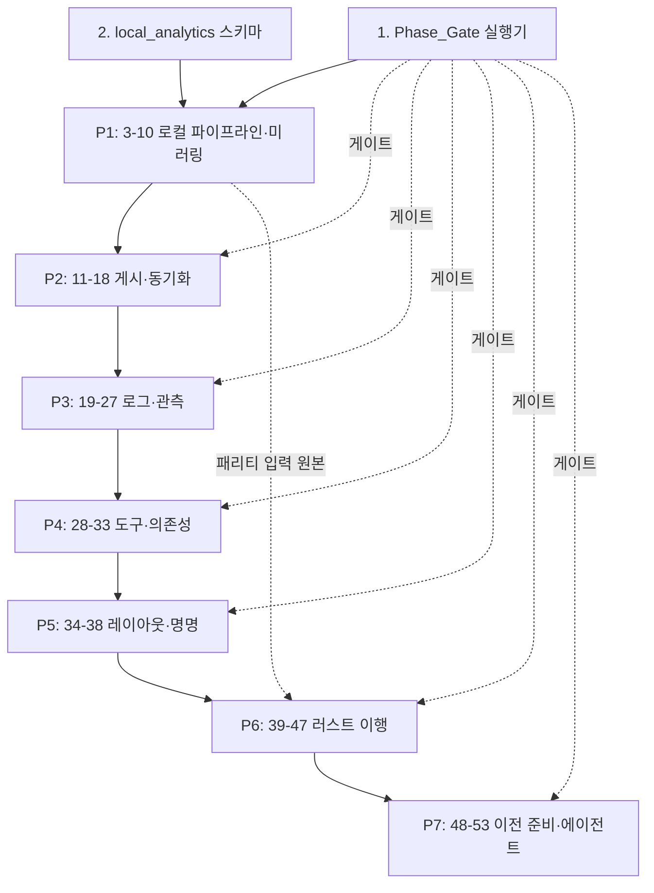

# Implementation Plan: 플랫폼 현대화

## Overview

이 문서는 `requirements.md`와 `design.md`에서 도출한 실행 가능한 작업 목록이다. 작업은 설계의 7단계(P1-P7) 순서를 따르며, 요구사항 16(단계 순서·롤백 게이트)은 횡단 관심사로 P0에 게이트 실행기를 먼저 두고 각 단계 끝에 게이트 검증 작업을 배치한다.

## 규율

- 모든 작업은 격리된 복구 후보 워크트리에서 수행한다. 더티 원본 워크트리에 reset·stash·clean·삭제를 실행하지 않는다. 설명되지 않는 워크트리 변경은 사용자 작업으로 보존한다.
- 새 Supabase 객체는 `backend/supabase/migrations/`의 새 마이그레이션 파일로만 추가한다. 적용된 마이그레이션은 수정하지 않는다.
- 로컬 서비스 포트는 `127.0.0.1`에만 바인딩한다. `latest`·부동 태그를 쓰지 않는다.
- 병합·배포·DNS·호스티드 프로덕션 변경 작업은 없다. 보존 분류·도구 선정·Publication_Set·게시 일정을 승인하는 작업은 없다. 승인 원장 파일은 `approverName: null`로 생성만 한다.
- 속성 기반 테스트는 파이썬 Hypothesis / 러스트 proptest, 각 100회 반복. 테스트에 `Feature: platform-modernization, Property {N}: {제목}` 태그를 단다.
- `check_env_contract.py`가 필수 시크릿 부재 시 실패로 닫히는 것은 정상 동작이다. 가짜 값을 넣지 않는다.

---

## Tasks

### P0. 횡단 기반

- [x] 1. Phase_Gate 실행기 `backend/bin/phase_gate.py` 구현
  - 요구사항 16.4의 7개 검증 명령 상수(`VERIFICATION_COMMANDS`)와 `PUBLIC_ROUTE_TIMEOUT_SECONDS = 5.0`을 정의한다.
  - 진입 조건·완료 조건·검증 명령·Rollback_Plan 참조 4항목 중 하나라도 부재 시 진입 차단 + `phase_gate_incomplete` 반환.
  - 완료 조건 1건 이상 미충족 시 미충족 조건 식별자 목록을 산출물에 기록 + `phase_gate_not_satisfied`, 다음 단계 산출물 미생성.
  - 명령 실패 또는 라우트 확인 실패 1건 이상 시 `phase_verification_failed`.
  - 산출물 스키마는 설계 D9(`backend/log/phases/{phaseId}-report.json`)를 따르고, `unexplainedWorktreeChanges`는 경로 목록만, `publicRouteChecks`는 쿠키·헤더·로컬 스토리지·관리자 본문·Supabase 페이로드를 제외한다.
  - _요구사항 16.2, 16.3, 16.10, 16.11, 16.12_

- [x] 1.1 Rollback_Plan 금지 명령 검증 속성 테스트 작성
  - `backend/pipeline_control/test_rollback_plan_pbt.py`, Property 37. 생성기: 임의 명령 목록 + `reset`/`stash`/`clean` 임의 삽입 + 워크트리 대상 변형. 불변식: 금지 명령·더티 원본 대상 부재 ⟺ 통과, 되돌림 검증 항목이 16.4 7개 명령 전체 포함.
  - _요구사항 16.5, 16.8_

- [x] 1.2 요구사항 배정 분할 속성 테스트 작성
  - `backend/pipeline_control/test_phase_partition_pbt.py`, Property 3. 생성기: `phase_assignments()` — 1~15를 임의 단계에 배정(누락·중복 허용), 순번 임의. 불변식: 전체 덮개 ∧ 교집합 0 ∧ 순번 유일 ∧ 단계당 게이트·산출물 각 1.
  - _요구사항 16.1_

- [x] 2. `local_analytics` 스키마와 10개 테이블 새 마이그레이션 작성
  - `backend/supabase/migrations/`에 새 파일 1개로 `local_analytics` 스키마와 `staging_restaurants`, `staging_videos`, `crawl_evidence`, `parity_results`, `benchmark_runs`, `publish_jobs`, `publish_history`, `publish_audit_events`, `phase_reports`, `agent_action_records`를 생성한다.
  - `parity_results`는 설계 D2 제약(`mismatch_fields` 카디널리티 ≤ 50, `mismatch_field_count >= 0`), `publish_audit_events`·`agent_action_records`는 update·delete 권한 회수(추가 전용), `agent_action_records`는 `unique (trigger_signal_id, action_kind_id)`.
  - 적용된 마이그레이션은 수정하지 않는다. 이 스키마는 Local_Only_Schema이며 Publication_Set과 교집합 0.
  - _요구사항 9.1, 9.6, 10.8, 15.7, 15.8_

- [x] 2.1 원장 구조 무결성 속성 테스트 작성
  - `backend/pipeline_control/test_ledger_integrity_pbt.py`, Property 1. 생성기: `ledger_documents(kind)` — 원장 종류별 필수 필드 결측·집합 밖 값·중복 식별자·기수 위반 주입. 불변식: 검증기 거부 ⟺ 위반 존재.
  - _요구사항 1.1, 1.9, 3.2, 6.1, 6.9, 7.1, 7.2, 11.1, 11.2, 14.2, 16.2_

---

### P1. 로컬 우선 파이프라인 · 스키마 미러링 (요구사항 8, 9)

- [x] 3. 로컬 도구 프리플라이트 `backend/bin/check_local_runtime.py` 구현
  - 설계 C4 도구 표(Python, Node, ffmpeg, Docker, Docker Compose, psycopg2, Hypothesis)의 이름·확인 명령·부재 판정 기준 3항목을 문서화하고 검사한다. 하나라도 부재 시 첫 단계 실행 전 `heavy_local_runtime_missing`.
  - _요구사항 8.7, 8.9_

- [x] 4. `heavy_local`+`local_db` 로컬 실행 편성과 프리플라이트 앞당기기
  - `profiles.py` 프로파일 해석을 첫 단계 실행 이전 프리플라이트로 앞당긴다. `hosted_apply` 요청 시 `hosted_apply_not_admitted`로 어떤 단계도 시작하지 않는다.
  - `graph.py:STEP_SPECS` 18개 단계를 크롤링·평가·미디어·삽입 4부류로 사상하고 각 단계에 성공·실패·건너뜀 중 정확히 하나의 종료 상태 부여. 건너뜀 사유 코드는 `profiles.py:skip_reason_for_step` 고정 집합으로 제한.
  - 진입점은 `python3 -m backend.pipeline_control.worker` 계열 워커뿐. Route_Handler_Boundary는 진입점 아님.
  - `local_db`에서 Hosted 쓰기 시도 시 `supabase_data_boundary_rejected`(공급자·DB 오류 문자열 제외).
  - _요구사항 8.1, 8.2, 8.3, 8.6, 8.11_

- [x] 5. 실행 요약 산출 구현
  - 실행 종료 시 `hostedReadRequestCount`, `hostedWriteRequestCount`, 성공·실패·건너뜀 단계 목록과 건너뜀 사유 코드, `finalStatus`를 기록한다. Forbidden_Log_Field 제외. 필수 단계 실패 시 의존 후속 단계 건너뜀 표기 + 최종 상태 실패 + 실패 단계 쓰기 미확정.
  - _요구사항 8.4, 8.5, 8.10_

- [x] 6. Schema_Mirror_Report `backend/bin/schema_mirror_report.py` 구현
  - 마이그레이션 적용 완료와 동일 실행에서 보고서 생성. Hosted 접근은 스키마 읽기 조회로만. 5개 차이 부류를 항목 0건 부류까지 열거(스키마 이름·객체 이름·차이 분류 포함).
  - Hosted 전용 항목 1건 이상 또는 미열거 로컬 전용 테이블 존재 시 `schema_mirror_defect`. Hosted 스키마 읽기 실패 시 `hosted_schema_read_unavailable` + 보고서 미완성 표기.
  - _요구사항 9.3, 9.4, 9.5, 9.9, 9.10_

- [x] 7. 시드 픽스처 표기 강제
  - Local_Database 시드 픽스처 전 레코드에 `LOCAL_TEST_ONLY:NOT_PRODUCTION` 유지, 게시 입력에서 제외. 표기 없는 픽스처 적재 요청 시 어떤 행도 적재하지 않고 `seed_fixture_marker_missing`.
  - 적용 마이그레이션 내용·파일명 변경 요청 시 `applied_migration_immutable`.
  - _요구사항 9.2, 9.8, 9.11_

- [x] 8. Local_Database 세 진입점 소스 계약 테스트
  - 브라우저/세션 인식 서버/권한 상승 서버 전용 세 진입점 외 직접 연결 0건을 소스 계약 테스트로 확인. 백엔드 워커 DSN 경로는 `dsn_guard.py` 기존 계약 유지.
  - _요구사항 9.7_

- [x] 9. P1 속성 테스트 묶음
  - [x] 9.1 단계 종료 상태 배타성 — `test_step_composition_pbt.py`, Property 15. `test_profiles_pbt.py` 전략 재사용. 불변식: 세 목록 배타 ∧ 합집합 = 전체. _요구사항 8.1, 8.5, 8.10_
  - [x] 9.2 로컬 데이터 경계 — `test_local_boundary_pbt.py`, Property 16. 생성기: `step_plans()` 변이 단계·Hosted 쓰기 시도 주입. 불변식: Hosted 쓰기 카운터 0. _요구사항 8.2, 8.4, 8.11_
  - [x] 9.3 Schema_Mirror_Report 분류 완전성 — `test_schema_mirror_pbt.py`, Property 17. 불변식: 각 차이가 정확히 1부류에 1회. _요구사항 9.3, 9.4, 9.5_
  - [x] 9.4 Local_Only_Schema × Publication_Set 분리 — `test_publication_isolation_pbt.py`, Property 18. 불변식: 교집합 0. _요구사항 9.6_

- [x] 10. P1 게이트 검증
  - `backend/bin/phase_gate.py`로 `P1-local-pipeline` 완료 판정. 16.4 7개 명령 + `check_env_contract.py --profile daily` + `python -m unittest discover -s backend/pipeline_control -p "test_*_pbt.py"` 실행, `backend/log/phases/P1-local-pipeline-report.json` 기록. 완료 조건: Hosted 쓰기 0, Schema_Mirror_Report 결함 0, 명령 전부 성공, 공개 라우트 5초 이내 무오류.
  - _요구사항 16.3, 16.4, 16.10_

---

### P2. 게시 대상 집합 · 로컬-호스티드 동기화 (요구사항 10)

- [x] 11. Publication_Set 원장 `backend/deploy/publication-set.v1.json` 생성
  - 설계 D5 도출법(공개 런타임 읽기 컬럼 ∩ 파이프라인 쓰기 컬럼 − 운영자·사용자 소유)으로 `public.restaurants` 29컬럼 + `public.videos` 8컬럼, 행 식별 키·CAS 키·제외 컬럼·도출 근거를 열거. 와일드카드 금지. `approval.approverName: null`.
  - 불변식: `publishedColumns` ∩ `excludedColumns` = 0, `local_analytics.*`·`privacy_*`·`*_audit_events`·`user_*`·`reviews`·`youtube_*_kpi_snapshots` 미포함.
  - _요구사항 10.1, 10.2_

- [x] 12. 게시 일정 원장 `backend/deploy/publish-schedule.approved.json` 생성
  - 설계 C6 값(KST 07:30-08:30, `30 22 * * *`, `minBufferMinutesAfterHeavyLocal: 30`), `approval.status: "unresolved"`, `approverName: null`. 코드는 이 값을 읽기만 하고 생성·기본값 대체 금지.
  - _요구사항 10.14_

- [x] 13. Publish_Worker `backend/pipeline_control/publish_worker.py` 구현 — 미리보기·확인
  - Publication_Set 미열거 테이블·컬럼 포함 시 `publication_target_not_admitted`(적용 행 0). 미리보기: 테이블별 삽입/갱신 예정 행 수 + 안정 해시(설계 D6 정규화, `state_machine.py:payload_hash` 규칙 재사용). 확인: 해시 일치 && 생성 후 900초 이하일 때만 적용 시작, 불일치 시 `preview_hash_mismatch`, 만료 시 `preview_expired`.
  - _요구사항 10.2, 10.3, 10.4, 10.5, 10.6_

- [x] 14. Publish_Worker 적용·읽기검증·감사 구현
  - 200행 이하 순차 배치(초과 시 `batch_upsert_limit`, 적용 행 0). `batch_upsert.py:BATCH_LIMIT=200`과 RPC 강제 유지.
  - 멱등 수렴: 2차 적용에서 `compare_and_set_conflict` 발생 시 재읽기 후 Publication_Set 값 일치 시 `converged_no_op`, 불일치 시 `publish_apply_aborted`. 배치 실패 시 후속 미시작 + 적용 완료/미적용 배치 수 기록.
  - 읽기검증: 적용된 전체 행 식별 키 재읽기, 테이블별 읽은 행 수·일치·불일치 기록, 불일치 1건 이상 시 `publish_readback_mismatch`(성공 미표기).
  - 감사: 단일 게시 작업 식별자 아래 미리보기·확인·적용·읽기검증 단계 시각·테이블·행 수·종료 코드 추가 전용 기록(수정·삭제 금지, Forbidden_Log_Field 제외).
  - 실패 코드는 7값 닫힌 집합으로 제한(공급자·DB·자유 형식 문자열 제외). 게시 일정 부재·비활성 시 `publish_schedule_not_approved`.
  - 적용·읽기검증은 Backend_Runtime 워커에서만. Route_Handler_Boundary 실행 금지.
  - _요구사항 10.7, 10.8, 10.9, 10.10, 10.13, 10.15, 10.16, 10.17_

- [x] 15. 관리자 게시 트리거 경로(큐잉 전용)
  - 관리자 API 핸들러는 `requireAdmin` 선행 호출 후 `local_analytics.publish_jobs`에 요청 행 삽입과 상태 조회만 수행한다. 장시간 작업 미수행, 경계 있는 고정 코드 응답, 공급자·DB 오류 미노출.
  - _요구사항 10.10_

- [x] 16. (후속) `batch_upsert_restaurants` 서버 측 컬럼 허용목록 강화 마이그레이션
  - 설계가 지적한 대로 현행 RPC는 `jsonb_object_keys` 동적 구성으로 서버 측 컬럼 허용목록이 없다. 새 마이그레이션 파일로 Publication_Set 컬럼 허용목록을 서버 측에 추가한다. 적용된 `20260820040000_pipeline_batch_upsert.sql`은 수정하지 않는다.
  - _요구사항 9.2, 10.3_

- [x] 17. P2 속성 테스트 묶음
  - [x] 17.1 게시 페이로드 허용목록 부분집합 — `test_publish_payload_pbt.py`, Property 19. 생성기: `publish_inputs()` 허용·비허용 컬럼 + `LOCAL_TEST_ONLY` 행 혼합. 불변식: 키 ⊆ 허용목록 ∧ 표기 행 0. _요구사항 9.8, 9.11, 10.2, 10.3_
  - [x] 17.2 미리보기 해시 결정성·게이트 — `test_publish_hash_pbt.py`, Property 20. 생성기: 순서 셔플 + 단일 값 변이 + 경과 시간 0~3600. 불변식: 순서 불변 ∧ 값 변이 시 상이 ∧ 게이트 정확. _요구사항 10.4, 10.5, 10.6_
  - [x] 17.3 배치 분할 불변식 — `test_publish_batch_pbt.py`, Property 21. 불변식: 배치 ≤ 200 ∧ 합집합 = 입력 ∧ 실패 후 후속 0. _요구사항 10.9, 10.16_
  - [x] 17.4 게시 멱등 수렴 — `test_publish_idempotency_pbt.py`, Property 22. 생성기: `publish_inputs()` + CAS 포함 인메모리 호스티드 모델. 불변식: 1회 결과 사상 = 2회 결과 사상. _요구사항 10.11_
  - [x] 17.5 게시 리드백 라운드트립 — `test_publish_readback_pbt.py`, Property 23. 불변식: 리드백 값 = 로컬 원본. _요구사항 10.7, 10.12, 10.15_
  - [x] 17.6 게시 실패 코드 닫힌 집합 — `test_publish_codes_pbt.py`, Property 24. 불변식: 코드 ∈ 7값 ∧ 자유 문자열 부재. _요구사항 10.13_

- [x] 18. P2 게이트 검증
  - `P2-publication` 완료 판정. 16.4 명령 + 속성 테스트 실행, `backend/log/phases/P2-publication-report.json` 기록. 완료 조건: 5단계 전부 통과, 2회 연속 적용 후 값 불변.
  - _요구사항 16.3, 16.4_

---

### P3. 로그 중앙화 · 관측 스택 상호연동 (요구사항 12, 13)

- [x] 19. Observability_Stack 기동기 `backend/bin/observability_up.py` 구현
  - `backend/pipeline-control/`(P5 전 현행 경로)의 compose 오버레이를 1회 실행으로 기동 + 준비 점검. 서비스당 최대 120초 5초 간격 재점검, 미달 시 `service_readiness_timeout` + 미준비 목록.
  - 전 포트 `127.0.0.1` 루프백만(Loki `127.0.0.1:3100` 추가). 비루프백 선언 시 어떤 서비스도 미기동 + `non_loopback_bind_rejected`.
  - 대시보드 익명 인증·자체 가입 비활성, 관리자 자격증명 환경 변수만. 부재·빈 값 시 `dashboard_credential_missing`(기본값·임시 자격증명 미생성). iframe 임베딩은 승인 루프백 오리진만.
  - 이미지 고정 태그만(`latest`·별칭 금지). 원격 도커 컨텍스트 대상 시 `remote_context_rejected`. 기동 산출물에 서비스별 이름·태그·준비 상태·경과 초 기록(Forbidden_Log_Field 제외).
  - _요구사항 12.1, 12.2, 12.3, 12.7, 12.8, 12.9, 12.10, 12.11, 12.12, 12.13_

- [x] 20. 지표 계약 노출과 브로커 지표
  - `metrics.v1.json` 13개 지표(카운터 4 + 추가 1 + 게이지 8) 전부 대시보드 조회 대상 노출. 하나라도 부재 시 `metrics_contract_incomplete` + 부재 목록. 브로커 기동 시 `tzudong_pipeline_kafka_lag`·`queue_depth`·`queue_age_seconds` 노출. 브로커/로그 검색 미기동 시 나머지 성공 유지 + 데이터 없음 패널 + 미기동 사유 코드.
  - _요구사항 12.5, 12.6, 12.14, 12.15_

- [x] 21. Loki 기본 Log_Sink와 OTel Collector filelog 수신기 배선
  - `backend/pipeline_control/loki_sink.py` 신설, OTel Collector에 filelog 수신기 + loki 내보내기 추가. 검색 저장소 URL 승인은 `es_index.py:admit_es_url` 재사용(호스트 집합에 `loki` 추가), `local_db`·`http`/`https`·승인 호스트만, 그 외 `es_url_host_rejected`.
  - _요구사항 13.10_

- [x] 22. Log_Pipeline 필수 필드·클래스·허용목록 구현
  - 5개 구성요소 식별자, 필수 4필드(`component`·`occurred_at`·`correlation_id`·`severity`), 심각도 열거 검증. 부재·미열거 시 `log_record_field_missing`. 레코드 클래스별 필드 허용목록(설계 C9 표) 적용, 허용 키만 전달·나머지 제거, 미열거 클래스 시 `log_record_class_unknown`.
  - _요구사항 13.1, 13.2, 13.4, 13.14_

- [x] 23. 레다크션 경계·깊이 정렬·경계 값 구현
  - 모든 레코드를 Log_Sink 전 Redaction_Boundary(`privacy_log.py`, `sanitize.ts`) 경유. Forbidden_Log_Field는 부분 문자열·길이·해시 없는 고정 대체 표시로 치환(동일 부류 동일 표시). 레다크션 예외·불안전 표시 시 미전달 + `log_redaction_unsafe`.
  - **깊이 정렬**: `privacy_log.py`의 `DEFAULT_MAX_DEPTH = 6`을 Log_Pipeline 경계에서 8로 통일하는 얇은 래퍼를 둔다. 이는 요구사항 13.8에 두 경계(`sanitize.ts`는 이미 8)를 맞추는 조정이며 완화가 아니다. 경계 값: 문자열 4096자·항목 100개·깊이 8·직렬화 65536바이트, 초과분 고정 절단 표시.
  - 예외 정보는 128자 이하 예외 타입 이름만(`safe_error_name`).
  - _요구사항 13.3, 13.5, 13.8, 13.9, 13.15_

- [x] 24. 보류 큐·상태 판정 분리·보존 게이트 구현
  - 전달 실패 시 보류 큐 유지, 성공 확인 후 제거, 재시도 배치 ≤ 50, 점유 30초 초과 재시도 복귀, 결정적 문서 ID로 중복 방지(`outbox.py` 재사용). 상태 판정·재실행은 Local/Hosted DB 조회로만, Log_Sink 조회 미사용.
  - 보존 분류: `backend/deploy/log-retention.proposed.json`에 제안 분류(운영 로그 30일 제안, 감사 이벤트는 기존 프라이버시 분류 지배)만 기록, `activation.status: "unresolved"`, `approverName: null`. 활성 승인 분류 부재 시 보존·만료·삭제 미수행 + `retention_class_unavailable`(기본 기간 미적용).
  - _요구사항 13.11, 13.12, 13.13, 13.16_

- [x] 25. P3 속성 테스트 묶음
  - [x] 25.1 이미지 태그 고정성 — `test_tag_fixity_pbt.py` + `apps/web/tests-unit/image-tag-fixity.test.ts`, Property 25. 불변식: 정확 태그·다이제스트 ⟺ 통과. _요구사항 11.3, 12.10_
  - [x] 25.2 루프백 노출 경계 — `test_loopback_boundary_pbt.py`, Property 26. 불변식: 루프백·승인 목록 ⟺ 통과. _요구사항 12.2, 12.3, 12.12_
  - [x] 25.3 로그 필수 필드 게이트 — `test_log_required_fields_pbt.py`, Property 27. 불변식: 4필드 존재 ∧ 심각도 열거 ⟺ 전달. _요구사항 13.1, 13.2, 13.14_
  - [x] 25.4 로그 레다크션 누출 부재 — `test_log_redaction_pbt.py` + `apps/web/tests-unit/sanitize-leak.test.ts`, Property 28. 생성기: `st.recursive()` 중첩 + 12개 금지 값 부류 삽입 + 순환·직렬화 불가·예외 객체. 불변식: 싱크 직렬화에 심은 값 부재. _요구사항 4.8, 8.4, 10.8, 11.10, 12.9, 13.5, 13.6, 13.9, 13.15, 15.7, 15.11_
  - [x] 25.5 로그 키 허용목록 부분집합 — `test_log_allowlist_pbt.py`, Property 29. 불변식: 출력 키 ⊆ 클래스 허용목록. _요구사항 13.4, 13.7_
  - [x] 25.6 로그 경계 값 — `test_log_bounds_pbt.py`, Property 30. 불변식: 4개 상한 만족 ∧ 절단 표시 고정. _요구사항 13.8_
  - [x] 25.7 검색 저장소 URL 승인 — `test_log_sink_url_pbt.py`, Property 31. 불변식: 승인 조건 정확 ⟺ 통과. _요구사항 13.10_
  - [x] 25.8 보류 큐 손실·중복 부재 — `test_log_queue_pbt.py`, Property 32. `outbox.py` 메모리 모드 활용. 불변식: 레코드별 도달 = 정확히 1 ∧ 배치 ≤ 50. _요구사항 13.13_

- [x] 26. (선택) Elasticsearch 보조 싱크 옵트인 경로 보존
  - `es_index.py`의 `pipeline-logs-v1`/`pipeline-raw-v1` 인덱스·필드 허용목록·`local_db` 전용 URL 승인을 `TZUDONG_PIPELINE_ES=es` 옵트인으로 보존한다. 기본 싱크는 Loki.
  - _요구사항 11.6, 13.10_

- [x] 27. P3 게이트 검증
  - `P3-observability` 완료 판정. 완료 조건: 13개 지표 대시보드 노출, 레다크션 속성 통과, 루프백 전용 바인딩 확인. `backend/log/phases/P3-observability-report.json` 기록.
  - _요구사항 16.3, 16.4_

---

### P4. 도구 선정 기록 · 의존성 신선도 (요구사항 4, 5, 11)

- [x] 28. Tooling_Selection_Record `backend/deploy/tooling-selection.v1.json` 생성
  - 12개 범주(11개 + 로컬 쿠버네티스)를 설계 C7 표대로 열거. 범주당 후보 2~6개 고유 식별자, 채택·미채택 사유(측정 항목 인용). 이미지 태그·버전은 설계 확정 값(Zot `v2.1.20`, Argo CD `v3.5.2`, Loki `v3.7.7`, kafka-ui `ghcr.io/kafbat/kafka-ui:v1.5.0`, Helm `4.2.4`, OpenTofu `1.12.6`, k3d `5.9.0` 등).
  - 측정 필드(`macosLocalInstallSucceeded`, `installVerifyObservation`, `residentMemoryMiBAt300s`)는 `null`로 두고 추정하지 않는다. `operatorApproval.approverName: null`. 자격증명·토큰·레지스트리 비밀·Forbidden_Log_Field 미포함.
  - 현행 자산 결정 표(유지·대체·폐기 + 되돌림 절차) 기록.
  - _요구사항 11.1, 11.2, 11.3, 11.4, 11.6, 11.7, 11.10_

- [x] 29. 도구 기동 게이트와 설치 측정
  - 승인 상태 `approved`가 아닌 범주는 기본 실행 제외 + `tooling_approval_missing`(부분 기동 금지). macOS 설치 성공 후보 0개 범주는 미해결 + `local_install_unverified`. 범주 수·후보 수·태그·경로 해석 불일치 시 `tooling_record_mismatch`.
  - 로컬에서 실제 설치 확인 명령을 실행해 측정 필드를 채우는 작업(추정 금지).
  - _요구사항 11.5, 11.8, 11.9_

- [x] 30. Pin_Contract 검증기 `apps/web/scripts/verify-pin-contract.mjs` 구현
  - 6항목(설계 C2 표) 선언 값·해석 값 검증. 불일치 시 `pin_contract_drift`(핀 값 자동 변경 금지). `bun.lock`↔`package-lock.json` 충돌 시 `package-lock.json` 권위로 `bun.lock`만 조정 + 불일치 목록·개수 기록. 타입 검사는 `npm run typecheck:parity`만, 컴파일러가 저장소 외부 경로 해석 시 `global_compiler_not_admitted`(결과 산출물 미생성).
  - _요구사항 5.1, 5.2, 5.4, 5.5, 5.7, 5.8, 5.9_

- [x] 31. Dependency_Freshness_Workflow `.github/workflows/dependency-freshness.yml` 구현
  - 7단위(설계 C2 표, cargo 7번째 포함) 갱신 후보를 `develop` 대상 PR로만 생성, 단위당 동시 열림 ≤ 5, 자동 병합 금지. 후보 검증: `apps/web`에서 4개 명령 실행 + 결과·종료 시각 첨부. 실패·30분 초과·첨부 미완 시 `dependency_check_failed`(내용 자동 변경 금지).
  - `dependabot.yml` 보류 4건 유지, 보류 해제는 단독 후보. 메이저 상승은 패키지당 단독 PR. 대상 브랜치 != `develop` 시 `target_branch_violation`, 보류 범위 상승 시 `dependency_hold_violation`, Pin_Contract 값 변경 시 `pin_contract_violation`. 로그·PR 본문·산출물에서 Forbidden_Log_Field 제외. 주 1회 이상 실행 + 실행 시각·후보 수 기록.
  - Rust 툴체인 버전은 `rust-toolchain.toml`에 3자리 고정, 검사 대상 포함.
  - _요구사항 4.1, 4.2, 4.3, 4.4, 4.5, 4.6, 4.7, 4.8, 4.9, 4.10, 4.11, 5.3, 5.6_

- [x] 32. P4 속성 테스트 묶음
  - [x] 32.1 의존성 후보 분류 — `apps/web/tests-unit/dependency-candidate-split.test.ts`, Property 11. 불변식: 메이저 단독 분리 ∧ 보류 범위 거부. _요구사항 4.7, 4.11_
  - [x] 32.2 핀 권위 불변식 — `apps/web/tests-unit/pin-contract.test.ts`, Property 12. 생성기: 임의 버전 문자열 × 4개 선언 위치. 불변식: 정확 고정 문자열 ⟺ 통과, npm 측 불변. _요구사항 5.2, 5.3, 5.4, 5.6, 5.7, 5.8_
  - [x] 32.3 외부 증거 상태 단조성 — `test_evidence_state_pbt.py`, Property 4. 불변식: 참조 없음 ⟹ ¬confirmed. _요구사항 14.8, 14.13_ (P7 재사용)

- [x] 33. P4 게이트 검증
  - `P4-supply-chain` 완료 판정. 완료 조건: 12개 범주 기록 완성, Pin_Contract 6항목 일치, 7단위 후보 생성 확인. `backend/log/phases/P4-supply-chain-report.json` 기록.
  - _요구사항 16.3, 16.4_

---

### P5. 레이아웃 재편 · 명명 리팩터 (요구사항 6, 7)

- [x] 34. `backend/deploy/` 도입과 `pipeline-control` 이동 + 미해석 참조 일괄 갱신
  - `backend/pipeline-control/*`를 `backend/deploy/pipeline-control/`로 이동. `backend/pipeline_control/`은 유일 임포트 패키지 유지. 별칭 디렉터리·호환 심링크 금지. `backend/deploy/`에 `helm/`, `opentofu/`, `argocd/`, `registry/` 하위 생성.
  - **같은 작업 안에서** 미해석 참조 일괄 갱신: `.github/workflows/*` 경로, `.github/dependabot.yml` pip 항목(`/backend/pipeline-control` → `/backend/deploy/pipeline-control`), `harbor-tags.md` 빌드 명령, `backend/pipeline_control/metrics.py:CATALOG_PATH`, compose 볼륨 경로. `backend/config/channels.yaml`은 이동 대상 아님.
  - 적용 마이그레이션·공개 라우트·영속 데이터 경로 이동 요청 시 `immutable_path_move_rejected`.
  - _요구사항 6.3, 6.5, 6.6, 6.7_

- [x] 35. Layout_Manifest `backend/layout-manifest.v1.json` + 검사기 `backend/bin/check_layout_manifest.py`
  - 1단·2단 디렉터리 전체에 항목 하나씩(소유 책임·허용·금지·분류). 설계 D4 예시 반영. 트리↔매니페스트 양방향 대응 누락 시 `layout_manifest_missing_entry`. `backend/deploy/`에 파이썬 임포트 모듈 또는 `backend/pipeline_control/`에 컨테이너·설정 산출물 시 `directory_ownership_violation`. 이동 잔여 경로 (0,1) 아니면 `directory_move_residual_path`, 별칭·심링크 시 `alias_path_not_admitted`, 미해석 참조 1건 이상 시 `stale_path_reference`.
  - _요구사항 6.1, 6.2, 6.4, 6.8, 6.9, 6.10, 6.11_

- [x] 36. Rename_Ledger 확장과 명명 변경 적용
  - `backend/naming-renames.v1.json` 형식 유지(5필드, 계약 분류 닫힌 집합 5값, 스키마 버전 1, nonGoals). 별칭 함수·호환 래퍼·재수출 셰임·위임 내보내기 금지, 적용 후 이전 이름 도달 진입점 0.
  - 범위 밖(공개 라우트·API 필드·마이그레이션 객체·RPC·영속 데이터 경로) 시 `rename_scope_violation`. 정규 프라이버시 객체 7개·RPC 5개 대상 또는 별칭 추가 시 `privacy_contract_violation`. 적용 후 이전 이름 참조 1건 이상 또는 새 이름 정의 != 1 시 `rename_verification_failed`. 대상 단위 테스트 실패·미실행 시 `rename_test_failure`. 검증 내역 3항목 기록.
  - _요구사항 7.1, 7.2, 7.3, 7.4, 7.5, 7.6, 7.7, 7.8, 7.9, 7.10_

- [x] 37. P5 속성 테스트 묶음
  - [x] 37.1 디렉터리 이동 잔여 경로 부재 — `test_layout_move_pbt.py`, Property 13. 불변식: (0,1) ⟺ 통과. _요구사항 6.4, 6.5, 6.10_
  - [x] 37.2 명명 변경 범위 판정 — `test_rename_scope_pbt.py`, Property 14. 생성기: 임의 이름·경로 + 12개 정규 프라이버시 이름 + 공개 라우트 풀. 불변식: 범위 밖 ⟺ 고정 코드. _요구사항 7.4, 7.5, 7.8_

- [x] 38. P5 게이트 검증
  - `P5-layout-naming` 완료 판정. 완료 조건: Layout_Manifest 전 항목 대응, 미해석 참조 0, Rename_Ledger 검증 3항목 기록. `backend/log/phases/P5-layout-naming-report.json` 기록.
  - _요구사항 16.3, 16.4_

---

### P6. 러스트 이행 (요구사항 1, 2, 3)

- [x] 39. 카고 워크스페이스와 툴체인 핀 생성
  - `backend/rust/`에 카고 워크스페이스, `rust-toolchain.toml`을 `1.97.0` 3자리 고정(채널 별칭·부동 범위 금지). 슬라이스당 크레이트: `tzudong-validators`, `tzudong-normalize`, `tzudong-upsert-payload`, `tzudong-media-compute`, `tzudong-pipeline-graph`. PyO3 `0.29.2`, maturin `1.15.0`, proptest `1.11.0`.
  - _요구사항 5.6, 1.1_

- [x] 40. Migration_Ledger `backend/rust/migration-ledger.v1.json` 생성
  - 설계 D1 스키마. 5개 슬라이스 항목(대체 파이썬 경로·러스트 산출물·범위·활성 구현) + 제외 항목(`excluded`, `node_sdk_bound`/`provider_sdk_bound`). 불변식: 대체 경로 합집합 중복 0, 제외 ∩ 대체 = ∅, `consecutiveMatchedCount >= 3` 아니면 `rust` 설정 불가.
  - _요구사항 1.1, 1.7_

- [x] 41. Implementation_Selector `backend/pipeline_control/impl_selector.py` 구현
  - `TZUDONG_RUST_SLICES` 옵트인, 파이썬 기본값. 슬라이스 식별자 명시 시에만 `rust`. 초기화 30초 초과·실패 시 `rust_component_unavailable`(재시도·자동 대체·부분 결과·쓰기 금지). 원장에 없는 식별자 시 `migration_slice_unknown`. 병합 후보 검사: 원장 항목·필드 검사, 장시간 작업 Route_Handler_Boundary 이탈 시 `boundary_violation`, 원장 항목 부재 시 `migration_ledger_entry_missing`, 회귀 3스위트 실패·30분 초과 시 `regression_suite_failed`.
  - _요구사항 1.2, 1.3, 1.4, 1.5, 1.6, 1.8, 1.9, 1.10, 1.11_

- [x] 42. 슬라이스 1 `tzudong-validators` 구현 + PyO3 바인딩
  - `backend/pipeline/validators.py`, `state.py`의 순수 함수를 러스트로 이행. maturin 빌드, 기존 패키지가 임포트. 진입점 불변.
  - _요구사항 1.1, 1.3_

- [x] 43. Parity_Harness `backend/pipeline_control/rust_parity.py` 구현
  - 설계 C1 인터페이스. 동일 입력을 파이썬·러스트에 투입, 정규화 규칙 `v1` 적용 비교, Parity_Result 산출(`local_analytics.parity_results` 기록). 600초 초과·비정상 종료 시 `matched=false` + `parity_run_incomplete`. 불일치 필드 이름 최대 50개(값 미기록). 빈 비교 필드 결과는 N=3 계수 제외. 산출물 식별자(크레이트명 + 확장 모듈 SHA-256) 변경 시 계수 0 초기화 + 기본값 파이썬 복귀. N=3 미만 시 `parity_evidence_insufficient`, 파이썬 제거는 별도 명시 후보.
  - _요구사항 2.1, 2.2, 2.3, 2.4, 2.5, 2.6, 2.9, 2.10, 2.11_

- [x] 44. 슬라이스 2-5 구현 + 바인딩
  - `tzudong-normalize`(`backend/utils/` 정규화·안정 해시·텍스트 파싱), `tzudong-upsert-payload`(`batch_upsert.py` 페이로드·안정 해시 부분, RPC는 파이썬 유지), `tzudong-media-compute`(프레임 선택·메타 계산, ffmpeg 오케스트레이션 파이썬 유지), `tzudong-pipeline-graph`(`graph.py`·`state_machine.py`).
  - _요구사항 1.1, 1.3_

- [x] 45. 성능 증거 경로 분리 구현
  - 러스트 원시 성능 아티팩트는 `backend/performance/`에만, `apps/web/performance/*`에 러스트 원시 아티팩트 미기록. 양방향 위반 시 `performance_evidence_path_violation`. Performance_Evidence_Set(설계 D3): 절대·상대·노이즈 예산, 기준선 측정 ID, 표본 ≥ 7, p75, 동결 트리 시작·종료 커밋. 노이즈 예산 이하 개선폭 시 `no_admitted_slice`(유효 결과). 아티팩트 미조회·해시 불일치·동결 트리 불일치 시 `performance_claim_not_established`.
  - _요구사항 3.1, 3.2, 3.3, 3.4, 3.5, 3.6, 3.7, 3.8, 3.9_

- [x] 46. P6 속성 테스트 묶음
  - [x] 46.1 Implementation_Selector 기본값 — `test_impl_selector_pbt.py`, Property 5. 불변식: 옵트인 명시 ⟺ `rust`. _요구사항 1.5, 1.11_
  - [x] 46.2 Migration_Slice 경로 배타성 — `test_ledger_integrity_pbt.py`, Property 2. 불변식: 대체 경로 중복 0 ∧ 제외 ∩ 대체 = ∅. _요구사항 1.1, 1.7_
  - [x] 46.3 파이썬↔러스트 출력 동등성 — `backend/rust/tests/parity_pbt.py` + `tzudong-validators/tests/prop.rs`, Property 6. 생성기: 슬라이스별 `valid_inputs()`. 불변식: 정규화 후 비교 필드 전부 동일. _요구사항 2.1, 2.2, 2.3, 2.7_
  - [x] 46.4 파이썬↔러스트 오류 코드 동등성 — `backend/rust/tests/parity_error_pbt.py`, Property 7. 생성기: `invalid_inputs()`. 불변식: 양쪽 고정 코드 동일 ∧ 부분 결과 0. _요구사항 2.8_
  - [x] 46.5 패리티 게이트 계수 — `test_rust_parity_gate_pbt.py`, Property 8. 불변식: 게이트 허용 ⟺ N=3 조건 정확. _요구사항 2.4, 2.5, 2.10_
  - [x] 46.6 성능 노이즈 판정 — `test_perf_noise_pbt.py`, Property 9. 불변식: |delta| ≤ noise ⟺ `no_admitted_slice`. _요구사항 3.4_
  - [x] 46.7 성능 증거 경로 분리 — `test_perf_path_pbt.py`, Property 10. 불변식: 위반 ⟺ 경로 교차. _요구사항 3.6, 3.9_

- [x] 47. P6 게이트 검증
  - `P6-rust` 완료 판정. 16.4 명령 + 속성 테스트 + `cargo test --manifest-path backend/rust/Cargo.toml` 실행. 완료 조건: 슬라이스별 N=3 연속 패리티, 회귀 3스위트 무결, 성능 증거 세트 유효. `backend/log/phases/P6-rust-report.json` 기록.
  - _요구사항 16.3, 16.4_

---

### P7. 이전 준비 · AI 운영 에이전트 (요구사항 14, 15)

- [x] 48. Migration_Readiness_Manifest `backend/deploy/migration-readiness.v1.json` 생성
  - 5개 구성요소(설계 C10 표) 로컬·이전 대상 설정·외부화 참조 이름. 백업·시점 복구 증거 항목 + 8개 릴리스 게이트 항목. 상태 `unresolved`/`external_evidence_confirmed` 두 값만, 참조 없는 항목 confirmed 금지. 전 항목 `unresolved` 초기화.
  - _요구사항 14.1, 14.8, 14.12, 14.13_

- [x] 49. Deployment_Descriptor_Set(`backend/deploy/helm/`, `backend/deploy/opentofu/`) 구현
  - 5개 구성요소 정의(이미지 참조·리소스 요청·환경 변수 이름+출처·시크릿 참조 이름, 빈 항목 금지). 시크릿 값은 참조 이름으로만. 리터럴 검출 시 `secret_value_in_descriptor`(렌더링 산출물 미생성). 클러스터 식별자 매개변수로 2개 이상 재사용, 차이는 파생 필드만. 검사는 로컬 렌더링만(원격 시도 0). 원격 자격증명·권한 요구 시 `remote_apply_not_admitted`(부분 산출물 미생성).
  - Vercel 동작 전 Git 연동 `tzudong` 프로젝트 확인 + 리드백, 미확인·`web` 지시 시 `vercel_project_not_verified`. DNS 변경 요청 시 `dns_change_out_of_scope`.
  - _요구사항 14.2, 14.3, 14.4, 14.5, 14.6, 14.7, 14.9, 14.10, 14.11_

- [x] 50. Agent_Action_Allowlist 원장과 상한 파일 생성
  - 6개 허용 조치(설계 C11 표: `restart_local_container`, `requeue_failed_pipeline_task`, `flush_log_pending_queue`, `open_github_issue`, `capture_diagnostic_snapshot`, `scale_local_worker_concurrency`), 전부 로컬·멱등. 상한: 슬라이딩 60분 10건, 일 40건.
  - _요구사항 15.3, 15.9_

- [x] 51. Ops_Agent 구현
  - 감시 입력 2종(Observability_Stack 알림, Log_Pipeline 심각도)만, 60초 이하 폴링. 활성 Watch_Rule 충족 신호 시 조치 이전 Agent_Action_Record 생성(설계 D8, 6필드만, 신호 원문·진단·자유 문자열 제외).
  - 허용목록 정확 일치만 무승인 수행, 불일치 시 `agent_action_not_allowlisted`. 고위험 부류(Hosted 쓰기·마이그레이션·배포·롤백·브랜치 보호·시크릿·DNS)는 결속된 명명된 사람 승인 참조 이후에만, 부재 시 `human_approval_required`. 릴리스 자체 승인·감독기관·정보주체 통지는 어떤 승인에서도 미수행.
  - 동일 (트리거, 조치) 조합 1회만(`agent_action_duplicate`, DB unique 강제). 상한 초과 시 `agent_action_rate_limited`. 결과 확인 3회·60초 실패 시 `agent_action_unverified` + 후속 중단. 허용목록 읽기 불가 시 `agent_allowlist_unavailable`. 기록 미확정 시 `agent_action_record_unavailable`(기록이 조치보다 먼저).
  - _요구사항 15.1, 15.2, 15.4, 15.5, 15.6, 15.7, 15.8, 15.10, 15.11, 15.13, 15.14, 15.15, 15.16_

- [x] 52. P7 속성 테스트 묶음
  - [x] 52.1 기술 산출물 시크릿 리터럴 부재 — `test_descriptor_secret_pbt.py`, Property 33. 불변식: 검출 ⟺ 고정 코드 ∧ 렌더링 산출물 0. _요구사항 14.3, 14.4_
  - [x] 52.2 클러스터 렌더링 메타모픽 — `test_cluster_render_pbt.py`, Property 34. 불변식: 차이 필드 ⊆ 파생 필드 ∧ 원격 시도 0. _요구사항 14.5_
  - [x] 52.3 에이전트 조치 경계 — `test_agent_boundary_pbt.py`, Property 35. 생성기: `action_requests()` 허용목록 내·외, 고·저위험, 승인 유·무, 중복 + 절대 금지 3부류. 불변식: 허용목록 외 0 ∧ 무승인 고위험 0 ∧ 절대 금지 0 ∧ 조합별 ≤ 1. _요구사항 15.3, 15.4, 15.5, 15.6, 15.8, 15.12, 15.16_
  - [x] 52.4 에이전트 슬라이딩 상한 — `test_agent_rate_pbt.py`, Property 36. 불변식: 60분 창 ≤ 10 ∧ 일 ≤ 40. _요구사항 15.9_

- [x] 53. P7 게이트 검증
  - `P7-readiness-agent` 완료 판정. 완료 조건: Deployment_Descriptor_Set 시크릿 리터럴 0, 2개 클러스터 식별자 렌더링, 허용목록 외 조치 0. `backend/log/phases/P7-readiness-agent-report.json` 기록.
  - _요구사항 16.3, 16.4_

---

## Task Dependency Graph



```json
{
  "waves": [
    { "wave": 1, "tasks": ["1", "1.1", "1.2", "2", "2.1"] },
    { "wave": 2, "tasks": ["3", "4", "5", "6", "7", "8", "9.1", "9.2", "9.3", "9.4", "10"] },
    { "wave": 3, "tasks": ["11", "12", "13", "14", "15", "16", "17.1", "17.2", "17.3", "17.4", "17.5", "17.6", "18"] },
    { "wave": 4, "tasks": ["19", "20", "21", "22", "23", "24", "25.1", "25.2", "25.3", "25.4", "25.5", "25.6", "25.7", "25.8", "26", "27"] },
    { "wave": 5, "tasks": ["28", "29", "30", "31", "32.1", "32.2", "32.3", "33"] },
    { "wave": 6, "tasks": ["34", "35", "36", "37.1", "37.2", "38"] },
    { "wave": 7, "tasks": ["39", "40", "41", "42", "43", "44", "45", "46.1", "46.2", "46.3", "46.4", "46.5", "46.6", "46.7", "47"] },
    { "wave": 8, "tasks": ["48", "49", "50", "51", "52.1", "52.2", "52.3", "52.4", "53"] }
  ]
}
```

각 단계는 앞 단계 게이트 통과 후 진입한다. 러스트 이행(P6)이 6번째인 이유는 P1의 로컬 실행 경로가 P6 패리티 하네스의 입력 원본이기 때문이다. 요구사항 16은 모든 단계에 적용된다.

## Notes

- 이 소스 트리는 병합·배포·호스티드 프로덕션 변경·법령 준수 승인이 발생했다고 주장하지 않는다.
- 보존 분류·도구 선정·Publication_Set·게시 일정의 운영자 승인은 명명된 사람이 원장 파일의 `approverName`을 채워야 성립한다.
- 성능 개선은 `backend/performance/`의 보존된 원시·스코어 아티팩트 없이는 확립되지 않는다.
