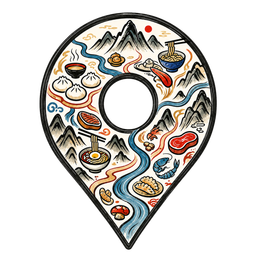
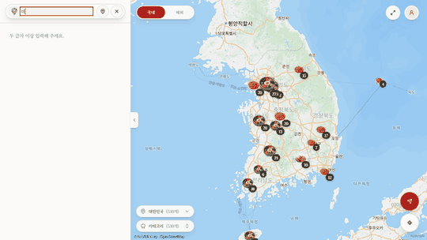
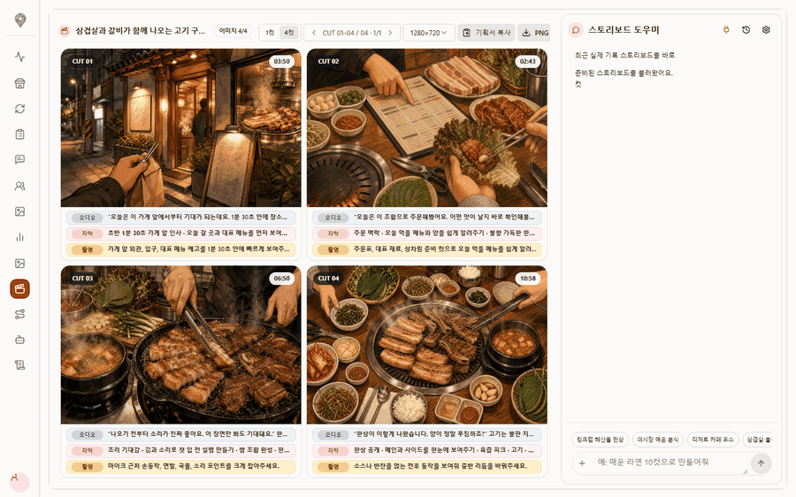
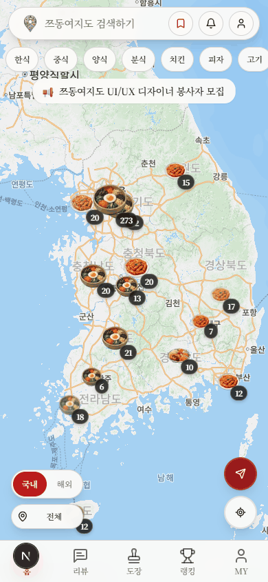
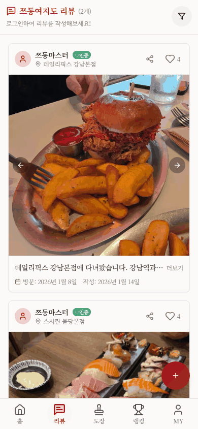
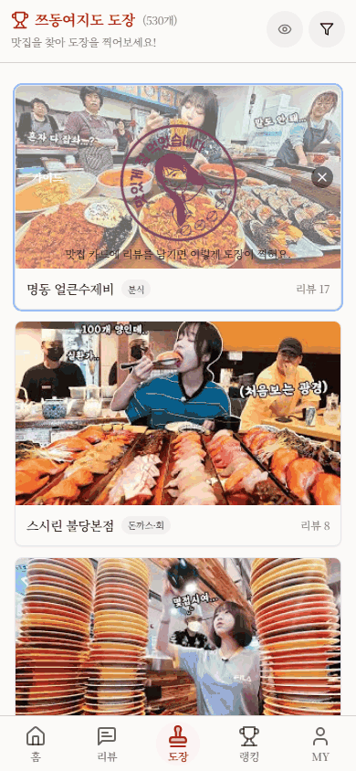
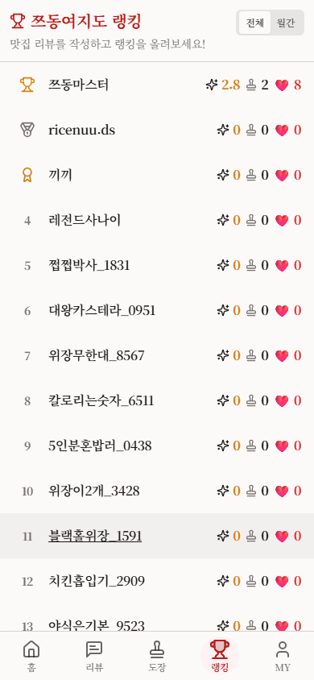

  

    
  

  <h1>Tzudong Map</h1>
  
<strong>쯔양 영상 속 맛집을 지도 중심으로 탐색하는 제품입니다.</strong>

  

    <a href="https://tzudong.app">라이브 앱</a>
    ·
    <a href="https://github.com/twoimo/tzudong/releases/tag/v1.2.3">최신 릴리즈</a>
    ·
    <a href="README.md">English</a>
    ·
    <a href="LICENSE">MIT</a>
  

  

    
    
    
    
    
  

---

Tzudong Map은 먹방 영상의 장소 근거를 사용자용 지도, 운영자용 검수 콘솔, 콘텐츠 제작용 스토리보드 워크스페이스로 바꿉니다.

## 핵심 기능

| 제품 영역 | 역할 |
| --- | --- |
| **지도 탐색** | 검색, 필터, 음식 마커 클러스터, 현재 위치 흐름, 맛집 상세 바텀시트. |
| **커뮤니티 루프** | 리뷰, 도장, 랭킹, 좋아요, 프로필 화면으로 반복 사용 경험 구성. |
| **관리자 운영** | 보호된 검수, source readback, 승인/삭제/복원, 감사 가능한 mutation 흐름. |
| **스토리보드 워크스페이스** | 채팅 기반 기획, 10컷 생성, 컷 메타데이터, 이미지 재생성, provider readiness UX. |
| **근거 중심 파이프라인** | 크롤링, Rule/LLM-as-a-Judge 평가, fail-closed 검증, Supabase 적재 payload 생성. |

## 스택

- 웹 런타임: Node 24.x. 일상 설치/유닛은 Bun을 쓸 수 있고, 릴리스 패키지 권위는 npm 11.6.2, `package.json`, `package-lock.json`입니다.
- TypeScript: 네이티브 CLI `@typescript/native` `7.0.2`, 안정 API/호환 브리지는 `6.0.2` (`npm run typecheck:parity`).
- 직렬 승격: `develop -> data -> main`. 이 트리는 hosted apply, 법령 준수, 라이브 URL 상태를 주장하지 않습니다.

## 제품 투어

### Desktop

**지도 탐색과 맛집 상세**

  

**관리자 스토리보드 워크스페이스**

### Mobile

<table>
  <tr>
    <td width="50%"><strong>홈 지도</strong> <small>마커 탐색 → 맛집 상세 전체 보기</small> </td>
    <td width="50%"><strong>리뷰 피드</strong> <small>리뷰 스크롤 → 맛집 상세 열기</small> </td>
  </tr>
  <tr>
    <td width="50%"><strong>도장 페이지</strong> <small>도장 맛집 탐색 → 상세 읽기</small> </td>
    <td width="50%"><strong>랭킹 프로필</strong> <small>1위 프로필 → 탭 전환</small> </td>
  </tr>
</table>

## 개인정보

소스 보호는 fail-closed입니다. 회원 생성은 게시된 방침 확인에 묶이고, 검증된 보호자 경로가 있기 전까지 만 14세 미만 가입은 막히며, 광고 동의는 목적/채널/야간을 분리하고, 공용 필터와 메모리 전용 기기 위치, 삭제·보존·사고의 Preview → Confirm → Apply → Readback → Audit을 유지합니다.

법령 준수나 운영 증명이 아닙니다. `AGENTS.md`의 외부 게이트에 기명 근거가 있을 때까지 출시는 차단됩니다. 위 라이브 앱/릴리즈 링크는 상태 참조일 뿐입니다.
