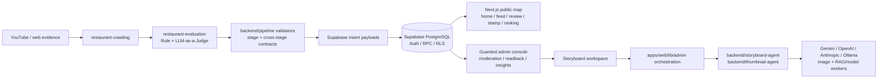

<div align="center">
  <h1>
    
    Tzudong Map
  </h1>
  <p><strong>모두를 위한 Tzudong Map. 쯔양 영상 속 맛집을 지도, 검수, 스토리보드 워크스페이스로 연결하는 제품입니다.</strong></p>
  <p>
    <a href="https://tzudong.app">라이브 앱</a>
    ·
    <a href="https://github.com/twoimo/tzudong/releases/tag/v1.1.1">최신 릴리즈</a>
    ·
    <a href="DESIGN.md">디자인 계약</a>
    ·
    <a href="SECURITY.md">보안 정책</a>
    ·
    <a href="LICENSE">MIT 라이선스</a>
  </p>
  <p><strong>언어:</strong> <a href="README.md">English</a> · 한국어</p>
  <p>
    
    
    
    
    
    
  </p>
</div>

---

## 목차

- [개요](#개요)
- [제품 투어](#제품-투어)
- [현재 구현 범위](#현재-구현-범위)
- [아키텍처](#아키텍처)
- [기술 스택](#기술-스택)
- [저장소 구조](#저장소-구조)
- [빠른 시작](#빠른-시작)
- [개발 명령](#개발-명령)
- [테스트와 QA](#테스트와-qa)
- [운영 가드레일](#운영-가드레일)
- [문서](#문서)

## 개요

Tzudong Map은 영상 기반 맛집 정보를 사용자가 탐색할 수 있는 지도 제품과 운영자가 검수할 수 있는 관리자 워크스페이스로 바꿉니다.

저장소는 두 개의 주요 표면으로 구성됩니다.

- **`apps/web`** — Next.js 기반 공개 지도, 피드, 마이페이지, 인사이트, 보호된 `/admin` 운영 콘솔.
- **`backend`** — 크롤링, 평가, 검증, Supabase 적재 준비, 로컬 AI 헬퍼 백엔드 파이프라인.

Supabase는 웹 앱과 백엔드 파이프라인 사이의 공유 영속성 경계입니다. 장시간 실행되는 수집, 미디어 처리, 평가, 대량 쓰기는 `backend`에 머물고, Next.js route handler는 인증과 응답 범위를 작게 유지합니다.

## 제품 투어

아래 GIF는 로컬 Next.js 앱을 실제 브라우저에서 조작해 녹화한 GitHub용 제품 데모입니다. 스토리보드 클립은 채팅 프롬프트에서 시작해 보호된 관리자 워크스페이스에서 새 스토리보드가 생성되는 과정을 보여줍니다.


### 모바일 앱 플로우

<table>
  <tr>
    <td width="50%">
      <strong>홈 지도</strong><br />
      위치 허용 후 강남역으로 이동하고, 지도 마커를 열어 맛집 상세 바텀시트를 스크롤합니다.<br />
      
    </td>
    <td width="50%">
      <strong>리뷰 피드</strong><br />
      인증 리뷰 카드가 전문으로 펼쳐지고, 연결된 맛집 상세 바텀시트로 이어집니다.<br />
      
    </td>
  </tr>
  <tr>
    <td width="50%">
      <strong>도장</strong><br />
      도장 카드를 맛집 기준으로 필터링하고, 도장을 찍은 맛집의 상세 readback을 확인합니다.<br />
      
    </td>
    <td width="50%">
      <strong>랭킹</strong><br />
      전체/월간 랭킹 문맥을 전환하면서 하단 모바일 내비게이션을 유지합니다.<br />
      
    </td>
  </tr>
</table>

### 스토리보드 워크스페이스


## 현재 구현 범위

| 표면 | 현재 상태 | 이 저장소의 증거 기준 |
| --- | --- | --- |
| 공개 맛집 지도 | Next.js/Supabase 지도, 검색, 필터, 상세 보기, 반응형 모바일/데스크톱 셸이 구현되어 있습니다. | 제품 동작은 Playwright/브라우저 점검과 source-contract 테스트로 검증합니다. |
| 맛집 데이터 파이프라인 | `backend/run_daily.sh`, validator, Rule/LAAJ 평가, 변환 계약, Supabase insert 경계가 구현되어 있습니다. | 정확도 주장은 원시 LLM 출력이 아니라 검토/승인된 데이터로 한정합니다. |
| 관리자 검수 | 보호된 관리자 route가 검토, 승인, 삭제/복원, 운영 readback 흐름을 지원합니다. | 위험한 흐름은 Preview → Confirm → Apply → Readback → Audit 순서를 따릅니다. |
| 스토리보드 생성기 | 관리자 UI, 스타터 예시, 기존 이미지 readback, 컷 메타데이터, 안내형 provider 설정, provider 상태 UX가 구현되어 있습니다. | 라이브 provider 주장은 provider proof 또는 명시적인 로컬 smoke evidence가 필요합니다. |
| 스토리보드 RAG/model worker 인프라 | BGE-M3, reranker, LLaVA captioning, Gemini/OpenAI/Ollama judge 경로와 fail-closed readiness 규칙이 코드와 문서에 반영되어 있습니다. | 결정론 fixture 점수와 라이브 worker smoke를 분리합니다. |
| LangGraph 스타일 스토리보드 에이전트 | `backend/storyboard-agent`에 Supervisor/Researcher/Intern/Designer graph와 adapter 구조가 있습니다. | 백엔드 증거가 있을 때만 UI가 라이브 graph 기능을 노출해야 합니다. |
| RAGAS/LangSmith 지표 | 다이어그램과 노트에서 RAGAS/LangSmith를 평가 축으로 유지합니다. | 재현 가능한 커밋 artifact가 없으면 수치 개선을 production 성능 주장으로 다루지 않습니다. |

## 아키텍처

### 시스템 경계

Tzudong Map은 하나의 거대한 full-stack 서비스가 아니라 명시적인 런타임 경계들의 조합으로 유지합니다.

| 경계 | 책임 | 책임지지 않는 것 |
| --- | --- | --- |
| `apps/web` 공개 앱 | 지도 우선 맛집 탐색, 반응형 모바일/데스크톱 셸, 리뷰/도장/랭킹 화면, 가벼운 API read. | 장시간 크롤링, ffmpeg/media 처리, 대량 LLM 평가, batch insert. |
| `apps/web` 관리자 콘솔 | 인증된 검수, source readback, 스토리보드 워크스페이스 orchestration, provider 상태 UX, bounded admin API. | 브라우저 안의 secret-bearing provider 실행 또는 request/response batch job. |
| `backend` 파이프라인 | 크롤링, evidence 정규화, Rule/LAAJ 평가, fail-closed 검증, manifest, Supabase 적재 payload 생성. | 사용자 페이지 렌더링 또는 interactive admin session state. |
| `backend/*-agent` 헬퍼 | 로컬 storyboard/thumbnail adapter, RAG/model worker profile, admin workflow용 provider smoke tooling. | 커밋된 smoke evidence 또는 재현 가능한 benchmark artifact 없는 production claim. |
| Supabase | PostgreSQL 영속성, Auth, RPC, migration, RLS/service-role 경계, batch와 web 사이의 공유 계약. | 파일시스템 batch state, crawler orchestration, provider runtime policy. |

### 런타임 요청 경로

- **공개 홈/지도 경로:** `app/page.tsx`가 특수 home shell(`home-runtime-shell.tsx` → `home-client.tsx` → `hooks/useHomeState.ts`)을 로드하고, 지도/필터/마커/상세 패널 UI를 `components/home/**`와 `components/map/**`로 위임합니다.
- **일반 앱 경로:** home이 아닌 route는 `app-runtime-layout.tsx` → `app-runtime-shell.tsx` → `components/layout/MainLayout.tsx`를 사용해 feed, review, stamp, ranking, mypage, insight surface의 navigation과 responsive behavior를 공유합니다.
- **인증/session 경로:** 요청은 `apps/web/proxy.ts`를 통과합니다. session-aware server 작업은 `lib/supabase/server.ts`, browser 작업은 `integrations/supabase/client.ts`, privileged server-only 작업은 `lib/supabase/service-role.ts`를 사용합니다.
- **Admin API 경로:** `/admin`과 `app/api/admin/**`는 초기에 `requireAdmin`으로 gate하고, bounded `NextResponse.json(...)`을 반환하며, provider/database error를 sanitize하고, 위험한 mutation은 Preview → Confirm → Apply → Readback → Audit 경로를 유지합니다.
- **스토리보드 경로:** admin storyboard UI는 chat/cut state를 web app에 유지한 뒤 `apps/web/lib/admin/**`의 bounded orchestration helper를 호출합니다. provider 실행과 local RAG/model worker는 backend adapter와 명시적인 readiness check 뒤에 남습니다.

### 배치와 데이터 흐름



안정적인 daily entrypoint는 `backend/run_daily.sh`입니다. 이 스크립트는 런타임 환경을 로드하고 cron/CI exit semantics를 보존하며, policy-heavy 작업은 `backend/utils/run_daily_helpers.py`, pipeline node, validator, review queue utility 같은 Python helper로 위임합니다. `restaurant-crawling` → `restaurant-evaluation` → Supabase payload → web/admin consumer를 가로지르는 계약 변경은 문서, validator/fixture, test, 그리고 저장된 데이터에서 이전/새 shape가 동시에 보일 수 있는 경우의 migration/defaulting 계획을 함께 요구합니다.

### 신뢰, 검증, AI 경계

- Backend validation은 fail-closed입니다. 필수 evidence 누락, malformed payload, unsafe cross-stage state는 조용히 degrade하지 않고 승격을 막아야 합니다.
- Admin surface는 bounded readback으로 운영 상태를 보여줍니다. raw secret, 민감한 local path, provider trace 전문, unbounded log는 response 밖에 둡니다.
- React Query가 기본 client async boundary입니다. ad-hoc fetch state보다 stable query key와 invalidation을 우선합니다.
- 무거운 UI와 client-only dependency는 필요에 따라 `dynamic`, `lazy`, `Suspense`, `ssr: false`로 code-split합니다.
- RAGAS와 LangSmith는 평가 축입니다. 재현 가능한 benchmark artifact가 함께 커밋되지 않은 수치 RAGAS 개선은 production claim이 아닙니다.

## 기술 스택

| 계층 | 도구 |
| --- | --- |
| 프론트엔드 | Next.js 16 App Router, React 19, TypeScript, Tailwind CSS, shadcn/Radix primitives |
| 클라이언트 상태 | TanStack Query, Zustand, stable query keys and invalidation |
| 지도 | Naver Maps, Google Maps/OpenFreeMap fallback contexts, Supercluster marker grouping |
| 영속성 | Supabase PostgreSQL, Auth, RPC, service-role server boundaries |
| 백엔드 파이프라인 | Python, Node ESM, shell entrypoints, manifest-first daily batch helpers |
| AI/스토리보드 | Gemini/OpenAI/Anthropic/Ollama adapters, RAG worker profiles, image provider proof paths |
| 테스트 | Bun test, Playwright, Python `unittest`, source-contract tests |

## 저장소 구조

```text
.
├── apps/web                    # Next.js 앱, 공개 지도, 관리자 콘솔, 테스트
│   ├── app                     # App Router pages, layouts, route handlers
│   ├── components              # admin, home, layout, map 등 UI 모듈
│   ├── hooks / contexts        # 공유 클라이언트 상태와 provider
│   ├── lib                     # Auth, Supabase client, admin workflow, map utilities
│   ├── tests                   # Playwright coverage
│   └── tests-unit              # Bun unit and source-contract tests
├── backend                     # Batch pipeline, validators, AI helper backends
│   ├── bin                     # Focused operational CLIs and checks
│   ├── pipeline                # Pipeline nodes, state, validators, tests
│   ├── storyboard-agent        # Local storyboard/RAG helper backend
│   ├── thumbnail-agent         # Local thumbnail helper backend
│   └── utils                   # Run-daily helpers and reusable utilities
├── docs                        # Operational notes and handoffs
├── scripts                     # Repo-level helper scripts
├── DESIGN.md                   # UI/admin design contract
└── AGENTS.md                   # Repository operating guide for coding agents
```

## 빠른 시작

### 사전 요구 사항

- `apps/web`용 Node.js **24.x**
- 프론트엔드 install/test workflow용 Bun
- 백엔드 검증과 파이프라인 도구용 Python 3.11+
- 실행할 명령에 필요한 `apps/web/.env.local` 및 백엔드 환경 변수

### 웹 앱 로컬 실행

```sh
cd apps/web
bun install
bun run dev:webpack
```

브라우저에서 `http://localhost:8080`을 엽니다.

### 백엔드 계약 점검

```sh
python3 backend/bin/check_env_contract.py --profile daily
python -m unittest backend.utils.tests.test_run_daily_regression
python -m unittest backend.pipeline.test_validators_unittest
python -m unittest backend.pipeline.test_data_contracts_unittest
```

## 개발 명령

### 프론트엔드 (`apps/web`)

| 작업 | 명령 |
| --- | --- |
| 의존성 설치 | `cd apps/web && bun install` |
| 개발 서버 | `cd apps/web && bun run dev` |
| 깨끗한 webpack 개발 서버 | `cd apps/web && bun run dev:clean` |
| webpack parity 개발 서버 | `cd apps/web && bun run dev:webpack` |
| 빌드 | `cd apps/web && bun run build` |
| 린트 | `cd apps/web && bun run lint` |
| Unit/source-contract 테스트 | `cd apps/web && bun run test:unit` |
| 반응형 Playwright 래퍼 | `cd apps/web && bun run test:responsive` |
| 전체 Playwright | `cd apps/web && npx playwright test` |

### 백엔드 / 파이프라인

| 작업 | 명령 |
| --- | --- |
| Node helper 의존성 설치 | `cd backend && npm ci` |
| Env contract 점검 | `python3 backend/bin/check_env_contract.py --profile daily` |
| Run-daily regression suite | `python -m unittest backend.utils.tests.test_run_daily_regression` |
| Pipeline validator suite | `python -m unittest backend.pipeline.test_validators_unittest` |
| Data-contract suite | `python -m unittest backend.pipeline.test_data_contracts_unittest` |
| 안정 daily entrypoint | `backend/run_daily.sh` |

## 테스트와 QA

이 저장소는 넓고 얕은 coverage보다 계약 중심 검증을 우선합니다.

- **프론트엔드 unit/source 테스트**는 `apps/web/tests-unit`에 있으며 Bun으로 실행합니다.
- **브라우저/e2e 테스트**는 `apps/web/tests`에 있으며 인증된 admin bootstrap 경로를 사용하는 Playwright 기반입니다.
- **백엔드 regression 테스트**는 `backend/utils/tests`와 `backend/pipeline/*_unittest.py`에 있습니다.
- **스토리보드 provider smoke**는 명시적이고 quota-aware입니다. `docs/operations/storyboard-eight-real-provider-smoke.md`를 보세요.
- **스토리보드 RAG worker profile**은 fail-closed로 설계되어 있습니다. `docs/operations/storyboard-rag-operating-profiles.md`를 보세요.

사용자에게 보이는 웹/admin 변경 전 권장 focused check:

```sh
cd apps/web
bun run test:unit
bun run lint
```

백엔드 계약 변경 전 권장 focused check:

```sh
python -m unittest backend.utils.tests.test_run_daily_regression
python -m unittest backend.pipeline.test_validators_unittest
python -m unittest backend.pipeline.test_data_contracts_unittest
```

## 운영 가드레일

- 크롤러 실행, ffmpeg/media 작업, Gemini 대량 평가, 긴 Supabase insert, GDrive sync를 Next.js route handler로 옮기지 않습니다.
- 컨텍스트에 맞는 Supabase client를 사용합니다: browser client, session-aware server client, service-role server-only client.
- Admin API는 초기에 `requireAdmin`으로 gate하고, bounded JSON을 반환하며, provider/database raw error를 노출하지 않아야 합니다.
- 무거운 web/admin surface는 `dynamic`, `lazy`, `Suspense`, client-only loading 등으로 code-split을 유지합니다.
- 백엔드 검증은 fail-closed입니다. 계약 변경은 문서, validator, regression test를 함께 갱신해야 합니다.
- AI 생성 또는 model-assisted claim에는 대응 artifact가 필요합니다. 재현 가능한 커밋 artifact 없이 실험 notebook/slide 숫자를 production claim으로 승격하지 않습니다.

## 문서

- [`AGENTS.md`](AGENTS.md) — 저장소 지침과 운영 규칙.
- [`DESIGN.md`](DESIGN.md) — UI/admin 디자인 계약과 route 기대값.
- [`SECURITY.md`](SECURITY.md) — 취약점 제보, 지원 브랜치, 안전한 테스트 규칙.
- [`LICENSE`](LICENSE) — MIT 라이선스 조건.
- [`backend/ARCHITECTURE.md`](backend/ARCHITECTURE.md) — backend/API/batch 경계 규칙.
- [`backend/DATA_CONTRACTS.md`](backend/DATA_CONTRACTS.md) — backend-to-Supabase-to-web data contract baseline.
- [`backend/docs/run-daily-operations.md`](backend/docs/run-daily-operations.md) — manifest-first batch runbook.
- [`docs/operations/storyboard-rag-operating-profiles.md`](docs/operations/storyboard-rag-operating-profiles.md) — required-provider RAG execution profiles.
- [`docs/operations/storyboard-eight-real-provider-smoke.md`](docs/operations/storyboard-eight-real-provider-smoke.md) — quota-aware storyboard image-provider smoke guide.
