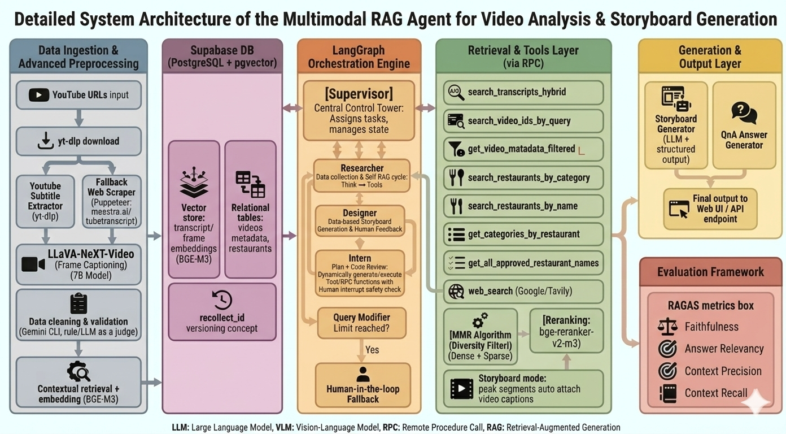
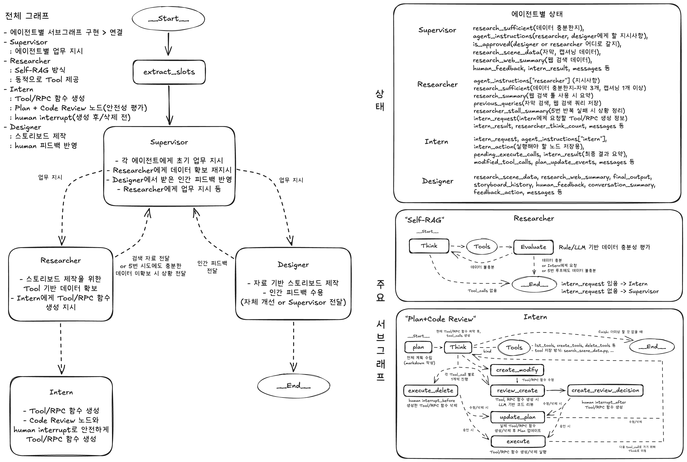
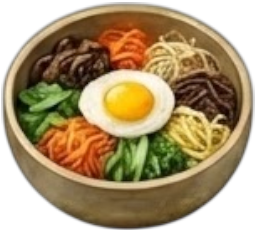
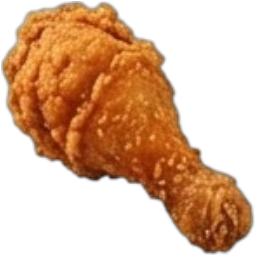
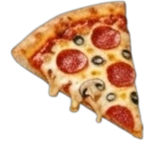
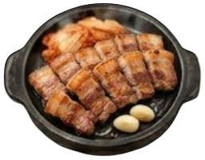
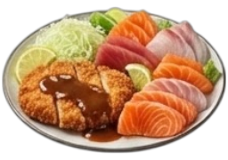
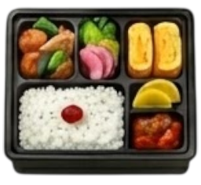
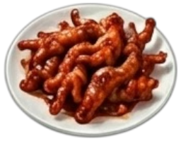

# 쯔동여지도 (Tzudong Map)

**쯔양이 다녀간 맛집을 한눈에! 전국 & 해외 맛집 지도 플랫폼**

Next.js 16 (Turbopack) + Supabase 기반의 풀스택 맛집 정보 플랫폼입니다.

**Live Demo**: [https://tzudong.app](https://tzudong.app)

---

## 시스템 아키텍처 (System Architecture)

현재 프로젝트는 **멀티모달 RAG(Multimodal RAG) 기반 비디오 분석 및 스토리보드 생성 에이전트**를 중심으로 고도화된 아키텍처를 자랑합니다.

### 전체 시스템 아키텍처


### 랭그래프 멀티 에이전트 체제 (LangGraph Orchestration)
Supervisor를 중앙 컨트롤 타워로 하여 Researcher, Designer, Intern 에이전트가 동적으로 협업하는 **방사형(Hub-and-spoke) 멀티 에이전트 오케스트레이션** 엔진이 구축되어 있습니다.


---

## 주요 기능

### 지도 기반 맛집 검색
- **국내/해외 지도**: Naver Maps + Google Maps API (전국 18개 지역, 해외 8개 국가)
- **마커 클러스터링**: Supercluster 기반 대량 마커 그룹화
- **스마트 필터링**: 카테고리(15개), 지역, 방문횟수, 리뷰수
- **검색 시스템**: 디바운싱, 인기 검색어, 최근 검색 기록.
- **주간 인기 맛집**: 검색 남용 방지 시스템 (1시간 3회 제한)

#### 다채로운 카테고리 마커 아이콘 지원 (15종)
지도 상의 맛집 메뉴를 한눈에 직관적으로 인지할 수 있도록 다채롭고 세련된 커스텀 마커 세트가 적용되어 있습니다.

<div align="center">
  
  
  
  
  
  
  
  
  
  
  
  
  
  
  
</div>

### 반응형 UI/UX
- **모바일 최적화**: 드래그 가능 바텀시트, 하단 네비게이션
- **터치 인터랙션**: 부드러운 스크롤 및 제스처
- **반응형 디자인**: 모바일/태블릿/데스크톱 완벽 대응

### 사용자 기능
- **소셜 로그인**: Google OAuth 인증
- **리뷰 시스템**: 별점, 사진, 영수증 인증
- **스탬프 투어**: 방문 맛집 스탬프 수집
- **리더보드**: 리뷰 수/신뢰도 기반 랭킹

### AI 평가 시스템 및 데이터 인프라
- 유튜브 식당 정보 자동화 데이터 파이프라인 (yt-dlp + 타겟 웹 스크래핑 폴백 지원)
- **LLaVA-NeXT-Video (7B)** 기반 비디오 프레임 캡셔닝
- **BGE-M3 (Dense + Sparse)** 및 **MMR Algorithm** 기반 하이브리드 Retrieval 인프라 적용
- LLM-as-a-judge 자동 품질 검증 및 관리자 승인 워크플로우

---

## 기술 스택

### Frontend
- **Framework**: Next.js 16 (App Router, Turbopack), React 19, TypeScript
- **Styling**: Tailwind CSS, shadcn/ui (Radix UI)
- **State**: TanStack Query, Zustand
- **Maps**: Naver Maps API, Google Maps API

### Backend
- **Database**: Supabase (PostgreSQL, pgvector)
- **AI/LLM**: Google Gemini, OpenAI, Anthropic (Multi-LLM LLM-as-a-Judge Router)
- **LangGraph**: RAG 기반 Storyboard Agent Orchestrator (Supervisor/Researcher/Designer/Intern)
- **APIs**: YouTube Data API, Kakao/Naver Geocoding, Tavily Web Search
- **Runtime**: Python 3.11+ (FastAPI), Node.js 20+, Bun

### Performance
- **Lighthouse 점수**: Performance 85-90/100
- **Bundle 최적화**: Dynamic imports, Code splitting
- **Image 최적화**: AVIF/WebP, Lazy loading
- **Cache**: React Query (staleTime: 60s, gcTime: 5m)

---

## 시작하기

### 사전 요구사항
- Node.js 18.17+
- Bun 1.2.0+ (권장) 또는 npm/yarn
- Python 3.11+ (백엔드 파이프라인)

### 설치 및 실행

```bash
# 1. 레포지토리 클론
git clone https://github.com/twoimo/tzudong.git
cd tzudong

# 2. 환경 변수 설정
cp apps/web/.env.example apps/web/.env.local
# .env.local 파일에 API 키 입력

# 3. 의존성 설치 및 실행
cd apps/web
bun install
bun run dev  # http://localhost:8080
```