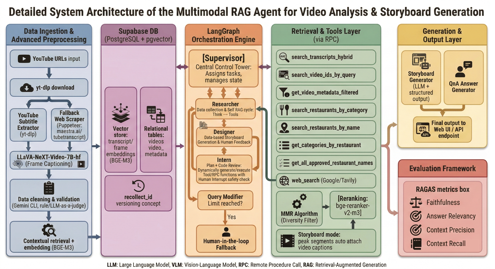
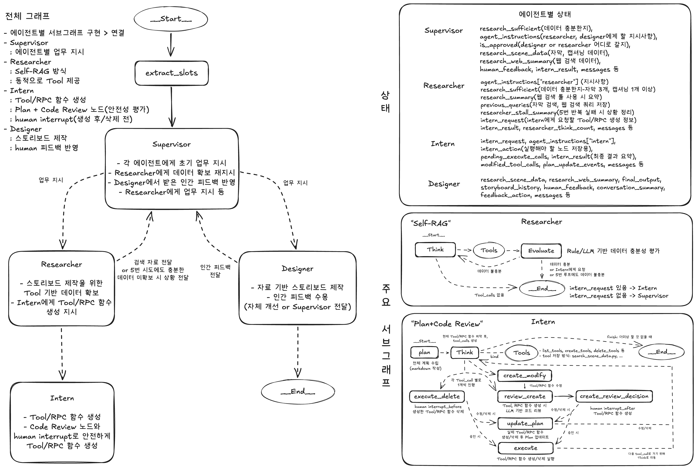
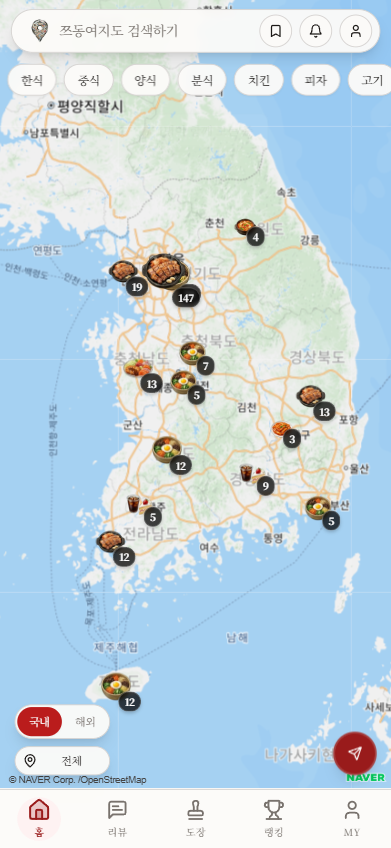
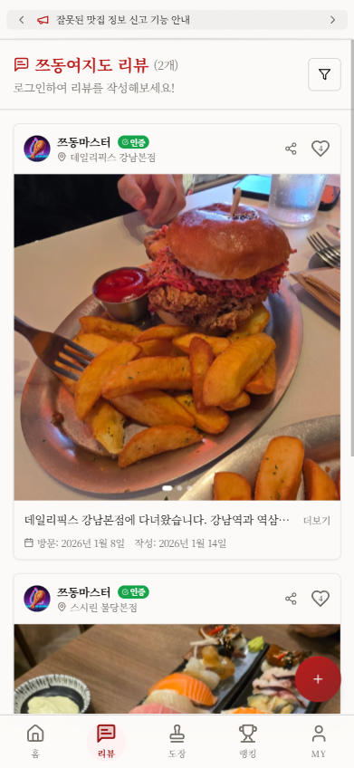
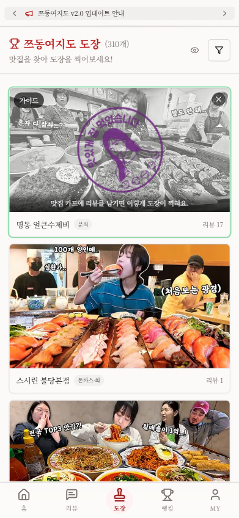
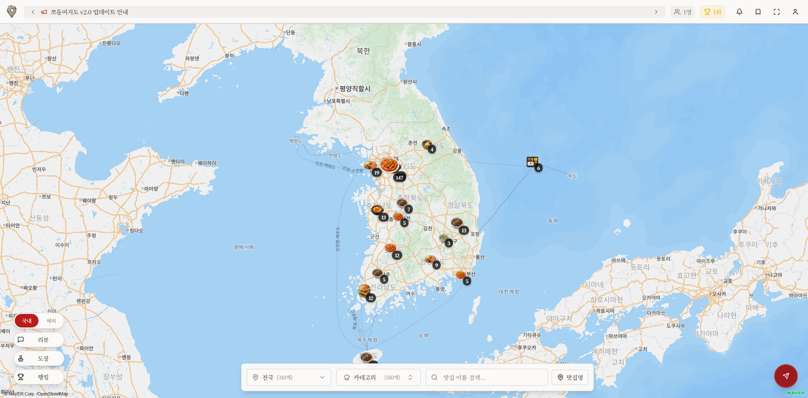
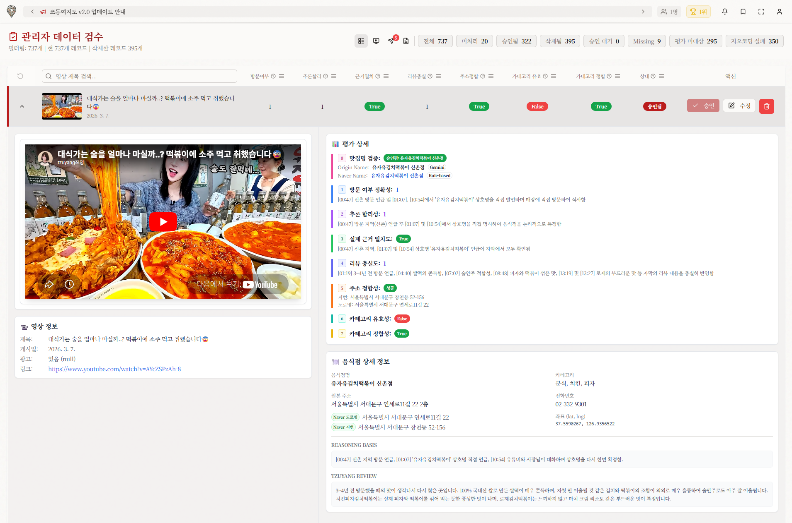

# 쯔동여지도 (Tzudong Map)

**쯔양이 다녀간 맛집을 한눈에! 전국 & 해외 맛집 지도 플랫폼**

**Live Demo**: [https://tzudong.app](https://tzudong.app)

## 전체 시스템 아키텍처 (System Architecture)

## 멀티 에이전트 아키텍처 (Multi-Agent Orchestration)

> 다이어그램의 RAGAS box는 **평가 축**을 나타냅니다. 커밋된 재현 리포트가 없는 수치형 RAGAS 개선율은 운영 성능 claim으로 쓰지 않습니다.

## 주요 기능

### 지도 기반 맛집 검색
- **국내/해외 지도**: Naver Maps + Google Maps API (전국 18개 지역, 해외 8개 국가)
- **마커 클러스터링**: Supercluster 기반 대량 마커 그룹화
- **스마트 필터링**: 카테고리(15개), 지역, 방문횟수, 리뷰수
- **검색 시스템**: 디바운싱, 인기 검색어, 최근 검색 기록.
- **주간 인기 맛집**: 검색 남용 방지 시스템 (1시간 3회 제한)

#### 다채로운 카테고리 마커 아이콘 지원 (15종)
지도 상의 맛집 메뉴를 한눈에 직관적으로 인지할 수 있도록 다채롭고 세련된 커스텀 마커 세트가 적용되어 있습니다.

  
  
  
  
  
  
  
  
  
  
  
  
  
  
  

### 반응형 UI/UX
- **모바일 최적화**: 드래그 가능 바텀시트, 하단 네비게이션
- **터치 인터랙션**: 부드러운 스크롤 및 제스처
- **반응형 디자인**: 모바일/태블릿/데스크톱 완벽 대응

### 사용자 기능
- **소셜 로그인**: Google OAuth 인증
- **리뷰 시스템**: 별점, 사진, 영수증 인증
- **스탬프 투어**: 방문 맛집 스탬프 수집
- **리더보드**: 리뷰 수/신뢰도 기반 랭킹

### AI 평가 시스템, 스토리보드 에이전트, 데이터 인프라
- **맛집 데이터 파이프라인**: `backend/run_daily.sh` 기반으로 유튜브/웹 근거를 수집하고 Rule 평가, LLM-as-a-Judge, 변환, Supabase 적재까지 manifest-first로 처리합니다.
- **검수 기준**: 맛집 정보의 정확성은 “관리자/검수 승인 데이터 기준”으로 표현합니다. LLM 출력 자체를 절대적 100% 정답으로 주장하지 않습니다.
- **스토리보드 생성 관리자**: `/admin?module=storyboard`에서 예시 프리셋, 기존 생성 이미지 즉시 표시, 컷별 오디오/자막/촬영 지시, 로컬 브릿지 연결 상태와 대화형 trace를 제공합니다.
- **LangGraph 에이전트 구조**: `backend/storyboard-agent`는 Supervisor, Researcher, Intern, Designer 역할의 그래프/어댑터 구조를 제공합니다. 운영 UI에서는 실제 backend evidence가 있을 때만 해당 경로를 노출합니다.
- **RAG/모델 worker 인프라**: BGE-M3 dense/sparse, bge-reranker-v2-m3, LLaVA-NeXT-Video captioning, Gemini/OpenAI/Ollama judge 경로를 fail-closed readiness와 함께 다룹니다.
- **평가 한계 명시**: 현재 커밋된 스토리보드 RAG 평가는 `deterministic_fixtures` 루브릭과 live worker smoke를 분리합니다. 발표 자료의 RAGAS 수치나 LangSmith 노트북 흔적은 재현 artifact가 붙기 전까지 “실험/평가 축”으로만 표기합니다.

## 구현 상태와 증거 기준

| 구분 | 현재 상태 | 공개 claim 기준 |
| --- | --- | --- |
| 맛집 지도 서비스 | Next.js/Supabase 기반 지도, 검색, 필터, 상세, 관리자 경로 구현 | 구현됨 |
| 데이터 수집·평가·적재 | run_daily, validators, Rule/LAAJ, Supabase insert contract 운영 | 구현됨; 데이터 정확도는 검수 승인 기준 |
| 스토리보드 생성 | 관리자 UI, 10개 예시, 기존 이미지 즉시 표시, 로컬 브릿지 연결 UX 구현 | 구현됨 |
| LangGraph 멀티 에이전트 | Supervisor/Researcher/Intern/Designer 그래프와 로컬/command bridge 구조 구현 | 구현됨; backend evidence가 있을 때만 live graph claim |
| RAG/모델 worker | BGE/reranker/LLaVA/Gemini/Ollama readiness·fail-closed 인프라 구현 | 인프라 구현; live smoke와 fixture 점수 분리 |
| RAGAS·LangSmith 수치 | 슬라이드/노트북/실험 맥락 존재, 커밋된 운영 벤치마크는 별도 필요 | 실험/평가 축; 운영 수치 claim 금지 |

---

## 기술 스택

### Frontend
- **Framework**: Next.js 16 (App Router, webpack dev/build parity; Turbopack은 비교/실험용 별도 실행), React 19, TypeScript
- **Styling**: Tailwind CSS, shadcn/ui (Radix UI)
- **State**: TanStack Query, Zustand
- **Maps**: Naver Maps API, Google Maps API

### Backend
- **Database**: Supabase (PostgreSQL, pgvector)
- **AI/LLM**: Google Gemini, OpenAI, Anthropic (Multi-LLM LLM-as-a-Judge Router)
- **LangGraph**: RAG 기반 Storyboard Agent Orchestrator (Supervisor/Researcher/Designer/Intern)
- **APIs**: YouTube Data API, Kakao/Naver Geocoding, Tavily Web Search
- **Runtime**: apps/web은 Node 24.x, Bun 기반 실행/테스트를 기준으로 하며 backend는 Python 3.11+와 Node/Bun 혼합 런타임을 사용

### Performance / 운영 품질
- **빌드 경로**: 기본 개발/빌드는 production parity를 위해 webpack 경로를 사용합니다.
- **번들 최적화**: Dynamic imports, route-level code splitting, heavy admin/map surface 지연 로딩
- **이미지 최적화**: AVIF/WebP, Lazy loading
- **상태/캐시**: React Query 기반 stale/cache 정책과 admin live-status no-store 경계

## 스크린샷

### 모바일 페이지 (메인 페이지, 리뷰 페이지, 도장 페이지)

  
  
  

### 데스크탑 메인 페이지 (Naver Map, OpenFreeMap)

### 데스크탑 관리자 검수 페이지 (승인, 수정, 삭제 등)

### 스토리보드 생성 에이전트 (Nano Banana)

