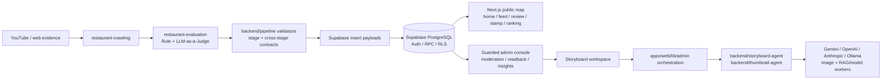

<div align="center">
  <p>
    
  </p>
  <h1>Tzudong Map</h1>
  <p><strong>A map-first restaurant discovery product and AI storyboard workspace for restaurants featured in Tzuyang videos.</strong></p>
  <p>
    <a href="https://tzudong.app">Live app</a>
    ·
    <a href="https://github.com/twoimo/tzudong/releases/tag/v1.1.1">Latest release</a>
    ·
    <a href="DESIGN.md">Design contract</a>
    ·
    <a href="SECURITY.md">Security policy</a>
    ·
    <a href="LICENSE">MIT license</a>
  </p>
  <p><strong>Language:</strong> English · <a href="README.ko.md">한국어</a></p>
  <p>
    
    
    
    
    
    
  </p>
</div>

---

## Table of contents

- [Overview](#overview)
- [Product tour](#product-tour)
- [What is implemented today](#what-is-implemented-today)
- [Architecture](#architecture)
- [Tech stack](#tech-stack)
- [Repository layout](#repository-layout)
- [Quick start](#quick-start)
- [Development commands](#development-commands)
- [Testing and QA](#testing-and-qa)
- [Operational guardrails](#operational-guardrails)
- [Documentation](#documentation)

## Overview

Tzudong Map turns video-based restaurant information into a product that users can browse and operators can verify.

The repository contains two main surfaces:

- **`apps/web`** — the Next.js public map, feed, mypage, insights surfaces, and the guarded `/admin` operating console.
- **`backend`** — the crawling, evaluation, validation, Supabase preparation, and local AI-helper backend pipeline.

Supabase is the shared persistence boundary between the web app and the backend pipeline. Long-running ingestion, media processing, evaluation, and bulk writes stay in `backend`; Next.js route handlers stay bounded and authenticated.

## Product tour

The README visuals are recorded from the local Next.js app in a real browser session and exported as app-first feature GIFs for GitHub. The storyboard clip starts from a chat prompt and shows a new storyboard being generated in the guarded admin workspace.

### PC


### Mobile

<table>
  <tr>
    <td width="50%"></td>
    <td width="50%"></td>
  </tr>
  <tr>
    <td width="50%"></td>
    <td width="50%"></td>
  </tr>
</table>

## What is implemented today

| Surface | Current state | Evidence standard used in this repository |
| --- | --- | --- |
| Public restaurant map | Next.js/Supabase map, search, filters, detail views, and responsive mobile/desktop shells are implemented. | Product behavior is verified through Playwright/browser checks and source-contract tests. |
| Restaurant data pipeline | `backend/run_daily.sh`, validators, Rule/LAAJ evaluation, transform contracts, and Supabase insert boundaries are implemented. | Accuracy claims are scoped to reviewed/approved data, not raw LLM output. |
| Admin moderation | Guarded admin routes support review, approval, deletion/restoration, and operational readback flows. | Risky flows should follow Preview → Confirm → Apply → Readback → Audit. |
| Storyboard generator | Admin UI, starter examples, existing image readback, cut metadata, guided provider setup, and provider status UX are implemented. | Live provider claims require provider proof or explicit local smoke evidence. |
| Storyboard RAG/model worker infrastructure | BGE-M3, reranker, LLaVA captioning, Gemini/OpenAI/Ollama judge paths, and fail-closed readiness rules are represented in code and docs. | Deterministic fixture scores and live worker smoke are kept separate. |
| LangGraph-style storyboard agent | `backend/storyboard-agent` contains Supervisor/Researcher/Intern/Designer graph and adapter structure. | The UI should expose live graph capability only when backend evidence is available. |
| RAGAS/LangSmith metrics | Diagrams and notes keep RAGAS/LangSmith as an evaluation axis. | Numeric RAGAS improvements are not production performance claims without reproducible committed artifacts. |

## Architecture

### System boundaries

Tzudong Map keeps the product split into explicit runtime boundaries instead of one large full-stack service.

| Boundary | Owns | Does not own |
| --- | --- | --- |
| `apps/web` public app | Map-first restaurant discovery, responsive mobile/desktop shells, review/stamp/ranking screens, and lightweight API reads. | Long-running crawling, ffmpeg/media processing, bulk LLM evaluation, or batch inserts. |
| `apps/web` admin console | Authenticated moderation, source readback, storyboard workspace orchestration, provider status UX, and bounded admin APIs. | Secret-bearing provider execution in the browser or request/response batch jobs. |
| `backend` pipeline | Crawling, evidence normalization, Rule/LAAJ evaluation, fail-closed validation, manifests, and Supabase-ready payload construction. | User-facing page rendering or interactive admin session state. |
| `backend/*-agent` helpers | Local storyboard/thumbnail adapters, RAG/model worker profiles, and provider smoke tooling used by admin workflows. | Production claims without committed smoke evidence or reproducible benchmark artifacts. |
| Supabase | PostgreSQL persistence, Auth, RPCs, migrations, RLS/service-role boundaries, and the shared contract between batch and web. | File-system batch state, crawler orchestration, or provider runtime policy. |

### Runtime request paths

- **Public home/map path:** `app/page.tsx` loads the special home shell (`home-runtime-shell.tsx` → `home-client.tsx` → `hooks/useHomeState.ts`) and delegates map, filter, marker, and detail-panel UI to `components/home/**` and `components/map/**`.
- **General app path:** non-home routes use `app-runtime-layout.tsx` → `app-runtime-shell.tsx` → `components/layout/MainLayout.tsx` so feed, review, stamp, ranking, mypage, and insight surfaces share navigation and responsive behavior.
- **Auth/session path:** requests pass through `apps/web/proxy.ts`; session-aware server work uses `lib/supabase/server.ts`, browser work uses `integrations/supabase/client.ts`, and privileged server-only operations use `lib/supabase/service-role.ts`.
- **Admin API path:** `/admin` and `app/api/admin/**` gate early with `requireAdmin`, return bounded `NextResponse.json(...)`, sanitize provider/database errors, and keep risky mutations on a Preview → Confirm → Apply → Readback → Audit path.
- **Storyboard path:** the admin storyboard UI keeps chat/cut state in the web app, then calls bounded admin orchestration helpers under `apps/web/lib/admin/**`; provider execution and local RAG/model workers remain behind backend adapters and explicit readiness checks.

### Batch and data flow


```mermaid
flowchart LR
  Evidence[YouTube / web evidence] --> Crawl[restaurant-crawling]
  Crawl --> Eval[restaurant-evaluation<br/>Rule + LLM-as-a-Judge]
  Eval --> Validate[backend/pipeline validators<br/>stage + cross-stage contracts]
  Validate --> Transform[Supabase insert payloads]
  Transform --> DB[(Supabase PostgreSQL<br/>Auth / RPC / RLS)]
  DB --> Public[Next.js public map<br/>home / feed / review / stamp / ranking]
  DB --> Admin[Guarded admin console<br/>moderation / readback / insights]
  Admin --> Storyboard[Storyboard workspace]
  Storyboard --> Orchestrator[apps/web/lib/admin orchestration]
  Orchestrator --> Agents[backend/storyboard-agent<br/>backend/thumbnail-agent]
  Agents --> Providers[Gemini / OpenAI / Anthropic / Ollama<br/>image + RAG/model workers]
```

The stable daily entrypoint is `backend/run_daily.sh`. It loads the runtime environment, preserves cron/CI exit semantics, and delegates policy-heavy work to Python helpers such as `backend/utils/run_daily_helpers.py`, pipeline nodes, validators, and review-queue utilities. Contract changes across `restaurant-crawling` → `restaurant-evaluation` → Supabase payloads → web/admin consumers require documentation, validators/fixtures, tests, and a stored-data migration/defaulting plan when both old and new shapes can be visible.

### Trust, verification, and AI boundaries

- Backend validation is fail-closed: missing required evidence, malformed payloads, and unsafe cross-stage states should block promotion rather than silently degrade.
- Admin surfaces expose operational state with bounded readbacks; raw secrets, local sensitive paths, full provider traces, and unbounded logs stay out of responses.
- React Query is the default client async boundary; stable query keys and invalidation are preferred over ad-hoc fetch state.
- Heavy UI and client-only dependencies are code-split with `dynamic`, `lazy`, `Suspense`, and `ssr: false` where appropriate.
- RAGAS and LangSmith are evaluation axes. Numeric RAGAS improvement claims are not production claims unless a reproducible benchmark artifact is committed with the claim.

## Tech stack

| Layer | Tools |
| --- | --- |
| Frontend | Next.js 16 App Router, React 19, TypeScript, Tailwind CSS, shadcn/Radix primitives |
| Client state | TanStack Query, Zustand, stable query keys and invalidation |
| Maps | Naver Maps, Google Maps/OpenFreeMap fallback contexts, Supercluster marker grouping |
| Persistence | Supabase PostgreSQL, Auth, RPC, service-role server boundaries |
| Backend pipeline | Python, Node ESM, shell entrypoints, manifest-first daily batch helpers |
| AI/storyboard | Gemini/OpenAI/Anthropic/Ollama adapters, RAG worker profiles, and image provider proof paths |
| Testing | Bun test, Playwright, Python `unittest`, source-contract tests |

## Repository layout

```text
.
├── apps/web                    # Next.js app, public map, admin console, tests
│   ├── app                     # App Router pages, layouts, route handlers
│   ├── components              # UI modules for admin, home, layout, map, etc.
│   ├── hooks / contexts        # Shared client state and providers
│   ├── lib                     # Auth, Supabase clients, admin workflows, map utilities
│   ├── tests                   # Playwright coverage
│   └── tests-unit              # Bun unit and source-contract tests
├── backend                     # Batch pipeline, validators, AI helper backends
│   ├── bin                     # Focused operational CLIs and checks
│   ├── pipeline                # Pipeline nodes, state, validators, tests
│   ├── storyboard-agent        # Local storyboard/RAG helper backend
│   ├── thumbnail-agent         # Local thumbnail helper backend
│   └── utils                   # Run-daily helpers and reusable utilities
├── docs                        # Operational notes and handoffs
├── scripts                     # Repo-level helper scripts
├── DESIGN.md                   # UI/admin design contract
└── AGENTS.md                   # Repository operating guide for coding agents
```

## Quick start

### Prerequisites

- Node.js **24.x** for `apps/web`
- Bun for frontend install/test workflows
- Python 3.11+ for backend validation and pipeline tooling
- Supabase environment variables in `apps/web/.env.local` and backend env files as required by the target command

### Run the web app locally

```sh
cd apps/web
bun install
bun run dev:webpack
```

Open `http://localhost:8080`.

### Run the backend contract checks

```sh
python3 backend/bin/check_env_contract.py --profile daily
python -m unittest backend.utils.tests.test_run_daily_regression
python -m unittest backend.pipeline.test_validators_unittest
python -m unittest backend.pipeline.test_data_contracts_unittest
```

## Development commands

### Frontend (`apps/web`)

| Task | Command |
| --- | --- |
| Install dependencies | `cd apps/web && bun install` |
| Start dev server | `cd apps/web && bun run dev` |
| Clean webpack dev server | `cd apps/web && bun run dev:clean` |
| Webpack parity dev server | `cd apps/web && bun run dev:webpack` |
| Build | `cd apps/web && bun run build` |
| Lint | `cd apps/web && bun run lint` |
| Unit/source-contract tests | `cd apps/web && bun run test:unit` |
| Responsive Playwright wrapper | `cd apps/web && bun run test:responsive` |
| Full Playwright | `cd apps/web && npx playwright test` |

### Backend / pipeline

| Task | Command |
| --- | --- |
| Install Node helper dependencies | `cd backend && npm ci` |
| Env contract check | `python3 backend/bin/check_env_contract.py --profile daily` |
| Run-daily regression suite | `python -m unittest backend.utils.tests.test_run_daily_regression` |
| Pipeline validator suite | `python -m unittest backend.pipeline.test_validators_unittest` |
| Data-contract suite | `python -m unittest backend.pipeline.test_data_contracts_unittest` |
| Stable daily entrypoint | `backend/run_daily.sh` |

## Testing and QA

This repository favors contract-heavy verification over broad, shallow coverage.

- **Frontend unit/source tests** live in `apps/web/tests-unit` and are run with Bun.
- **Browser/e2e tests** live in `apps/web/tests` and use Playwright with an authenticated admin bootstrap path.
- **Backend regression tests** live under `backend/utils/tests` and `backend/pipeline/*_unittest.py`.
- **Storyboard provider smoke** is explicit and quota-aware; see `docs/operations/storyboard-eight-real-provider-smoke.md`.
- **Storyboard RAG worker profiles** are fail-closed by design; see `docs/operations/storyboard-rag-operating-profiles.md`.

Recommended focused checks before shipping user-visible web/admin changes:

```sh
cd apps/web
bun run test:unit
bun run lint
```

Recommended focused checks before backend contract changes:

```sh
python -m unittest backend.utils.tests.test_run_daily_regression
python -m unittest backend.pipeline.test_validators_unittest
python -m unittest backend.pipeline.test_data_contracts_unittest
```

## Operational guardrails

- Keep crawler execution, ffmpeg/media work, Gemini bulk evaluation, long Supabase inserts, and GDrive sync out of Next.js route handlers.
- Use the correct Supabase client for the context: browser client, session-aware server client, or service-role server-only client.
- Admin APIs should gate early with `requireAdmin`, return bounded JSON, and avoid exposing raw provider or database errors.
- Heavy web/admin surfaces should stay code-split with `dynamic`, `lazy`, `Suspense`, or client-only loading where appropriate.
- Backend validation is fail-closed. Contract changes should update docs, validators, and regression tests together.
- AI-generated or model-assisted claims need matching artifacts. Do not promote experimental notebook or slide numbers into production claims without committed reproducible evidence.

## Documentation

- [`AGENTS.md`](AGENTS.md) — repository guidelines and operating conventions.
- [`DESIGN.md`](DESIGN.md) — UI/admin design contract and route expectations.
- [`SECURITY.md`](SECURITY.md) — vulnerability reporting, supported branches, and safe testing rules.
- [`LICENSE`](LICENSE) — MIT license terms.
- [`backend/ARCHITECTURE.md`](backend/ARCHITECTURE.md) — backend/API/batch boundary rules.
- [`backend/DATA_CONTRACTS.md`](backend/DATA_CONTRACTS.md) — backend-to-Supabase-to-web data contract baseline.
- [`backend/docs/run-daily-operations.md`](backend/docs/run-daily-operations.md) — manifest-first batch runbook.
- [`docs/operations/storyboard-rag-operating-profiles.md`](docs/operations/storyboard-rag-operating-profiles.md) — required-provider RAG execution profiles.
- [`docs/operations/storyboard-eight-real-provider-smoke.md`](docs/operations/storyboard-eight-real-provider-smoke.md) — quota-aware storyboard image-provider smoke guide.
