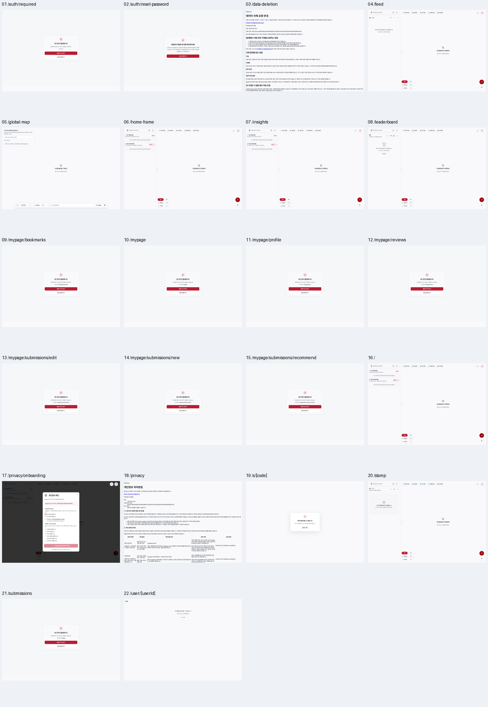
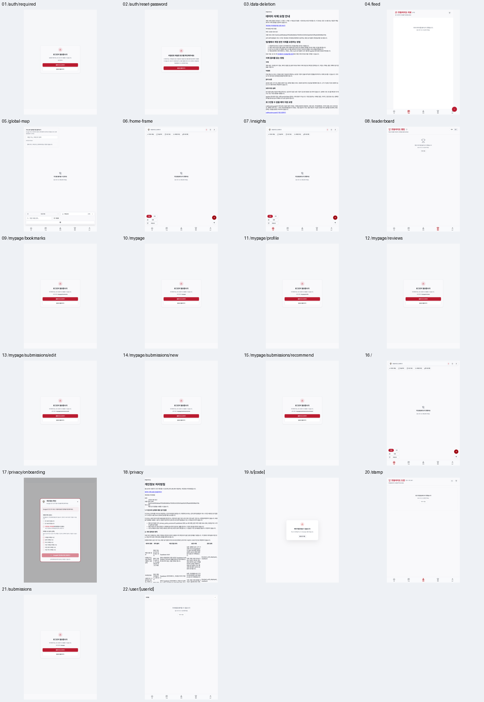
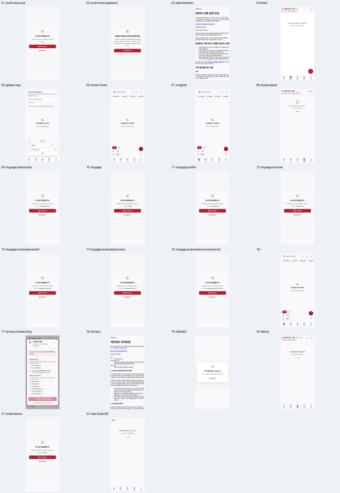

# 공개 CMS 후속 검증 — 2026-10-09

시작 후보 HEAD: `b085e1d36ad8a8bc5626738b9921b194f50324a1`. 기존 사용자/다른 작업자의 변경, 서비스와 브라우저를 보존했습니다. 운영 쓰기·배포·유료 호출은 수행하지 않았습니다.

## 결과와 경계

22개 경로를 데스크톱 1440×1000, 태블릿 820×1180, 모바일 390×844에서 캡처했습니다. 초기 66개 캡처 중 로딩/빈 화면은 완료 증거로 인정하지 않았습니다. 피드·랭킹·도장·프로필·개인정보 확인 화면 15개를 명시적인 최종 상태로 다시 캡처했고, accepted-route-matrix.json과 final-contact-sheet-*에는 해당 교체본을 연결했습니다. 지도 제공자·공개 API는 차단/합성 실패 응답이며 실제 지도·운영 데이터 성공을 주장하지 않습니다. 계정·insights 경로는 익명 가드/홈 이동만 검증했습니다.

브라우저 읽기 흐름 10개가 통과했습니다: 로그인 브랜드/로고/회원가입 스크롤/Escape 4개, 공개 문서 스크롤/링크 1개, 합성 랭킹 기간/재연결 실패/재조회 회복 3개, 합성 도장 목록·검색 실패/빈 성공/재조회 회복 2개. 관련 57개 단위 테스트, 대상 ESLint와 TypeScript parity(진단 0개)가 통과했습니다. 실제 OAuth·비밀번호 변경·회원가입·동의 확정·개인 데이터·mutation은 실행하지 않았습니다.

## 수정

| 파일 | 확인된 문제와 최종 변경 | 증거 |
| --- | --- | --- |
| components/auth/AuthModal.tsx | 익명 개인정보 확인 화면도 Google 로그인 완료를 단정했습니다. 완료를 단정하지 않는 안내로 수정했습니다. | 17번 초기 캡처와 stable-17-* |
| components/leaderboard/LeaderboardList.tsx | 기존 데이터가 있으면 갱신 실패 안내/재조회 UI가 없었습니다. 이전 결과임을 밝히고 읽기 재시도 버튼을 표시합니다. | public-ui-run.json의 3개 합성 재연결 흐름, leaderboard-refetch-error.png |
| app/stamp/page.tsx | 실패한 목록/검색을 빈 결과로 처리했습니다. 전체 수 미확인, 활성 목록/검색 오류, 재조회와 검색 로딩을 구분합니다. | stamp-final-run.json의 태블릿/모바일 두 흐름 |
| app/leaderboard/page.tsx; lib/motion/scroll-behavior.ts | 현재 사용자 자동 이동이 smooth를 직접 지정했습니다. 매 동작 시 reduced-motion을 읽어 auto/smooth를 선택합니다. | preferred-scroll-behavior.test.ts; 로그인 자동 이동 전체 흐름은 미검증 |
| tests/public-cms-readonly.spec.ts | 실제 UI의 읽기/실패/회복/브랜드/스크롤 검증을 추가했습니다. 모든 외부 쓰기를 차단하고 알려진 랭킹 읽기 RPC만 합성 응답합니다. | 최종 10개 브라우저 사례 |

## 22개 단계별 화면 검증

익명 가드나 합성 실패의 렌더링을 해당 계정의 정상 운영 기능으로 대체하지 않습니다. 각 행의 화면은 아래 3개 contact sheet에도 같은 번호로 배치했습니다.

| 단계 | 경로 | 현재 확인 상태 | 데스크톱 | 태블릿 | 모바일 |
| --- | --- | --- | --- | --- | --- |
| 1 | `/auth/required` | 익명 접근 안내 | [화면](screenshots/01-desktop.png) | [화면](screenshots/01-tablet.png) | [화면](screenshots/01-mobile.png) |
| 2 | `/auth/reset-password` | 복구 권한 없는 상태 안내 | [화면](screenshots/02-desktop.png) | [화면](screenshots/02-tablet.png) | [화면](screenshots/02-mobile.png) |
| 3 | `/data-deletion` | 공개 안내·스크롤·링크 검증 | [화면](screenshots/03-desktop.png) | [화면](screenshots/03-tablet.png) | [화면](screenshots/03-mobile.png) |
| 4 | `/feed` | 합성 읽기 실패 상태 | [화면](stable-4-desktop.png) | [화면](stable-4-tablet.png) | [화면](stable-4-mobile.png) |
| 5 | `/global-map` | 외부 지도 차단 상태 | [화면](screenshots/05-desktop.png) | [화면](screenshots/05-tablet.png) | [화면](screenshots/05-mobile.png) |
| 6 | `/home-frame` | 홈 지도 차단 상태 | [화면](screenshots/06-desktop.png) | [화면](screenshots/06-tablet.png) | [화면](screenshots/06-mobile.png) |
| 7 | `/insights` | 익명 사용자는 홈으로 이동 | [화면](screenshots/07-desktop.png) | [화면](screenshots/07-tablet.png) | [화면](screenshots/07-mobile.png) |
| 8 | `/leaderboard` | 합성 기간 읽기·오류·회복 검증 | [화면](stable-8-desktop.png) | [화면](stable-8-tablet.png) | [화면](stable-8-mobile.png) |
| 9 | `/mypage/bookmarks` | 익명 로그인 가드 | [화면](screenshots/09-desktop.png) | [화면](screenshots/09-tablet.png) | [화면](screenshots/09-mobile.png) |
| 10 | `/mypage` | 익명 로그인 가드 | [화면](screenshots/10-desktop.png) | [화면](screenshots/10-tablet.png) | [화면](screenshots/10-mobile.png) |
| 11 | `/mypage/profile` | 익명 로그인 가드 | [화면](screenshots/11-desktop.png) | [화면](screenshots/11-tablet.png) | [화면](screenshots/11-mobile.png) |
| 12 | `/mypage/reviews` | 익명 로그인 가드 | [화면](screenshots/12-desktop.png) | [화면](screenshots/12-tablet.png) | [화면](screenshots/12-mobile.png) |
| 13 | `/mypage/submissions/edit` | 익명 로그인 가드 | [화면](screenshots/13-desktop.png) | [화면](screenshots/13-tablet.png) | [화면](screenshots/13-mobile.png) |
| 14 | `/mypage/submissions/new` | 익명 로그인 가드 | [화면](screenshots/14-desktop.png) | [화면](screenshots/14-tablet.png) | [화면](screenshots/14-mobile.png) |
| 15 | `/mypage/submissions/recommend` | 익명 로그인 가드 | [화면](screenshots/15-desktop.png) | [화면](screenshots/15-tablet.png) | [화면](screenshots/15-mobile.png) |
| 16 | `/` | 홈 지도 차단 상태 | [화면](screenshots/16-desktop.png) | [화면](screenshots/16-tablet.png) | [화면](screenshots/16-mobile.png) |
| 17 | `/privacy/onboarding` | 안내 오표현 수정·미완료 폼 | [화면](stable-17-desktop.png) | [화면](stable-17-tablet.png) | [화면](stable-17-mobile.png) |
| 18 | `/privacy` | 공개 문서·스크롤·링크 검증 | [화면](screenshots/18-desktop.png) | [화면](screenshots/18-tablet.png) | [화면](screenshots/18-mobile.png) |
| 19 | `/s/[code]` | 무효 링크 fallback; TypeError 남음 | [화면](screenshots/19-desktop.png) | [화면](screenshots/19-tablet.png) | [화면](screenshots/19-mobile.png) |
| 20 | `/stamp` | 합성 읽기·검색 오류/회복 검증 | [화면](stable-20-desktop.png) | [화면](stable-20-tablet.png) | [화면](stable-20-mobile.png) |
| 21 | `/submissions` | 마이페이지 경유 로그인 가드 | [화면](screenshots/21-desktop.png) | [화면](screenshots/21-tablet.png) | [화면](screenshots/21-mobile.png) |
| 22 | `/user/[userId]` | 합성 프로필 조회 실패 상태 | [화면](stable-22-desktop.png) | [화면](stable-22-tablet.png) | [화면](stable-22-mobile.png) |

## 스타일·접근성·반응형 확인

초기 66개 문서의 수평 넘침 최대값은 0px였고, reduce 설정에서 측정한 visible CSS animation 최대값은 0개였습니다. 각 화면의 기본 이름 없는 컨트롤 탐지 결과는 capture-results.json에 보존했습니다. 이 간단한 탐지는 WCAG 적합성 또는 스크린리더 전체 동작 검증이 아닙니다. 기존 public 헤더 높이는 화면별 약 61/65/74/87px로 기록됐으며, 높이 측정만으로 고밀도 디자인 전체 목표가 완성됐다고 판단하지 않습니다.

로그인 브랜드 제목·실제 로고 자산 로딩, 회원가입 탭, 긴 폼 하단 버튼까지 스크롤, 정책 조회 불가 시 가입 비활성, Escape 닫기를 데스크톱/태블릿/모바일/390×600에서 확인했습니다. 모바일 헤더를 유지한 채 폼이 스크롤됐습니다. 실제 모바일 키보드·기기·회원가입은 미검증입니다.

## 실패 증거와 재확인

첫 auth-flow는 로컬 Next HMR WebSocket까지 막아 bootstrap skeleton에 머물렀습니다. 운영/제품 성공으로 처리하지 않았고 auth-flow-results.json 및 failure 캡처를 보존했습니다. 이후 로컬 개발 소켓만 연결하고 외부 소켓은 차단한 auth-current와 실제 spec이 통과했습니다.

기존 랭킹의 갱신 실패는 같은 기간의 데이터가 유지되는 재연결 실패로 검증했습니다. 기간 전환/기본 5초 대기/Next route-announcer의 추가 alert 때문에 실패한 초기 테스트 보고서는 따로 보존했습니다. 최종 검증은 특정 랭킹 alert, 이전 결과, 재조회 후 alert 제거와 정상 합성 결과를 모두 확인합니다.

도장 검색 SDK의 503 재시도와 Query 재시도가 겹쳐 15초 검증이 먼저 끝났습니다. 설치된 @supabase/postgrest-js/src/fetchWithRetry.ts 및 공식 retry API/변경 기록을 확인했으며 제품의 retry 기본값은 바꾸지 않았습니다. 최종 45초 한도의 상태 검증을 포함한 두 흐름은 39.4초에 모두 통과했습니다. [공식 retry API](https://supabase.com/docs/reference/javascript/retry), [공식 변경 기록](https://supabase.com/changelog). 이 시간은 합성 테스트 실행 시간이며 운영 성능 측정이 아닙니다.

무효 공유 링크에서 not-found 화면이 렌더되지만 별도 문맥에서도 TypeError 1건이 남습니다(error-reconciliation.json). 유효 공유 코드/실제 redirect는 검증하지 않았습니다. global-map/privacy-onboarding의 초기 error-count는 각각 새 문맥 재확인에서 0건이었고 원래 카운트도 삭제하지 않았습니다.

초기 capture-results.json의 mutationAttemptsBlocked라는 원래 필드 이름은 보존했습니다. 35건은 non-GET 차단 카운터이고 공개 읽기 RPC POST도 포함합니다. 이것을 35건의 운영 mutation 시도라고 해석하지 않습니다. 실제 spec의 알려진 읽기 RPC도 페이지 안에서 합성 응답만 반환했습니다.

## 프로세스·브라우저 소유

기존 개발 서버 PID 57309/127.0.0.1:19872를 재사용했고 cwd가 후보 apps/web임을 lsof로 확인했습니다. 환경에 지정된 빌드 디렉터리는 .next-local-18080이며 현재 변경의 컴파일도 확인했습니다. 이 helper가 서버를 시작/중단/재설정하지 않았습니다. 모든 custom Chromium은 finally에서 닫았고 Playwright worker/browser fixture는 실패/성공 실행 종료 시 정리했습니다. 기존 사용자 탭, 쿠키나 저장된 인증 상태는 채택하지 않았습니다. process-ownership.json의 마지막 확인에서 소유 harness/runner 프로세스는 0개이며 기존 서버는 실행 중입니다.

## 정확한 미완료

운영 인증을 거친 계정/북마크/리뷰/제보/프로필/성과 분석 본문, 실제 지도 SDK와 검색·선택·동선·위치, 실제 레스토랑/공유 데이터, 유효 공유 링크 redirect와 남은 TypeError, 로그인 사용자의 자동 스크롤 전체 흐름, 스크린리더/기기 검증과 배포는 남아 있습니다. 이번 변경을 해당 운영 증거의 대체물로 표시하지 않습니다.
