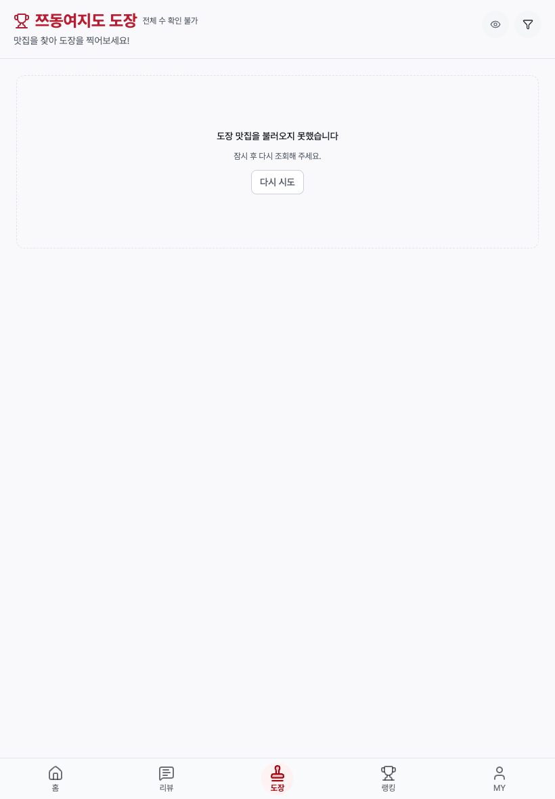
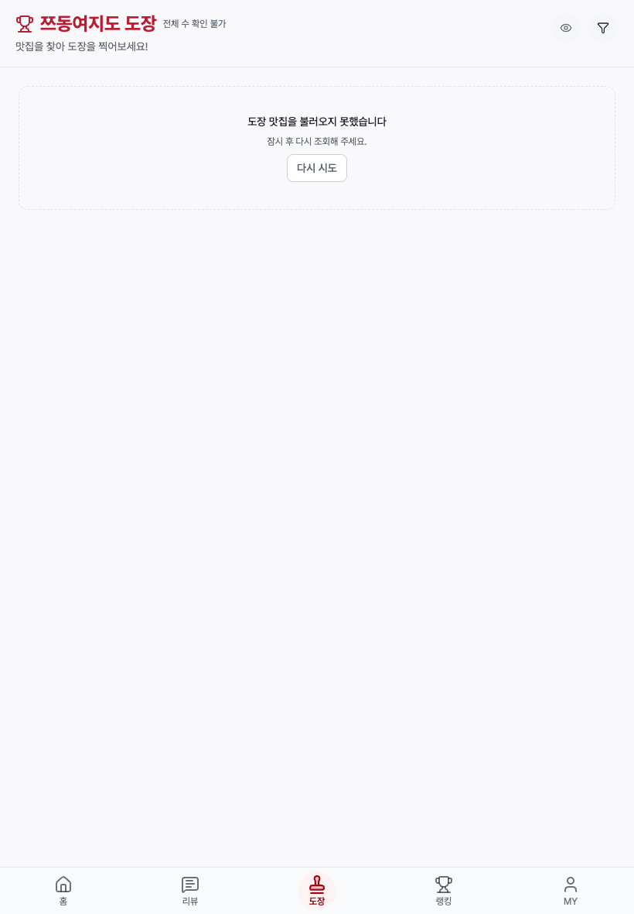
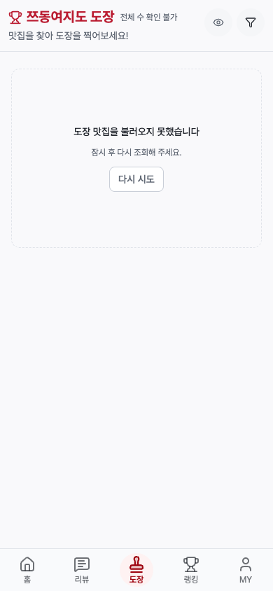
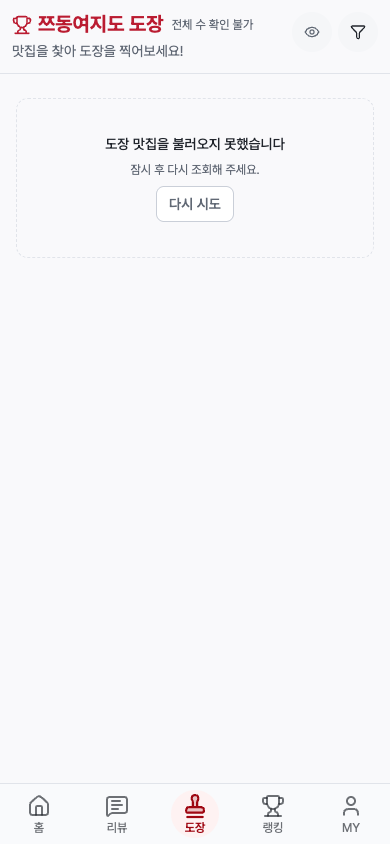
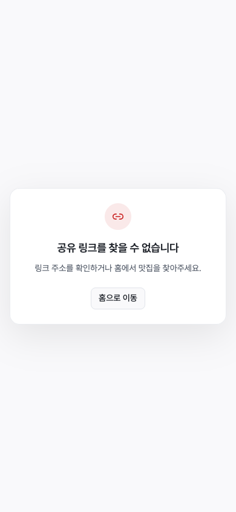

# 공유 fallback·도장 정보 밀도 후속 — 2026-10-09

앞선 public-cms-followthrough의 TypeError 미완료 항목을 이어서 처리했습니다. 앞선 66개 raw 캡처와 15개 stable 캡처를 수정하지 않았으며, 현재 81개 파일의 SHA-256/크기를 preserved-original-capture-manifest.json에 기록했습니다. 이전 보고서는 당시 상태의 기록이고 이 폴더가 후속 결과입니다.

## 원인과 수정

무효 코드와 존재하지 않는 6자리 코드 모두 notFound() 제어 예외 뒤에 TypeError가 발생했습니다. 자유형 오류/제공자 본문은 저장하지 않고 고정 분류·키워드·로컬 코드 프레임만 수집했습니다. diagnosis-framed.json은 React 개발 RSC의 flushComponentPerformance → performance.measure(3907:35)를 가리킵니다. URL 키워드는 확인됐지만 라이브러리의 정확한 URL 인수 문제를 별도로 변경했다고 주장하지 않습니다.

[Next notFound](https://nextjs.org/docs/app/api-reference/functions/not-found)는 제어 예외를 던집니다. 예상할 수 있는 읽기 실패는 [명시적인 결과로 모델링하는 지침](https://nextjs.org/docs/app/getting-started/error-handling)에 맞춰 처리했습니다. 패키지 pin, 전역 performance API, console, 오류 수집기를 바꾸거나 오류를 필터링하지 않았습니다.

app/s/[code]/page.tsx는 allocator와 같은 6자리 영숫자 코드를 먼저 검증합니다. 읽기에는 10초 AbortSignal을 적용하고 maybeSingle의 없는 행, 제공자 오류, 잘못된 응답과 던져진 예외를 not-found/unavailable의 고정 결과로 구분합니다. lib/share/short-url-read.ts의 결과와 ShareRedirectNotice 서버 UI만 사용자에게 전달합니다. 조회 불가에는 같은 검증된 링크를 재조회하는 native 링크가 있고 모든 실패 상태에는 홈 복구가 있습니다. noindex와 같은 출처/홈 경로/유효 리뷰 ID의 redirect guard를 유지했고, 정상 redirect는 읽기 catch 밖에 둡니다. app/s/layout.tsx는 원인을 확인한 뒤 기존 AppRuntimeLayout 그대로 유지했습니다.

## 실제 검증

| 단계 | 화면/동작 | 결과 | 증빙 |
| --- | --- | --- | --- |
| 1 | 무효 코드 desktop | 안내·noindex·홈 복구·pageerror 0 | browser-output의 desktop invalid-code 캡처 |
| 2 | 없는 6자리 코드 desktop | bounded 안내·홈 복구·pageerror 0 | browser-output의 desktop Zz00Qq 캡처 |
| 3 | 무효 코드 tablet | 안내·noindex·홈 복구·pageerror 0 | browser-output의 tablet invalid-code 캡처 |
| 4 | 없는 6자리 코드 tablet | bounded 안내·홈 복구·pageerror 0 | browser-output의 tablet Zz00Qq 캡처 |
| 5 | 무효 코드 mobile | 안내·noindex·홈 복구·pageerror 0 | after-code-1.png 및 browser-output |
| 6 | 없는 6자리 코드 mobile | bounded 안내·홈 복구·pageerror 0 | after-code-2.png 및 browser-output |
| 7 | 도장 실패 tablet | compact 높이·재조회 버튼·넘침 0 | stamp-after-tablet.png |
| 8 | 도장 실패 mobile | compact 높이·재조회 버튼·넘침 0 | stamp-after-mobile.png |

실제 Playwright 8개가 15.3초에 통과했습니다(browser-results.json). 조회/페이지 runtime 8개, public surface/SDK 진입점 source 계약 16개, redirect security 1개로 단위/계약 검증 25개가 통과했습니다. 정상 같은 출처 리뷰 redirect, 외부/unsafe target의 홈 fallback, missing/provider/thrown/malformed read와 diagnostics 미전파를 실행했습니다. 구현 위치가 바뀐 기존 source 계약은 validator → read helper → redirect 연결을 확인하도록 갱신했고, 검사를 삭제해서 통과시키지 않았습니다. ESLint와 TypeScript parity(진단 0개)도 통과했습니다.

## 도장 실패 영역의 밀도

min-h-64는 메시지 두 줄과 버튼에 256px를 강제했습니다. 기존 CMS의 compact 실패/빈 상태 기준에 맞춰 min-h-40, gap-2, p-4로 조정했습니다. 같은 viewport와 동일 실패 응답 조건에서 태블릿과 모바일 모두 256px → 160px(-96px, -37.5%)였습니다. 이것은 실제 영역 높이 비교이며 성능/속도/사용량 개선 주장이 아닙니다. 두 조건 모두 가로 넘침 0px이고 메시지와 재조회 버튼은 보입니다.

| 화면 | 변경 전 | 변경 후 |
| --- | --- | --- |
| 태블릿 820×1180 |  |  |
| 모바일 390×844 |  |  |

## 소유 상태와 미완료 경계

기존 PID 57309/127.0.0.1:19872 개발 서버를 재사용하고 시작/중단/재설정하지 않았습니다. 이 helper의 custom browser는 finally에서 닫았고 Playwright fixture도 실패/성공 종료 시 정리했습니다. 마지막 ps 확인에서 소유 harness/runner는 0개이고 기존 서버는 실행 중입니다. 기존 user 서비스/브라우저/탭/인증 저장 상태는 채택하지 않았습니다.

유효한 기존 공유 링크의 실제 운영 redirect와 강제 live provider outage는 별도 운영 검증으로 남습니다. provider 오류/예외와 정상/unsafe redirect는 로컬 페이지 runtime mock 사례이며 운영 성공으로 대체하지 않습니다. 앞선 로그인 계정·개인 데이터·실제 지도 제공자·기기·배포 경계도 유지합니다. SQL, 목표/Todo, package pins, 운영 쓰기와 배포는 변경하지 않았습니다.

React 점검: 새 안내는 서버 컴포넌트이고 사용자 동작은 native 복구 링크로 구성했습니다. 조건부 훅/새 전역 이벤트/클라이언트 provider 데이터 직렬화를 추가하지 않았습니다. 코드 검증은 SDK 조회 전에 수행하고 redirect 제어 예외는 lookup catch 밖에 유지합니다. 제목·설명 연결과 장식 아이콘의 aria-hidden, 접근 가능한 복구 명칭을 검사했으며 새로운 추가 조치가 필요한 문제는 발견하지 않았습니다.
