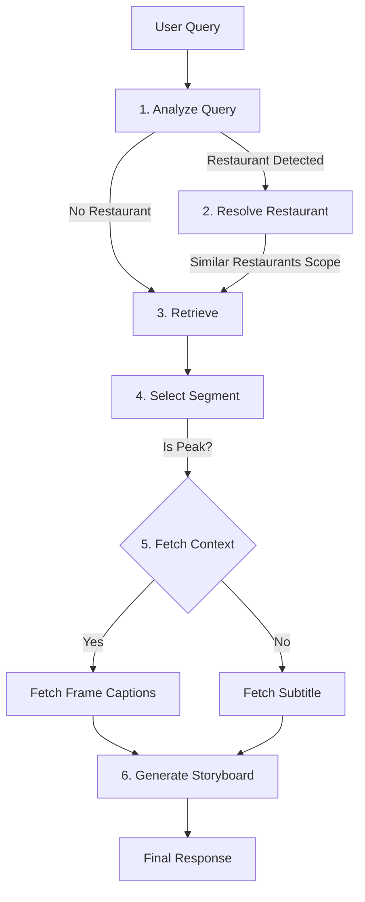

# 📊 Mukbang Storyboard Agent

> **Tzuyang Agentic Framework** - 쯔양 유튜브 콘텐츠 분석 및 스토리보드 생성 에이전트

## 🎯 목표

사용자가 먹방 콘텐츠를 기획할 때, 쯔양이 성공한 요인을 분석하고 구체적인 촬영 가이드(스토리보드)를 제공하는 에이전트.
자연어 질문을 분석하여 하이라이트 분석, 비교 분석, 스토리보드 생성 등 복합적인 작업을 수행합니다.

### 주요 기능
- **스토리보드 생성**: 맛집 촬영 전 촬영 구도, 멘트, 리액션 제안.
- **하이라이트 분석**: 조회수가 높은 구간의 시각적/청각적 특징 분석.
- **성과 비교**: 고성과 영상 vs 저성과 영상의 구조적 차이 비교.

---

## 🏗️ Architecture

### 1. Data Layer (Supabase)
두 가지 주요 벡터 저장소를 운영합니다:

1.  **`document_embeddings`** (Transcript): 음성 자막 데이터.
    -   메타데이터: `video_id`, `recollect_id`, `restaurants`, `is_peak`, `peak_score`.
2.  **`image_captions`** (Visual): 영상 프레임 시각적 설명 데이터.
    -   컬럼: `id`, `video_id`, `recollect_id`, `start_sec`, `end_sec`, `caption`, `embedding`.
    -   메타데이터: `is_peak` (조인 로직으로 파생).

### 2. Agent Workflow (LangGraph Storyboard Pipeline)



- **AnalyzeQuery**: 사용자 쿼리에서 음식점 이름이나 핵심 의도를 추출합니다.
- **ResolveRestaurant**: 
    - Supabase에서 음식점 정보를 조회하고, 동일 카테고리의 유사 맛집들까지 검색 범위를 확장합니다.
    - 이를 통해 "특정 가게"뿐만 아니라 "유사한 느낌의 다른 가게" 영상들에서도 좋은 구도를 찾아냅니다.
- **Retrieve**: 
    - Supabase에서 관련성 높은 영상 및 자막을 검색합니다. 
    - `ResolveRestaurant` 단계에서 범위가 좁혀졌다면, 해당 `video_id` 리스트 내에서만 검색하여 정확도를 높입니다.
    - `is_peak=True` 메타데이터를 우선순위로 둡니다.
- **SelectSegment**: 검색된 결과 중 가장 적합한 장면을 선정합니다.
- **FetchContext**: 
    - 선정된 장면이 Peak(하이라이트) 구간이라면, **프레임 캡셔닝 데이터**를 가져와 시각적 묘사를 강화합니다.
    - 일반 구간이라면 자막(Transcript) 내용을 사용합니다.
- **GenerateStoryboard**: 수집된 장면 정보와 시각적 묘사를 종합하여 구체적인 촬영 스토리보드를 생성합니다.

---

## 📁 파일 구조

```
backend/agent-rag/
├── app/
│   ├── agent.py                # Main LangGraph Agent
│   ├── retriever.py            # HybridRetriever (Cross-Modal)
│   ├── nodes/
│   │   ├── router.py           # Intent Classification
│   │   ├── analyzer.py         # Data Analysis Logic
│   │   └── synthesizer.py      # Response/Storyboard Generation
│   └── state.py                # AgentState
├── data/
│   └── tzuyang/
├── scripts/
│   ├── 01-add-restaurants-to-documents.py
│   ├── 02-add-peak-metadata.py
│   ├── 03-embed-and-store-supabase.py  # Transcript Embedding
│   └── 07-ingest-captions.py           # Caption Embedding (New)
└── README.md
```

## 📊 데이터 스키마

### `image_captions` Table (New)
| Column | Type | Description |
|--------|------|-------------|
| id | BIGINT | PK |
| video_id | TEXT | YouTube Video ID |
| recollect_id | INTEGER | 수집 ID |
| rank | INTEGER | 프레임 순번 |
| start_sec | FLOAT | 시작 시간 |
| end_sec | FLOAT | 종료 시간 |
| caption | TEXT | 시각적 설명 (LLaVA-NeXT-Video) |
| embedding | VECTOR(1536) | OpenAI Embedding |

---

## 🚀 워크플로우 예시

### 시나리오: "떡볶이 먹방 스토리보드 짜줘"
1.  **Router**: `generate_storyboard` 모드로 전환.
2.  **Retriever**:
    -   **Video Structure**: 조회수 높은 떡볶이 영상의 타임라인 구조 검색.
    -   **Visual Hooks**: "떡볶이 먹는 장면", "썸네일" 캡션 검색.
3.  **Analyzer**:
    -   성공 패턴 추출 (예: "가게 밖에서 5초 -> 메뉴판 3초 -> 음식 클로즈업 10초").
4.  **Synthesizer**:
    -   구체적인 샷 리스트, 카메라 앵글, 추천 멘트가 포함된 스토리보드 작성.

### 시나리오: "맛 표현 분석"
1.  **Router**: `analyze_highlight` 모드로 전환.
2.  **Retriever**:
    -   `is_peak=True` 필터로 자막("맛있다", "매콤하다") 및 캡션("눈을 감음", "엄지척") 검색.
3.  **Analyzer**:
    -   언어적 표현과 비언어적 표현(제스처)의 결합 패턴 분석.
4.  **Synthesizer**:
    -   "한 입 먹고 나서 3초간 침묵 후 '와'라고 감탄하며 카메라를 응시하세요" 등의 구체적 조언 제공.

---

## Next.js 챗봇 연동 가이드

`apps/web`의 관리자 인사이트 챗봇은 `STORYBOARD_AGENT_API_URL` 환경 변수가 설정되어 있으면 스토리보드 API를 우선 호출합니다.

예시 설정:

```env
STORYBOARD_AGENT_API_URL=http://localhost:8000
STORYBOARD_AGENT_CHAT_PATH=/chat
STORYBOARD_AGENT_TIMEOUT_MS=8000
```

에이전트 응답 본문에 `content` 필드(또는 `message`, `answer`, `response`, `output`) 하나만 있어도 처리됩니다.
`sources` 필드는 `[{ videoTitle, youtubeLink, timestamp, text }]` 형태를 지원합니다.

## 로컬 API 서버 실행

### 1) 패키지 설치

```bash
cd backend/storyboard-agent
pip install -r requirements.txt
```

추가로 벡터 검색 및 RAG 도구 실행을 위해 `numpy`, `langchain-core`, `supabase-py`,
`python-dotenv`가 필요합니다.

### 2) 환경 변수

`backend/storyboard-agent`에서 아래 환경 변수를 설정하세요.

```bash
PUBLIC_SUPABASE_URL=https://aqlcofblfxdrjhhdmarw.supabase.co
PUBLIC_SUPABASE_SERVICE_ROLE_KEY=<SUPABASE_SERVICE_ROLE_KEY>
STORYBOARD_AGENT_HOST=0.0.0.0
STORYBOARD_AGENT_PORT=8001
```

`tools.py`가 기존 환경 변수(`SUPABASE_URL`)를 그대로 사용하는 레포도 있으므로,
`STORYBOARD_AGENT` 서버는 `PUBLIC_SUPABASE_URL`/`PUBLIC_SUPABASE_SERVICE_ROLE_KEY`가 우선
사용되도록 매핑해 둡니다.

### 3) 서버 실행

```bash
python -m uvicorn src.server:app --app-dir . --host 0.0.0.0 --port 8001
```

또는 `src/server.py`의 `__main__` 블록 실행도 가능합니다.

```bash
python src/server.py
```

실행 후 `/health`와 `/chat` 엔드포인트를 확인할 수 있습니다.

```bash
curl http://localhost:8001/health
curl -X POST http://localhost:8001/chat \
  -H "Content-Type: application/json" \
  -d '{"message":"떡볶이 먹방 스토리보드 짜줘"}'
```
