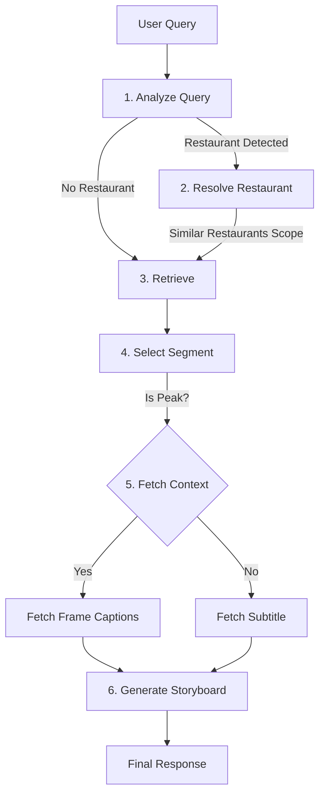

# 📊 Mukbang Storyboard Agent

## RAG worker capability and artifacts

Web and worker require an independently approved `STORYBOARD_RAG_WORKER_TOKEN`
(43-128 base64url characters). This is an inbound server-only capability, never a
Gemini egress key. Missing, malformed or reused provider credentials fail closed;
no token is generated by the launcher. All HTTP routes require the capability.
The Admin system-status helper uses this same connection validator and sends the
capability to `/health` and `/models?load=false`. Model readiness checks only worker
configuration; it does not verify paid-provider access, quota, or generation.
Retired `STORYBOARD_AGENT_API_URL` and BGE producers cannot satisfy the active RAG
readiness contract and are not probed. Existing response field names are retained
for consumers, with the BGE field explicitly disabled. The documents route (the
active ingestion/indexing caller) and search route both use `rag-worker-client`;
there is no separate active RAG HTTP indexer or caption caller in this source tree.
Historical scripts are retained and are not converted into new workers.

The default listener is loopback. Remote listeners require
`STORYBOARD_RAG_WORKER_TLS_CERT` and `STORYBOARD_RAG_WORKER_TLS_KEY`; proxy headers
are disabled, so forwarded HTTPS headers cannot bypass the transport boundary.
The web client accepts only HTTPS remote origins or loopback HTTP, rejects URL
credentials/query fragments, and refuses redirects. TLS configuration and any
network exposure remain operator actions, not authorized by this example.

Captioning additionally requires the worker-only absolute
`STORYBOARD_RAG_FRAME_ROOT`, a narrow approved image artifact directory. Existing
`framePaths` must name absolute children of that directory; arbitrary filesystem
paths, traversal, symlinks (including parent/root directories), hardlinks, special
files, MIME/signature mismatches and batches above 8 MiB are rejected before any
provider call. Reads use held directory descriptors and bounded file reads.
Unconfigured roots fail closed. No existing environment, credentials or grants
are changed by source configuration examples.

## 현재 실행 경로

신규 스토리보드는 Gemini 전용 outbound worker로 실행합니다. `apps/web`에서 `bun run storyboard:gemini-worker -- --help`로 현재 인자를 확인하세요. 기존 작업 토큰·프로젝트 사용 한도·관리자 편집 결과를 보존합니다.

RAG는 `scripts/run_rag_worker.py`를 통해 기존 worker URL에서 실행하며, `requirements-rag-worker.txt`의 가벼운 웹 의존성만 사용합니다. 임베딩은 `gemini-embedding-001`의 1024차원 정규화 벡터입니다. 모델·차원·task·정규화 지문으로 기존 벡터와 분리하며, 과거 문서는 원본 내용으로 조회할 수 있습니다. 재정렬은 Gemini 임베딩 cosine 방식으로 바뀌었으므로 과거 cross-encoder와의 품질 동등성을 주장하지 않습니다.

호출량은 크롤러와 같은 `GEMINI_BUDGET_PROJECT`, `GEMINI_BUDGET_PATH` 또는 `TZUDONG_PROVIDER_STATE_DIR`, `GEMINI_REQUESTS_PER_MINUTE`, `GEMINI_MAX_INFLIGHT` 설정으로 공유합니다. 기본 RPM 값은 내부 pacing 설정이며 확인된 공급자 쿼터가 아닙니다. 429 cooldown과 응답 유실 후 명시적 복구를 유지하고 다른 모델로 대체하지 않습니다.

`run-storyboard-agent.py`, `01-bge-embed-and-store-supabase.py`, `99-openai-embed-and-store-supabase.py` 및 이전 Codex/MLX/Ollama storyboard CLI는 실행 전에 retired 코드로 종료합니다. 기존 문서·임베딩·이미지와 데이터 이동 전용 스크립트는 보존합니다. 아래 LangGraph 구조는 과거 구현 참고 자료이며 신규 모델 실행 경로가 아닙니다.

> **Tzuyang Agentic Framework** - 쯔양 유튜브 콘텐츠 분석 및 스토리보드 생성 에이전트

## 🎯 목표

사용자가 먹방 콘텐츠를 기획할 때, 쯔양이 성공한 요인을 분석하고 구체적인 촬영 가이드(스토리보드)를 제공하는 에이전트.
자연어 질문을 분석하여 하이라이트 분석, 비교 분석, 스토리보드 생성 등 복합적인 작업을 수행합니다.

### 주요 기능
- **스토리보드 생성**: 맛집 촬영 전 촬영 구도, 멘트, 리액션 제안.
- **하이라이트 분석**: 조회수가 높은 구간의 시각적/청각적 특징 분석.
- **성과 비교**: 고성과 영상 vs 저성과 영상의 구조적 차이 비교.

---

## 🏗️ Architecture

### 1. Data Layer (Supabase)
두 가지 주요 벡터 저장소를 운영합니다:

1.  **`document_embeddings`** (Transcript): 음성 자막 데이터.
    -   메타데이터: `video_id`, `recollect_id`, `restaurants`, `is_peak`, `peak_score`.
2.  **`image_captions`** (Visual): 영상 프레임 시각적 설명 데이터.
    -   컬럼: `id`, `video_id`, `recollect_id`, `start_sec`, `end_sec`, `caption`, `embedding`.
    -   메타데이터: `is_peak` (조인 로직으로 파생).

### 2. Agent Workflow (LangGraph Storyboard Pipeline)


```mermaid
graph TD
    UserQuery[User Query] --> AnalyzeQuery[1. Analyze Query]
    
    AnalyzeQuery -->|Restaurant Detected| ResolveRestaurant[2. Resolve Restaurant]
    AnalyzeQuery -->|No Restaurant| Retrieve[3. Retrieve]
    
    ResolveRestaurant -->|Similar Restaurants Scope| Retrieve
    
    Retrieve --> SelectSegment[4. Select Segment]
    
    SelectSegment -->|Is Peak?| FetchContext{5. Fetch Context}
    
    FetchContext -->|Yes| FetchFrame[Fetch Frame Captions]
    FetchContext -->|No| FetchTranscript[Fetch Subtitle]
    
    FetchFrame --> GenerateStoryboard[6. Generate Storyboard]
    FetchTranscript --> GenerateStoryboard
    
    GenerateStoryboard --> Output[Final Response]
```

- **AnalyzeQuery**: 사용자 쿼리에서 음식점 이름이나 핵심 의도를 추출합니다.
- **ResolveRestaurant**: 
    - Supabase에서 음식점 정보를 조회하고, 동일 카테고리의 유사 맛집들까지 검색 범위를 확장합니다.
    - 이를 통해 "특정 가게"뿐만 아니라 "유사한 느낌의 다른 가게" 영상들에서도 좋은 구도를 찾아냅니다.
- **Retrieve**: 
    - Supabase에서 관련성 높은 영상 및 자막을 검색합니다. 
    - `ResolveRestaurant` 단계에서 범위가 좁혀졌다면, 해당 `video_id` 리스트 내에서만 검색하여 정확도를 높입니다.
    - `is_peak=True` 메타데이터를 우선순위로 둡니다.
- **SelectSegment**: 검색된 결과 중 가장 적합한 장면을 선정합니다.
- **FetchContext**: 
    - 선정된 장면이 Peak(하이라이트) 구간이라면, **프레임 캡셔닝 데이터**를 가져와 시각적 묘사를 강화합니다.
    - 일반 구간이라면 자막(Transcript) 내용을 사용합니다.
- **GenerateStoryboard**: 수집된 장면 정보와 시각적 묘사를 종합하여 구체적인 촬영 스토리보드를 생성합니다.

---

## 📁 파일 구조

```
backend/agent-rag/
├── app/
│   ├── agent.py                # Main LangGraph Agent
│   ├── retriever.py            # HybridRetriever (Cross-Modal)
│   ├── nodes/
│   │   ├── router.py           # Intent Classification
│   │   ├── analyzer.py         # Data Analysis Logic
│   │   └── synthesizer.py      # Response/Storyboard Generation
│   └── state.py                # AgentState
├── data/
│   └── tzuyang/
├── scripts/
│   ├── 01-add-restaurants-to-documents.py
│   ├── 02-add-peak-metadata.py
│   ├── 03-embed-and-store-supabase.py  # Transcript Embedding
│   └── 07-ingest-captions.py           # Caption Embedding (New)
└── README.md
```

## 📊 데이터 스키마

### `image_captions` Table (New)
| Column | Type | Description |
|--------|------|-------------|
| id | BIGINT | PK |
| video_id | TEXT | YouTube Video ID |
| recollect_id | INTEGER | 수집 ID |
| rank | INTEGER | 프레임 순번 |
| start_sec | FLOAT | 시작 시간 |
| end_sec | FLOAT | 종료 시간 |
| caption | TEXT | 시각적 설명 (LLaVA-NeXT-Video) |
| embedding | VECTOR(1536) | OpenAI Embedding |

---

## 🚀 워크플로우 예시

### 시나리오: "떡볶이 먹방 스토리보드 짜줘"
1.  **Router**: `generate_storyboard` 모드로 전환.
2.  **Retriever**:
    -   **Video Structure**: 조회수 높은 떡볶이 영상의 타임라인 구조 검색.
    -   **Visual Hooks**: "떡볶이 먹는 장면", "썸네일" 캡션 검색.
3.  **Analyzer**:
    -   성공 패턴 추출 (예: "가게 밖에서 5초 -> 메뉴판 3초 -> 음식 클로즈업 10초").
4.  **Synthesizer**:
    -   구체적인 샷 리스트, 카메라 앵글, 추천 멘트가 포함된 스토리보드 작성.

### 시나리오: "맛 표현 분석"
1.  **Router**: `analyze_highlight` 모드로 전환.
2.  **Retriever**:
    -   `is_peak=True` 필터로 자막("맛있다", "매콤하다") 및 캡션("눈을 감음", "엄지척") 검색.
3.  **Analyzer**:
    -   언어적 표현과 비언어적 표현(제스처)의 결합 패턴 분석.
4.  **Synthesizer**:
    -   "한 입 먹고 나서 3초간 침묵 후 '와'라고 감탄하며 카메라를 응시하세요" 등의 구체적 조언 제공.
