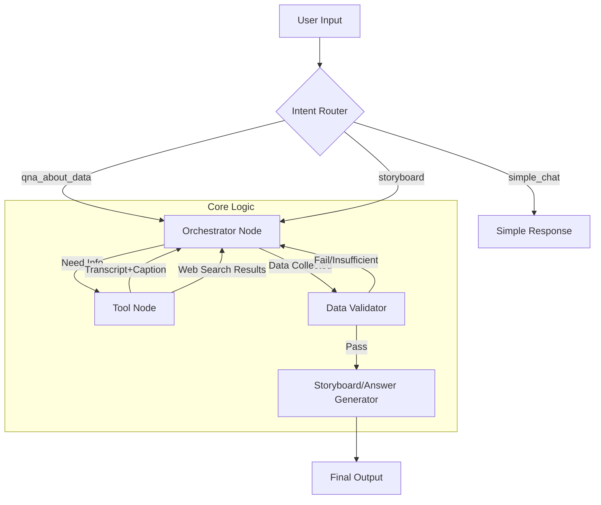

# Storyboard Agent Design (LangGraph Architecture)

이 문서는 LangGraph 기반의 "먹방 스토리보드 제작 에이전트" 아키텍처 및 상세 설계를 기술합니다.
사용자의 모호한 요구 사항을 처리하고, 내부 데이터(DB)와 외부 데이터(Web)를 유연하게 활용하여 최적의 스토리보드를 생성하는 것을 목표로 합니다.

## 1. 시스템 개요 (System Overview)

- **목적**: 사용자 입력(키워드, 상황, 분위기 등)을 분석하여 영상 기획에 필요한 구체적인 스토리보드(씬 구성, 자막, 촬영 구도 등)를 제안합니다.
- **핵심 기술**: LangGraph (순환형 에이전트 구조), Vector Search (의미 검색), RAG (검색 증강 생성).
- **데이터 소스**:
    - **Internal DB**: `restaurants` (음식점명, 카테고리 정보), `videos` (조회수, 메타데이터), `transcript_embeddings_bge` (자막 벡터), `video_frame_captions`.
    - **External**: Web Search.

---

## 2. 아키텍처 흐름 (Architecture Flow)

복잡한 의존성(예: "조회수 확인 후 -> 해당 영상의 자막 검색 -> 부족하면 카테고리 확장")을 처리하기 위해 **중앙 제어형 오케스트레이터(Orchestrator)** 모델을 채택합니다.

### 핵심 변경 사항
- **기존**: Router가 처음에 경로를 정하면 바꾸기 어려운 선형 구조.
- **변경**: **Orchestrator Agent**가 중심에서 상황(State)을 판단하여 도구(Tools)를 동적으로 꺼내 쓰는 **Loop 구조**.

```text
[Start] --> [Intent Router]
                 |
      +----------+---------------------------+
      | (Simple Chat)                        | (Q&A / Storyboard)
      v                                      v
[Simple Chat]                    +--> [Orchestrator] <---------------------------------------------+
      |                          |       /      ^                                                  |
      v                          |    (Call)  (Result)                                             |
    [End]                        |     /        |                                                  |
                                 |    v         |                                                  |
                                 |  [Tools Node]+ ───────────────────────────────────────────+   |
                                 |   │                                                         |   |
                                 |   │  ┌─────────────────────────────────────────────────┐   |   |
                                 |   │  │ 📊 메타/필터링                                   │   |   |
                                 |   │  │  • get_video_metadata_filtered (조회수/인기순)  │   |   |
                                 |   │  └─────────────────────────────────────────────────┘   |   |
                                 |   │                                                         |   |
                                 |   │  ┌─────────────────────────────────────────────────┐   |   |
                                 |   │  │ 🔍 검색 도구                                     │   |   |
                                 |   │  │  • search_transcripts_hybrid (자막+캡션 자동)   │   |   |
                                 |   │  └─────────────────────────────────────────────────┘   |   |
                                 |   │                                                         |   |
                                 |   │  ┌─────────────────────────────────────────────────┐   |   |
                                 |   │  │ 🍽️ 음식점 도구                                   │   |   |
                                 |   │  │  • get_all_approved_restaurant_names (전체 목록) │   |   |
                                 |   │  │  • search_restaurants_by_name (이름 검색)        │   |   |
                                 |   │  │  • search_restaurants_by_category (카테고리)     │   |   |
                                 |   │  │  • get_categories_by_restaurant (카테고리 역조회)│   |   |
                                 |   │  └─────────────────────────────────────────────────┘   |   |
                                 |   │                                                         |   |
                                 |   │  ┌─────────────────────────────────────────────────┐   |   |
                                 |   │  │ 🌐 외부 검색                                     │   |   |
                                 |   │  │  • web_search (Tavily 웹 검색)                  │   |   |
                                 |   │  └─────────────────────────────────────────────────┘   |   |
                                 |   │                                                         |   |
                                 |   └───────────────────────────────────────────────────────────+   |
                                 |                                                                 |
                                 +--(Finish)--> [Mode Check]                                       |
                                                  /      \                                         |
                                            (Q&A)         (Storyboard)                             |
                                              |                |                                   |
                                              v                v                                   |
                                       [Gen Answer]     [Data Validator]                           |
                                              |           /        \                               |
                                              v        (Pass)     (Fail)                           |
                                            [End]        |           \                             |
                                                         v            v                            |
                                                  [Storyboard]   [Query Refiner]                   |
                                                  [ Generator]    /           \                    |
                                                         |  (Still Fail)     (Retry) --------------+
                                                         v       |                                 |
                                                       [End]     v                                 |
                                                           [Human Request]                         |
                                                                 |                                 |
                                                                 +---------------------------------+
```

### 도구 호출 흐름 예시

```text
사용자: "조회수 높은 떡볶이 먹방 참고해서 짜줘"

[Orchestrator Loop]
  │
  ├─ Turn 1: "조회수 필터링 필요"
  │   └─ Call: get_video_metadata_filtered(order_by='view_count')
  │   └─ Result: 상위 영상 목록 (video_id: A, B, C)
  │
  ├─ Turn 2: "자막에서 떡볶이 관련 내용 검색 + 캡션 자동 보강"
  │   └─ Call: search_transcripts_hybrid("떡볶이 먹방", intent="storyboard")
  │   └─ Result: 관련 자막 청크 + is_peak=True 구간의 캡션 자동 포함
  │
  └─ Turn 3: "정보 충분" → Finish
       └─ → [Data Validator] → [Storyboard Generator]
```


### F. Query Refiner (자동 재검색)
- **역할**: Validator(검증기)가 "정보 부족" 판정을 내렸을 때, 즉시 포기하지 않고 검색어를 수정합니다.
- **전략**:
    - "매운거" -> "불닭볶음면, 엽기떡볶이" (구체화)
    - "쯔양 뭐 먹었지" -> "쯔양 최신 영상 목록" (도구 변경)
    - **Self-Correction Loop**: 최대 3회까지 스스로 재시도합니다.
- **실패 판단 (Still Fail)**:
    - **조건 1**: `retry_count >= 3` (3번 고쳐도 Validator 통과 못함)
    - **조건 2**: Refiner가 "더 이상 검색할 키워드가 없음"이라고 판단할 때.
    - -> 이 경우 **Human Request**로 넘어갑니다.

### G. Human Request (사용자 질문)
- **역할**: Query Refiner로도 해결되지 않을 때, 또는 사용자 취향 결정이 필요할 때 실행됩니다.
- **행동**: "검색 결과가 없습니다. 혹시 특정 식당을 원하시나요?"라고 되묻고, 사용자의 답변을 받아 다시 Orchestrator로 전달합니다.

### D. Data Validator (검증기)
- **역할**: Orchestrator가 생각하기를 멈췄을 때, 정말로 충분한지 검사하는 '비평가(Critic)' 역할.
- **흐름**:
    - **Pass** -> Generator로 이동.
    - **Fail (Recoverable)** -> Query Refiner로 이동 (검색어 변경).
    - **Fail (Unrecoverable/Ambiguous)** -> Human Request로 이동 (사용자 질문).

### 상세 시나리오 흐름 (Scenario)

#### 시나리오 1: "조회수 높은 떡볶이 먹방 참고해서 짜줘"
1. **Router**: 'Storyboard Plan'으로 분류 -> **Orchestrator** 진입.
2. **Orchestrator (Turn 1)**: "조회수 정보가 먼저 필요하군." -> **`get_video_meta(sort='view')`** 호출.
3. **Tools**: 상위 3개 영상 정보(ID, Title 등) 반환.
4. **Orchestrator (Turn 2)**: "ID를 확보했으니 이제 내용을 보자." -> **`search_transcripts(filter_ids=[...])`** 호출.
5. **Tools**: 자막 및 Peak 구간 캡션 반환.
6. **Orchestrator (Turn 3)**: "정보가 충분하다." -> 종료 신호.
7. **Validator**: Pass.
8. **Generator**: 스토리보드 작성.

#### 시나리오 2: "요즘 유행하는 마라탕 챌린지 좀 찾아줘"
1. **Orchestrator**: "내부 DB에는 최신 유행 정보가 없을 거야." -> **`search_web("latest maratang challenge trend")`** 호출.
2. **Tools**: 웹 검색 결과 반환.
3. **Validator**: Pass.
4. **Generator**: 트렌드 기반 기획안 작성.

---

## 3. 노드별 상세 기능 (Node Details)

### A. Intent Router (가벼운 분류기)
- **역할**: 비싼 Orchestrator를 호출할지, 가벼운 잡담을 할지 결정.
- **도구**: LLM (gpt-4o-mini 등 light model).

### B. Orchestrator Agent (중앙 지휘관)
- **역할**: 현재 State(대화 기록, 수집된 데이터)를 보고 **"다음에 무엇을 할지"** 결정합니다.
- **특징**: 반복(Loop)하며 필요한 데이터를 단계적으로 수집합니다.
- **Logic**:
    - 입력에 '조회수', '인기' 키워드 -> `video_meta` 도구 우선 호출.
    - 입력에 '특정 장면' 묘사 -> `transcript` 도구 호출.
    - 내부 데이터 결과가 없거나 부족 -> `web_search` 도구 호출.
    - 검색 결과가 부족하지만 카테고리 확장이 가능해 보일 때 -> `search_by_category` 도구 호출.

### C. Tools Node (도구 모음)
실제 기능을 수행하는 함수들의 집합입니다. 각 도구는 Supabase RPC 함수를 호출합니다.

#### 도구 목록

| # | 도구명 | 용도 | 언제 사용? |
|---|--------|------|-----------|
| 1 | `search_transcripts_hybrid` | 하이브리드 자막 검색 (Dense 0.6 + Sparse 0.4 + MMR + Reranking) | 키워드/문장으로 관련 영상 자막 검색 (캡션 자동 포함) |
| 2 | `search_restaurants_by_category` | 카테고리별 음식점 검색 | "냉면집 추천" → 냉면 카테고리 음식점 조회 |
| 3 | `get_video_metadata_filtered` | 조회수/게시일 기반 비디오 필터링 | "인기 영상", "최신 영상" 요청 시 |
| 4 | `get_categories_by_restaurant` | 음식점→카테고리 역조회 | 카테고리 확장 검색 시 (냉면→면류→칼국수) |
| 5 | `search_restaurants_by_name` | 음식점명 검색 | 사용자가 특정 식당 언급 시 |
| 6 | `get_all_approved_restaurant_names` | 전체 승인 음식점명 목록 | LLM이 사용자 입력에서 음식점명 추출 시 참조 |
| 7 | `web_search` | Tavily 웹 검색 (External) | **최신 트렌드, 내부 DB에 없는 정보, Validator 실패 시 보충** |
#### 도구별 상세 설명

1. **`search_transcripts_hybrid`** (하이브리드 자막 검색 + 자동 캡션)
   - 입력: 쿼리 문자열, dense_weight(기본 0.6), match_count, mmr_k, mmr_diversity, rerank_top_k, **intent**
   - 출력: 재순위화된 자막 청크 (video_id, page_content, metadata, rerank_score)
   - **검색 파이프라인**:
     1. **Dense + Sparse 하이브리드**: Dense(0.6) + Sparse(0.4) 가중 결합
     2. **MMR (Maximal Marginal Relevance)**: 다양성 확보 (중복 결과 제거)
     3. **BGE-reranker-v2-m3**: 최종 재순위화
   - **자동 캡션 보강**: `intent='storyboard'`로 호출 시, `is_peak=True`인 구간에 대해 내부적으로 `get_video_captions_for_range`를 호출하여 캡션을 `metadata['caption']`에 포함합니다.

2. **`search_restaurants_by_category`** (카테고리 검색)
   - 입력: 카테고리명 (예: "치킨", "중식")
   - 출력: 해당 카테고리의 승인된 음식점 목록 (youtube_link 포함)
   - **활용**: 검색 결과의 video_id로 자막 검색을 연계할 수 있습니다.

4. **`get_video_metadata_filtered`** (메타데이터 필터링)
   - 입력: 최소 조회수, 반환 개수, 정렬 기준
   - 출력: 필터링된 비디오 목록 (view_count, published_at 등)
   - **정렬 옵션**: `view_count`, `published_at`, `comment_count`

5. **`get_categories_by_restaurant`** (카테고리 역조회)
   - 입력: 음식점명 또는 video_id
   - 출력: 해당 음식점의 카테고리 배열
   - **확장 검색**: "엽기떡볶이" → ["떡볶이", "분식"] → 분식 카테고리로 추가 검색

6. **`search_restaurants_by_name`** (음식점명 검색)
   - 입력: 검색 키워드 (부분 일치)
   - 출력: 매칭된 음식점 정보 (tzuyang_review 포함)

7. **`get_all_approved_restaurant_names`** (음식점명 목록)
   - 입력: 없음
   - 출력: 전체 승인 음식점명 + 카테고리
   - **LLM 참조용**: 사용자 입력에서 음식점명을 추출할 때 이 목록과 대조합니다.

8. **`web_search`** (Tavily 웹 검색)
   - 입력: 검색 쿼리
   - 출력: 웹 검색 결과 (최대 5개)
   - **활용**: 최신 트렌드, 내부 DB에 없는 정보 검색 시 사용합니다.

#### 도구 조합 시나리오

```text
시나리오 A: "조회수 높은 떡볶이 먹방 참고해서 짜줘"
───────────────────────────────────────────────
1. get_video_metadata_filtered(order_by='view_count') → 인기 영상 목록
2. search_transcripts_hybrid("떡볶이", intent="storyboard") → 하이브리드 검색 + 캡션 자동 포함

시나리오 B: "엽기떡볶이 나온 영상 찾아줘"
───────────────────────────────────────────────
1. get_all_approved_restaurant_names() → 음식점명 목록 (LLM 매칭 참조)
2. search_restaurants_by_name("엽기떡볶이") → 음식점 정보 + video_id
3. search_transcripts_hybrid + video_id 필터 → 해당 영상 자막

시나리오 C: "냉면 먹방 기획안 짜줘" (결과 부족 시)
───────────────────────────────────────────────
1. search_transcripts_hybrid("냉면") → 결과 부족
2. search_restaurants_by_category("냉면") → 냉면집 목록
3. get_categories_by_restaurant(음식점) → ["면류"] 추출
4. search_restaurants_by_category("칼국수") → 관련 확장 검색

시나리오 D: "요즘 유행하는 마라탕 챌린지" (외부 정보 필요)
───────────────────────────────────────────────
1. search_transcripts_hybrid("마라탕 챌린지") → 내부 결과 부족
2. web_search("마라탕 챌린지 트렌드") → 최신 웹 정보
3. Generator에서 외부 정보 + 내부 데이터 결합
```

### D. Data Validator (검증기)

Storyboard 모드에서 데이터 충분성을 판단합니다.

**충분성 기준:**
| 조건 | 판정 | 다음 행동 |
|------|------|----------|
| 캡션 있는 자막 ≥ 3개 | **충분** | Generator (캡션 없는 자막 제거) |
| 캡션 있는 자막 < 3개 + 웹검색으로 커버 가능 | **충분** | Generator (캡션 없는 자막 제거) |
| 캡션 있는 자막 < 3개 + 웹검색 부족 + retry < 3 | **부족** | Orchestrator (재검색) |
| 재검색 후에도 부족 (retry ≥ 3) | **부족** | **Human Request** |

**Generator 전달 전 처리:**
- 캡션 없는 자막은 모두 제거
- 캡션 있는 자막 + 웹검색 결과만 Generator에 전달

---

### E. Human Request (사용자 질문)

재검색 후에도 데이터가 부족할 때 실행됩니다.

**출력 예시:**
```
현재 수집된 정보:
- 캡션 있는 자막: 2개
- 웹검색 결과: 1개

[요약]
- 떡볶이 먹방 관련 자막 일부 확보
- 시각적 묘사가 부족함

어떻게 할까요?
1. 다시 검색 (검색어를 알려주세요)
2. 현재 정보로 스토리보드 생성
```

**사용자 답변에 따른 흐름:**
- "1" 또는 검색어 입력 → `human_feedback`에 저장 → Orchestrator로 돌아가 재검색
- "2" → 현재 데이터 + 사용자 의도로 바로 Generator

---

### F. Storyboard Generator (생성기)
- **입력**: 캡션 있는 자막 + 웹검색 결과 (캡션 없는 자막 제외)
- **역할**: 최종 포맷(씬/비디오/오디오/연출)에 맞춰 구조화된 스토리보드 생성

---

## 4. 데이터 처리 로직 (Data Processing Logic)

### 오케스트레이터의 도구 사용 전략

1. **상호 보완적 검색**:
    - 자막 검색(`search_transcripts`) 결과가 좋으면 거기서 멈춥니다.
    - 결과가 없으면 `web_search`를 부르거나, `search_restaurants_by_category`로 범위를 넓힙니다.

2. **데이터 결합 자동화**:
    - `search_transcripts` 도구 내부에서 `is_peak=True`인 구간에 대해 자동으로 `fetch_video_caption`을 수행하거나,
    - Orchestrator가 별도 호출 없이 데이터를 한 번에 가져오도록 도구를 설계합니다.


### 3. State Schema (Updated)

LangGraph에서 관리할 에이전트의 상태(`AgentState`) 정의입니다. 데이터의 성격에 따라 저장소를 분리하여 관리합니다.

```python
class AgentState(TypedDict):
    # 1. 대화 히스토리 (ID 기반 병합)
    messages: Annotated[List[BaseMessage], add_messages]
    
    # 2. 흐름 제어
    intent: Literal["simple_chat", "qna_about_data", "storyboard"]
    loop_count: int
    retry_count: int
    
    # 3. 수집된 데이터 (분리 관리)
    # (1) 자막 + 캡션 (Scene 데이터)
    # - search_transcripts_hybrid 도구가 자막과 캡션을 묶어서(Pairing) 반환함
    # - 중복 제거 후 누적 (video_id + chunk_index 기준)
    transcript_docs: List[Document]  # 중복 제거 로직은 Orchestrator에서 처리
    
    # (2) 웹 검색 결과 (보충 정보)
    # - 부족한 배경지식이나 외부 정보를 보강하기 위함
    # - 요약 없이 원본(또는 발췌본)을 저장하여 정보 손실 방지
    web_search_docs: Annotated[List[Document], operator.add]
    
    # 4. 검증 피드백
    validation_status: Literal["pass", "fail", "pending"]
    validation_feedback: Optional[str]
    
    # 5. 쿼리 & 피드백
    active_query: Optional[str]
    human_feedback: Optional[str]
    
    # 6. 최종 출력
    final_output: Optional[str]
```

---

### 4. Node & Flow Architecture

에이전트의 실행 흐름은 **Orchestrator-Workers** 패턴을 따르며, 데이터 수집과 검증을 반복합니다.



#### 4.1. Orchestrator Node
-   **역할**: 현재 상태(`transcript_docs`, `web_search_docs` 유무)를 보고 다음 행동을 결정합니다.
-   **로직**:
    1.  데이터가 비어있으면 -> `search_transcripts_hybrid` 우선 호출.
    2.  자막/캡션은 본 것 같은데 내용이 부족하면 -> `search_transcripts_hybrid` (쿼리 수정) 또는 `web_search` 호출.
    3.  충분해 보이면 -> `Validator` 호출.

#### 4.2. Tool Execution (Auto-Captioning)
-   **핵심 변경**: 에이전트가 직접 `get_video_captions`를 호출하지 않습니다.
-   **`search_transcripts_hybrid`**:
    -   `intent='storyboard'` 모드로 호출되면, 검색된 자막 중 중요 구간(`is_peak=True`)에 대해 **자동으로 캡션을 조회**하여 메타데이터에 포함합니다.
    -   결과적으로 `transcript_docs`에는 "자막 + 시각 묘사"가 세트로 들어갑니다.

#### 4.3. Data Validator
-   수집된 `transcript_docs`와 `web_search_docs`를 평가합니다.
-   **체크리스트**:
    -   [ ] 자막 분량이 스토리보드 구성에 충분한가?
    -   [ ] `is_peak` 구간에 대한 캡션(시각 정보)이 확보되었는가? (Scene 구성 가능 여부)
    -   [ ] (필요시) 외부 정보(`web_search_docs`)가 보강되었는가?
-   실패 시 피드백(`validation_feedback`)을 남겨 Orchestrator가 재검색하도록 유도합니다.

#### 4.4. Generator Node
-   **Storyboard 모드**:
    -   `transcript_docs`의 각 항목(자막+캡션)을 활용하여 **영상 기획안(Storyboard)**을 작성합니다.
    -   캡션이 있는 구간은 구체적인 시각 묘사를 포함하고, 없는 구간은 오디오 위주의 연출을 제안합니다.
    -   필요시 `web_search_docs`의 정보를 참고하여 배경 설명이나 맥락을 보강합니다.
