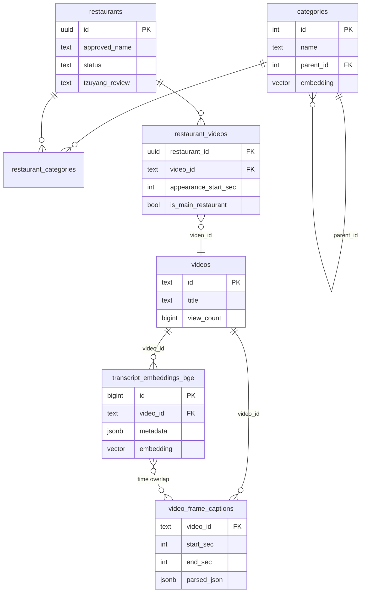

# Storyboard Agent 고도화 설계 (Legacy Draft)

> 이 문서는 초기 구상/아이디어 초안입니다.  
> 현재 구현 기준 최신 설계는 `STORYBOARD_NEXT_STEP_DESIGN_v2.md`를 사용하세요.

현재 에이전트의 다음 단계 개선 사항을 정리한다. 핵심 축은 세 가지:
1. **슬롯 필링 기반 에이전트 루프** — 사용자 의도 + 콘텐츠 요소를 구조적으로 수집
2. **에이전트 설계 개선** — Orchestrator 분리, Validator 강화, 비용 절감
3. **데이터/인덱싱 고도화** — Knowledge Graph, 캡션 벡터화, Heatmap 활용

---

## 1. 슬롯 필링 기반 에이전트 루프

### 1.1 개요

현재 에이전트는 사용자 입력을 받자마자 Orchestrator가 자유롭게 검색을 시작한다.
**무엇을 모아야 스토리보드를 만들 수 있는지** 명시적 목표 없이 "3개 이상 모이면 통과"라는 단순 기준.

슬롯 필링을 도입하면:
- **사용자 의도 슬롯**: 어떤 스토리보드를 원하는지 구조적 파악
- **콘텐츠 슬롯**: 스토리보드 씬 구성에 필요한 데이터 요소를 체크리스트로 관리
- Validator가 "슬롯이 얼마나 채워졌는가"로 판단 → 목표 지향적 루프

### 1.2 사용자 의도 슬롯 (Intent Slots)

Intent Router → **Slot Extractor** → Orchestrator 순서로 진입.

```python
class StoryboardSlots(BaseModel):
    """사용자 요청에서 추출할 기획 의도"""
    food_keyword: str = Field(description="음식/메뉴 키워드 (필수)")
    tone: Optional[str] = Field(
        default=None,
        description="분위기: ASMR, 리액션, 챌린지, 브이로그, 먹방 등"
    )
    format: Literal["shorts", "long", "unknown"] = Field(default="unknown")
    scene_count: Optional[int] = Field(
        default=None, description="요청된 씬 개수 (기본 6~8)"
    )
    restaurant_name: Optional[str] = Field(
        default=None, description="특정 음식점명 언급 시"
    )
    reference_style: Optional[str] = Field(
        default=None, description="참고 스타일 (예: 쯔양 스타일, 하이라이트 편집 등)"
    )
    additional_request: Optional[str] = Field(
        default=None, description="추가 요청 사항"
    )
    is_complete: bool = Field(
        description="스토리보드 제작을 시작하기에 충분한 정보가 있는가"
    )
    missing_info: Optional[str] = Field(
        default=None, description="부족한 정보가 있다면 설명"
    )
```

**동작**:
1. LLM(`gpt-4o-mini`)이 사용자 입력에서 슬롯 추출
2. `food_keyword`만 필수. 나머지는 LLM이 합리적 기본값 추론
3. `is_complete == False`이면 `interrupt`로 부족한 정보 한 번에 질문
4. 한 번의 왕복으로 해결. 여러 번 물어보지 않는다

### 1.3 콘텐츠 슬롯 (Content Slots)

스토리보드를 구성하려면 아래 **콘텐츠 요소**가 필요하다.
Orchestrator가 데이터를 수집할 때, 이 슬롯들을 채우는 것을 목표로 삼는다.

```python
class ContentSlots(BaseModel):
    """스토리보드 씬 구성에 필요한 콘텐츠 요소"""
    # 시각 자료 (캡션 기반)
    visual_references: list[str] = Field(
        default_factory=list,
        description="촬영 구도/피사체 묘사 (캡션에서 추출). 최소 3개"
    )
    # 대사/리액션 자료 (자막 기반)
    dialogue_samples: list[str] = Field(
        default_factory=list,
        description="유튜버 대사, 리액션 표현 샘플. 최소 2개"
    )
    # 음식 정보
    food_details: Optional[str] = Field(
        default=None,
        description="해당 음식의 특징, 조리법, 비주얼 포인트"
    )
    # 인기 장면 정보
    peak_scene_info: list[str] = Field(
        default_factory=list,
        description="시청자가 많이 재시청한 장면 정보"
    )
    # 트렌드/배경 정보
    trend_context: Optional[str] = Field(
        default=None,
        description="관련 트렌드, 챌린지, 시즌 이슈 (웹 검색)"
    )
    # 음식점 정보
    restaurant_info: Optional[str] = Field(
        default=None,
        description="음식점명, 카테고리, 리뷰 요약"
    )
```

**슬롯 충족 기준** (Validator에서 사용):

| 슬롯 | 필수 여부 | 최소 기준 |
|------|-----------|-----------|
| `visual_references` | 필수 | 3개 이상 |
| `dialogue_samples` | 필수 | 2개 이상 |
| `food_details` | 권장 | 1개 |
| `peak_scene_info` | 권장 | 1개 |
| `trend_context` | 선택 | 0개 가능 |
| `restaurant_info` | 선택 | 0개 가능 |

### 1.4 수정된 그래프 흐름

```text
[Start] --> [Intent Router]
                 |
      +----------+---------------------------+
      | (simple_chat)                        | (qna / storyboard)
      v                                      v
[Simple Response]              [Slot Extractor] <------+
      |                         /          \           |
      v                (complete)    (incomplete)      |
    [End]                  |              |            |
                           v              v            |
                   [Orchestrator] <--[Human:슬롯질문]  |
                    /      ^                           |
              (Need Data)  |                           |
                  /        |                           |
                 v         |                           |
           [Tools Node] --+                            |
                 |                                     |
                 v                                     |
         [Content Slot Evaluator] ---(fail)---> [Orchestrator]
                 |                                     |
            (pass)  (need_human)                       |
              |          |                             |
              v          v                             |
      [Route by Intent]  [Human Request] -----(재검색)-+
         |         |          |
         v         v          v (진행)
   [Generator] [QnA]    [Route by Intent]
         |         |          |         |
         v         v          v         v
       [End]     [End]   [Generator]  [QnA]
```

**핵심 변경**:
1. `Slot Extractor` 노드 추가 (Intent Router 직후)
2. `validate_data` → `Content Slot Evaluator`로 교체: 개수 기반이 아닌 **슬롯 충족도** 기반
3. Orchestrator 프롬프트에 현재 슬롯 상태 주입 → "visual_references 2개 부족, peak_scene_info 필요" 등 구체적 지시

### 1.5 Content Slot Evaluator 구현

기존 개수 기반 Validator를 **LLM 기반 Self-RAG 패턴**으로 교체.

```python
class SlotEvaluation(BaseModel):
    """콘텐츠 슬롯 충족도 평가"""
    visual_count: int = Field(description="확보된 시각 자료 수")
    dialogue_count: int = Field(description="확보된 대사 샘플 수")
    has_food_details: bool
    has_peak_info: bool
    overall_status: Literal["pass", "fail", "need_human"]
    missing_elements: list[str] = Field(
        default_factory=list,
        description="부족한 요소 목록"
    )
    search_suggestion: Optional[str] = Field(
        default=None,
        description="재검색 시 추천 전략"
    )

def content_slot_evaluator(state: AgentState) -> dict:
    slots = state.get("slots", {})
    transcript_docs = state.get("transcript_docs", []) or []
    web_search_docs = state.get("web_search_docs", []) or []
    retry_count = state.get("retry_count", 0)

    # LLM에게 현재 데이터와 슬롯을 보여주고 평가 요청
    evaluation = llm_mini.with_structured_output(SlotEvaluation).invoke(
        f"""아래 데이터로 '{slots.get("food_keyword", "")}'
분위기 '{slots.get("tone", "기본 먹방")}'의
스토리보드를 만들 수 있는지 평가하세요.

[수집된 자막+캡션 {len(transcript_docs)}개]
{format_docs_summary(transcript_docs)}

[웹 검색 {len(web_search_docs)}건]
{format_docs_summary(web_search_docs)}

평가 기준:
- 시각 자료(캡션): 최소 3개
- 대사 샘플: 최소 2개
- 데이터가 사용자 요청과 관련이 있는가?"""
    )

    if evaluation.overall_status == "pass":
        return {"validation_status": "pass", "content_slots": evaluation.dict()}

    if retry_count >= 3:
        return {
            "validation_status": "need_human",
            "validation_feedback": f"부족: {', '.join(evaluation.missing_elements)}",
            "content_slots": evaluation.dict(),
        }

    return {
        "validation_status": "fail",
        "validation_feedback": evaluation.search_suggestion,
        "retry_count": retry_count + 1,
        "content_slots": evaluation.dict(),
    }
```

### 1.6 Generator에 슬롯 정보 주입

Generator 프롬프트에 추출된 슬롯 정보를 명시적으로 전달:

```python
# Generator 시스템 프롬프트에 추가
"""
[기획 의도]
- 음식: {slots.food_keyword}
- 분위기: {slots.tone or '기본 먹방'}
- 포맷: {slots.format}
- 씬 개수: {slots.scene_count or '6~8'}
- 참고 스타일: {slots.reference_style or '없음'}
- 추가 요청: {slots.additional_request or '없음'}
"""
```

이로써 Generator가 단순 데이터 나열이 아닌, **사용자 의도에 정확히 맞는** 스토리보드를 생성한다.

---

## 2. 에이전트 설계 개선

### 2.1 Orchestrator 분리

현재 하나의 `orchestrator()` 함수가 수행하는 역할:
- Tool 결과 파싱 → State 업데이트
- 프롬프트 구성 → LLM 호출
- 다음 행동 결정

**변경**: `tool_result_parser` 노드를 분리.

```text
Tools → tool_result_parser → Orchestrator
```

`tool_result_parser`가 ToolMessage를 파싱하여 `transcript_docs`, `web_search_docs` 업데이트.
Orchestrator는 현재 슬롯 상태만 보고 "다음에 어떤 도구를 쓸지" 결정에만 집중.

### 2.2 메시지 윈도우 관리

매 턴 전체 `messages`를 LLM에 보내는 대신:

```python
def get_windowed_messages(state: AgentState, window: int = 6) -> list:
    messages = state["messages"]
    # SystemMessage는 항상 포함, 최근 window개 메시지만
    return [m for m in messages if isinstance(m, SystemMessage)] + messages[-window:]
```

또는 LangGraph의 `RemoveMessage`로 오래된 ToolMessage를 명시적 삭제.

### 2.3 Human Feedback LLM 분류

하드코딩 문자열 매칭 → LLM 기반 분류:

```python
class FeedbackClassification(BaseModel):
    action: Literal["proceed", "re_search", "change_topic"]
    new_query: Optional[str] = Field(default=None, description="재검색 시 새 검색어")
```

### 2.4 loop_count 안전장치

```python
MAX_LOOPS = 10
if state.get("loop_count", 0) >= MAX_LOOPS:
    return "generator"  # 강제 종료, 현재 데이터로 생성
```

### 2.5 Multi-turn 수정 지원

Generator 출력 후 `END` 대신 선택적 Human Request:

```text
Generator → Human Request ("수정할 부분이 있으면 말씀해주세요")
  → (수정 요청) → Generator (이전 final_output을 "이전 버전"으로 프롬프트 포함)
  → (완료)     → END
```

### 2.6 에러 처리

```python
class AgentState(TypedDict):
    # ... 기존
    tool_errors: Annotated[list[str], operator.add]  # 에러 로그 누적
```

Tool 호출 3회 연속 실패 시 해당 Tool 스킵, 대체 경로 시도.

---

## 3. 데이터 / 인덱싱 고도화

### 3.1 Knowledge Graph 경량 구축

#### 현재 데이터 관계의 문제

현재 4개 테이블 간 관계가 **암묵적**이다:

```text
restaurants.youtube_link → 파싱 → video_id → videos.id
transcript_embeddings_bge.video_id → videos.id (FK 없음)
video_frame_captions.video_id → videos.id (FK 없음)
restaurants.categories → text[] (정규화 안 됨)
```

문제:
- `restaurants` → `videos` 연결이 URL 파싱에 의존. 깨지기 쉽다.
- "엽기떡볶이가 나온 Peak 장면의 캡션"을 구하려면 다중 RPC 호출 필요.
- 카테고리 간 관계(떡볶이 ⊂ 분식 ⊂ 한식) 표현 불가.

#### 목표 스키마

```sql
-- ============================================
-- 1. 카테고리 정규화 테이블
-- ============================================
CREATE TABLE categories (
    id SERIAL PRIMARY KEY,
    name TEXT UNIQUE NOT NULL,
    parent_id INT REFERENCES categories(id),  -- 상위 카테고리
    embedding vector(1024)                     -- 의미 검색용
);

-- 예시 데이터:
-- (1, '한식', NULL, [0.12, ...])
-- (2, '분식', 1,    [0.15, ...])     ← 한식의 하위
-- (3, '떡볶이', 2,  [0.18, ...])     ← 분식의 하위
-- (4, '일식', NULL, [0.22, ...])

-- 계층 검색: "분식" 검색 시 떡볶이, 순대 등 하위 카테고리 모두 포함
CREATE OR REPLACE FUNCTION get_category_tree(p_category_id INT)
RETURNS TABLE(id INT, name TEXT, depth INT) AS $$
    WITH RECURSIVE tree AS (
        SELECT id, name, 0 AS depth
        FROM categories WHERE id = p_category_id
        UNION ALL
        SELECT c.id, c.name, t.depth + 1
        FROM categories c JOIN tree t ON c.parent_id = t.id
    )
    SELECT * FROM tree;
$$ LANGUAGE sql STABLE;

-- 의미 기반 카테고리 검색
CREATE OR REPLACE FUNCTION match_categories_semantic(
    query_embedding vector(1024),
    match_count INT DEFAULT 5
) RETURNS TABLE(id INT, name TEXT, score FLOAT) AS $$
    SELECT id, name,
           1 - (embedding <=> query_embedding) AS score
    FROM categories
    WHERE embedding IS NOT NULL
    ORDER BY embedding <=> query_embedding
    LIMIT match_count;
$$ LANGUAGE sql STABLE;


-- ============================================
-- 2. 음식점-영상 관계 테이블 (Junction Table)
-- ============================================
CREATE TABLE restaurant_videos (
    id SERIAL PRIMARY KEY,
    restaurant_id UUID NOT NULL REFERENCES restaurants(id),
    video_id TEXT NOT NULL,
    -- 해당 음식점이 영상에서 등장하는 시간대 (초)
    appearance_start_sec INT,
    appearance_end_sec INT,
    -- 메타 정보
    is_main_restaurant BOOLEAN DEFAULT TRUE,  -- 메인 출연 vs 언급만
    UNIQUE(restaurant_id, video_id)
);

CREATE INDEX idx_rv_restaurant ON restaurant_videos(restaurant_id);
CREATE INDEX idx_rv_video ON restaurant_videos(video_id);


-- ============================================
-- 3. 음식점-카테고리 관계 테이블
-- ============================================
CREATE TABLE restaurant_categories (
    restaurant_id UUID NOT NULL REFERENCES restaurants(id),
    category_id INT NOT NULL REFERENCES categories(id),
    PRIMARY KEY (restaurant_id, category_id)
);


-- ============================================
-- 4. 그래프 순회 RPC: 복합 쿼리 지원
-- ============================================

-- 쿼리: "특정 카테고리의 모든 Peak 장면 캡션 조회"
-- 예: "떡볶이 카테고리 영상들의 인기 장면 캡션"
CREATE OR REPLACE FUNCTION get_peak_captions_by_category(
    p_category_name TEXT,
    p_limit INT DEFAULT 20
) RETURNS TABLE(
    restaurant_name TEXT,
    video_id TEXT,
    page_content TEXT,
    caption JSONB,
    peak_intensity FLOAT,
    start_sec INT,
    end_sec INT
) AS $$
    SELECT
        r.approved_name AS restaurant_name,
        rv.video_id,
        te.page_content,
        vfc.parsed_json AS caption,
        (te.metadata->>'peak_intensity')::float AS peak_intensity,
        (te.metadata->>'start_time')::int AS start_sec,
        (te.metadata->>'end_time')::int AS end_sec
    FROM restaurant_categories rc
    JOIN categories c ON rc.category_id = c.id
    JOIN restaurants r ON rc.restaurant_id = r.id
    JOIN restaurant_videos rv ON r.id = rv.restaurant_id
    JOIN transcript_embeddings_bge te ON rv.video_id = te.video_id
    LEFT JOIN video_frame_captions vfc
        ON te.video_id = vfc.video_id
        AND (te.metadata->>'start_time')::int < vfc.end_sec
        AND vfc.start_sec < (te.metadata->>'end_time')::int
    WHERE c.name = p_category_name
      AND (te.metadata->>'is_peak')::boolean = TRUE
      AND te.recollect_id = (
          SELECT MAX(recollect_id)
          FROM transcript_embeddings_bge
          WHERE video_id = te.video_id
      )
    ORDER BY peak_intensity DESC NULLS LAST
    LIMIT p_limit;
$$ LANGUAGE sql STABLE;


-- 쿼리: "특정 음식점의 전체 데이터 조회" (원스톱)
CREATE OR REPLACE FUNCTION get_restaurant_full_context(
    p_restaurant_name TEXT
) RETURNS TABLE(
    restaurant_name TEXT,
    categories TEXT[],
    tzuyang_review TEXT,
    video_id TEXT,
    video_title TEXT,
    view_count BIGINT,
    transcript TEXT,
    is_peak BOOLEAN,
    caption JSONB,
    start_sec INT,
    end_sec INT
) AS $$
    SELECT
        r.approved_name,
        r.categories,
        r.tzuyang_review,
        rv.video_id,
        v.title AS video_title,
        v.view_count,
        te.page_content AS transcript,
        (te.metadata->>'is_peak')::boolean AS is_peak,
        vfc.parsed_json AS caption,
        (te.metadata->>'start_time')::int AS start_sec,
        (te.metadata->>'end_time')::int AS end_sec
    FROM restaurants r
    JOIN restaurant_videos rv ON r.id = rv.restaurant_id
    LEFT JOIN videos v ON rv.video_id = v.id
    LEFT JOIN transcript_embeddings_bge te ON rv.video_id = te.video_id
    LEFT JOIN video_frame_captions vfc
        ON te.video_id = vfc.video_id
        AND (te.metadata->>'start_time')::int < vfc.end_sec
        AND vfc.start_sec < (te.metadata->>'end_time')::int
    WHERE r.approved_name ILIKE '%' || p_restaurant_name || '%'
      AND r.status = 'approved'
      AND te.recollect_id = (
          SELECT MAX(recollect_id)
          FROM transcript_embeddings_bge
          WHERE video_id = te.video_id
      )
    ORDER BY v.view_count DESC NULLS LAST, (te.metadata->>'start_time')::int;
$$ LANGUAGE sql STABLE;
```

#### KG 도입 후 에이전트 Tool 변경

| 기존 Tool | KG 적용 후 |
|-----------|-----------|
| `search_restaurants_by_category` (정확 일치) | `match_categories_semantic` + `get_peak_captions_by_category` 조합 → 의미 기반 카테고리 검색 + Peak 캡션 한 번에 |
| `search_restaurants_by_name` → 별도 자막 검색 필요 | `get_restaurant_full_context` → 원스톱 조회 |
| Orchestrator가 3~4턴 돌며 데이터 조립 | 1~2턴으로 단축 |

#### KG 데이터 마이그레이션

1. `restaurants.categories` 배열 → `categories` 테이블 + `restaurant_categories` 정규화
2. `restaurants.youtube_link` 파싱 → `restaurant_videos` 테이블에 명시적 관계 저장
3. `categories` 테이블에 BGE-M3 임베딩 생성 (1회성 배치)

#### 관계 시각화



---

### 3.2 캡션 벡터 인덱싱

`video_frame_captions`에 `caption_embedding vector(1024)` 컬럼 추가.
"클로즈업 촬영", "먹는 표정" 등 시각 요소를 의미 검색.

```sql
ALTER TABLE video_frame_captions
ADD COLUMN caption_embedding vector(1024);

CREATE INDEX idx_vfc_embedding
ON video_frame_captions
USING ivfflat (caption_embedding vector_cosine_ops);

CREATE OR REPLACE FUNCTION match_captions_by_visual(
    query_embedding vector(1024),
    match_count INT DEFAULT 10
) RETURNS TABLE(
    video_id TEXT,
    parsed_json JSONB,
    start_sec INT,
    end_sec INT,
    score FLOAT
) AS $$
    SELECT video_id, parsed_json, start_sec, end_sec,
           1 - (caption_embedding <=> query_embedding) AS score
    FROM video_frame_captions
    WHERE caption_embedding IS NOT NULL
    ORDER BY caption_embedding <=> query_embedding
    LIMIT match_count;
$$ LANGUAGE sql STABLE;
```

### 3.3 Heatmap Intensity 활용

`transcript_embeddings_bge.metadata`에 이미 `peak_intensity`가 저장 가능한 구조.
검색 점수에 가중치로 반영:

```sql
-- match_documents_hybrid의 최종 점수 계산 수정
(s.dense_score * dense_weight + s.sparse_score * (1 - dense_weight))
  * (1 + COALESCE((s.metadata->>'peak_intensity')::float, 0) * 0.5)
  AS hybrid_score
```

### 3.4 기타

- **Contextual Chunking**: 각 chunk에 앞뒤 chunk 요약을 prepend하여 독립적 맥락 확보
- **쿼리 임베딩 캐시**: 세션 내 동일 쿼리 재임베딩 방지 (`AgentState`에 `embedding_cache` 추가)

---

## 4. 우선순위

| 순위 | 항목 | 난이도 | 기대 효과 |
|------|------|--------|-----------|
| 1 | 슬롯 필링 (의도 + 콘텐츠) | 중 | 목표 지향적 루프, 스토리보드 품질 ⬆⬆ |
| 2 | Content Slot Evaluator (LLM 기반) | 중 | 관련성 검증, 불필요한 루프 ⬇ |
| 3 | 캡션 벡터 인덱싱 | 중 | 시각 중심 검색 가능 |
| 4 | Orchestrator 분리 + 메시지 윈도우 | 저~중 | 토큰 비용 ⬇⬇, 유지보수성 ⬆ |
| 5 | Knowledge Graph (카테고리 + 관계 테이블) | 중~고 | 복합 쿼리 1~2턴으로 단축 |
| 6 | Heatmap intensity 활용 | 저 | 인기 장면 우선 검색 |
| 7 | Human Feedback LLM 분류 | 저 | UX 개선 |
| 8 | Multi-turn 수정 | 중 | 반복 수정 가능 |
| 9 | 에러 처리 강화 | 저 | 안정성 ⬆ |
| 10 | Contextual Chunking | 중 | 검색 정확도 ⬆ |
