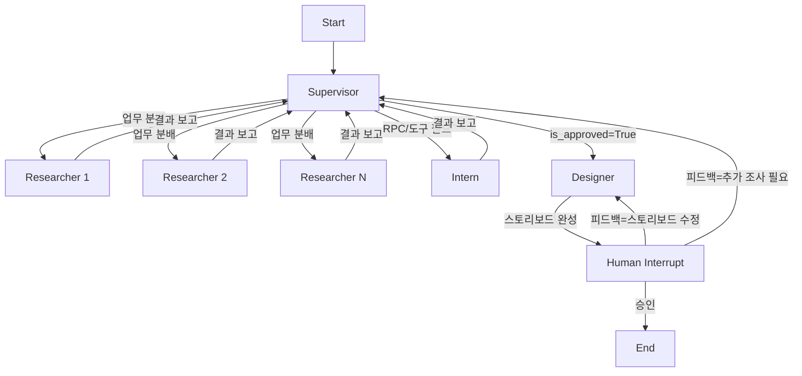
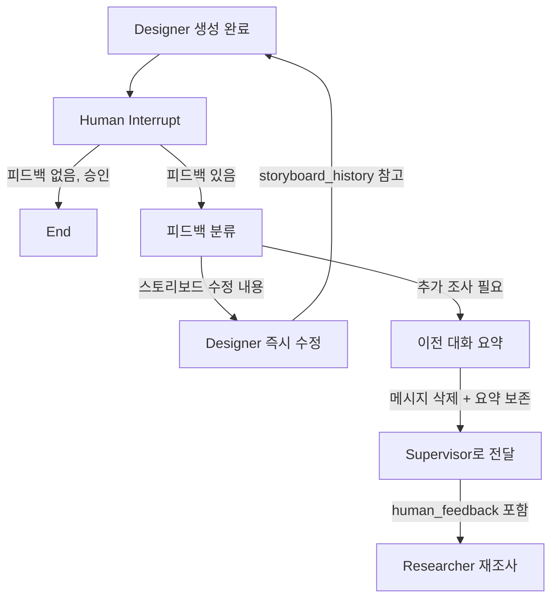

# Storyboard Multi-Agent System v2

v1(단일 Orchestrator)의 확장. 4개 전문 에이전트로 분할하여 병렬 처리, 역할 분리, 안전한 코드 생성을 구현한다.

---

## 1. 에이전트 구성

| 에이전트 | 역할 | 도구 접근 | interrupt |
|----------|------|-----------|-----------|
| **Supervisor** | 기획·설계, 업무 분배, 완료 승인 | 없음 (지시만) | 없음 |
| **Researcher** | 데이터 수집·검증 루프 | `TOOLS` 전체 | 없음 |
| **Intern** | RPC 함수·도구 생성, 문서 작성 | `ADMIN_TOOLS` | `interrupt_before` |
| **Designer** | 스토리보드 제작·수정 | 없음 (생성만) | `interrupt_after` |

---

## 2. 전체 그래프 흐름



---

## 3. 에이전트별 상세 설계

### 3.1 Supervisor (기획·설계·분배)

**역할**:
- 사용자 요청 분석 → 슬롯 필링 (`StoryboardSlots`)
- 업무 분해 → 병렬 실행 가능한 단위로 분할
- Researcher/Intern에 업무 배정 (동시 실행)
- 수집 결과 점검 → `is_approved: True` 결정
- Designer 결과물에 대한 human feedback 수신 후 라우팅

**State 관리**:
```python
class SupervisorState(TypedDict):
    messages: Annotated[list, add_messages]
    slots: StoryboardSlots                         # 슬롯 필링 결과
    tasks: list[Task]                              # 분배된 업무 목록
    research_results: Annotated[dict, merge_dicts]  # Researcher 결과 누적
    is_approved: bool                              # 데이터 충분성 승인
    human_feedback_to_storyboard_designer: Optional[str]
    loop_count: int
```

**업무 분배 형식** (Supervisor → Researcher/Intern):
```python
class Task(BaseModel):
    """Supervisor가 생성하는 업무 단위"""
    task_id: str
    agent: Literal["researcher", "intern"]
    instruction: str  # 구체적 지시사항
    priority: int     # 1=높음, 3=낮음
```

**동작 흐름**:
1. 사용자 입력 → `StoryboardSlots` 추출
2. 슬롯 기반으로 `Task` 목록 생성 (예: "떡볶이 자막 검색", "떡볶이 카테고리 음식점 조회")
3. Researcher 복수 인스턴스에 병렬 분배 (`Send` API)
4. 결과 수집 → `ContentSlots` 충족도 평가
5. 충분하면 `is_approved = True` → Designer 호출
6. 부족하면 추가 Task 생성 → 재분배 (최대 3회)

---

### 3.2 Researcher (자료조사 담당)

**역할**:
- Supervisor로부터 받은 업무(`Task.instruction`)를 수행
- 자율적으로 도구 호출 → 결과 검증 → 추가 검색 판단
- 결과를 Supervisor에 보고

**사용 도구**: `TOOLS` 전체 (검색·조회 도구만)
```
search_transcripts_hybrid, search_video_ids_by_query,
get_video_metadata_filtered, search_restaurants_by_category,
search_restaurants_by_name, get_categories_by_restaurant,
get_all_approved_restaurant_names, web_search, list_tools
```

**동작 흐름 (ReAct 패턴)**:
```
[Researcher] → 도구 호출 → 결과 확인
    → 부족하면 → 다른 도구/다른 쿼리로 재시도 (자체 루프, 최대 5턴)
    → 충분하면 → 결과 정리 후 Supervisor에 반환
```

**구현 패턴** (LangGraph `Send`로 병렬 실행):
```python
from langgraph.types import Send

def supervisor_distribute(state: SupervisorState):
    """Supervisor가 업무를 병렬로 분배"""
    tasks = state["tasks"]
    researcher_tasks = [t for t in tasks if t.agent == "researcher"]
    
    return [
        Send("researcher", {
            "instruction": task.instruction,
            "task_id": task.task_id,
            "messages": [],
        })
        for task in researcher_tasks
    ]
```

---

### 3.3 Intern (RPC·도구 생성 담당)

**역할 3가지**:

#### A. RPC 함수 & 도구 생성
- Supervisor가 "이런 함수가 필요하다"고 지시
- 코드 작성 → `review_python_code()` / `review_sql_code()` 정적 검사
- **human interrupt** (`interrupt_before`) → 사람 승인 후 파일 생성

#### B. 불가능 항목 문서화
- 현재 데이터로 만들 수 없는 함수/도구 목록을 구조화
- Pydantic 모델로 검증하여 문서 일관성 보장

```python
class InfeasibleItem(BaseModel):
    """현재 데이터로 구현 불가능한 항목"""
    item_name: str
    item_type: Literal["rpc_function", "tool"]
    reason: str                    # 불가 사유
    required_data: list[str]       # 필요하지만 없는 데이터
    suggested_action: str          # 해결 방안 제안

class InfeasibilityReport(BaseModel):
    """불가능 항목 종합 보고서"""
    items: list[InfeasibleItem]
    summary: str
```

#### C. 메타데이터 구축 제안서
- 현재 데이터에서 추출 가능한 메타데이터 항목 제안
- 구축 방법, 예상 효과 포함

```python
class MetadataProposal(BaseModel):
    """메타데이터 구축 제안"""
    field_name: str
    source_table: str              # 원본 테이블
    extraction_method: str         # 추출 방법
    expected_benefit: str          # 기대 효과
    implementation_effort: Literal["low", "medium", "high"]

class MetadataProposalReport(BaseModel):
    """메타데이터 구축 제안서"""
    proposals: list[MetadataProposal]
    priority_order: list[str]      # 추천 구축 순서
    summary: str
```

**사용 도구**: `ADMIN_TOOLS` (전부 `interrupt_before`)
```
create_tool, delete_tool, generate_rpc_sql
```

**Intern의 interrupt 흐름**:
```
Intern이 코드 작성 → 정적 검사 통과 → interrupt_before 발동
→ 사람이 코드 확인 → 승인(resume) → 파일 생성
                    → 거부(feedback) → Intern이 수정 후 재시도
```

---

### 3.4 Designer (스토리보드 제작)

**역할**:
- `is_approved == True`일 때만 실행
- 수집된 전체 데이터(`research_results` + `slots`)를 기반으로 스토리보드 생성
- 생성 후 `interrupt_after` → 사람 확인

**State**:
```python
class DesignerState(TypedDict):
    messages: Annotated[list, add_messages]
    slots: StoryboardSlots
    research_results: dict
    storyboard_history: list[str]          # 이전 버전들 보관
    human_feedback_to_storyboard_designer: Optional[str]
    final_output: Optional[str]
```

**human feedback 처리 흐름**:



**피드백 분류 구현**:
```python
class StoryboardFeedbackClassification(BaseModel):
    """스토리보드 피드백 분류"""
    action: Literal["edit_storyboard", "need_research"]
    edit_instruction: Optional[str] = None   # edit일 때 수정 지시
    research_query: Optional[str] = None     # research일 때 조사 내용
```

**"추가 조사 필요" 시 메시지 관리**:
```python
def summarize_and_reset(state: DesignerState) -> dict:
    """이전 대화 요약 후 메시지 삭제"""
    # 1. 현재까지의 대화 요약 생성
    summary = llm.invoke(
        "다음 대화를 한 문단으로 요약하세요: " + format_messages(state["messages"])
    )
    # 2. 기존 메시지 삭제 (RemoveMessage)
    remove_ids = [m.id for m in state["messages"] if not isinstance(m, SystemMessage)]
    # 3. 요약 + human_feedback을 Supervisor에 전달
    return {
        "messages": [RemoveMessage(id=mid) for mid in remove_ids],
        "conversation_summary": summary.content,
        "human_feedback_to_storyboard_designer": state["human_feedback_to_storyboard_designer"],
    }
```

---

## 4. 통합 State (전체 그래프)

```python
from typing import Annotated, TypedDict, Optional, Literal
from langgraph.graph.message import add_messages
from operator import add

def merge_dicts(left: dict, right: dict) -> dict:
    return {**left, **right}

class AgentState(TypedDict):
    messages: Annotated[list, add_messages]
    
    # --- Supervisor ---
    slots: Optional[dict]                          # StoryboardSlots
    tasks: list[dict]                              # Task 목록
    is_approved: bool                              # 데이터 승인 여부
    loop_count: int
    
    # --- Researcher ---
    research_results: Annotated[dict, merge_dicts] # 수집 데이터 누적
    previous_queries: Annotated[list[str], add]    # 중복 검색 방지
    
    # --- Intern ---
    intern_reports: Annotated[list[dict], add]     # 불가 항목, 제안서
    
    # --- Designer ---
    storyboard_history: Annotated[list[str], add]  # 스토리보드 버전 이력
    final_output: Optional[str]
    human_feedback_to_storyboard_designer: Optional[str]
    conversation_summary: Optional[str]            # 대화 요약 (초기화 시)
```

---

## 5. 그래프 빌드 코드 (개요)

```python
from langgraph.graph import StateGraph, START, END
from langgraph.types import Send, interrupt, Command
from langgraph.prebuilt import ToolNode
from langgraph.checkpoint.memory import MemorySaver
from tools import load_tools

TOOLS, ADMIN_TOOLS = load_tools()

builder = StateGraph(AgentState)

# --- 노드 등록 ---
builder.add_node("supervisor", supervisor_node)
builder.add_node("researcher", researcher_subgraph)       # 하위 그래프 (ReAct 루프)
builder.add_node("intern", intern_node)
builder.add_node("intern_tools", ToolNode(ADMIN_TOOLS))   # interrupt_before 적용
builder.add_node("designer", designer_node)
builder.add_node("feedback_classifier", feedback_classifier_node)
builder.add_node("summarize_and_reset", summarize_and_reset_node)

# --- 엣지 ---
builder.add_edge(START, "supervisor")

# Supervisor → 병렬 분배 (Send)
builder.add_conditional_edges("supervisor", route_supervisor, {
    "researcher": "researcher",     # Send로 병렬
    "intern": "intern",
    "designer": "designer",
    "end": END,
})

# Researcher → Supervisor (결과 보고)
builder.add_edge("researcher", "supervisor")

# Intern → Intern Tools (interrupt_before)
builder.add_conditional_edges("intern", route_intern, {
    "intern_tools": "intern_tools",
    "supervisor": "supervisor",
})
builder.add_edge("intern_tools", "intern")

# Designer → interrupt_after → 피드백 분류
builder.add_edge("designer", "feedback_classifier")

# 피드백 분류 → 라우팅
builder.add_conditional_edges("feedback_classifier", route_feedback, {
    "designer": "designer",             # 스토리보드 수정
    "summarize_and_reset": "summarize_and_reset",  # 추가 조사
    "end": END,                         # 승인
})

builder.add_edge("summarize_and_reset", "supervisor")

# --- 컴파일 ---
memory = MemorySaver()
graph = builder.compile(
    checkpointer=memory,
    interrupt_before=["intern_tools"],   # ADMIN_TOOLS 실행 전 human 승인
    interrupt_after=["designer"],        # 스토리보드 생성 후 human 확인
)
```

---

## 6. Researcher 하위 그래프 (서브그래프)

Researcher는 자체적으로 ReAct 루프를 가진 서브그래프:

```python
def build_researcher_subgraph():
    """Researcher 에이전트의 내부 ReAct 루프"""
    
    researcher_builder = StateGraph(ResearcherState)
    
    researcher_builder.add_node("think", researcher_think)        # 다음 행동 결정
    researcher_builder.add_node("tools", ToolNode(TOOLS))         # 도구 실행
    researcher_builder.add_node("evaluate", researcher_evaluate)  # 결과 자체 평가
    
    researcher_builder.add_edge(START, "think")
    researcher_builder.add_conditional_edges("think", route_researcher_think, {
        "tools": "tools",
        "done": END,
    })
    researcher_builder.add_edge("tools", "evaluate")
    researcher_builder.add_conditional_edges("evaluate", route_researcher_eval, {
        "think": "think",    # 추가 검색 필요
        "done": END,         # 충분
    })
    
    return researcher_builder.compile()
```

---

## 7. Interrupt 정리

| 시점 | 대상 노드 | 방식 | 사람 역할 |
|------|-----------|------|-----------|
| RPC/도구 코드 생성 전 | `intern_tools` | `interrupt_before` | 코드 확인 후 승인/거부 |
| 스토리보드 생성 후 | `designer` | `interrupt_after` | 결과 확인 후 승인/수정요청/재조사 |

---

## 8. 코드 생성 보안 아키텍처

에이전트가 도구/RPC를 **생성**하는 구조이므로, 보안 설계가 이 시스템의 핵심이다.

### 8.1 5계층 보안 모델

```
┌─────────────────────────────────────────────────────┐
│  5층   실행 샌드박스                    [미구현]      │
│        생성된 코드를 격리 환경에서 테스트 실행          │
├─────────────────────────────────────────────────────┤
│  4층   LLM 코드 리뷰 노드              [미구현]      │
│        정적 검사로 못 잡는 논리적 위험을 LLM이 판단    │
├─────────────────────────────────────────────────────┤
│  3층   Human Interrupt                 [구현 완료]   │
│        interrupt_before → 사람이 코드 직접 확인       │
├─────────────────────────────────────────────────────┤
│  2층   정적 코드 검사                   [구현 완료]   │
│        regex 단어 경계(\b) 기반 위험 패턴 탐지        │
├─────────────────────────────────────────────────────┤
│  1층   경로 제한                       [구현 완료]   │
│        도구별 허용 폴더 외 접근 원천 차단              │
└─────────────────────────────────────────────────────┘
```

### 8.2 계층별 상세

#### 1층: 경로 제한 (구현 완료)

| 도구 | 허용 폴더 | 차단 방법 |
|------|-----------|-----------|
| `create_tool` | `src/tools/` | `os.path.realpath()` + prefix 검증 |
| `delete_tool` | `src/tools/` | 동일 + 시스템 파일 보호 목록 |
| `generate_rpc_sql` | `supabase/` | 동일 |

- `../`, 절대 경로, `/`, `\` 포함 시 즉시 거부
- `_shared.py`는 `src/`에 위치 (tools/ 외부) → 에이전트 접근 불가

#### 2층: 정적 코드 검사 (구현 완료)

**Python 위험 패턴** (9개):
```
os.system(), subprocess, exec(), eval(), __import__(),
shutil.rmtree, os.remove/unlink/rmdir,
requests/urllib/httpx (외부 HTTP), socket (네트워크)
```

**SQL 위험 패턴** (8개 + 조건부 2개):
```
DROP (table/schema/database/function/index/view/trigger/role/type),
TRUNCATE, ALTER (table/schema/database/role/type),
GRANT, REVOKE, CREATE ROLE, COPY, EXECUTE
+ DELETE FROM without WHERE, UPDATE without WHERE
```

**SQL 화이트리스트**: `CREATE (OR REPLACE) FUNCTION` 구문이 아니면 즉시 차단.

#### 3층: Human Interrupt (구현 완료)

- `interrupt_before=["intern_tools"]` → Intern이 도구 호출 전 사람 승인 필수
- 승인(`Command(resume=...)`) 또는 거부(feedback) → Intern 재시도

#### 4층: LLM 코드 리뷰 노드 (미구현)

구현 시 `intern` → `code_reviewer` → `intern_tools` 순서로 노드 삽입:

```python
def code_review_node(state):
    """LLM이 코드의 논리적 안전성 평가"""
    code = extract_pending_code(state)
    review = llm.with_structured_output(CodeReview).invoke(
        f"아래 코드가 안전한지 평가하세요. 데이터 손실, 보안 취약점, "
        f"의도하지 않은 부작용이 있는지 검토합니다.\n\n{code}"
    )
    if not review.is_safe:
        return {"messages": [AIMessage(content=f"[코드 리뷰 거부] {review.reason}")]}
    return {}  # 통과 → intern_tools로 진행

class CodeReview(BaseModel):
    is_safe: bool
    reason: Optional[str] = None
    risk_level: Literal["low", "medium", "high"]
```

#### 5층: 실행 샌드박스 (미구현)

생성된 Python 도구를 `subprocess`로 격리 실행하여 import 오류, 런타임 에러 사전 탐지.

### 8.3 공격 시나리오별 방어 매핑

| 공격 시나리오 | 방어 계층 |
|--------------|-----------|
| `create_tool("../../.env", "...")` 경로 탈출 | 1층 (경로 제한) |
| `os.system("rm -rf /")` 포함 코드 생성 | 2층 (정적 검사) |
| `DROP TABLE restaurants` SQL 생성 | 2층 (정적 검사 + 화이트리스트) |
| 정적 검사 우회하는 난독화 코드 | 3층 (Human) + 4층 (LLM 리뷰) |
| 논리적으로 위험한 쿼리 (WHERE 1=1 등) | 4층 (LLM 리뷰) |
| import 오류가 있는 도구 생성 | 5층 (샌드박스) |

## 9. v1 대비 변경점

| 항목 | v1 (단일 에이전트) | v2 (다중 에이전트) |
|------|-------------------|-------------------|
| 구조 | Orchestrator 중심 루프 | Supervisor + 3 전문 에이전트 |
| 검색 | 순차적 도구 호출 | Researcher 병렬 실행 (`Send`) |
| 도구 생성 | 없음 | Intern이 RPC/Tool 생성 (human 승인) |
| 보안 | 없음 | 5계층 보안 모델 (경로·정적·human·LLM·샌드박스) |
| 검증 | 단순 개수 기반 Validator | Supervisor의 LLM 기반 승인 |
| 피드백 | Generator 후 종료 | Designer 후 수정/재조사 분기 |
| 대화 관리 | 전체 유지 | 재조사 시 요약 후 초기화 |
| 문서화 | 없음 | Intern이 Pydantic 기반 보고서 작성 |

---

## 10. 구현 우선순위

| 순서 | 항목 | 의존성 |
|------|------|--------|
| 1 | `AgentState` 정의 + `StoryboardSlots` | 없음 |
| 2 | Supervisor 노드 (슬롯 필링 + 업무 분배) | 1 |
| 3 | Researcher 서브그래프 (ReAct + `TOOLS`) | 1 |
| 4 | Intern 노드 + Pydantic 모델 | 1 |
| 5 | Designer 노드 + 피드백 분류기 | 1, 2, 3 |
| 6 | 전체 그래프 조립 + interrupt 설정 | 1~5 |
| 7 | `summarize_and_reset` + 메시지 관리 | 5, 6 |

---

## 11. 슬롯 필링 기반 검증으로 전환

### 11.1 전환 배경 (v1 문제점)

v1의 `validate_data`는 **캡션 있는 자막 ≥ 3개**라는 고정 임계값으로 통과 여부를 판단한다.

**문제**: RAG 검색 결과에서 `is_peak=True`인 구간(= 캡션이 존재하는 구간)은 전체 자막 대비 소수. 실제 운영 시 캡션 보유 자막이 0~1개인 경우가 대부분이며, 에이전트가 동일한 주제로 3회 재검색해도 캡션 수가 늘지 않는다. 결과적으로 거의 매번 `need_human` → human interrupt로 빠진다.

**근본 원인**: 임계값이 데이터 분포와 맞지 않음. 캡션 부족은 검색 품질이 아니라 **데이터 커버리지 자체의 한계**.

### 11.2 슬롯 필링 방식으로의 전환

"캡션 N개" 같은 단일 수치 대신, **스토리보드 제작에 필요한 정보 유형(슬롯)** 을 정의하고, 각 슬롯의 충족 상태를 기준으로 검증한다.

**핵심 변경**:

| 구분 | v1 (고정 임계값) | v2 (슬롯 필링) |
|------|-----------------|---------------|
| 판단 기준 | `len(docs_with_caption) >= 3` | 슬롯별 충족 여부 |
| 실패 시 행동 | 동일 쿼리로 재검색 반복 | 미충족 슬롯만 타겟 검색 |
| human interrupt 시점 | 3회 실패 후 무조건 | 타겟 검색으로도 못 채운 슬롯만 human에게 문의 |
| human에게 보여주는 정보 | "캡션 N개 부족합니다" | "어떤 슬롯이 왜 부족한지" 구체적 설명 |

### 11.3 `StoryboardSlots` 구체적 슬롯 설계

> **TODO**: 아래는 초안. 실제 스토리보드 제작 과정에서 필요한 정보를 세분화하여 확정해야 함.

```python
class StoryboardSlots(BaseModel):
    """스토리보드 제작에 필요한 정보 슬롯"""

    # --- 필수 슬롯 ---
    # TODO: 각 슬롯의 최소 요구량, 충족 판정 기준을 구체화할 것

    # 시각 자료: 장면의 촬영 대상·구도·색감 등을 묘사하는 캡션
    visual_references: list[...]       # 캡션 데이터 (is_peak 구간)

    # 자막/대사: 유튜버의 말투·리듬·감정을 참고할 자막
    transcript_context: list[...]      # 자막 텍스트

    # 음식/식당 정보: 어떤 음식을 어디서 먹는지
    food_restaurant_info: list[...]    # 카테고리, 식당명, 메뉴 등

    # --- 보조 슬롯 ---
    video_metadata: list[...]          # 조회수, 제목, 업로드일 등 참고 정보
    web_search_results: list[...]      # 외부 검색 결과 (트렌드, 배경 지식)
    audio_cues: list[...]              # 효과음, BGM 힌트 (자막에서 추출)

    # --- 메타 ---
    user_intent: str                   # 사용자 원본 요청
    target_scene_count: int            # 목표 씬 수 (6~8)
```

### 11.4 검증 로직 변경 방향

```
AS-IS (v1):
  len(docs_with_caption) >= 3 → pass
  else → fail (재검색) → 3회 후 need_human

TO-BE (v2):
  1. Supervisor가 각 슬롯의 충족 상태를 LLM으로 평가
  2. 미충족 슬롯이 있으면 → 해당 슬롯을 채울 수 있는 Task를 Researcher에 분배
  3. 캡션 0개여도 transcript + metadata로 시각 묘사를 LLM이 추론 가능하면 pass
  4. 타겟 검색으로도 못 채우는 슬롯만 human에게 구체적으로 문의
```

> **TODO**: 슬롯 충족도 평가를 LLM에게 맡길지, 규칙 기반으로 할지 결정 필요. LLM 기반이면 평가 프롬프트 설계가 핵심.
