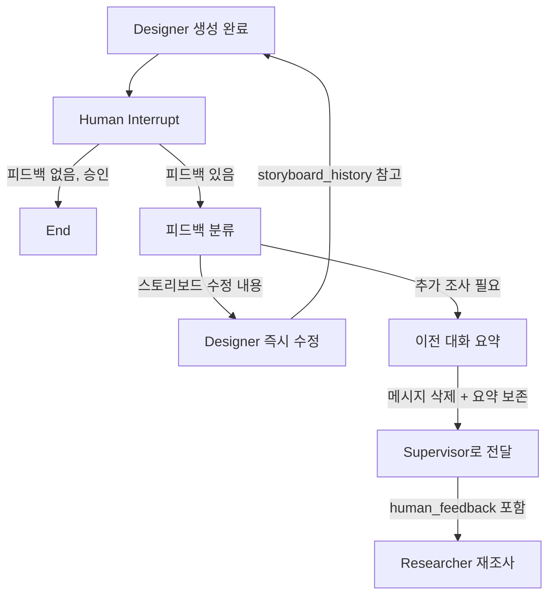

# Storyboard Multi-Agent System v2

v1(단일 Orchestrator)의 확장. 4개 전문 에이전트로 분할하여 병렬 처리, 역할 분리, 안전한 코드 생성을 구현한다.

---

## 0. Intern 단순화 리디자인(적용 기준)

아래 내용은 기존 Intern 흐름을 유지하되, `pending_review_calls/pending_execute_calls` 중심 로직을
`modified_tool_calls` 중심으로 단순화하는 계획이다.

### 0.1 목표

- 노드 수는 최대한 유지: `plan -> think -> review_create/create_review_decision/execute_delete/execute/update_plan/finish`
- `think`에서 생성된 원본 호출은 보존하고, 수정본은 별도 상태에서 관리
- create/delete 승인 절차를 명확히 분리
- 수정/거부는 반드시 `update_plan`을 거친 뒤 `think`로 복귀
- `END` 진입은 `think`에서만 판단

### 0.2 핵심 상태 설계 (InternState)

기존 필드는 유지하고 아래를 추가/재정의:

- `original_tool_calls: list[dict]`
  - think가 최초 생성한 호출 스냅샷(불변 로그)
- `modified_tool_calls: dict[str, dict]`
  - key=`tool:xxx`/`rpc:yyy`
  - value 예시:
    - `{"tool_call": {...}, "status": "pending|approved|rejected|needs_modify|executed|failed", "version": 1}`
- `tool_call_order: list[str]`
  - 순회 순서 보장용 key 목록
- `current_tool_key: Optional[str]`
  - 현재 검토/수정 대상
- `pending_modified_feedback: dict[str, str]`
  - key별 최신 수정 지시
- `pending_execute_calls: list[dict]`
  - 실제 실행 대기 큐(승인된 create/delete + 일반 tool)
- `plan_update_events: list[BaseMessage]`
  - 계획 변경 이벤트 버퍼(기존 유지)
- `review_statuses: dict[str, str]`
  - `approve/reject/modify` 기록(기존 유지)
- `intern_ready_to_end: bool`
  - finish 완료 후 think에서 END 판단용

상태 전이 원칙:

- 원본은 `original_tool_calls`에만 append
- 실제 처리 대상은 `modified_tool_calls[key].tool_call`
- 승인/거부/수정은 항상 `modified_tool_calls[key].status`로 단일화

### 0.3 Intern 노드/엣지 계획

```text
START -> plan -> think

think
  - [review 대상 delete] -> execute_delete
  - [review 대상 create] -> review_create
  - [needs_modify create] -> create_modify(신규)
  - [pending_execute_calls 있음] -> execute
  - [수정/거부 이벤트 있음] -> update_plan
  - [모든 modified_tool_calls 처리완료 + 실행도 완료 + finish 미수행] -> finish
  - [intern_ready_to_end=True] -> END
  - [그 외] -> think(추가 tool_calls 생성)

review_create -> (interrupt_after) -> create_review_decision

create_review_decision
  - 승인: status=approved, pending_execute_calls+=call
  - 삭제/거부: status=rejected, plan_update_events+=event -> update_plan
  - 수정요청: status=needs_modify, pending_modified_feedback[key]=text, plan_update_events+=event -> update_plan

execute_delete -> (interrupt_before) -> decision 처리
  - 승인: status=approved, pending_execute_calls+=delete_call
  - 거부: status=rejected, plan_update_events+=event -> update_plan
  - 수정텍스트: status=needs_modify(or rejected 정책), feedback 저장, plan_update_events+=event -> update_plan

create_modify(신규)
  - modified_tool_calls[key] + feedback로 create 1건 재생성
  - 성공 시 version+=1, status=pending
  - 이후 review_create로 복귀

execute
  - pending_execute_calls 순차 실행
  - 실행 결과로 status=executed/failed 업데이트
  - 승인 건 실행이 끝나면 plan_update_events 누적
  - update_plan으로 이동

update_plan
  - plan_update_events 소비(RemoveMessage)
  - think로 복귀

finish
  - intern_result 생성
  - intern_ready_to_end=True
  - think로 복귀
```

### 0.4 승인/수정/거부 규칙 단순화

- 승인(rule): `"승인"` 정확 일치
- 삭제/거부(rule): `"삭제"` 정확 일치
- 나머지 입력: 모두 수정요청으로 처리

적용 위치:

- `create_review_decision`
- `execute_delete`

공통 결과:

- `review_statuses[key] = approve|reject|modify`
- `modified_tool_calls[key].status` 동기화

### 0.5 update_plan 호출 규칙

- 이벤트 적재 원칙:
  - 승인: 즉시 실행하지 않고 `pending_execute_calls`에 적재 + `plan_update_events`에 `approved(queued)` 이벤트 기록
  - 삭제/거부: `plan_update_events`에 `rejected` 이벤트 기록
  - 수정: `plan_update_events`에 `needs_modify` 이벤트 기록
- 호출 타이밍:
  - `create_review_decision`/`execute_delete`에서 삭제·거부·수정이 발생하면 즉시 `update_plan`
  - 승인만 누적 중이면 실행 단계(`execute`)까지 진행
  - `execute` 완료 후 `executed/failed` 이벤트까지 포함해 `update_plan` 1회 호출
- 즉, `update_plan`은 승인 대기 상태 변화(`approved(queued)`)와
  삭제/거부/수정, 실행 결과(`executed/failed`)를 모두 반영한다.

### 0.6 END 정책

- `END`는 `think`에서만 진입
- `finish`는 END로 바로 가지 않고 `intern_ready_to_end=True` 설정 후 `think`로 복귀

### 0.7 프롬프트 변경 계획

`src/prompts/intern.py`

- 유지:
  - `INTERN_PLAN_PROMPT`, `INTERN_THINK_PROMPT`, `INTERN_UPDATE_PLAN_PROMPT`, `INTERN_FINAL_RESULT_PROMPT`
- 수정:
  - `INTERN_THINK_PROMPT`
    - `original_tool_calls` 요약, `modified_tool_calls(status/version)`, `pending_modified_feedback`를 명시 입력
    - "이미 승인된 호출 재생성 금지" 규칙 추가
- 신규:
  - `INTERN_CREATE_MODIFY_PROMPT`
    - 입력: `current_tool_call`, `modify_feedback`, `target key/name`
    - 출력: 동일 대상 create tool_call 1개만 반환
  - `INTERN_REVIEW_DECISION_FORMAT_PROMPT` (옵션)
    - 사람 입력 형식 안내(`승인` / `삭제` / 수정텍스트)

### 0.8 코드 변경 계획 (파일 단위)

`src/state/main.py`

- InternState에 신규 필드 추가:
  - `original_tool_calls`, `modified_tool_calls`, `tool_call_order`, `current_tool_key`, `intern_ready_to_end`

`src/agents/intern.py`

- think 로직 재작성:
  - 최초 tool_calls 생성 시
    - `original_tool_calls` append
    - `modified_tool_calls`/`tool_call_order`/`current_tool_key` 초기화
  - 처리 우선순위:
    1) needs_modify create -> `create_modify`
    2) delete review -> `execute_delete`
    3) create review -> `review_create`
    4) pending execute -> `execute`
    5) update_plan 필요 -> `update_plan`
    6) finish/end 판단
- 신규 노드 추가:
  - `intern_create_modify_node` (노드명: `create_modify`)
- `create_review_decision`/`execute_delete`:
  - `modified_tool_calls[key].status` 중심으로 상태 전환
  - 승인만 execute 큐에 적재
- `execute`:
  - 실행 후 key status를 `executed/failed`로 동기화
- `finish`:
  - `intern_ready_to_end=True` 설정
- 그래프 라우팅:
  - END는 think 조건 분기에서만 반환

`src/prompts/intern.py`

- 위 0.7 프롬프트 변경 반영

### 0.9 마이그레이션/호환 원칙

- 기존 `pending_review_calls/pending_execute_calls/review_statuses/pending_modified_feedback`는 유지
- 새 구조(`modified_tool_calls`)를 소스 오브 트루스로 사용
- 로그/리포트(`created_artifacts`, `artifact_statuses`, `intern_result`)는 기존 포맷 유지

### 0.10 테스트 체크리스트

- create 승인: review_create -> decision -> execute -> update_plan -> think
- create 수정: review_create -> decision(modify) -> update_plan -> create_modify -> review_create
- delete 승인: interrupt_before -> execute_delete 승인 -> execute -> update_plan
- delete 거부: interrupt_before -> execute_delete 거부 -> update_plan -> think
- mixed tool_calls(create+delete+read): 순차 처리 후 pending_execute_calls 일괄 실행
- all done: finish -> think -> END

---

## 1. 에이전트 구성

| 에이전트 | 역할 | 도구 접근 | interrupt |
|----------|------|-----------|-----------|
| **Supervisor** | 기획·설계, 업무 분배, 완료 승인 | 없음 (지시만) | 없음 |
| **Researcher** | 데이터 수집·검증 루프 | `TOOLS` 전체 | 없음 |
| **Intern** | RPC 함수·도구 생성, 문서 작성 | `ADMIN_TOOLS` | create:`interrupt_after`, delete:`interrupt_before` |
| **Designer** | 스토리보드 제작·수정 | 없음 (생성만) | `interrupt_after` |

---

## 2. 전체 그래프 흐름

```text
[Legend]
  ---->              : 일반 엣지
  --[조건]---------> : 조건부 엣지
  R:                 : Read state
  W:                 : Write state

-----------
|  START  |
-----------
    |
    v
----------------
| extract_slots |
| R: slots, messages[-1] |
| W: slots(없을 때만)    |
----------------
    |
    v
--------------
| supervisor  |
| R: slots, research_results, research_sufficient, research_summary,
|    researcher_think_count, researcher_stall_summary, intern_request,
|    intern_result, human_feedback, conversation_summary, agent_instructions,
|    messages |
| W(공통): research_scene_data, research_web_summary |
| W(승인): is_approved=True, intern_request=None, intern_result=None,
|         human_feedback=None, conversation_summary=None |
| W(재조사): is_approved=False, research_sufficient=False,
|           research_instruction=<신규>, intern_request=None,
|           human_feedback=None, conversation_summary=None, intern_result=None,
|           agent_instructions["researcher"] += [instruction] |
--------------
   |--[is_approved=True]---------------------------------------------->----------------
   |                                                                    |  designer   |
   |                                                                    ----------------
   |
   |--[is_approved=False]--------------------------------------------->----------------
                                                                        | researcher  |
                                                                        ----------------
                                                                                 |
                                                                                 v
                                                                           -------------
                                                                           | R:think   |
                                                                           | R: messages, previous_queries,
                                                                           |    research_instruction,
                                                                           |    agent_instructions["researcher"] |
                                                                           | W: messages += [AI(tool_calls)],
                                                                           |    researcher_think_count += 1,
                                                                           |    researcher_stall_summary=None,
                                                                           |    intern_request=None,
                                                                           |    previous_queries(scene/web) |
                                                                           -------------
                                                                              |--[tool_calls 없음]-->-------------
                                                                              |                      |   R:END   |
                                                                              |                      -------------
                                                                              |
                                                                              |--[tool_calls 있음]-->-------------
                                                                                                       | R:tools  |
                                                                                                       | W: messages += ToolMessage(...) |
                                                                                                       -------------
                                                                                                              |
                                                                                                              v
                                                                                                       ---------------
                                                                                                       | R:evaluate  |
                                                                                                       | R: messages, research_results,
                                                                                                       |    previous_queries, researcher_think_count,
                                                                                                       |    agent_instructions, research_instruction |
                                                                                                       | W: research_results(scene_data/transcripts/
                                                                                                       |    web_results/web_summary 신규분),
                                                                                                       |    loop_count+=1,
                                                                                                       |    research_sufficient,
                                                                                                       |    research_summary,
                                                                                                       |    messages += [AI(충분/부족)] |
                                                                                                       | W(요청툴 감지): intern_request,
                                                                                                       |    agent_instructions["intern"] += [req],
                                                                                                       |    researcher_context=messages,
                                                                                                       |    research_sufficient=False |
                                                                                                       | W(정체>=5): researcher_think_count=0,
                                                                                                       |    researcher_stall_summary, research_summary,
                                                                                                       |    researcher_context, intern_request,
                                                                                                       |    agent_instructions["intern"] += [req] |
                                                                                                       ---------------
                                                                                                         |--[intern_request 있음]-->-------------
                                                                                                         |                           |   R:END   |
                                                                                                         |                           -------------
                                                                                                         |--[research_sufficient=True]->-------------
                                                                                                         |                           |   R:END   |
                                                                                                         |                           -------------
                                                                                                         |--[researcher_stall_summary 있음]-------------
                                                                                                         |                           |   R:END   |
                                                                                                         |                           -------------
                                                                                                         |--[그 외]--------------->-------------
                                                                                                                                      | R:think   |
                                                                                                                                      -------------

-------------
|  R:END    |
-------------
   |--[intern_request 있음]------------------------------------------>------------
   |                                                                  |  intern  |
   |                                                                  ------------
   |
   |--[intern_request 없음]----------------------------------------->--------------
                                                                      | supervisor |
                                                                      --------------


------------
|  intern  |
------------
    |
    v
------------
| I:plan   |
| R: intern_request, agent_instructions["intern"] |
| W(성공): messages += [AI("초기 계획 수립 완료...")] |
| W(실패): intern_result="...초기 계획 생성 실패", messages += [AI("[오류]...")] |
------------
   |--[실패 메시지]-->---------
   |               | I:END    |
   |               ---------
   |
   |--[정상]------->-----------
                   | I:think |
                   | R: pending_review_calls, pending_execute_calls,
                   |    agent_instructions["intern"], messages, 
                   |    pending_modified_feedback, artifact_statuses |
                   | W(잔여 큐 있으면): intern_action만 결정 |
                   | W(신규 tool_calls): pending_review_calls,
                   |    pending_execute_calls, pending_review_notes={},
                   |    intern_action(review_create/execute_delete/execute/finish),
                   |    messages(리뷰 시작 안내) |
                   -----------
                      |--[delete review 필요]------>(interrupt_before=["execute_delete"])
                      |                                        |
                      |                                        v
                      |                            -------------------
                      |                            | I:execute_delete |
                      |                            -------------------
                      |
                      |--[create review 필요]------>------------------
                      |                            | I:review_create |
                      |                            ------------------
                      |                                | R: pending_review_calls, pending_review_notes
                      |                                | W: pending_review_notes[key]=review,
                      |                                |    messages += [AI(리뷰결과+응답형식)]
                      |                                v
                      |                     (interrupt_after=["review_create"])
                      |                                |
                      |                                v
                      |                       ---------------------------
                      |                       | I:create_review_decision |
                      |                       | R: last HumanMessage, pending_review_calls,
                      |                       |    pending_execute_calls, pending_review_notes |
                      |                       | W(승인): pending_execute_calls += current,
                      |                       |    pending_review_calls pop,
                      |                       |    review_statuses[key]="approve",
                      |                       |    pending_modified_feedback[key]="",
                      |                       |    intern_action="execute" |
                      |                       | W(삭제): pending_review_calls pop,
                      |                       |    review_statuses[key]="delete",
                      |                       |    plan_update_events += ToolMessage(event),
                      |                       |    intern_action=다음큐기반 |
                      |                       | W(수정): pending_modified_feedback[key]=원문피드백,
                      |                       |    review_statuses[key]="modify",
                      |                       |    plan_update_events += ToolMessage(event),
                      |                       |    intern_action=다음큐기반 |
                      |                       ---------------------------
                      |
                      |--[일반 실행]------------>-------------
                      |                            | I:execute |
                      |                            | R: pending_execute_calls(or latest ai tool_calls) |
                      |                            | W: messages += ToolMessage(raw) + AI("도구 실행 완료"),
                      |                            |    pending_execute_calls=[],
                      |                            |    created_artifacts += [...],
                      |                            |    artifact_statuses[key]=created/deleted/failed,
                      |                            |    plan_update_events += ToolMessage(event),
                      |                            |    pending_modified_feedback[key]=""(성공건 clear),
                      |                            |    intern_action=다음큐기반(update_plan/think 등) |
                      |                            -------------
                      |
                      |--[plan 업데이트 필요]---->----------------
                      |                            | I:update_plan |
                      |                            | R: plan_update_events, pending_review_calls,
                      |                            |    pending_execute_calls, intern instruction |
                      |                            | W(이벤트 없음): intern_action=기본다음 |
                      |                            | W(이벤트 있음): messages += [AI("계획 업데이트 완료")],
                      |                            |    plan_update_events += RemoveMessage(...소비),
                      |                            |    intern_action=기본다음 |
                      |                            ----------------
                      |
                      |--[종료]------------------>------------
                                                   | I:finish  |
                                                   | R: created_artifacts, artifact_statuses,
                                                   |    pending_modified_feedback, plan, instruction |
                                                   | W: intern_result, messages += [AI("Intern 보고 완료...")] |
                                                   | side effect: plan 파일 삭제 |
                                                   ------------
                                                        |
                                                        v
                                                     ---------
                                                     | I:END |
                                                     ---------
                                                        |
                                                        v
                                                   ----------------
                                                   | researcher    |
                                                   ----------------


-------------------
| I:execute_delete |
| NOTE: 이 노드는 진입 직전에 interrupt_before로 사람 입력을 받음 |
| R: pending_review_calls, last HumanMessage |
| W(승인): pending_execute_calls += delete_call,
|          review_statuses[key]="approve",
|          pending_modified_feedback[key]="",
|          intern_action="execute" |
| W(삭제): review_statuses[key]="delete",
|          plan_update_events += event,
|          intern_action=다음큐기반 |
| W(수정): pending_modified_feedback[key]=원문,
|          review_statuses[key]="modify",
|          plan_update_events += event,
|          intern_action=다음큐기반 |
-------------------

----------------
|  designer     |
----------------
   |
   v
-------------------
| D:designer_node |
| R: human_feedback, storyboard_history, slots,
|    research_scene_data, research_web_summary |
| W: messages += [AI(storyboard)],
|    storyboard_history += [final_output],
|    final_output,
|    human_feedback=None |
-------------------
   |
   v
(interrupt_after=["designer_node"])
   |
   v
---------------------------
| D:feedback_classifier    |
| R: messages[-1](human), final_output |
| W(edit): feedback_action="edit_storyboard",
|          human_feedback=edit_instruction |
| W(research): feedback_action="need_research",
|              human_feedback=research_query |
| W(approve): feedback_action="approved" |
---------------------------
   |--[edit_storyboard]--------->-------------------
   |                              | D:designer_node |
   |                              -------------------
   |
   |--[need_research]----------->--------------------------
   |                              | D:summarize_and_reset |
   |                              | R: messages, human_feedback |
   |                              | W: messages += RemoveMessage(all),
   |                              |    conversation_summary,
   |                              |    human_feedback(유지) |
   |                              --------------------------
   |                                         |
   |                                         v
   |                                     -----------
   |                                     | D:END   |
   |                                     -----------
   |
   |--[approved]------------------------>-----------
                                         | D:END   |
                                         -----------

-----------
| D:END   |
-----------
   |--[human_feedback or conversation_summary 있음]-->--------------
   |                                                  | supervisor  |
   |                                                  --------------
   |
   |--[없음]----------------------------------------->-------
                                                      | END |
                                                      -------
```

---

## 3. 에이전트별 상세 설계

### 3.1 Supervisor (기획·설계·분배) — 규칙 기반 분기

**역할**:
- 초기 입력에서 최소 `StoryboardSlots`를 생성 (`user_intent`, `target_scene_count`)
- Researcher 결과를 분리 저장:
  - `research_scene_data` (`scene_data`/`transcripts`)
  - `research_web_summary` (`web_summary`)
- `research_sufficient` + `scene_data` 존재 여부로 `is_approved` 결정
- `intern_request`가 있으면 Intern으로 라우팅
- `intern_result(str)`를 해석해 실패 시 Researcher 재시도 지시
- Designer의 `need_research` 복귀(`human_feedback`) 시 stale 상태 초기화 후 재조사

**동작 흐름**:
1. slots가 없으면 `extract_slots()`로 최소 슬롯 생성
2. `research_results`에서 scene/web 데이터를 분리해 shared state 업데이트
3. `human_feedback`가 있으면 `is_approved/research_sufficient/slots_ready`를 false로 초기화하고 researcher 재요청
4. `intern_request`가 있으면 intern으로 보냄
5. `research_sufficient == True` 이고 `scene_data`가 있으면 `designer`, 아니면 `researcher`

---

### 3.2 Researcher (자료조사 담당)

**역할**:
- Supervisor의 `research_instruction`에 따라 조사 수행
- 자율적으로 도구 호출 → 결과 검증 → 추가 검색 판단
- 결과를 Supervisor에 보고
- 기존 도구로 불가능 시 `request_new_tool` 호출 → Intern에게 도구 생성 요청

**사용 도구**: `TOOLS`만 (ADMIN_TOOLS 제외) + `request_new_tool`
```python
tools, _ = load_tools()  # 매 호출마다 동적 로딩
all_tools = tools + [request_new_tool]  # 항상 포함
```
```
search_scene_data (하이브리드 검색 + 캡션), search_video_ids_by_query,
get_video_metadata_filtered, search_restaurants_by_category,
search_restaurants_by_name, get_categories_by_restaurant,
get_all_approved_restaurant_names, web_search, request_new_tool
+ Intern이 동적으로 생성한 도구들
```

**ResearcherState**: slots 직접 참조 안 함. `think` 방문 카운트 기반 정체 제어.
```python
# Shared: messages, intern_request, researcher_context
# Shared 추가: research_instruction, researcher_think_count, researcher_stall_summary
# Private: research_results, previous_queries({"scene":[],"web":[]}), loop_count
```

**동작 흐름 (ReAct + Self-RAG)**:
```
[think] → LLM이 tool_calls 반환 (복수 도구 병렬 실행)
    → [tools] ToolNode 실행 (request_new_tool 포함)
    → [evaluate] ToolMessage.name으로 결과 분류:
        - "search_scene_data" → transcripts 누적(중복 제거)
        - "web_search" → web_results 수집
        - "request_new_tool" → intern_request 설정 → END
        충분성 판단:
        → 자막≥3 + 캡션≥1 → "충분" (rule) → END
        → 부족 + web_search 있음 → LLM 주관적 판단 → "충분"/"부족"
        → 부족 + web_search 없음 → "부족" (rule) → think 재시도
        → think 방문 5회 이상 정체 시:
           - `researcher_think_count` 리셋
           - `researcher_stall_summary` 생성
           - Supervisor로 복귀
```

**구현 요약**:

- `ToolMessage.name`으로 결과를 분류한다. 응답 본문의 키를 추측하지 않는다.
- `previous_queries`는 `{"scene": [...], "web": [...]}`로 도구별 분리 관리.
- Researcher는 slots에 직접 접근하지 않는다. Supervisor가 `research_instruction`으로 지시를 전달한다.
- 도구 결과 필드 정리(rerank_score 등)는 Designer에서 처리.
- `research_results`에는 `scene_data`, `web_results`, `web_summary`를 저장한다.

**Intern 요청 경로**:

Researcher가 기존 도구로 필요한 데이터를 가져올 수 없다고 판단하면,
`intern_request`에 어떤 도구/RPC가 필요한지 기술하고 서브그래프를 종료한다.
`researcher_context`에 현재 대화를 보존하여 재시도 시 이전 검색 결과를 기억한다.

```
Researcher → intern_request + researcher_context → Supervisor
  → Supervisor가 Intern Task 생성 → Intern이 도구 생성 (human 승인)
  → Intern이 intern_result(str) 반환
  → Supervisor가 intern_result.status 판단 후 Researcher 재시도 Send (researcher_context 복원)
  → Researcher: load_tools() → 새 도구 포함 → 이전 대화 기반으로 이어서 검색
```

---

### 3.3 Intern (RPC·도구 생성/삭제 담당)

**역할 2가지**:

#### A. RPC 함수 & 도구 생성/삭제
- Supervisor가 "이런 함수가 필요하다"고 지시
- 코드 작성 → LLM 코드 리뷰(`review_create` 노드, 보안 계층 3) → 인간 확인
- 덮어쓰기 불가: 수정 시 delete → human 승인 → create 순서 강제

#### B. 제안 보고서 저장
- 즉시 구현이 어려운 항목은 `write_intern_report(report_type="tool-proposals", ...)`로 저장
- 메타데이터 확장 제안은 `write_intern_report(report_type="metadata-proposal", ...)`로 저장
- 보고서는 `.storyboard-agent/intern-reports/` 하위에 Markdown으로 보관

**사용 도구**: `ADMIN_TOOLS` (9종)
```
create_tool, delete_tool, create_rpc_sql, delete_rpc_sql, list_rpc_sql, view_rpc_sql, view_intern_plan, update_intern_plan, write_intern_report
```

**InternState**: `intern_request`(입력) + `intern_action` + `pending_review_calls` + `pending_execute_calls` + `review_statuses` + `pending_modified_feedback` + `created_artifacts` + `artifact_statuses` + `intern_result`(출력)
```python
# Shared: messages, intern_request, researcher_context, intern_result
# Private: intern_reports, intern_action, pending_review_calls, pending_review_notes, pending_execute_calls,
#          review_statuses, pending_modified_feedback, plan_update_events, created_artifacts, artifact_statuses
# Plan: .storyboard-agent/intern-reports/plan/active_plan.md (Markdown 체크리스트)
```

**동작 흐름 (Plan + ReAct + 코드 리뷰 + 상태 기반 분기)**:
```
plan → think → route_think (intern_action 기반):
  ├─ create_tool / create_rpc_sql / delete_tool / delete_rpc_sql
  │   → pending_review_calls 큐 저장 (delete 먼저, create 다음)
  │   → delete: execute_delete(interrupt_before)에서 사람 승인/삭제/수정 처리
  │   → create: review_create(interrupt_after) → create_review_decision에서 사람 승인/삭제/수정 처리
  │       ├─ 승인(rule) → pending_execute_calls에 넣고 execute
  │       ├─ 삭제(rule) → 실행 없이 큐에서 제거
  │       └─ 그 외 텍스트 → pending_modified_feedback 저장 후 think로 복귀
  ├─ read/list 계열 tool call
  │   → execute → think
  └─ tool_call 없음 → finish → END

※ 실행/리뷰 이벤트는 `plan_update_events`에 누적하고 `update_plan`에서 1회 반영
※ `think`는 `update_intern_plan`을 직접 호출하지 않음
```

**Researcher ↔ Intern 핸드오프**:
```
Researcher evaluate:
  request_new_tool 감지 → intern_request + researcher_context 저장
Intern:
  intern_request를 우선 지시로 사용해 처리
  완료 후 intern_result(str) 생성
Supervisor:
  intern_result를 보고 재시도/추가 요청 여부 판단 후 Researcher로 재분배
```

**보안 5계층**:
```
1. 경로 제한 (도구 내부)
2. 정적 검사 (review_python_code/review_sql_code, 도구 내부)
3. LLM 코드 리뷰 (`review_create` 노드, _PROTECTED + 위험패턴 목록)
4. Human 확인 (create→interrupt_after, delete→interrupt_before)
5. 샌드박스 (미구현)
```

**덮어쓰기 방지**:
```
create_tool/create_rpc_sql → 이미 존재 시 에러
  → delete (interrupt_before → human 승인) → create 순서 강제
```

---

### 3.4 Designer (스토리보드 제작)

**역할**:
- `is_approved == True`일 때만 실행
- 수집된 데이터(`slots` + `research_scene_data` + `research_web_summary`)를 기반으로 스토리보드 생성
- 생성 후 `interrupt_after` → 사람 확인

**State**:
```python
class DesignerState(TypedDict):
    messages: Annotated[list, add_messages]
    slots: StoryboardSlots
    research_scene_data: list[dict]
    research_web_summary: Optional[str]
    storyboard_history: list[str]          # 이전 버전들 보관
    human_feedback: Optional[str]
    final_output: Optional[str]
```

**human feedback 처리 흐름**:



**피드백 분류 구현**:
```python
class StoryboardFeedbackClassification(BaseModel):
    """스토리보드 피드백 분류"""
    action: Literal["edit_storyboard", "need_research"]
    edit_instruction: Optional[str] = None   # edit일 때 수정 지시
    research_query: Optional[str] = None     # research일 때 조사 내용
```

**"추가 조사 필요" 시 메시지 관리**:
```python
def summarize_and_reset(state: DesignerState) -> dict:
    """이전 대화 요약 후 메시지 삭제"""
    # 1. 현재까지의 대화 요약 생성
    summary = llm.invoke(
        "다음 대화를 한 문단으로 요약하세요: " + format_messages(state["messages"])
    )
    # 2. 기존 메시지 삭제 (RemoveMessage)
    remove_ids = [m.id for m in state["messages"] if not isinstance(m, SystemMessage)]
    # 3. 요약 + human_feedback을 Supervisor에 전달
    return {
        "messages": [RemoveMessage(id=mid) for mid in remove_ids],
        "conversation_summary": summary.content,
        "human_feedback": state["human_feedback"],
    }
```

---

## 4. State 아키텍처 (Shared + Private)

각 에이전트는 **자체 비공개 State**(서브그래프)를 가지고, **공유 State**를 통해 데이터를 주고받는다.

```
┌──────────────────────────────────────────────────────────────────┐
│                       SharedState (공유)                        │
│  messages, slots, is_approved, final_output,                   │
│  research_results, research_scene_data, research_web_summary,  │
│  intern_request, researcher_context, intern_result,            │
│  research_sufficient, research_summary,                        │
│  research_instruction, researcher_think_count,                 │
│  researcher_stall_summary                                      │
├──────────┬──────────┬──────────┬─────────────────────────────────┤
│Supervisor│Researcher│  Intern  │  Designer                      │
│ Private  │ Private  │ Private  │  Private                       │
│ tasks    │ prev_    │ intern_  │ storyboard_history              │
│ loop_cnt │ queries  │ reports  │ human_feedback                  │
│ human_fb │ research │          │ conversation_summary            │
│ rsch_ctx │ _results │          │ feedback_action                 │
└──────────┴──────────┴──────────┴─────────────────────────────────┘
```

### 4.1 SharedState (에이전트 간 공유)

```python
class SharedState(TypedDict):
    """모든 에이전트가 읽고 쓸 수 있는 공유 State"""
    messages: Annotated[list, add_messages]
    slots: Optional[StoryboardSlots]
    is_approved: bool
    final_output: Optional[str]
    research_instruction: Optional[str]
    research_results: dict
    research_scene_data: list[dict]
    research_web_summary: Optional[str]
    research_sufficient: Optional[bool]
    research_summary: Optional[str]
    researcher_think_count: int
    researcher_stall_summary: Optional[str]
    intern_request: Optional[str]
    researcher_context: Optional[list[BaseMessage]]
    intern_result: Optional[str]
```

### 4.2 에이전트별 비공개 State

```python
# Supervisor — 분기/상태 관리
class SupervisorPrivate(TypedDict):
    tasks: list[Task]
    loop_count: int
    human_feedback: Optional[str]
    researcher_context: Optional[list[BaseMessage]]  # Researcher 대화 보존

# Researcher — 검색 루프용
class ResearcherPrivate(TypedDict):
    research_results: Annotated[dict, merge_dicts]
    previous_queries: Annotated[dict, merge_dicts]  # {"scene": [...], "web": [...]}
    research_instruction: Optional[str]
    researcher_think_count: int
    researcher_stall_summary: Optional[str]
    research_sufficient: Optional[bool]
    research_summary: Optional[str]
    intern_request: Optional[str]  # 도구/RPC 부족 시 Intern 요청

# Intern — 보고서 관리용
class InternPrivate(TypedDict):
    intern_reports: Annotated[list[dict], add]
    intern_action: Optional[str]
    pending_review_calls: list[dict]       # create/delete 리뷰 대기 큐
    pending_review_notes: dict[str, str]   # create 코드리뷰 캐시
    pending_execute_calls: list[dict]      # 승인되어 실제 실행할 호출
    review_statuses: Annotated[dict, merge_dicts]          # {target: approve/delete/modify}
    pending_modified_feedback: Annotated[dict, merge_dicts]# {target: 수정 지시}
    plan_update_events: Annotated[list[BaseMessage], add_messages]
    created_artifacts: Annotated[list[dict], add]
    artifact_statuses: Annotated[dict, merge_dicts]        # {target: created/deleted/failed}

# Designer — 스토리보드 이력 관리용
class DesignerPrivate(TypedDict):
    storyboard_history: Annotated[list[str], add]
    human_feedback: Optional[str]
    conversation_summary: Optional[str]
    feedback_action: Optional[str]  # 피드백 분류 결과
```

### 4.3 서브그래프 State 구성

각 서브그래프의 State = `SharedState` 필드 + 자체 `Private` 필드:

```python
# 예: Researcher 서브그래프
class ResearcherState(TypedDict):
    messages: Annotated[list, add_messages]
    intern_request: Optional[str]
    researcher_context: Optional[list[BaseMessage]]
    research_instruction: Optional[str]
    research_results: Annotated[dict, merge_dicts]
    previous_queries: Annotated[dict, merge_dicts]
    researcher_think_count: int
    researcher_stall_summary: Optional[str]
    research_sufficient: Optional[bool]
    research_summary: Optional[str]
```

### 4.4 장점

| 항목 | 단일 flat State | Shared + Private |
|------|----------------|------------------|
| 유지보수 | 필드 추가 시 전체 영향 파악 필요 | 해당 에이전트 Private만 수정 |
| 디버깅 | 어떤 노드가 어떤 필드를 건드렸는지 추적 어려움 | 에이전트별 State가 분리되어 추적 용이 |
| 테스트 | 전체 State mock 필요 | 서브그래프 단위로 독립 테스트 가능 |
| 확장 | 에이전트 추가 시 전체 State 수정 | Private만 추가, SharedState 변경 최소화 |

---

## 5. 그래프 빌드 코드 (개요)

```python
from langgraph.graph import StateGraph, START, END
from langgraph.types import Send, interrupt, Command
from langgraph.prebuilt import ToolNode
from langgraph.checkpoint.memory import MemorySaver
from tools import load_tools

TOOLS, ADMIN_TOOLS = load_tools()

builder = StateGraph(SharedState)

# --- 노드 등록 ---
builder.add_node("supervisor", supervisor_node)
builder.add_node("researcher", researcher_subgraph)       # 하위 그래프 (ReAct 루프)
builder.add_node("intern", intern_subgraph)               # plan/think/review_create/create_review_decision/execute_delete/update_plan 포함
builder.add_node("designer", designer_node)
builder.add_node("feedback_classifier", feedback_classifier_node)
builder.add_node("summarize_and_reset", summarize_and_reset_node)

# --- 엣지 ---
builder.add_edge(START, "supervisor")

# Supervisor → 병렬 분배 (Send)
builder.add_conditional_edges("supervisor", route_supervisor, {
    "researcher": "researcher",     # Send로 병렬
    "intern": "intern",
    "designer": "designer",
    "end": END,
})

# Researcher → Supervisor (결과 보고)
builder.add_edge("researcher", "supervisor")

# Intern 서브그래프 종료 후 Supervisor 복귀
builder.add_edge("intern", "supervisor")

# Designer → interrupt_after → 피드백 분류
builder.add_edge("designer", "feedback_classifier")

# 피드백 분류 → 라우팅
builder.add_conditional_edges("feedback_classifier", route_feedback, {
    "designer": "designer",             # 스토리보드 수정
    "summarize_and_reset": "summarize_and_reset",  # 추가 조사
    "end": END,                         # 승인
})

builder.add_edge("summarize_and_reset", "supervisor")

# --- 컴파일 ---
memory = MemorySaver()
graph = builder.compile(
    checkpointer=memory,
    # Intern 내부 compile에서 처리:
    #   interrupt_after=["review_create"], interrupt_before=["execute_delete"]
    interrupt_after=["designer"],        # 스토리보드 생성 후 human 확인
)
```

---

## 6. Researcher 하위 그래프 (서브그래프)

Researcher는 자체적으로 ReAct 루프를 가진 서브그래프:

```python
def build_researcher_subgraph():
    """Researcher 에이전트의 내부 ReAct 루프"""
    
    researcher_builder = StateGraph(ResearcherState)
    
    researcher_builder.add_node("think", researcher_think)        # 다음 행동 결정
    researcher_builder.add_node("tools", ToolNode(TOOLS))         # 도구 실행
    researcher_builder.add_node("evaluate", researcher_evaluate)  # 결과 자체 평가
    
    researcher_builder.add_edge(START, "think")
    researcher_builder.add_conditional_edges("think", route_researcher_think, {
        "tools": "tools",
        "done": END,
    })
    researcher_builder.add_edge("tools", "evaluate")
    researcher_builder.add_conditional_edges("evaluate", route_researcher_eval, {
        "think": "think",    # 추가 검색 필요
        "done": END,         # 충분
    })
    
    return researcher_builder.compile()
```

---

## 7. Interrupt 정리

| 시점 | 대상 노드 | 방식 | 사람 역할 |
|------|-----------|------|-----------|
| 코드 생성 리뷰 후 | `review_create` | `interrupt_after` | 생성 코드 확인 후 승인/삭제/수정 지시 |
| RPC/도구 삭제 실행 전 | `execute_delete` | `interrupt_before` | 삭제 승인/거부 |
| 스토리보드 생성 후 | `designer` | `interrupt_after` | 결과 확인 후 승인/수정요청/재조사 |

---

## 8. 코드 생성 보안 아키텍처

에이전트가 도구/RPC를 **생성**하는 구조이므로, 보안 설계가 이 시스템의 핵심이다.

### 8.1 5계층 보안 모델

```
┌─────────────────────────────────────────────────────┐
│  5층   실행 샌드박스                    [미구현]      │
│        생성된 코드를 격리 환경에서 테스트 실행          │
├─────────────────────────────────────────────────────┤
│  4층   LLM 코드 리뷰 노드              [구현 완료]   │
│        정적 검사로 못 잡는 논리적 위험을 LLM이 판단    │
├─────────────────────────────────────────────────────┤
│  3층   Human Interrupt                 [구현 완료]   │
│        create는 interrupt_after, delete는 interrupt_before │
├─────────────────────────────────────────────────────┤
│  2층   정적 코드 검사                   [구현 완료]   │
│        regex 단어 경계(\b) 기반 위험 패턴 탐지        │
├─────────────────────────────────────────────────────┤
│  1층   경로 제한                       [구현 완료]   │
│        도구별 허용 폴더 외 접근 원천 차단              │
└─────────────────────────────────────────────────────┘
```

### 8.2 계층별 상세

#### 1층: 경로 제한 (구현 완료)

| 도구 | 허용 폴더 | 차단 방법 |
|------|-----------|-----------|
| `create_tool` | `src/tools/` | `os.path.realpath()` + prefix 검증 |
| `delete_tool` | `src/tools/` | 동일 + 시스템 파일 보호 목록 |
| `create_rpc_sql` | `supabase/` | 동일 |
| `delete_rpc_sql` | `supabase/` | 동일 + `_`/`idx_` 인덱스 파일 보호 |
| `list_rpc_sql` | `supabase/` | 읽기 전용 + RPC/인덱스 분리 반환 |
| `view_rpc_sql` | `supabase/` | 읽기 전용 + SQL 본문 조회 |

- `../`, 절대 경로, `/`, `\` 포함 시 즉시 거부
- `_shared.py`는 `src/`에 위치 (tools/ 외부) → 에이전트 접근 불가

#### 2층: 정적 코드 검사 (구현 완료)

**Python 위험 패턴** (9개):
```
os.system(), subprocess, exec(), eval(), __import__(),
shutil.rmtree, os.remove/unlink/rmdir,
requests/urllib/httpx (외부 HTTP), socket (네트워크)
```

**SQL 위험 패턴** (8개 + 조건부 2개):
```
DROP (table/schema/database/function/index/view/trigger/role/type),
TRUNCATE, ALTER (table/schema/database/role/type),
GRANT, REVOKE, CREATE ROLE, COPY, EXECUTE
+ DELETE FROM without WHERE, UPDATE without WHERE
```

**SQL 화이트리스트**: `CREATE (OR REPLACE) FUNCTION` 구문이 아니면 즉시 차단.

#### 3층: Human Interrupt (구현 완료)

- `interrupt_after=["review_create"]` → create 코드 리뷰 결과를 사람이 확인
- `interrupt_before=["execute_delete"]` → delete 실행 전 사람 승인 필수
- 승인(`Command(resume=...)`) 또는 거부(feedback) → Intern 재시도

#### 4층: LLM 코드 리뷰 노드 (구현 완료)

현재 Intern 서브그래프에서 `review_create` 노드는 create 코드 리뷰를 JSON으로 생성하고,
사람 검토는 큐 기준으로 1건씩 처리한다:

```python
def review_create_node(state):
    # pending_review_calls의 현재 create 1건 리뷰를 생성/표시 (interrupt_after)
    # human 응답:
    #   - "승인"/"삭제" -> rule 분기
    #   - 그 외 텍스트 -> pending_modified_feedback에 저장 후 think에서 재계획
```

#### 5층: 실행 샌드박스 (미구현)

생성된 Python 도구를 `subprocess`로 격리 실행하여 import 오류, 런타임 에러 사전 탐지.

### 8.3 공격 시나리오별 방어 매핑

| 공격 시나리오 | 방어 계층 |
|--------------|-----------|
| `create_tool("../../.env", "...")` 경로 탈출 | 1층 (경로 제한) |
| `os.system("rm -rf /")` 포함 코드 생성 | 2층 (정적 검사) |
| `DROP TABLE restaurants` SQL 생성 | 2층 (정적 검사 + 화이트리스트) |
| 정적 검사 우회하는 난독화 코드 | 3층 (Human) + 4층 (LLM 리뷰) |
| 논리적으로 위험한 쿼리 (WHERE 1=1 등) | 4층 (LLM 리뷰) |
| import 오류가 있는 도구 생성 | 5층 (샌드박스) |

## 9. v1 대비 변경점

| 항목 | v1 (단일 에이전트) | v2 (다중 에이전트) |
|------|-------------------|-------------------|
| 구조 | Orchestrator 중심 루프 | Supervisor + 3 전문 에이전트 |
| 검색 | 순차적 도구 호출 | Researcher 병렬 실행 (`Send`) |
| 도구 생성 | 없음 | Intern이 RPC/Tool 생성 (human 승인) |
| 보안 | 없음 | 5계층 보안 모델 (경로·정적·human·LLM·샌드박스) |
| 검증 | 단순 개수 기반 Validator | Supervisor의 LLM 기반 승인 |
| 피드백 | Generator 후 종료 | Designer 후 수정/재조사 분기 |
| 대화 관리 | 전체 유지 | 재조사 시 요약 후 초기화 |
| 문서화 | 없음 | Intern이 Pydantic 기반 보고서 작성 |

---

## 10. 파일 구조

```
backend/storyboard-agent/
├── .env
├── STYLE.md
├── STORYBOARD_NEXT_STEP_DESIGN_v2.md
│
├── .storyboard-agent/              # 런타임 데이터 (.gitignore 대상)
│   ├── memory/                     # 에이전트 메모리
│   │   ├── short-term/             # 세션별 체크포인트 (LangGraph checkpointer)
│   │   └── long-term/              # 세션 간 누적 지식 (과거 스토리보드, 검색 패턴 등)
│   ├── intern-reports/             # Intern 산출물
│   │   ├── infeasibility/          # 불가능 항목 보고서
│   │   ├── metadata-proposal/      # 메타데이터 구축 제안서
│   │   └── tool-proposals/         # 도구 생성 제안 (승인 전 대기)
│   └── logs/                       # 실행 로그
│
├── src/
│   ├── __init__.py
│   ├── _shared.py                      # Supabase 클라이언트, 모델 싱글톤
│   │
│   ├── state/                          # State 정의 모음
│   │   ├── __init__.py
│   │   ├── main.py                     # AgentState (전체 그래프용)
│   │   ├── slots.py                    # StoryboardSlots 등
│   │   └── models.py                   # Task, InfeasibleItem, MetadataProposal 등 공용 Pydantic 모델
│   │
│   ├── agents/                         # 에이전트별 노드 로직
│   │   ├── __init__.py
│   │   ├── supervisor.py               # supervisor_node, route_supervisor
│   │   ├── researcher.py               # researcher_think, researcher_evaluate, build_researcher_subgraph
│   │   ├── intern.py                   # intern_node, route_intern, code_review_node
│   │   └── designer.py                 # designer_node, feedback_classifier, summarize_and_reset
│   │
│   ├── prompts/                        # 프롬프트 템플릿 분리
│   │   ├── __init__.py
│   │   ├── supervisor.py               # 슬롯 추출, 업무 분배용 프롬프트
│   │   ├── researcher.py               # ReAct 루프용 시스템 프롬프트
│   │   ├── designer.py                 # 스토리보드 생성 프롬프트
│   │   └── feedback.py                 # 피드백 분류 프롬프트
│   │
│   ├── graph.py                        # 전체 그래프 빌드 (build_graph → compile)
│   │
│   └── tools/                          # 기존 유지
│       ├── __init__.py                 # load_tools()
│       ├── tools.py                    # TOOLS 리스트 + 도구 구현체
│       ├── create_tool.py              # ADMIN_TOOLS
│       ├── delete_tool.py
│       ├── create_rpc_sql.py
│       ├── delete_rpc_sql.py
│       ├── list_rpc_sql.py
│       ├── view_rpc_sql.py
│       └── ...
│
├── scripts/
│   ├── 03-storyboard-agent.ipynb       # v1 노트북 (참고용)
│   └── 04-multi-agent.ipynb            # v2 테스트 노트북
│
└── supabase/
    ├── _*.sql / idx_*.sql              # 인덱스 SQL (RPC와 분리)
    └── <rpc_name>.sql                  # RPC 함수별 SQL
```

### 10.1 import 의존성 방향

단방향 강제. 순환 참조 없음.

```
state/  ←  agents/  ←  graph.py
  ↑          ↑
prompts/   tools/
```

| 모듈 | import 대상 | 비고 |
|------|------------|------|
| `state/` | 없음 (pydantic, typing만) | 모든 모듈이 참조하는 최하위 계층 |
| `prompts/` | 없음 (langchain_core만) | 순수 프롬프트 정의. 로직 없음 |
| `agents/` | `state/`, `prompts/` | 에이전트 로직. tools는 graph.py에서 주입 |
| `tools/` | `_shared.py` | 도구 구현체. 에이전트 로직과 독립 |
| `graph.py` | `agents/`, `tools/`, `state/` | 진입점. 모든 것을 조립 |

### 10.2 파일별 구현 매핑

| 설계 문서 섹션 | 구현 파일 |
|---------------|----------|
| §3.1 Supervisor | `agents/supervisor.py` + `prompts/supervisor.py` |
| §3.2 Researcher | `agents/researcher.py` + `prompts/researcher.py` |
| §3.3 Intern | `agents/intern.py` |
| §3.4 Designer | `agents/designer.py` + `prompts/designer.py` + `prompts/feedback.py` |
| §4 통합 State | `state/main.py` |
| §5 그래프 빌드 | `graph.py` |
| §6 Researcher 서브그래프 | `agents/researcher.py` 내 `build_researcher_subgraph()` |
| §12 StoryboardSlots | `state/slots.py` |

---

## 11. 구현 우선순위

| 순서 | 항목 | 구현 파일 | 의존성 |
|------|------|----------|--------|
| 1 | `AgentState` + `StoryboardSlots` + 공용 모델 | `state/` | 없음 |
| 2 | 프롬프트 템플릿 | `prompts/` | 없음 |
| 3 | Supervisor 노드 | `agents/supervisor.py` | 1, 2 |
| 4 | Researcher 서브그래프 | `agents/researcher.py` | 1, 2 |
| 5 | Intern 노드 + 리뷰/실행 큐 상태머신 | `agents/intern.py` | 1 |
| 6 | Designer 노드 + 피드백 분류기 | `agents/designer.py` | 1, 2, 3, 4 |
| 7 | 전체 그래프 조립 + interrupt 설정 | `graph.py` | 1~6 |
| 8 | `summarize_and_reset` + 메시지 관리 | `agents/designer.py` | 6, 7 |

---

## 12. 슬롯 필링 기반 검증으로 전환

### 12.1 전환 배경 (v1 문제점)

v1의 `validate_data`는 **캡션 있는 자막 ≥ 3개**라는 고정 임계값으로 통과 여부를 판단한다.

**문제**: RAG 검색 결과에서 `is_peak=True`인 구간(= 캡션이 존재하는 구간)은 전체 자막 대비 소수. 실제 운영 시 캡션 보유 자막이 0~1개인 경우가 대부분이며, 에이전트가 동일한 주제로 3회 재검색해도 캡션 수가 늘지 않는다. 결과적으로 거의 매번 `need_human` → human interrupt로 빠진다.

**근본 원인**: 임계값이 데이터 분포와 맞지 않음. 캡션 부족은 검색 품질이 아니라 **데이터 커버리지 자체의 한계**.

### 12.2 슬롯 필링 방식으로의 전환

"캡션 N개" 같은 단일 수치 대신, **스토리보드 제작에 필요한 정보 유형(슬롯)** 을 정의하고, 각 슬롯의 충족 상태를 기준으로 검증한다.

**핵심 변경**:

| 구분 | v1 (고정 임계값) | v2 (슬롯 필링) |
|------|-----------------|---------------|
| 판단 기준 | `len(docs_with_caption) >= 3` | 슬롯별 충족 여부 |
| 실패 시 행동 | 동일 쿼리로 재검색 반복 | 미충족 슬롯만 타겟 검색 |
| human interrupt 시점 | 3회 실패 후 무조건 | 타겟 검색으로도 못 채운 슬롯만 human에게 문의 |
| human에게 보여주는 정보 | "캡션 N개 부족합니다" | "어떤 슬롯이 왜 부족한지" 구체적 설명 |

### 12.3 `StoryboardSlots` 구체적 슬롯 설계

> **TODO**: 아래는 초안. 실제 스토리보드 제작 과정에서 필요한 정보를 세분화하여 확정해야 함. 구현 위치: `state/slots.py`

```python
class StoryboardSlots(BaseModel):
    """스토리보드 제작에 필요한 정보 슬롯"""

    # --- 필수 슬롯 ---
    # TODO: 각 슬롯의 최소 요구량, 충족 판정 기준을 구체화할 것

    # 시각 자료: 장면의 촬영 대상·구도·색감 등을 묘사하는 캡션
    visual_references: list[...]       # 캡션 데이터 (is_peak 구간)

    # 자막/대사: 유튜버의 말투·리듬·감정을 참고할 자막
    transcript_context: list[...]      # 자막 텍스트

    # 음식/식당 정보: 어떤 음식을 어디서 먹는지
    food_restaurant_info: list[...]    # 카테고리, 식당명, 메뉴 등

    # --- 보조 슬롯 ---
    video_metadata: list[...]          # 조회수, 제목, 업로드일 등 참고 정보
    web_search_results: list[...]      # 외부 검색 결과 (트렌드, 배경 지식)
    audio_cues: list[...]              # 효과음, BGM 힌트 (자막에서 추출)

    # --- 메타 ---
    user_intent: str                   # 사용자 원본 요청
    target_scene_count: int            # 목표 씬 수 (6~8)
```

### 12.4 검증 로직 변경 방향

```
AS-IS (v1):
  len(docs_with_caption) >= 3 → pass
  else → fail (재검색) → 3회 후 need_human

TO-BE (v2):
  1. Supervisor가 각 슬롯의 충족 상태를 LLM으로 평가
  2. 미충족 슬롯이 있으면 → 해당 슬롯을 채울 수 있는 Task를 Researcher에 분배
  3. 캡션 0개여도 transcript + metadata로 시각 묘사를 LLM이 추론 가능하면 pass
  4. 타겟 검색으로도 못 채우는 슬롯만 human에게 구체적으로 문의
```

> **TODO**: 슬롯 충족도 평가를 LLM에게 맡길지, 규칙 기반으로 할지 결정 필요. LLM 기반이면 평가 프롬프트 설계가 핵심.
