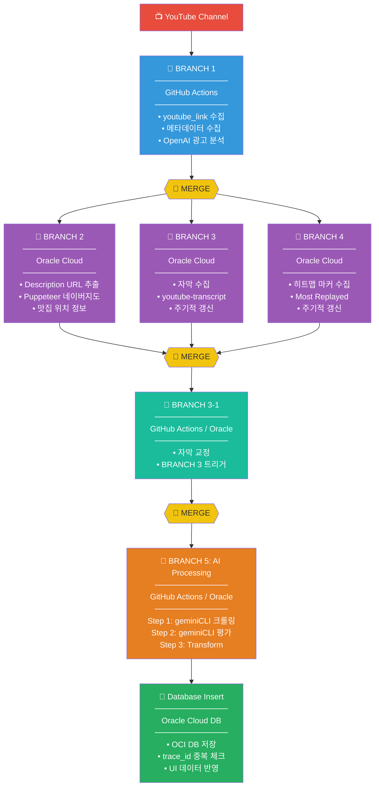

# 🍜 Tzudong Pipeline v2.0

**YouTube 맛집 데이터 자동화 파이프라인 - 통합 리팩토링 버전**

---

## 🎯 시스템 개요

### 목적

유튜버 채널의 영상에서 방문한 맛집 정보를 자동으로 수집, 검증, 평가하여 데이터베이스에 저장하는 통합 파이프라인입니다.

---

## 📁 디렉토리 구조

```
tzudong_pipeline_v2.0/
├── README.md              # 이 파일
├── env.example            # 환경 변수 템플릿
│
├── scripts/               # 🔧 실행 스크립트 (구현 예정)
│   └── example.js
│
├── prompts/               # 📝 AI 프롬프트 (구현 예정)
│   └── example.txt
│
├── data/                  # 💾 데이터 저장
│   └── example.jsonl
│
├── utils/                 # 🛠️ 공통 유틸리티 (구현 예정)
│   ├── example.js
│   └── example.py
│
└── .gemini/               # Gemini CLI 인증 (OAuth 2.0)
```

---

## ⚙️ 환경 설정

### 1. 주요 환경 변수

```env.example
# ===== GitHub =====
GITHUB_TOKEN=your_github_token
GITHUB_OWNER=your_github_owner
GITHUB_REPO=your_github_repo

# ===== YouTube 메타데이터 수집 =====
YOUTUBE_API_KEY=your_youtube_api_key

# ===== Google API =====
GOOGLE_API_KEY=your_google_api_key

# ===== OpenAI API =====
OPENAI_API_KEY=your_openai_api_key

# ===== Kakao Map API =====
KAKAO_REST_API_KEY=your_kakao_rest_api_key

# ===== Naver Search API =====
NAVER_CLIENT_ID=your_naver_client_id
NAVER_CLIENT_SECRET=your_naver_client_secret

# ===== NCP Maps (Naver Cloud Platform) =====
NCP_MAPS_KEY_ID=your_ncp_maps_key_id
NCP_MAPS_KEY=your_ncp_maps_key

# ===== PostgreSQL (OR Supabase)=====
POSTGRES_HOST=your_postgres_host
POSTGRES_PORT=5432
POSTGRES_USER=your_postgres_user
POSTGRES_PASSWORD=your_postgres_password
POSTGRES_DATABASE=your_postgres_database
SUPABASE_URL=your_supabase_url
SUPABASE_KEY=your_supabase_key

# ===== Gemini OAuth 2.0 (backend\tzudong_pipeline\.gemini\oauth_creds.json) =====
GEMINI_ACCESS_TOKEN=your_gemini_access_token
GEMINI_REFRESH_TOKEN=your_gemini_refresh_token

# ===== Pipeline Settings =====
# 실행 환경 (local, github_actions, oracle_cloud)
PIPELINE_ENV=local

# 타겟 채널 (콤마로 여러 개 선택 가능)
# 예: tzuyang,meatcreator,seonkyoung
TARGET_CHANNELS=tzuyang

# Gemini 모델 설정 (gemini-3-flash-preview, gemini-3-pro-preview)
GEMINI_MODEL=gemini-3-flash-preview

# 병렬 처리 워커 수
PARALLEL_WORKERS=2

# 로그 레벨 (DEBUG, INFO, WARNING, ERROR)
LOG_LEVEL=INFO

# 한국 시간대
TIMEZONE=Asia/Seoul
```

---

## 3. 전체 파이프라인 흐름

